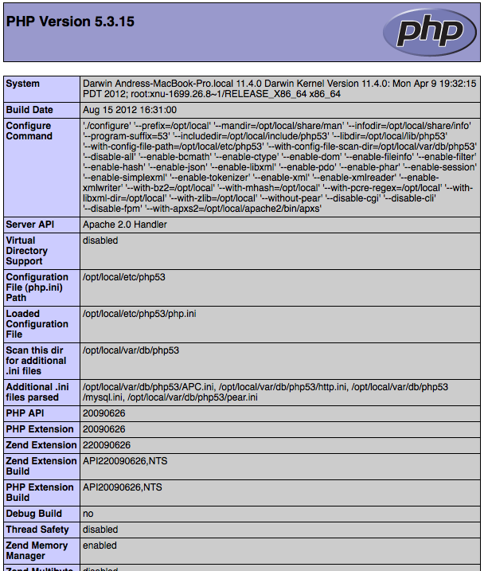

Framework Benchmarks
====================

In the past, performance was not considered one of the top priorities when developing web applications. Reasonable hardware was able to compensate for that. However when Google decided_ to take site speed into account in the search rankings, performance became one of the top priorities alongside functionality. This is yet another way in which improving web performance will have a positive impact on a website.

The benchmarks below, show how efficient Phalcon is when compared with other traditional PHP frameworks. These benchmarks are updated as stable versions are released from any of the frameworks mentioned or Phalcon itself.

We encourage programmers to clone the test suite that we are using for our benchmarks. If you have any additional optimizations or comments please `write us`_. `Check out source at Github`_

What was the test environment?
------------------------------
APC_ intermediate code cache was enabled for all frameworks. Any Apache mod-rewrite feature was disabled when possible to avoid potentially additional overheads.

The testing hardware environment is as follows:

* Operating System: Mac OS X Lion 10.7.4
* Web Server: Apache httpd 2.2.22
* PHP: 5.3.15
* CPU: 2.04 Ghz Intel Core i5
* Main Memory: 4GB 1333 MHz DDR3
* Hard Drive: 500GB SATA Disk

*PHP version and info:*

*APC settings:*

.. figure:: ../_static/img/bench-5.png
    :align: center

Pariticipant Frameworks
-----------------------

* Yii_ (YII_DEBUG=false) (yii-1.1.12.b600af)
* Symfony_ (2.0.11)
* CodeIgniter_ (2.1.0)
* Kohana_ (3.2.0)
* FuelPHP_ (1.2.1)
* CakePHP_ (2.1.3)
* `Zend Framework`_ 1.11.11

List of Benchmarks
-----------------------

.. toctree::
   :maxdepth: 1

   benchmark/hello-world

.. _decided: http://googlewebmastercentral.blogspot.com/2010/04/using-site-speed-in-web-search-ranking.html
.. _write us: http://phalcon.uservoice.com/
.. _Check out source at Github: https://github.com/phalcon/framework-bench
.. _APC: http://php.net/manual/en/book.apc.php
.. _Yii: http://www.yiiframework.com/
.. _Symfony: http://symfony.com/
.. _CodeIgniter: http://codeigniter.com/
.. _Kohana: http://kohanaframework.org/index
.. _FuelPHP: http://fuelphp.com/
.. _CakePHP: http://cakephp.org/
.. _Zend Framework: http://framework.zend.com
