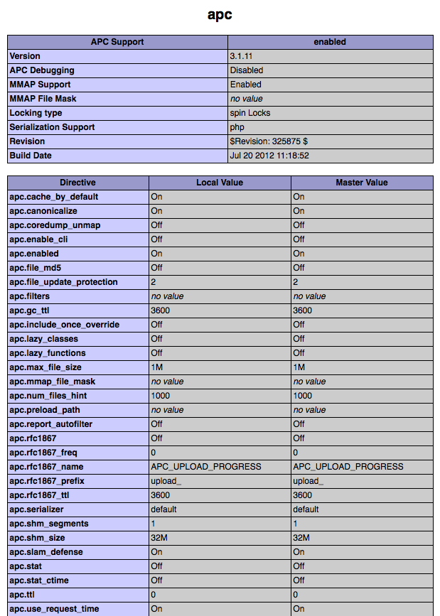

Framework Benchmarks
====================
En el pasado, el rendimiento no era considerado una prioridad al desarrollar aplicaciones web. Tener un buen hardware
era suficiente para compensarlo. Ahora que Google ha decidido_ tener en cuenta la velocidad en sus rankings de búsqueda,
esta se ha vuelto una proridad junto con el contenido y la funcionalidad.

Los benchmarks monstrados a continuación, muestran que tan eficiente es Phalcon al ser comparado con frameworks PHP tradicionales.
Estos benchmarks son actualizados en la medida que nuevas versiones son liberadas.

Puedes clonar la suite de test que se usó para estos benchmarks y correrlos por ti. Si tienes optimizaciones adicionales o comentarios puedes
`escribirnos`_. `Código en Github`_

¿Cuál es el entorno de pruebas?
------------------------------
APC_ fue habilitado para todos los frameworks. Módulos como mod-rewrite fueron desabilitados para evitar posibles sobrecargas.

El hardware utilizado es el siguiente:

* Sistema Operativo: Mac OS X Lion 10.7.4
* Web Server: Apache httpd 2.2.22
* PHP: 5.3.15
* CPU: 2.04 Ghz Intel Core i5
* Memoria Principal: 4GB 1333 MHz DDR3
* Disco duro: 500GB SATA Disk

*Versión de PHP e información:*

.. figure:: ../_static/img/bench-4.png
    :align: center

*Configuración de APC:*

Lista de Benchmarks
-----------------------

.. toctree::
   :maxdepth: 1

   benchmark/hello-world
   benchmark/micro

ChangeLog
---------

.. versionadded:: 1.0
    Update Mar-20-2012: Benchmarks actualizado, cambio de la configuracion apc.stat a Off.

.. versionchanged:: 1.1
    Update May-13-2012: Benchmarks actualizado, usando [PHP plain templating engine] en lugar de Twig para Symfony. Opciones de configuración para Yii fueron cambiadas según las recomendaciones.

.. versionchanged:: 1.2
    Update May-20-2012: Fuel framework fué añadido a la lista de benchmarks.

.. versionchanged:: 1.3
    Update Jun-4-2012: Cake framework fué añadido a la lista de benchmarks. Aún asi no esta presente en los gráficos pues toma 30 segundos para correr 10 de 1000.

.. versionchanged:: 1.4
    Update Ago-27-2012: PHP actualizado a 5.3.15, APC actualizado a 3.1.11, Yii actualizado a 1.1.12, Phalcon actualizado a 0.5.0, Laravel fué añadido, OS actualizado a Mac OS X Lion. Actualizacion en el hardware.

.. _decidido: http://googlewebmastercentral.blogspot.com/2010/04/using-site-speed-in-web-search-ranking.html
.. _escribirnos: https://github.com/phalcon/framework-bench
.. _Check out source at Github: https://github.com/phalcon/framework-bench
.. _APC: http://php.net/manual/en/book.apc.php

