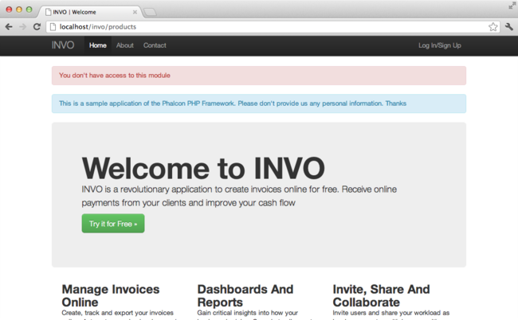

Tutorial 3: Securing INVO
=========================

In this chapter, we continue explaining how INVO is structured, we'll talk
about the implementation of authentication, authorization using events and plugins and
an access control list (ACL) managed by Phalcon.

Iniciar sesión en la Aplicación
-------------------------------
El enlace "Log In" nos permitirá trabajar en los controladores del backend. La separación entre los controladores del backend y
los del frontend es solo lógica. Todos los controladores se encuentran ubicados en el directorio (app/controllers/).

Para ingresar al sistema, debemos tener un nombre de usuario y contraseña válidos. Los usuarios son almacenados en la tabla "users"
de la base de datos "invo".

Antes de iniciar sesión, necesitamos configurar la conexión a la base de datos de la aplicación. Un servicio
llamado "db" esta configurado en el contenedor de servicios con esta información. Así como lo hicimos con el
autocargador también vamos a tomar los parámetros del archivo de configuración:

.. code-block:: php

    <?php

    use Phalcon\Db\Adapter\Pdo\Mysql as DbAdapter;

    // ...

    // La conexión a la base de datos es creada basada en los parámetros definidos en el archivo de configuración
    $di->set(
        "db",
        function () use ($config) {
            return new DbAdapter(
                [
                    "host"     => $config->database->host,
                    "username" => $config->database->username,
                    "password" => $config->database->password,
                    "dbname"   => $config->database->name,
                ]
            );
        }
    );

Este servicio retorna una instancia del adaptador de conexión a MySQL. De llegar a ser requerido, puedes hacer acciones extra como agregar un
logger, un profiler, cambiar el adaptador, agregar más opciones de configuración, etc.

Retomando el login, tenemos un formulario muy sencillo (app/views/session/index.volt) que solicita los datos de inicio de sesión.
Hemos quitado algo de HTML para hacer el ejemplo más simple:

.. code-block:: html+jinja

    {{ form("session/start") }}
        <fieldset>
            

                <label for="email">
                    Nombre de usuario/Correo electrónico
                </label>

                

                    {{ text_field("email") }}
                

            

            

                <label for="password">
                    Contraseña
                </label>

                

                    {{ password_field("password") }}
                

            

            

                {{ submit_button("Autenticar") }}
            

        </fieldset>
    {{ endForm() }}

Instead of using raw PHP as the previous tutorial, we started to use :doc:`Volt <volt>`. This is a built-in
template engine inspired in Jinja_ providing a simpler and friendly syntax to create templates.
It will not take too long before you become familiar with Volt.

:code:`SessionController::startAction` (app/controllers/SessionController.php) tiene la tarea de validar los
datos ingresados verificando si el usuario existe y sus credenciales son validas:

.. code-block:: php

    <?php

    class SessionController extends ControllerBase
    {
        // ...

        private function _registerSession($user)
        {
            $this->session->set(
                "auth",
                [
                    "id"   => $user->id,
                    "name" => $user->name,
                ]
            );
        }

        /**
         * This action authenticate and logs a user into the application
         */
        public function startAction()
        {
            if ($this->request->isPost()) {
                // Recibir los datos ingresados por el usuario
                $email    = $this->request->getPost("email");
                $password = $this->request->getPost("password");

                // Buscar el usuario en la base de datos
                $user = Users::findFirst(
                    [
                        "(email = :email: OR username = :email:) AND password = :password: AND active = 'Y'",
                        "bind" => [
                            "email"    => $email,
                            "password" => sha1($password),
                        ]
                    ]
                );

                if ($user !== false) {
                    $this->_registerSession($user);

                    $this->flash->success(
                        "Welcome " . $user->name
                    );

                    // Redireccionar la ejecución si el usuario es valido
                    return $this->dispatcher->forward(
                        [
                            "controller" => "invoices",
                            "action"     => "index",
                        ]
                    );
                }

                $this->flash->error(
                    "Wrong email/password"
                );
            }

            // Redireccionar a el forma de login nuevamente
            return $this->dispatcher->forward(
                [
                    "controller" => "session",
                    "action"     => "index",
                ]
            );
        }
    }

Por simplicidad, hemos usado "sha1_" para guardar los passwords en la base de datos, sin embargo, este algoritmo
no es recomendado para aplicaciones reales, usa mejor ":doc:`bcrypt <security>`".

Como pudiste ver, muchos atributos públicos fueron accedidos desde el controlador como: :code:`$this->flash`, :code:`$this->request` y :code:`$this->session`.
Estos son servicios en el contenedor de servicios anteriormente (app/config/services.php).
Cuando ellos son accedidos la primera vez, son injectados como parte del controlador.

Estos servicios son compartidos, esto significa que siempre que accedamos a ellos estaremos accediendo a la misma instancia sin importar
desde donde los solicitemos.

Por ejemplo, aquí invocamos el servicio "session" y luego almacenamos la identidad del usuario logueado en la variable "auth":

.. code-block:: php

    <?php

    $this->session->set(
        "auth",
        [
            "id"   => $user->id,
            "name" => $user->name,
        ]
    );

Another important aspect of this section is how the user is validated as a valid one,
first we validate whether the request has been made using method POST:

.. code-block:: php

    <?php

    if ($this->request->isPost()) {

Then, we receive the parameters from the form:

.. code-block:: php

    <?php

    $email    = $this->request->getPost("email");
    $password = $this->request->getPost("password");

Now, we have to check if there is one user with the same username or email and password:

.. code-block:: php

    <?php

    $user = Users::findFirst(
        [
            "(email = :email: OR username = :email:) AND password = :password: AND active = 'Y'",
            "bind" => [
                "email"    => $email,
                "password" => sha1($password),
            ]
        ]
    );

Note, the use of 'bound parameters', placeholders :email: and :password: are placed where values should be,
then the values are 'bound' using the parameter 'bind'. This safely replaces the values for those
columns without having the risk of a SQL injection.

If the user is valid we register it in session and forwards him/her to the dashboard:

.. code-block:: php

    <?php

    if ($user !== false) {
        $this->_registerSession($user);

        $this->flash->success(
            "Welcome " . $user->name
        );

        return $this->dispatcher->forward(
            [
                "controller" => "invoices",
                "action"     => "index",
            ]
        );
    }

If the user does not exist we forward the user back again to action where the form is displayed:

.. code-block:: php

    <?php

    return $this->dispatcher->forward(
        [
            "controller" => "session",
            "action"     => "index",
        ]
    );

Asegurando el Backend
---------------------
El backend es una área privada donde solamente los usuarios registrados tienen acceso. Por lo tanto, es necesario
verificar que solo usuarios registrados tengan acceso a esos controladores. Si no estás autenticado
en la aplicación y tratas, por ejemplo de acceder al controlador 'products' (que es privado)
entonces verás una pantalla como esta:

Cada vez que alguien intente acceder a cualquier controlador/acción, la aplicación verifica si el
perfil actual (en sesión) tiene acceso a él, en caso contrario visualiza un mensaje como el anterior y
redirecciona el usuario al inicio de la página.

Ahora, descubramos como la aplicación logra esto. Lo primero que debemos saber es que
hay un componente llamado :doc:`Dispatcher <dispatching>`. Este es informado sobre la ruta
encontrada por componente el :doc:`Router <routing>`. Luego es responsable de cargar el
controlador apropiado y ejecutar la acción correspondiente.

Normalmente, el framework crea el despachador (dispatcher) automáticamente. En nuestro caso como debemos verificar
antes de ejecutar las acciones y revisar si el usuario tiene acceso a ellas. Para lograr esto
reemplazaremos la creación automática y crearemos una función en el bootstrap:

.. code-block:: php

    <?php

    use Phalcon\Mvc\Dispatcher;

    // ...

    /**
     * MVC dispatcher
     */
    $di->set(
        "dispatcher",
        function () {
            // ...

            $dispatcher = new Dispatcher();

            return $dispatcher;
        }
    );

Ahora tenemos total control sobre como el Dispatcher es inicializado y usado en la aplicación. Muchos componentes del framework lanzan
eventos que nos permiten cambiar el funcionamiento interno o su operación. Así como el inyector de dependencias funciona como intermedario
de componentes, un nuevo componente llamado :doc:`EventsManager <events>` nos ayuda a interceptar eventos producidos
por un componente enrutando los eventos a los escuchadores.

Administración de Events
^^^^^^^^^^^^^^^^^^^^^^^^
Un :doc:`EventsManager <events>` nos permite agregar escuchadores (listeners) a un tipo particular de evento. El tipo que
nos interesa ahora es "dispatch", el siguiente código filtra todos los eventos producidos por Dispatcher:

.. code-block:: php

    <?php

    use Phalcon\Mvc\Dispatcher;
    use Phalcon\Events\Manager as EventsManager;

    $di->set(
        "dispatcher",
        function () {
            // Crear un administrador de eventos
            $eventsManager = new EventsManager();

            // Enviar todos los eventos producidos en el Dispatcher al plugin Security
            $eventsManager->attach(
                "dispatch:beforeExecuteRoute",
                new SecurityPlugin()
            );

            // Handle exceptions and not-found exceptions using NotFoundPlugin
            $eventsManager->attach(
                "dispatch:beforeException",
                new NotFoundPlugin()
            );

            $dispatcher = new Dispatcher();

            // Asignar el administrador de eventos al dispatcher
            $dispatcher->setEventsManager($eventsManager);

            return $dispatcher;
        }
    );

When an event called "beforeExecuteRoute" is triggered the following plugin will be notified:

.. code-block:: php

    <?php

    /**
     * Check if the user is allowed to access certain action using the SecurityPlugin
     */
    $eventsManager->attach(
        "dispatch:beforeExecuteRoute",
        new SecurityPlugin()
    );

When a "beforeException" is triggered then other plugin is notified:

.. code-block:: php

    <?php

    /**
     * Handle exceptions and not-found exceptions using NotFoundPlugin
     */
    $eventsManager->attach(
        "dispatch:beforeException",
        new NotFoundPlugin()
    );

El plugin Security es una clase úbicada en (app/plugins/SecurityPlugin.php). Esta clase implementa el método
"beforeExecuteRoute". Este tiene el mismo nombre de uno de los eventos producidos en el dispatcher:

.. code-block:: php

    <?php

    use Phalcon\Events\Event;
    use Phalcon\Mvc\User\Plugin;
    use Phalcon\Mvc\Dispatcher;

    class SecurityPlugin extends Plugin
    {
        // ...

        public function beforeExecuteRoute(Event $event, Dispatcher $dispatcher)
        {
            // ...
        }
    }

Los escuchadores de eventos siempre reciben un primer parámetro que contiene información contextual del evento producido (:code:`$event`)
y un segundo que es el objeto que produjo el evento como tal (:code:`$dispatcher`). No es obligatorio que
los plugins extiendan la clase :doc:`Phalcon\\Mvc\\User\\Plugin <../api/Phalcon_Mvc_User_Plugin>`, pero haciendo esto, ellos ganan acceso de forma simple a los servicios
disponibles en la aplicación.

Ahora, verificamos si el pérfil (role) actual en sesión tiene acceso usando una lista de control de acceso ACL.
Si no tiene acceso lo redireccionamos a la pantalla de inicio como explicamos anteriormente:

.. code-block:: php

    <?php

    use Phalcon\Acl;
    use Phalcon\Events\Event;
    use Phalcon\Mvc\User\Plugin;
    use Phalcon\Mvc\Dispatcher;

    class SecurityPlugin extends Plugin
    {
        // ...

        public function beforeExecuteRoute(Event $event, Dispatcher $dispatcher)
        {
            // Verificar si la variable de sesión "auth" está definida, esto indica si hay un usuario autenticado
            $auth = $this->session->get("auth");

            if (!$auth) {
                $role = "Guests";
            } else {
                $role = "Users";
            }

            // Obtener el controlador y acción actual desde el Dispatcher
            $controller = $dispatcher->getControllerName();
            $action     = $dispatcher->getActionName();

            // Obtener la lista ACL
            $acl = $this->getAcl();

            // Verificar si el pérfil (role) tiene acceso al controlador/acción
            $allowed = $acl->isAllowed($role, $controller, $action);

            if (!$allowed) {
                // Si no tiene acceso mostramos un mensaje y lo redireccionamos al inicio
                $this->flash->error(
                    "No tienes acceso a este módulo."
                );

                $dispatcher->forward(
                    [
                        "controller" => "index",
                        "action"     => "index",
                    ]
                );

                // Devolver "false" le indica al Dispatcher que debe detener la operación y evitar que la acción se ejecute
                return false;
            }
        }
    }

Crear una lista ACL
^^^^^^^^^^^^^^^^^^^
En el ejemplo anterior, hemos obtenido la lista ACL usando el método :code:`$this->getAcl()`. Este método también es
implementado en el plugin. Ahora, explicaremos paso a paso como construir la lista de control de acceso (ACL):

.. code-block:: php

    <?php

    use Phalcon\Acl;
    use Phalcon\Acl\Role;
    use Phalcon\Acl\Adapter\Memory as AclList;

    // Crear el ACL
    $acl = new AclList();

    // La acción por defecto es denegar (DENY)
    $acl->setDefaultAction(
        Acl::DENY
    );

    // Registrar dos roles, 'users' son usuarios registrados
    // y 'guests' son los usuarios sin un pérfil definido (invitados)
    $roles = [
        "users"  => new Role("Users"),
        "guests" => new Role("Guests"),
    ];

    foreach ($roles as $role) {
        $acl->addRole($role);
    }

Ahora definiremos los recursos para cada área respectívamente. Los nombres de controladores son recursos y sus acciones son
accesos a los recursos:

.. code-block:: php

    <?php

    use Phalcon\Acl\Resource;

    // ...

    // Recursos del área privada (backend)
    $privateResources = [
        "companies"    => ["index", "search", "new", "edit", "save", "create", "delete"],
        "products"     => ["index", "search", "new", "edit", "save", "create", "delete"],
        "producttypes" => ["index", "search", "new", "edit", "save", "create", "delete"],
        "invoices"     => ["index", "profile"],
    ];

    foreach ($privateResources as $resourceName => $actions) {
        $acl->addResource(
            new Resource($resourceName),
            $actions
        );
    }

    // Recursos del área pública (frontend)
    $publicResources = [
        "index"    => ["index"],
        "about"    => ["index"],
        "register" => ["index"],
        "errors"   => ["show404", "show500"],
        "session"  => ["index", "register", "start", "end"],
        "contact"  => ["index", "send"],
    ];

    foreach ($publicResources as $resourceName => $actions) {
        $acl->addResource(
            new Resource($resourceName),
            $actions
        );
    }

El ACL ahora tiene conocimiento de los controladores existentes y sus acciones. El perfil "Users" tiene acceso tanto
al backend y al frontend. El perfil "Guests" solo tiene acceso al área pública:

.. code-block:: php

    <?php

    // Permitir acceso al área pública tanto a usuarios como a invitados
    foreach ($roles as $role) {
        foreach ($publicResources as $resource => $actions) {
            $acl->allow(
                $role->getName(),
                $resource,
                "*"
            );
        }
    }

    // Permitir acceso al área privada solo al pérfil "Users"
    foreach ($privateResources as $resource => $actions) {
        foreach ($actions as $action) {
            $acl->allow(
                "Users",
                $resource,
                $action
            );
        }
    }

Super!, la ACL está ahora completa. In next chapter, we will see how a CRUD is implemented in Phalcon and how you
can customize it.

.. _jinja: http://jinja.pocoo.org/
.. _sha1: http://php.net/manual/es/function.sha1.php
