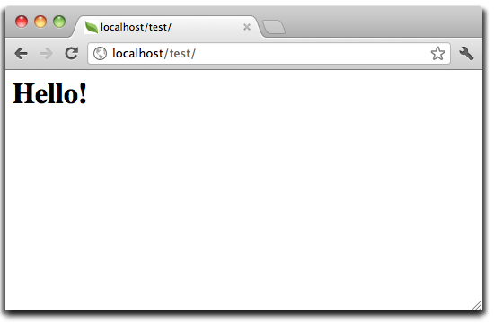

Tutorial 1: Aprendamos usando ejemplos
======================================
A lo largo de este tutorial, te guiaremos en la creación desde cero de una aplicación que contiene un simple formulario de registro.
Además explicaremos algunos aspectos básicos del framework. Si estas interesado en la generación automática de código
para Phalcon, puedes ver nuestro :doc:`developer tools <tools>`.

La mejor forma de usar esta guia es siguiendo cada paso. Si lo deseas puedes encontrar el código completo
`aquí <https://github.com/phalcon/tutorial>`_.

Estructura de Directorios
-------------------------
Phalcon no te impone que uses una determinada estructura de directorios para desarrollar. Gracias al hecho que es
libremente acoplado, puedes crear aplicaciones con Phalcon con cualquier estructura con la que te sientas cómodo.

Para efectos de este tutorial y como punto de inicio, te sugerimos la siguiente estructura:

.. code-block:: php

    tutorial/
      app/
        controllers/
        models/
        views/
      public/
        css/
        img/
        js/

Ten en cuenta que no necesitas un directorio "library" para Phalcon. El framework está en memoria
y listo para ser usado en cualquier parte.

Before continuing, please be sure you've successfully :doc:`installed Phalcon <install>` and have setup either :doc:`Nginx <nginx>`, :doc:`Apache <apache>` or :doc:`Cherokee <cherokee>`.

Bootstrap
---------
El primer archivo que debes crear es el bootstrap. Este archivo es muy importante, ya que sirve
como base de tu aplicación, dándote control sobre muchos aspectos en ella. En este archivo podemos implementar
la inicialización de componentes así como cambiar el comportamiento de la aplicación.

Ultimately, it is responsible for doing 3 things:

1. Setting up the autoloader.
2. Configuring the Dependency Injector.
3. Handling the application request.

Autocargadores
^^^^^^^^^^^^^^
La primera parte que encontramos en el bootstrap es el registro de un autocargador. Este será usado para cargar clases como controladores y modelos en la aplicación. Por ejemplo podemos registrar uno o más directorios de controladores incrementando la flexibilidad de la aplicación. En nuestro ejemplo hemos usado el componente :doc:`Phalcon\\Loader <../api/Phalcon_Loader>`.

Con él, podemos cargar clases usando varias estrategias, para este ejemplo vamos a cargar las clases basado en unos directorios predeterminados.

.. code-block:: php

    <?php

    use Phalcon\Loader;

    // ...

    $loader = new Loader();

    $loader->registerDirs(
        [
            "../app/controllers/",
            "../app/models/",
        ]
    );

    $loader->register();

Administración de Dependencias
^^^^^^^^^^^^^^^^^^^^^^^^^^^^^^
Un concepto muy importante que debemos entender al trabajar con Phalcon es su :doc:`contenedor/inyector de dependencias <di>`. Puede sonar complejo pero en realidad es muy sencillo y práctico.

Un contenedor de servicios es una bolsa donde globalmente registramos los servicios que nuestra aplicación necesita para trabajar. Cada vez que requerimos un componente, le solicitaremos al contenedor el servicio usando un nombre previamente convenido. Ya que Phalcon es un framework libremente acoplado, :doc:`Phalcon\\Di <../api/Phalcon_Di>` actúa como intermediario facilitando la integración de los diferentes componentes logrando que trabajen juntos de manera transparente.

.. code-block:: php

    <?php

    use Phalcon\Di\FactoryDefault;

    // ...

    // Crear un DI
    $di = new FactoryDefault();

:doc:`Phalcon\\Di\\FactoryDefault <../api/Phalcon_Di_FactoryDefault>` es una variante de :doc:`Phalcon\\Di <../api/Phalcon_Di>`. Para hacer las cosas más fáciles,
él ya tiene registrado la mayoría de componentes que vienen con Phalcon. De esta manera no debemos registrarlos uno a uno.
Puedes reemplazar un componente por otro en cualquier momento que lo desees.

Luego, registramos el servicio 'view', en él indicamos el directorio que el framework debe utilizar para cargar los archivos de vistas.
Como las vistas no son clases como tal, ellas no pueden ser cargadas usando un autocargadores.

Los servicios pueden ser registrados de muchas maneras, para nuestro tutorial usaremos `funciones anónimas`_:

.. code-block:: php

    <?php

    use Phalcon\Mvc\View;

    // ...

    // Configurar el componente de vistas
    $di->set(
        "view",
        function () {
            $view = new View();

            $view->setViewsDir("../app/views/");

            return $view;
        }
    );

Next we register a base URI so that all URIs generated by Phalcon include the "tutorial" folder we setup earlier.
This will become important later on in this tutorial when we use the class :doc:`Phalcon\\Tag <../api/Phalcon_Tag>`
to generate a hyperlink.

.. code-block:: php

    <?php

    use Phalcon\Mvc\Url as UrlProvider;

    // ...

    // Setup a base URI so that all generated URIs include the "tutorial" folder
    $di->set(
        "url",
        function () {
            $url = new UrlProvider();

            $url->setBaseUri("/tutorial/");

            return $url;
        }
    );

Handling the application request
^^^^^^^^^^^^^^^^^^^^^^^^^^^^^^^^
En la última parte, encontramos a :doc:`Phalcon\\Mvc\\Application <../api/Phalcon_Mvc_Application>`. Su proposito
es inicializar el entorno de la petición, enrutar, descubrir las acciones relacionadas, produciendo las
respuestas para el cliente.

.. code-block:: php

    <?php

    use Phalcon\Mvc\Application;

    // ...

    $application = new Application($di);

    $response = $application->handle();

    $response->send();

Putting everything together
^^^^^^^^^^^^^^^^^^^^^^^^^^^
El archivo tutorial/public/index.php debería verse así:

.. code-block:: php

    <?php

    use Phalcon\Loader;
    use Phalcon\Mvc\View;
    use Phalcon\Mvc\Application;
    use Phalcon\Di\FactoryDefault;
    use Phalcon\Mvc\Url as UrlProvider;
    use Phalcon\Db\Adapter\Pdo\Mysql as DbAdapter;

    // Registrar un autocargador
    $loader = new Loader();

    $loader->registerDirs(
        [
            "../app/controllers/",
            "../app/models/",
        ]
    );

    $loader->register();

    // Crear un Inyector de dependencias
    $di = new FactoryDefault();

    // Configurar el componente de vistas
    $di->set(
        "view",
        function () {
            $view = new View();

            $view->setViewsDir("../app/views/");

            return $view;
        }
    );

    // Setup a base URI so that all generated URIs include the "tutorial" folder
    $di->set(
        "url",
        function () {
            $url = new UrlProvider();

            $url->setBaseUri("/tutorial/");

            return $url;
        }
    );

    $application = new Application($di);

    try {
        // Atender la petición
        $response = $application->handle();

        $response->send();
    } catch (\Exception $e) {
        echo "Exception: ", $e->getMessage();
    }

En resúmen, como puedes ver el bootstap es muy pequeño y no requiere archivos externos.
Hemos configurado un MVC muy flexible en menos de 30 líneas de código.

Creando un Controlador
----------------------
Por defecto Phalcon buscará un controlador llamado "Index". Este es el punto de inicio cuando no se ha indicado una ruta o
acción especifica en la petición. El controlador Index (app/controllers/IndexController.php) se ve así:

.. code-block:: php

    <?php

    use Phalcon\Mvc\Controller;

    class IndexController extends Controller
    {
        public function indexAction()
        {
            echo "<h1>Hola!</h1>";
        }
    }

Las clases de controlador deben tener el sufijo "Controller" y las acciones el sufijo "Action". Si accedes a tu aplicación desde el navegador, podrás ver algo como esto:

Felicidades, estás volando con Phalcon!

Generando salida a la vista
---------------------------
Generar salidas desde los controladores es a veces necesario pero no deseable para la mayoria de puristas del MVC. Toda información debe ser pasada a la vista la cual es responsable de imprimirla y presentarla al cliente. Phalcon buscará una vista con el mismo nombre de la última acción ejecutada dentro de un directorio con el nombre del último controlador ejecutado. En nuestro caso (app/views/index/index.phtml):

.. code-block:: php

    <?php echo "<h1>Hello!</h1>";

Ahora nuestro controlador (app/controllers/IndexController.php) tiene la implementación de una acción vacia:

.. code-block:: php

    <?php

    use Phalcon\Mvc\Controller;

    class IndexController extends Controller
    {
        public function indexAction()
        {

        }
    }

La salida en el navagador permanece igual. El :doc:`Phalcon\\Mvc\\View <../api/Phalcon_Mvc_View>` es automáticamente creado y terminado cuando la petición termina. Puedes ver más sobre el :doc:`uso de vistas aquí <views>`.

Diseñando una formulario de registro
------------------------------------
Ahora cambiaremos el archivo index.phtml para agregar un enlace a un nuevo controllador llamado "signup". El objetivo de esto es permitir a los usuarios registrarse en nuestra aplicación.

.. code-block:: php

    <?php

    echo "<h1>Hello!</h1>";

    echo PHP_EOL;

    echo PHP_EOL;

    echo $this->tag->linkTo(
        "signup",
        "Sign Up Here!"
    );

El HTML generado muestra una eqiqueta ("a") enlazando al nuevo controlador:

.. code-block:: html

    <h1>Hello!</h1>

    <a href="/tutorial/signup">Sign Up Here!</a>

Para generar la etiqueta hemos usado la clase :doc:`Phalcon\\Tag <../api/Phalcon_Tag>`. Esta es una clase utilitaria que nos permite
construir código HTML teniendo en cuenta las convenciones del framework. As this class is a also a service registered in the DI
we use :code:`$this->tag` to access it.

Puedes encontrar más información relacionada a la generación de etiquetas HTML aquí :doc:`found here <tags>`.

.. figure:: ../_static/img/tutorial-2.png
    :align: center

Aquí está el controlador Signup (app/controllers/SignupController.php):

.. code-block:: php

    <?php

    use Phalcon\Mvc\Controller;

    class SignupController extends Controller
    {
        public function indexAction()
        {

        }
    }

Al encontrarce la acción 'index' vacía se da paso a la vista, la cual contiene el formulario (app/views/signup/index.phtml):

.. code-block:: html+php

    <h2>
        Registrate haciendo uso de este formulario
    </h2>

    <?php echo $this->tag->form("signup/register"); ?>

        

            <label for="name">
                Nombre
            </label>

            <?php echo $this->tag->textField("name"); ?>
        

        

            <label for="email">
                Correo electrónico
            </label>

            <?php echo $this->tag->textField("email"); ?>
        

        

            <?php echo $this->tag->submitButton("Registrarme"); ?>
        

    </form>

Visualizando el formulario en tu navegador mostrará algo como esto:

.. figure:: ../_static/img/tutorial-3.png
    :align: center

:doc:`Phalcon\\Tag <../api/Phalcon_Tag>` también proporciona métodos para definir formularios.

El método :code:`Phalcon\Tag::form()` recibe un parámetro, una URI relativa a el controlador/acción en
la aplicación.

Al hacer click en el botón "Registrarme", verás que el framework lanza una excepción indicando que nos hace falta definir la acción "register" en el controlador "signup":

    Exception: Action "register" was not found on handler "signup"

Continuemos con la implementación de esta acción para no mostrar más la excepción:

.. code-block:: php

    <?php

    use Phalcon\Mvc\Controller;

    class SignupController extends Controller
    {
        public function indexAction()
        {

        }

        public function registerAction()
        {

        }
    }

Si haces click nuevamente en el botón "Registrarme", verás esta vez una página en blanco. Necesitamos ahora almacenar el nombre y correo electrónico que el usuario proporcionó en una base de datos. De acuerdo con el patrón MVC, las interacciones con la base de datos deben realizarse a través de modelos (models) así también nos aseguramos que la aplicación está completamente orientada a objetos.

Creando un Modelo
-----------------
Phalcon posee el primer ORM para PHP escrito totalmente en C. En vez de aumentar la complejidad del desarrollo, la simplifica.

Antes de crear nuestro primer modelo, necesitamos una tabla que el modelo use para mapearse. Una simple tabla para guardar los usuarios registrados puede ser la siguiente:

.. code-block:: sql

    CREATE TABLE `users` (
        `id`    int(10)     unsigned NOT NULL AUTO_INCREMENT,
        `name`  varchar(70)          NOT NULL,
        `email` varchar(70)          NOT NULL,

        PRIMARY KEY (`id`)
    );

Según como hemos organizado esta aplicación, un modelo debe ser ubicado en el directorio app/models (app/models/Users.php). El modelo que mapea a la tabla "users" es:

.. code-block:: php

    <?php

    use Phalcon\Mvc\Model;

    class Users extends Model
    {
        public $id;

        public $name;

        public $email;
    }

Estableciendo la conexión a la base de datos
--------------------------------------------
Para poder conectarnos a una base de datos y por lo tanto usar nuestros modelos, necesitamos especificar esta configuración en el bootstrap de la aplicación. Una conexión a una base de datos es simplemente otro servicio que nuestra aplicación usará en muchos componentes:

.. code-block:: php

    <?php

    use Phalcon\Db\Adapter\Pdo\Mysql as DbAdapter;

    // Establecer el servicio de base de datos
    $di->set(
        "db",
        function () {
            return new DbAdapter(
                [
                    "host"     => "localhost",
                    "username" => "root",
                    "password" => "secret",
                    "dbname"   => "test_db",
                ]
            );
        }
    );

Con una configuración correcta, nuestros modelos están listos para trabajar e interactuar con el resto de la aplicación.

Guardando datos mediante modelos
--------------------------------
Recibir datos desde el formulario y posteriormente guardarlos en una tabla es el siguiente paso.

.. code-block:: php

    <?php

    use Phalcon\Mvc\Controller;

    class SignupController extends Controller
    {
        public function indexAction()
        {

        }

        public function registerAction()
        {
            $user = new Users();

            // Almacenar y verificar errores de validación
            $success = $user->save(
                $this->request->getPost(),
                [
                    "name",
                    "email",
                ]
            );

            if ($success) {
                echo "Gracias por registrarte!";
            } else {
                echo "Lo sentimos, los siguientes errores ocurrieron mientras te dabamos de alta: ";

                $messages = $user->getMessages();

                foreach ($messages as $message) {
                    echo $message->getMessage(), " ";
                }
            }

            $this->view->disable();
        }
    }

Instanciamos la clase "Users", que corresponde a un registro de la tabla "users". Las propiedades públicas en la clase representan los campos
que tiene cada registro en la tabla. Establecemos los datos necesarios en el modelo y llamamos al método :code:`save()` para que almacene estos datos en la tabla. El método :code:`save()` retorna un valor booleano (true/false) que indica si el proceso de guardar fue correcto o no.

El ORM automaticamente escapa la entrada de datos previniendo inyecciones de SQL, de esta manera podemos simplemente pasar los datos al método :code:`save()`.

Una validación adicional sobre los campos que no permiten valores nulos (obligatorios) es ejecutada de manera automática. Si no entramos ningún valor en el formulario y tratamos de guardar veremos lo siguiente:

.. figure:: ../_static/img/tutorial-4.png
    :align: center

Conclusión
----------
Como podrás ver este es un tutorial muy sencillo que permite aprender a crear aplicaciones con Phalcon.
El hecho de que PHalcon es una extensión para PHP no ha interferido en la facilidad de desarrollo o
características disponibles. Te invitamos a que continues leyendo el manual y descubrar muchas más características que ofrece Phalcon!

.. _funciones anónimas: http://php.net/manual/es/functions.anonymous.php
