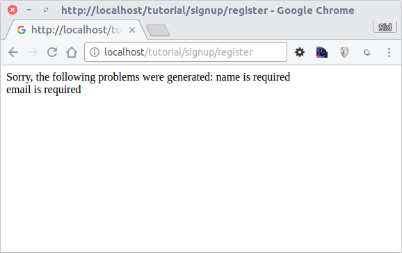

Tutorial 1: Aprendamos usando ejemplos
======================================
Atraves de este tutorial, realizaremos la creación de una aplicación que tiene un sencillo formulario de registro desde cero.
Adicionalmente explicaremos algunos aspectos básicos del framework. Si estas interesado en generación automática de código
para Phalcon, puedes ver nuestros :doc:`developer tools <tools>`.

Revisando tu instalación
------------------------
Asumiremos que ya has instalado Phalcon. Revisa la salida de tu phpinfo() que incluya una sección mencionando "Phalcon" o
ejecuta el siguiente código a continuación:

.. code-block:: php

    <?php print_r(get_loaded_extensions()); ?>

La extensión de Phalcon debe aparecer como parte de la salida:

.. code-block:: php

    Array
    (
        [0] => Core
        [1] => libxml
        [2] => filter
        [3] => SPL
        [4] => standard
        [5] => phalcon
        [6] => pdo_mysql
    )

Creando un proyecto
-------------------
La mejor forma de seguir esta guia es seguir paso a paso. Puedes encontrar el código completo `aquí <https://github.com/phalcon/tutorial>`_.

Estructura de Directorios
^^^^^^^^^^^^^^^^^^^^^^^^^
Phalcon no te impone que uses una determinada estructura de directorios para desarrollar. Gracias al hecho que es debilmente acoplado, puedes crear aplicaciones con Phalcon con cualquier estructura con
la que te sientas cómodo.

Para efectos de este tutorial y como punto de inicio, te sugerimos la siguiente estructura:

.. code-block:: php

    tutorial/
      app/
        controllers/
        models/
        views/
      public/
        css/
        img/
        js/

Ten en cuenta que no necesitas un directorio "library" para Phalcon. El framework está en memoria y listo para usar en cualquier parte.

URLs Bonitas
^^^^^^^^^^^^
Usaremos URLS bonitas o amigables para este tutorial. Estas Urls son mejores para SEO, adicionalmente los usuarios las recuerdan más fácil.
Phalcon soporta modulos de reescritura (rewrite) proporcionados por los servidores web más populares. Que tus aplicaciones tengan URLs
amigables no es una obligación y también podrías desarrollar sin ellas.

En este ejemplo usaremos el modulo rewrite para Apache. Vamos a crear una serie de reglas en el archivo /.htaccess:

.. code-block:: apacheconf

    #/.htaccess
    <IfModule mod_rewrite.c>
        RewriteEngine on
        RewriteRule  ^$ public/    [L]
        RewriteRule  (.*) public/$1 [L]
    </IfModule>

Todas las peticiones a el proyecto serán reescritas al directorio public/ haciendo como de raíz de documentos.
Este paso asegura que los archivos internos del proyecto permanezcan ocultos del público evitando posibles problemas de seguridad.

El segundo conjunto de reglas permitirá servir los archivos existentes y redireccionar lo no existe al bootstrap de la aplicación:

.. code-block:: apacheconf

    #/public/.htaccess
    <IfModule mod_rewrite.c>
        RewriteEngine On
        RewriteCond %{REQUEST_FILENAME} !-d
        RewriteCond %{REQUEST_FILENAME} !-f
        RewriteRule ^(.*)$ index.php?_url=/$1 [QSA,L]
    </IfModule>

Bootstrap
^^^^^^^^^
El primer archivo que debes crear el es bootstrap. Este archivo es muy importante, ya que sirve como base a tu aplicación, dándote
control sobre muchos aspectos en ella. En este archivo podemos implementar la inicialización de componentes así como cambiar
el comportamiento de la aplicación.

El archivo public/index.php debería verse así:

.. code-block:: php

    <?php

    try {

        //Registrar un autoloader
        $loader = new \Phalcon\Loader();
        $loader->registerDirs(array(
            '../app/controllers/',
            '../app/models/'
        ))->register();

        //Crear un DI
        $di = new Phalcon\DI\FactoryDefault();

        //Configurar el componente de vistas
        $di->set('view', function(){
            $view = new \Phalcon\Mvc\View();
            $view->setViewsDir('../app/views/');
            return $view;
        });

        //Atender la petición
        $application = new \Phalcon\Mvc\Application($di);

        echo $application->handle()->getContent();

    } catch(\Phalcon\Exception $e) {
         echo "PhalconException: ", $e->getMessage();
    }

Autoloaders
^^^^^^^^^^^
La primera parte que encontramos en el bootstrap es el registro de un atuoloader. Esto será usado para cargar clases como controladores y modelos en la aplicación.
Por ejemplo podemos registrar uno o más directorios de controladores incrementando la flexibilidad de la aplicación.

En nuestro ejemplo hemos usado el componente Phalcon\\Loader. Con él, podemos cargar clases usando varias estrategias, para
este ejemplo vamos a cargar las clases basado en unos directorios predeterminados.

.. code-block:: php

    <?php

    $loader = new \Phalcon\Loader();
    $loader->registerDirs(
        array(
            '../app/controllers/',
            '../app/models/'
        )
    )->register();

Administración de Dependencias
^^^^^^^^^^^^^^^^^^^^^^^^^^^^^^
Un concepto muy importante que debemos entender al trabajar con Phalcon es su :doc:`contenedor/injector de dependencias <di>`.
Puede sonar complejo pero en realidad es muy sencillo y práctico.

Un contenedor de servicios es una bolsa donde globalmente registramos los servicios que nuestra aplicación necesita para trabajar.
Cada vez que requerimos un componente, le solicitaremos al contenedor el servicio usando un nombre previamente convenido.
Ya que Phalcon es un framework debilmente acoplado, Phalcon\\DI actúa como intermediario facilitando la integración
de los diferentes componentes logrando que trabajen juntos de manera transparente.

.. code-block:: php

    <?php

    //Crear un DI
    $di = new Phalcon\DI\FactoryDefault();

:doc:`Phalcon\\DI\\FactoryDefault <../api/Phalcon\_DI_FactoryDefault>` es una variante de Phalcon\\DI.
Para hacer las cosas más fáciles, él ya tiene registrado la mayoría de componentes que vienen con Phalcon.
De esta manera no debemos registrarlos uno a uno. Después no tenemos problema en reemplazar
algún componente por otro.

Luego, registramos el servicio 'view', en él indicamos el directorio que el framework debe utilizar para cargar los archivos de vistas.
Como las vistas no son clases como tal, ellas no pueden ser cargadas usando un auto-loader.

Los servicios pueden ser registrados de muchas maneras, para nuestro tutorial usaremos funciones anónimas:

.. code-block:: php

    <?php

    //Configurar el componente de vistas
    $di->set('view', function(){
        $view = new \Phalcon\Mvc\View();
        $view->setViewsDir('../app/views/');
        return $view;
    });

En la última parte, encontramos a :doc:`Phalcon\\Mvc\\Application <../api/Phalcon_Mvc_Application>`.
Su proposito es inicializar el entorno de la petición, enrutar, descubrir las acciones relacionadas, produciendo las
respuestas para el cliente.

.. code-block:: php

    <?php

    $application = new \Phalcon\Mvc\Application($di);

    echo $application->handle()->getContent();

En resúmen, como puedes ver el bootstap es muy pequeño y no requiere archivos externos. Hemos configurado un MVC muy flexible
en menos de 30 líneas de código.

Creando un Controlador
^^^^^^^^^^^^^^^^^^^^^^
Por defecto Phalcon buscará un controlador llamado "Index". Este es el punto de inicio cuando no se ha indicado una ruta o acción especifica en la petición.
El controlador Index (app/controllers/IndexController.php) se ve así:

.. code-block:: php

    <?php

    class IndexController extends \Phalcon\Mvc\Controller
    {

        public function indexAction()
        {
            echo "<h1>Hello!</h1>";
        }

    }

Las clases de controlador deben tener el sufijo "Controller" y las acciones el sufijo "Action". Si accesas la aplicación desde tu navegador,
debes ver algo como esto:

.. figure:: ../_static/img/tutorial-1.png
    :align: center

Felicidades, estás volando con Phalcon!

Generando salida a la vista
^^^^^^^^^^^^^^^^^^^^^^^^^^^
Generar salidas desde los controladores es a veces necesario pero no deseable para la mayoria de puristas del MVC.
Todo debe ser pasado a la vista que es responsable de imprimirla y presentarla para el cliente.
Phalcon buscará una vista con el mismo nombre de la última acción ejecutada dentro de un directorio
con el nombre del último controlador ejecutado. En nuestro caso (app/views/index/index.phtml):

.. code-block:: php

    <?php echo "<h1>Hello!</h1>";

Ahora nuestro controlador (app/controllers/IndexController.php) tiene la implementación de una acción vacia:

.. code-block:: php

    <?php

    class IndexController extends \Phalcon\Mvc\Controller
    {

        public function indexAction()
        {

        }

    }

La salida en el navagador permanece igual. El :doc:`Phalcon\\Mvc\\View <../api/Phalcon_Mvc_View>` es automaticamente creado y terminado cuando la petición termina.
Aprender más sobre el :doc:`uso de vistas aquí <views>` .

Diseñando una formulario de registro
^^^^^^^^^^^^^^^^^^^^^^^^^^^^^^^^^^^^
Ahora cambiaremos el archivo index.phtml para agregar un enlace a un nuevo controllador llamado "signup".
El objetivo de esto es permitir a los usuarios registrarse en nuestra aplicación.

.. code-block:: php

    <?php

    echo "<h1>Hello!</h1>";

    echo Phalcon\Tag::linkTo("signup", "Sign Up Here!");

El HTML generado muestra una eqiqueta "A" enlazando al nuevo controlador:

.. code-block:: html

    <h1>Hello!</h1> <a href="/test/signup">Sign Up Here!</a>

Para generar la etiqueta hemos usado la clase :doc:`\Phalcon\\Tag <../api/Phalcon_Tag>`.
Esta es una clase utilitaria que nos permite construir HTML teniendo en cuenta las convenciones del framework.
Un artículo más detallado en cuanto a la generación de HTML puede ser encontrado aquí :doc:`found here <tags>`

.. figure:: ../_static/img/tutorial-2.png
    :align: center

Aquí está el controlador Signup (app/controllers/SignupController.php):

.. code-block:: php

    <?php

    class SignupController extends \Phalcon\Mvc\Controller
    {

        public function indexAction()
        {

        }

    }

La acción vacía para 'index' simplemente le da paso a la vista que contiene el formulario:

.. code-block:: html+php

    <?php use Phalcon\Tag; ?>

    <h2>Sign using this form</h2>

    <?php echo Tag::form("signup/register"); ?>

     

        <label for="name">Name</label>
        <?php echo Tag::textField("name") ?>
     

     

        <label for="name">E-Mail</label>
        <?php echo Tag::textField("email") ?>
     

     

        <?php echo Tag::submitButton("Register") ?>
     

    </form>

Visualizando el formulario en tu navegador mostrará algo como esto:

.. figure:: ../_static/img/tutorial-3.png
    :align: center

:doc:`Phalcon\\Tag <../api/Phalcon_Tag>` también proporciona métodos para definir formularios.

El método Phalcon\\Tag::form recibe un parámetro, una URI relativa a el controlador/acción en la aplicación.

Al hacer click en el botón "Send", verás que el framework lanza una excepción indicando que
nos hace falta definir la acción "register" en el controlador "signup":

    PhalconException: Action "register" was not found on controller "signup"

Implementar esa acción quitará la excepción:

.. code-block:: php

    <?php

    class SignupController extends \Phalcon\Mvc\Controller
    {

        public function indexAction()
        {

        }

        public function registerAction()
        {

        }

    }

Si haces click nuevamente en el botón "Send", verás una página en blanco.
El nombre y email que el usuario proporcionó deben ser almacenados en una base de datos.

De acuerdo con el MVC, las interacciones con la base de datos deben realizarse a través de modelos models así también
nos aseguramos que la aplicación está completamente orientada a objetos.

Crear un Modelo
^^^^^^^^^^^^^^^
Phalcon trae el primer ORM para PHP escrito totalmente en C. En vez de aumentar la complejidad del desarrollo, la simplifica.

Antes de crear nuestro primer modelo, necesitamos una tabla que el modelo use para mapearse. Una simple tabla para guardar los
usuarios registrados es la siguiente:

.. code-block:: sql

    CREATE TABLE `users` (
      `id` int(10) unsigned NOT NULL AUTO_INCREMENT,
      `name` varchar(70) NOT NULL,
      `email` varchar(70) NOT NULL,
      PRIMARY KEY (`id`)
    );

Según como hemos organizado esta aplicación, un modelo debe ser ubicado en el directorio app/models. El modelo que mapea a la tabla "users" es:

.. code-block:: php

    <?php

    class Users extends \Phalcon\Mvc\Model
    {

    }

Estableciendo la configuración a la base de datos
^^^^^^^^^^^^^^^^^^^^^^^^^^^^^^^^^^^^^^^^^^^^^^^^^
Para poder conectarnos a una base de datos y por lo tanto usar nuestros modelos, necesitamos especificar esta configuración en el bootstrap
de la aplicación.

Una conexión a una base de datos es simplemente otro servicio que nuestra aplicación usará en muchos componentes, entre ellos Phalcon\Mvc\Model:

.. code-block:: php

    <?php

    try {

        //Registrar un autoloader
        $loader = new \Phalcon\Loader();
        $loader->registerDirs(array(
            '../app/controllers/',
            '../app/models/'
        ))->register();

        //Crear un DI
        $di = new Phalcon\DI\FactoryDefault();

        //Establecer el servicio de base de datos
        $di->set('db', function(){
            return new \Phalcon\Db\Adapter\Pdo\Mysql(array(
                "host" => "localhost",
                "username" => "root",
                "password" => "secret",
                "dbname" => "test_db"
            ));
        });

        //Establecer el servicio de vistas
        $di->set('view', function(){
            $view = new \Phalcon\Mvc\View();
            $view->setViewsDir('../app/views/');
            return $view;
        });

        //Atender la petición
        $application = new \Phalcon\Mvc\Application($di);

        echo $application->handle()->getContent();

    } catch(Exception $e) {
         echo "PhalconException: ", $e->getMessage();
    }

Con una configuración correcta, nuestros modelos están listos para trabajar e interactuar con el resto de la aplicación.

Guardando datos mediante modelos
^^^^^^^^^^^^^^^^^^^^^^^^^^^^^^^^
Recibir datos desde el formulario y posteriormente guardarlos en una tabla es el siguiente paso:

.. code-block:: php

    <?php

    class SignupController extends \Phalcon\Mvc\Controller
    {

        public function indexAction()
        {

        }

        public function registerAction()
        {

            $user = new Users();

            /Almacenar y verificar errores de validación
            $success = $user->save($this->request->getPost(), array('name', 'email'));

            if ($success) {
                echo "Thanks for register!";
            } else {
                echo "Sorry, the following problems were generated: ";
                foreach ($user->getMessages() as $message) {
                    echo $message->getMessage(), " ";
                }
            }
        }

    }

Instanciamos la clase "Users", que corresponde a un registro de la tabla "users". Las propiedades públicas en la clase
representan los campos que tiene cada registro en la tabla. Establecemos los datos necesarios en el modelo
y llamamos a "save()" para que almacene estos datos en la tabla. El método save() retorna un valor booleano (true/false)
que indica si el proceso de guardar fue correcto o no.

El ORM automaticamente escapa la entrada de datos previniendo inyecciones de SQL, de esta manera podemos simplemente pasar
los datos al método save().

Validación adicional sobre campos que no permiten nulos (obligatorios) es ejecutada de manera automática.
Si no digitamos ningún valor en el formulario y tratamos de guardar veremos lo siguiente:

Conclusión
----------
Como podrás ver es un tutorial muy sencillo, es fácil empezar a crear aplicaciones con Phalcon.
El hecho de que PHalcon es una extensión para PHP no ha interferido en la facilidad de desarrollo
o características disponibles. Te invitamos a que continues leyendo el manual y descubrar muchas más características
que ofrece Phalcon!

Aplicaciones de Ejemplo
-----------------------
Las siguientes aplicaciones de ejemplo están disponibles proporcionando ejemplos más complejos de uso:

* `INVO application`_: Generación de facturas. Permite adiministrar clientes, productos, tipos de producto. etc.
* `PHP Alternative website`_: Aplicación multi-idioma con enrutamiento avanzado
* `Album O'Rama`_: Un catalogo de albunes de música con un gran número de datos que usa :doc:`PHQL <phql>` y :doc:`Volt <volt>` como motor de plantillas
* `Phosphorum`_: Un foro simple y compacto

.. _INVO application: http://blog.phalconphp.com/post/20928554661/invo-a-sample-application
.. _PHP Alternative website: http://blog.phalconphp.com/post/24622423072/sample-application-php-alternative-site
.. _Album O'Rama: http://blog.phalconphp.com/post/37515965262/sample-application-album-orama
.. _Phosphorum: http://blog.phalconphp.com/post/41461000213/phosphorum-the-phalcons-forum

