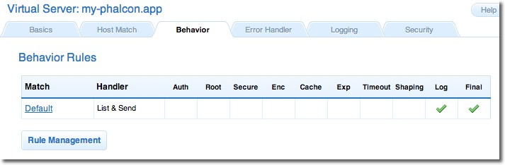

Notes d'installation pour Cherokee
==================================

Cherokee_ est un serveur web hautement performant. Il est très rapide, flexible et facile à configurer.

Configurer Cherokee pour Phalcon
--------------------------------
Cherokee fournit un interface graphique conviviale pour configurer presque tous les réglages disponibles dans le serveur web.  
Démarrez l'administrateur cherokee avec /path-to-cherokee/sbin/cherokee-admin (NDT: On suppose que l'interface d'administration est en anglais)

.. figure:: ../_static/img/cherokee-1.jpg
    :align: center

Créez un nouveau serveur virtuel en cliquant sur "vServers" et renseignez alors votre nouveau serveur virtuel:

.. figure:: ../_static/img/cherokee-2.jpg
    :align: center

Le serveur virtuel nouvellement ajouté doit apparaître dans la barre gauche de l'écran. Dans l'onglet "Behaviors"
vous verrez un ensemble de comportements par défaut pour ce serveur virtuel. Cliquez sur le bouton "Rule Management".
Supprimez ceux qui sont identifiés comme "Directory /cherokee_themes" et "Directory /icons":

A l'aide de l'assistant, ajoutez le comportement "PHP Language". Ce comportement vous permet d'exécuter des applications PHP:

.. figure:: ../_static/img/cherokee-4.jpg
    :align: center

Normalement ce comportement ne nécessite aucun réglage supplémentaire. Ajoutez un autre comportement
cette fois ci en allant dans la section "Manual Configuration". Dans "Rule Type" choisissez "File Exists", 
ensuite assurez-vous que l'option "Match any file" soit activée:

.. figure:: ../_static/img/cherokee-55.jpg
    :align: center

Dans l'onglet "Handler", choisissez "List & Send" comme gestionnaire:

.. figure:: ../_static/img/cherokee-7.jpg
    :align: center

Editez le comportement "Default" afin d'activer le moteur de réécriture d'URL. Définissez le gestionnaire à "Redirection",
et ajouter l'expression régulière ^(.*)$ au moteur:

.. figure:: ../_static/img/cherokee-6.jpg
    :align: center

Enfin, assurez-vous que les comportement soient dans l'ordre suivant:

.. figure:: ../_static/img/cherokee-8.jpg
    :align: center

Lancez l'application dans un navigateur:

.. figure:: ../_static/img/cherokee-9.jpg
    :align: center

.. _Cherokee: http://www.cherokee-project.com/
