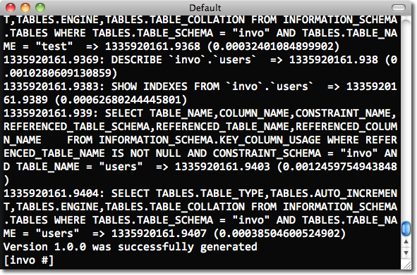

Database Migrations
===================

Migrations are a convenient way for you to alter your database in a structured and organized manner.

.. highlights::

    **Important:** Migrations are available in :doc:`Phalcon Developer Tools <tools>` You need at least Phalcon Framework version 0.5.0 to use developer tools. Also, it is recommended to have PHP 5.4 or greater installed.

Often in development we need to update changes in production environments. Some of these changes could be database modifications like new fields, new tables, removing indexes, etc.

When a migration is generated a set of classes are created to describe how your database is structured at that particular moment. These classes can be used to synchronize the schema structure on remote databases setting your database ready to work with the new changes that your application implements. Migrations describe these transformations using plain PHP.

.. raw:: html

    

        <iframe src="https://player.vimeo.com/video/41381817" width="500" height="281" frameborder="0" webkitAllowFullScreen mozallowfullscreen allowFullScreen></iframe>
    

Schema Dumping
--------------
The :doc:`Phalcon Developer Tools <tools>` provides scripts to manage migrations (generation, running and rollback).

The available options for generating migrations are:

.. figure:: ../_static/img/migrations-1.png
   :align: center

Running this script without any parameters will simply dump every object (tables and views) from your database into migration classes.

Each migration has a version identifier associated with it. The version number allows us to identify if the migration is newer or older than the current 'version' of our database. Versions will also inform Phalcon of the running order when executing a migration.

When a migration is generated, instructions are displayed on the console to describe the different steps of the migration and the execution time of those statements. At the end, a migration version is generated.

By default :doc:`Phalcon Developer Tools <tools>` uses the *app/migrations* directory to dump the migration files. You can change the location by setting one of the parameters on the generation script. Each table in the database has its respective class generated in a separated file under a directory referring its version:

.. figure:: ../_static/img/migrations-3.png
   :align: center

Migration Class Anatomy
-----------------------
Each file contains a unique class that extends the :code:`Phalcon\Mvc\Model\Migration` class. These classes normally have two methods: :code:`up()` and :code:`down()`. :code:`up()` performs the migration, while :code:`down()` rolls it back.

:code:`up()` also contains the *magic* method :code:`morphTable()`. The magic comes when it recognizes the changes needed to synchronize the actual table in the database to the description given.

.. code-block:: php

    <?php

    use Phalcon\Db\Column as Column;
    use Phalcon\Db\Index as Index;
    use Phalcon\Db\Reference as Reference;
    use Phalcon\Mvc\Model\Migration;

    class ProductsMigration_100 extends Migration
    {
        public function up()
        {
            $this->morphTable(
                "products",
                [
                    "columns" => [
                        new Column(
                            "id",
                            [
                                "type"          => Column::TYPE_INTEGER,
                                "size"          => 10,
                                "unsigned"      => true,
                                "notNull"       => true,
                                "autoIncrement" => true,
                                "first"         => true,
                            ]
                        ),
                        new Column(
                            "product_types_id",
                            [
                                "type"     => Column::TYPE_INTEGER,
                                "size"     => 10,
                                "unsigned" => true,
                                "notNull"  => true,
                                "after"    => "id",
                            ]
                        ),
                        new Column(
                            "name",
                            [
                                "type"    => Column::TYPE_VARCHAR,
                                "size"    => 70,
                                "notNull" => true,
                                "after"   => "product_types_id",
                            ]
                        ),
                        new Column(
                            "price",
                            [
                                "type"    => Column::TYPE_DECIMAL,
                                "size"    => 16,
                                "scale"   => 2,
                                "notNull" => true,
                                "after"   => "name",
                            ]
                        ),
                    ],
                    "indexes" => [
                        new Index(
                            "PRIMARY",
                            [
                                "id",
                            ]
                        ),
                        new Index(
                            "product_types_id",
                            [
                                "product_types_id",
                            ],
                        ),
                    ],
                    "references" => [
                        new Reference(
                            "products_ibfk_1",
                            [
                                "referencedSchema"  => "invo",
                                "referencedTable"   => "product_types",
                                "columns"           => ["product_types_id"],
                                "referencedColumns" => ["id"],
                            ]
                        ),
                    ],
                    "options" => [
                        "TABLE_TYPE"      => "BASE TABLE",
                        "ENGINE"          => "InnoDB",
                        "TABLE_COLLATION" => "utf8_general_ci",
                    ],
                ]
            );
        }
    }

The class is called "ProductsMigration_100". Suffix 100 refers to the version 1.0.0. :code:`morphTable()` receives an associative array with 4 possible sections:

+--------------+---------------------------------------------------------------------------------------------------------------------------------------------+----------+
| Index        | Description                                                                                                                                 | Optional |
+==============+=============================================================================================================================================+==========+
| "columns"    | An array with a set of table columns                                                                                                        | Non      |
+--------------+---------------------------------------------------------------------------------------------------------------------------------------------+----------+
| "indexes"    | An array with a set of table indexes.                                                                                                       | Oui      |
+--------------+---------------------------------------------------------------------------------------------------------------------------------------------+----------+
| "references" | An array with a set of table references (foreign keys).                                                                                     | Oui      |
+--------------+---------------------------------------------------------------------------------------------------------------------------------------------+----------+
| "options"    | An array with a set of table creation options. These options are often related to the database system in which the migration was generated. | Oui      |
+--------------+---------------------------------------------------------------------------------------------------------------------------------------------+----------+

Defining Columns
^^^^^^^^^^^^^^^^
:doc:`Phalcon\\Db\\Column <../api/Phalcon_Db_Column>` is used to define table columns. It encapsulates a wide variety of column related features. Its constructor receives as first parameter the column name and an array describing the column. The following options are available when describing columns:

+-----------------+--------------------------------------------------------------------------------------------------------------------------------------------+----------+
| Option          | Description                                                                                                                                | Optional |
+=================+============================================================================================================================================+==========+
| "type"          | Column type. Must be a :doc:`Phalcon_Db_Column <../api/Phalcon_Db_Column>` constant (see below)                                            | Non      |
+-----------------+--------------------------------------------------------------------------------------------------------------------------------------------+----------+
| "size"          | Some type of columns like VARCHAR or INTEGER may have a specific size                                                                      | Oui      |
+-----------------+--------------------------------------------------------------------------------------------------------------------------------------------+----------+
| "scale"         | DECIMAL or NUMBER columns may be have a scale to specify how much decimals it must store                                                   | Oui      |
+-----------------+--------------------------------------------------------------------------------------------------------------------------------------------+----------+
| "unsigned"      | INTEGER columns may be signed or unsigned. This option does not apply to other types of columns                                            | Oui      |
+-----------------+--------------------------------------------------------------------------------------------------------------------------------------------+----------+
| "notNull"       | Column can store null values?                                                                                                              | Oui      |
+-----------------+--------------------------------------------------------------------------------------------------------------------------------------------+----------+
| "default"       | Defines a default value for a column (can only be an actual value, not a function such as `NOW()`)                                         | Oui      |
+-----------------+--------------------------------------------------------------------------------------------------------------------------------------------+----------+
| "autoIncrement" | With this attribute column will filled automatically with an auto-increment integer. Only one column in the table can have this attribute. | Oui      |
+-----------------+--------------------------------------------------------------------------------------------------------------------------------------------+----------+
| "first"         | Column must be placed at first position in the column order                                                                                | Oui      |
+-----------------+--------------------------------------------------------------------------------------------------------------------------------------------+----------+
| "after"         | Column must be placed after indicated column                                                                                               | Oui      |
+-----------------+--------------------------------------------------------------------------------------------------------------------------------------------+----------+

Database migrations support the following database column types:

* :code:`Phalcon\Db\Column::TYPE_INTEGER`
* :code:`Phalcon\Db\Column::TYPE_VARCHAR`
* :code:`Phalcon\Db\Column::TYPE_CHAR`
* :code:`Phalcon\Db\Column::TYPE_DATE`
* :code:`Phalcon\Db\Column::TYPE_DATETIME`
* :code:`Phalcon\Db\Column::TYPE_TIMESTAMP`
* :code:`Phalcon\Db\Column::TYPE_DECIMAL`
* :code:`Phalcon\Db\Column::TYPE_TEXT`
* :code:`Phalcon\Db\Column::TYPE_BOOLEAN`
* :code:`Phalcon\Db\Column::TYPE_FLOAT`
* :code:`Phalcon\Db\Column::TYPE_DOUBLE`
* :code:`Phalcon\Db\Column::TYPE_TINYBLOB`
* :code:`Phalcon\Db\Column::TYPE_BLOB`
* :code:`Phalcon\Db\Column::TYPE_MEDIUMBLOB`
* :code:`Phalcon\Db\Column::TYPE_LONGBLOB`
* :code:`Phalcon\Db\Column::TYPE_JSON`
* :code:`Phalcon\Db\Column::TYPE_JSONB`
* :code:`Phalcon\Db\Column::TYPE_BIGINTEGER`

Defining Indexes
^^^^^^^^^^^^^^^^
:doc:`Phalcon\\Db\\Index <../api/Phalcon_Db_Index>` defines table indexes. An index only requires that you define a name for it and a list of its columns. Note that if any index has the name PRIMARY, Phalcon will create a primary key index for that table.

Defining References
^^^^^^^^^^^^^^^^^^^
:doc:`Phalcon\\Db\\Reference <../api/Phalcon_Db_Reference>` defines table references (also called foreign keys). The following options can be used to define a reference:

+---------------------+-----------------------------------------------------------------------------------------------------+----------+------------------+
| Index               | Description                                                                                         | Optional | Implemented in   |
+=====================+=====================================================================================================+==========+==================+
| "referencedTable"   | It's auto-descriptive. It refers to the name of the referenced table.                               | Non      | All              |
+---------------------+-----------------------------------------------------------------------------------------------------+----------+------------------+
| "columns"           | An array with the name of the columns at the table that have the reference                          | Non      | All              |
+---------------------+-----------------------------------------------------------------------------------------------------+----------+------------------+
| "referencedColumns" | An array with the name of the columns at the referenced table                                       | Non      | All              |
+---------------------+-----------------------------------------------------------------------------------------------------+----------+------------------+
| "referencedSchema"  | The referenced table maybe is on another schema or database. This option allows you to define that. | Oui      | All              |
+---------------------+-----------------------------------------------------------------------------------------------------+----------+------------------+
| "onDelete"          | If the foreign record is removed, perform this action on the local record(s).                       | Oui      | MySQL PostgreSQL |
+---------------------+-----------------------------------------------------------------------------------------------------+----------+------------------+
| "onUpdate"          | If the foreign record is updated, perform this action on the local record(s).                       | Oui      | MySQL PostgreSQL |
+---------------------+-----------------------------------------------------------------------------------------------------+----------+------------------+

Writing Migrations
------------------
Migrations aren't only designed to "morph" table. A migration is just a regular PHP class so you're not limited to these functions. For example after adding a column you could write code to set the value of that column for existing records. For more details and examples of individual methods, check the :doc:`database component <db>`.

.. code-block:: php

    <?php

    use Phalcon\Mvc\Model\Migration;

    class ProductsMigration_100 extends Migration
    {
        public function up()
        {
            // ...

            self::$_connection->insert(
                "products",
                [
                    "Malabar spinach",
                    14.50,
                ],
                [
                    "name",
                    "price",
                ]
            );
        }
    }

Running Migrations
------------------
Once the generated migrations are uploaded on the target server, you can easily run them as shown in the following example:

.. figure:: ../_static/img/migrations-4.png
   :align: center

.. figure:: ../_static/img/migrations-5.png
   :align: center

Depending on how outdated is the database with respect to migrations, Phalcon may run multiple migration versions in the same migration process. If you specify a target version, Phalcon will run the required migrations until it reaches the specified version.
