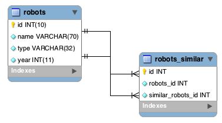

Relation de modèle
==================

Relations entre modèles
-----------------------
Il existe quatre types de relations: un-à-un, un-à-plusieurs, plusieurs-à-un, plusieurs-à-plusieurs. La relation peut être
unidirectionnelle ou bidirectionnelle, et chacune peut être simple (entre deux modèles) ou plus complexe (une combinaison de modèles).
Le gestionnaire de modèles s'occupe des contraintes de clés étrangères pour ces relations, la définition de celles-ci contribue à l'intégrité
référentielle aussi aisément que l'accès rapide aux enregistrements liés à un modèle. Grâce à la mise en œuvre de relations,
il devient facile d'accéder aux données des modèles associés à chaque enregistrement d'une manière uniforme.

Relations Unidirectionnelles
^^^^^^^^^^^^^^^^^^^^^^^^^^^^
Les relations unidirectionnelles sont celles qui sont dirigés d'un modèle vers un autre mais pas réciproquement.

Relations Bidirectionnelles
^^^^^^^^^^^^^^^^^^^^^^^^^^^
Les relations bidirectionnelles construisent des relations entre deux modèles, et chaque modèle établit une relation réciproque à l'autre.

Définition de relations
^^^^^^^^^^^^^^^^^^^^^^^
Dans Phalcon, les relations doivent être définies dans la méthode :code:`initialize()` d'un modèle. Les méthodes :code:`belongsTo()`, :code:`hasOne()`,
:code:`hasMany()` et :code:`hasManyToMany()` définissent la relation entre un ou plusieurs champs du modèle courant vers des champs d'un
autre modèle. Chacune de ces méthodes requiert 3 paramètres: champs locaux, modèle référencé, champs référencés.

+---------------+----------------------------+
| Méthode       | Description                |
+===============+============================+
| hasMany       | Définit une relation 1-n   |
+---------------+----------------------------+
| hasOne        | Définit une relation 1-1   |
+---------------+----------------------------+
| belongsTo     | Définit une relation n-1   |
+---------------+----------------------------+
| hasManyToMany | Définit une relation n-n   |
+---------------+----------------------------+

Le schéma suivant montre 3 tables dont les relations vont nous servir d'exemples sur les relations:

.. code-block:: sql

    CREATE TABLE `robots` (
        `id` int(10) unsigned NOT NULL AUTO_INCREMENT,
        `name` varchar(70) NOT NULL,
        `type` varchar(32) NOT NULL,
        `year` int(11) NOT NULL,
        PRIMARY KEY (`id`)
    );

    CREATE TABLE `robots_parts` (
        `id` int(10) unsigned NOT NULL AUTO_INCREMENT,
        `robots_id` int(10) NOT NULL,
        `parts_id` int(10) NOT NULL,
        `created_at` DATE NOT NULL,
        PRIMARY KEY (`id`),
        KEY `robots_id` (`robots_id`),
        KEY `parts_id` (`parts_id`)
    );

    CREATE TABLE `parts` (
        `id` int(10) unsigned NOT NULL AUTO_INCREMENT,
        `name` varchar(70) NOT NULL,
        PRIMARY KEY (`id`)
    );

* Le modèle "Robots" a plusieurs "RobotsParts".
* Le modèle "Parts" a plusieurs "RobotsParts".
* Le modèle "RobotsParts" appartient aux modèles "Robots" et "Parts" dans une relation plusieurs-à-un.
* Le modèle "Robots" a une relation plusieurs-à-plusieurs vers "Parts" au travers de "RobotsParts".

Regardez le diagramme EER pour mieux comprendre les relations:

.. figure:: ../_static/img/eer-1.png
    :align: center

Les modèles et leurs relations pourraient être implémentées comme suit:

.. code-block:: php

    <?php

    namespace Store\Toys;

    use Phalcon\Mvc\Model;

    class Robots extends Model
    {
        public $id;

        public $name;

        public function initialize()
        {
            $this->hasMany(
                "id",
                "RobotsParts",
                "robots_id"
            );
        }
    }

.. code-block:: php

    <?php

    use Phalcon\Mvc\Model;

    class Parts extends Model
    {
        public $id;

        public $name;

        public function initialize()
        {
            $this->hasMany(
                "id",
                "RobotsParts",
                "parts_id"
            );
        }
    }

.. code-block:: php

    <?php

    use Phalcon\Mvc\Model;

    class RobotsParts extends Model
    {
        public $id;

        public $robots_id;

        public $parts_id;

        public function initialize()
        {
            $this->belongsTo(
                "robots_id",
                "Store\\Toys\\Robots",
                "id"
            );

            $this->belongsTo(
                "parts_id",
                "Parts",
                "id"
            );
        }
    }

Le premier paramètre indique le champ dans le modèle local impliqué dans la relation; le deuxième indique le nom
du modèle référencé et le troisième le nom du champ dans le modèle référencé. Vous pouvez également utiliser des tableaux pour définir plusieurs champs dans la relation.

Les relations de type plusieurs à plusieurs nécessitent 3 modèles et la définition des attributs impliqués dans la relation:

.. code-block:: php

    <?php

    namespace Store\Toys;

    use Phalcon\Mvc\Model;

    class Robots extends Model
    {
        public $id;

        public $name;

        public function initialize()
        {
            $this->hasManyToMany(
                "id",
                "RobotsParts",
                "robots_id", "parts_id",
                "Parts",
                "id"
            );
        }
    }

Profiter de l'avantage des relations
^^^^^^^^^^^^^^^^^^^^^^^^^^^^^^^^^^^^
En définissant explicitement les relations entre modèles, il est aisé de trouver les enregistrements relatifs à un enregistrement particulier.

.. code-block:: php

    <?php

    use Store\Toys\Robots;

    $robot = Robots::findFirst(2);

    foreach ($robot->robotsParts as $robotPart) {
        echo $robotPart->parts->name, "\n";
    }

Phalcon utilise les méthodes magiques :code:`__set`/:code:`__get`/:code:`__call` pour stocker ou récupérer les données relatives.

En accédant à un attribut du même nom que la relation, nous récupérons tous les enregistrements relatifs.

.. code-block:: php

    <?php

    use Store\Toys\Robots;

    $robot       = Robots::findFirst();
    
    / Tous les enregistrements relatifs dans RobotsParts
    $robotsParts = $robot->robotsParts; /

De même, vous pouvez utiliser un accesseur magique:

.. code-block:: php

    <?php

    use Store\Toys\Robots;

    $robot = Robots::findFirst();

	// Tous les enregistrements relatifs dans RobotsParts
    $robotsParts = $robot->getRobotsParts();

    // Transmision de paramètres
    $robotsParts = $robot->getRobotsParts(
        [
            "limit" => 5,
        ]
    );

Si une méthode appelée porte le préfixe "get" alors :doc:`Phalcon\\Mvc\\Model <../api/Phalcon_Mvc_Model>` retournera un résultat
:code:`findFirst()`/:code:`find()`. L'exemple suivant compare la récupération de résultats relatif avec 
et sans les méthodes magiques:

.. code-block:: php

    <?php

    use Store\Toys\Robots;

    $robot       = Robots::findFirst(2);

    // Le modèle Robots a une relation 1-n
    // (hasMany) avec RobotsParts
    $robotsParts = $robot->robotsParts;

    // Seulement les "parts" qui répondent à la condition
    $robotsParts = $robot->getRobotsParts(
        [
            "created_at = :date:",
            "bind" => [
                "date" => "2015-03-15"
            ]
        ]
    );

    $robotPart = RobotsParts::findFirst(1);

    // le modèle RobotsParts a une relation n-1
    // (belongsTo) avec RobotsParts
    $robot = $robotPart->robots;

Obtenir des enregistrements relatifs manuellement:

.. code-block:: php

    <?php

    use Store\Toys\Robots;
    
	$robot = Robots::findFirst(2);

    // Le modèle Robots a une relation 1-n
    // (hasMany) avec RobotsParts
    $robotsParts = RobotsParts::find(
        [
            "robots_id = :id:",
            "bind" => [
                "id" => $robot->id,
            ]
        ]
    );

    // Seulement les "parts" qui répondent à la condition
    $robotsParts = RobotsParts::find(
        [
            "robots_id = :id: AND created_at = :date:",
            "bind" => [
                "id"   => $robot->id,
                "date" => "2015-03-15",
            ]
        ]
    );

    $robotPart   = RobotsParts::findFirst(1);

    // le modèle RobotsParts a une relation n-1
    // (belongsTo) avec Robots
    $robot = Robots::findFirst(
        [
            "id = :id:",
            "bind" => [
                "id" => $robotPart->robots_id,
            ]
        ]
    );

Les méthodes "get" sont utilisées pour rechercher avec :code:`find()` ou :code:`findFirst()` les enregistrements associés selon
le type de la relation:

+---------------------+------------------------------------------------------------------------------------------------------------------------------+------------------------+
| Type                | Description                                                                                                                  | Méthode implicite      |
+=====================+==============================================================================================================================+========================+
| Belongs-To          | Retourne une instance du modèle de l'enregistrement directement associé                                                      | findFirst              |
+---------------------+------------------------------------------------------------------------------------------------------------------------------+------------------------+
| Has-One             | Retourne une instance du modèle de l'enregistrement directement associé                                                      | findFirst              |
+---------------------+------------------------------------------------------------------------------------------------------------------------------+------------------------+
| Has-Many            | Retourne une collection d'instances du modèle référencé                                                                      | find                   |
+---------------------+------------------------------------------------------------------------------------------------------------------------------+------------------------+
| Has-Many-to-Many    | Retourne une collection d'instances du modèle référencé. Réalise implicitement des "innner joins" avec les modèles concernés | (requête complexe)     |
+---------------------+------------------------------------------------------------------------------------------------------------------------------+------------------------+

Vous pouvez également utiliser le préfixe "count" pour retourner un entier qui indique le nombre d'enregistrements relatifs:

.. code-block:: php

    <?php

    use Store\Toys\Robots;

    $robot = Robots::findFirst(2);
    
    echo "The robot has ", $robot->countRobotsParts(), " parts\n";

Alias dans les relations
^^^^^^^^^^^^^^^^^^^^^^^^
Pour mieux comprendre comment les alias marchent, consultez l'exemple suivant:

La table "robots_similar" contient une fonction pour indiquer comment chaque robot est similaire à d'autres:

.. code-block:: bash

    mysql> desc robots_similar;
    +-------------------+------------------+------+-----+---------+----------------+
    | Field             | Type             | Null | Key | Default | Extra          |
    +-------------------+------------------+------+-----+---------+----------------+
    | id                | int(10) unsigned | NO   | PRI | NULL    | auto_increment |
    | robots_id         | int(10) unsigned | NO   | MUL | NULL    |                |
    | similar_robots_id | int(10) unsigned | NO   |     | NULL    |                |
    +-------------------+------------------+------+-----+---------+----------------+
    3 rows in set (0.00 sec)

Les deux champs "robots_id" et "similar_robots_id" possèdent une relation vers le modèle Robots:

Un modèle qui défini une association de cette table et de ses relation est le suivant:

.. code-block:: php

    <?php

    class RobotsSimilar extends Phalcon\Mvc\Model
    {
        public function initialize()
        {
            $this->belongsTo(
                "robots_id",
                "Store\\Toys\\Robots",
                "id"
            );

            $this->belongsTo(
                "similar_robots_id",
                "Store\\Toys\\Robots",
                "id"
            );
        }
    }

Tant que les deux relations pointent le même modèle (Robots), obtenir les enregistrements associés par les relations n'est pas très clair:

.. code-block:: php

    <?php

    $robotsSimilar = RobotsSimilar::findFirst();

    // Retourne l'enregistrement sous-jacent à la colonne robots_id
    // Mais c'est aussi un belongsTo qui ne retourne qu'un seul enregistrement
    // mais le nom "getRobots" semble indiquer qu'il en retourne plus d'un
    $robot = $robotsSimilar->getRobots();

    // Mais alors, comment récupérer l'enregistrement sous-jacent à la colonne similar_robots_id
    // Si les deux relations possèdent le même nom ?

Les alias nous permettent de renommer chacune des relations, pour résoudre ce type de problèmes:

.. code-block:: php

    <?php

    use Phalcon\Mvc\Model;

    class RobotsSimilar extends Model
    {
        public function initialize()
        {
            $this->belongsTo(
                "robots_id",
                "Store\\Toys\\Robots",
                "id",
                [
                    "alias" => "Robot",
                ]
            );

            $this->belongsTo(
                "similar_robots_id",
                "Store\\Toys\\Robots",
                "id",
                [
                    "alias" => "SimilarRobot",
                ]
            );
        }
    }

Avec ces définitions d'alias nous pouvons récupérer aisément les enregistrements relatifs:

.. code-block:: php

    <?php

    $robotsSimilar = RobotsSimilar::findFirst();

    // Retourne l'enregistrement sous-jacent à la colonne (robots_id)
    $robot = $robotsSimilar->getRobot();
    $robot = $robotsSimilar->robot;

    // Retourne l'enregistrement sous-jacent à la colonne (similar_robots_id)
    $similarRobot = $robotsSimilar->getSimilarRobot();
    $similarRobot = $robotsSimilar->similarRobot;

Accesseurs magiques contre méthodes explicites
^^^^^^^^^^^^^^^^^^^^^^^^^^^^^^^^^^^^^^^^^^^^^^
La plupart des IDEs et des éditeurs ayant une autocomplétion ne peuvent pas déterminer le bon type avec les accesseurs magiques.
Donc, au lieu d'utiliser les accesseurs magiques vous pouvez éventuellement définir explicitement ces méthodes avec leur docblock
respectif aidant ainsi les IDE de produire une meilleur autocomplétion:

.. code-block:: php

    <?php

    namespace Store\Toys;

    use Phalcon\Mvc\Model;

    class Robots extends Model
    {
        public $id;

        public $name;

        public function initialize()
        {
            $this->hasMany(
                "id",
                "RobotsParts",
                "robots_id"
            );
        }

        /**
         * Return the related "robots parts"
         *
         * @return \RobotsParts[]
         */
        public function getRobotsParts($parameters = null)
        {
            return $this->getRelated('RobotsParts', $parameters);
        }
    }

Clés étrangères virtuelles
--------------------------
Par défaut, les relations n'agissent pas comme les clés étrangères des bases de données, ce qui fait que si vous tentez d'insérer ou de mettre à jour une valeur sans avoir une valeur
valide dans le modèle référencé, Phalcon ne produira pas de message de validation. Vous pouvez modifier de comportement en ajoutant un quatrième paramètre
lors de la définition de la relation.

Le modèle RobotsParts peut être modifié pour montrer cette capacité:

.. code-block:: php

    <?php

    use Phalcon\Mvc\Model;

    class RobotsParts extends Model
    {
        public $id;

        public $robots_id;

        public $parts_id;

        public function initialize()
        {
            $this->belongsTo(
                "robots_id",
                "Store\\Toys\\Robots",
                "id",
                [
                    "foreignKey" => true
                ]
            );

            $this->belongsTo(
                "parts_id",
                "Parts",
                "id",
                [
                    "foreignKey" => [
                        "message" => "The part_id does not exist on the Parts model"
                    ]
                ]
            );
        }
    }

Si vous altérez une relation :code:`belongsTo()` pour qu'elle agisse comme une clé étrangère, elle vérifiera que les valeurs insérées ou mises à jour sur ces champs sont valides
dans le modèle référencé. De même, si une relation :code:`hasMany()`/:code:`hasOne()` est altérée, elle vérifiera que les enregistrements ne peuvent pas être supprimés
si l'enregistrement en question est utilisé dans le modèle référencé.

.. code-block:: php

    <?php

    use Phalcon\Mvc\Model;

    class Parts extends Model
    {
        public function initialize()
        {
            $this->hasMany(
                "id",
                "RobotsParts",
                "parts_id",
                [
                    "foreignKey" => [
                        "message" => "The part cannot be deleted because other robots are using it",
                    ]
                ]
            );
        }
    }

Une clé étrangère virtuelle peut être modifiée pour autoriser des valeurs nulles comme suit:

.. code-block:: php

    <?php

    use Phalcon\Mvc\Model;

    class RobotsParts extends Model
    {
        public $id;

        public $robots_id;

        public $parts_id;

        public function initialize()
        {
            $this->belongsTo(
                "parts_id",
                "Parts",
                "id",
                [
                    "foreignKey" => [
                        "allowNulls" => true,
                        "message"    => "The part_id does not exist on the Parts model",
                    ]
                ]
            );
        }
    }

Action en cascade ou Restrictions
^^^^^^^^^^^^^^^^^^^^^^^^^^^^^^^^^
Les relations qui agissent en tant que relation étrangère virtuelle restreignent par défaut la création, la suppression et la mise à jours d'enregistrements
afin de maintenir l'intégrité des données:

.. code-block:: php

    <?php

    namespace Store\Toys;

    use Phalcon\Mvc\Model;
    use Phalcon\Mvc\Model\Relation;

    class Robots extends Model
    {
        public $id;

        public $name;

        public function initialize()
        {
            $this->hasMany(
                "id",
                "Parts",
                "robots_id",
                [
                    "foreignKey" => [
                        "action" => Relation::ACTION_CASCADE,
                    ]
                ]
            );
        }
    }

Le code ci-dessus fait en sorte que les enregistrements référencés (parts) soient supprimés si l'enregistrement maître (robot) est supprimé.

Stockage des enregistrements relatifs
-------------------------------------
Les propriétés magiques peuvent être utilisées pour stocker les enregistrements et les propriétés associées;

.. code-block:: php

    <?php

    // Creation d'un artiste
    $artist = new Artists();

    $artist->name    = "Shinichi Osawa";
    $artist->country = "Japan";

    // Creation d'un album
    $album = new Albums();

    $album->name   = "The One";
    $album->artist = $artist; // Assign the artist
    $album->year   = 2008;

    // Sauvegarde les 2 enregistrements
    $album->save();

Sauvegarder un enregistrement et ses enregistrements associés dans une relation has-many:

.. code-block:: php

    <?php

    // Récupère un artiste existant
    $artist = Artists::findFirst(
        "name = 'Shinichi Osawa'"
    );

    // Création d'un album
    $album = new Albums();

    $album->name   = "The One";
    $album->artist = $artist;

    $songs = [];

    // Création du premier morceau 
    $songs[0]           = new Songs();
    $songs[0]->name     = "Star Guitar";
    $songs[0]->duration = "5:54";

    // Création du deuxième morceau 
    $songs[1]           = new Songs();
    $songs[1]->name     = "Last Days";
    $songs[1]->duration = "4:29";

    // Assignation du tableau de morceaux
    $album->songs = $songs;

    // Enregistre l'album et ses morceaux
    $album->save();

L'enregistrement simultané de l'album et de l'artiste implique l'utilisation implicite d'une transaction, ainsi 
s'il y a un problème lors de la sauvegarde des enregistrement associés, le parent ne sera pas sauvegardé non plus. Les messages
sont renvoyés à l'utilisateur pour l'informer d'éventuelles erreurs.

Note: L'ajout d'entités relatives en surchargeant les méthodes suivantes n'est pas possible:

 - :code:`Phalcon\Mvc\Model::beforeSave()`
 - :code:`Phalcon\Mvc\Model::beforeCreate()`
 - :code:`Phalcon\Mvc\Model::beforeUpdate()`

Vous devez surcharger la méthode :code:`Phalcon\Mvc\Model::save()` dans un modèle pour que cela fonctionne.

Opérations sur les jeux de résultat
-----------------------------------
Si un jeu de résultat est composé d'objets complets, le jeu de résultat est dans la capacité de réaliser des opérations sur les enregistrements d'une façon simple:

Mise à jour des enregistrements relatifs
^^^^^^^^^^^^^^^^^^^^^^^^^^^^^^^^^^^^^^^^
Au lieu de faire ceci:

.. code-block:: php

    <?php

    $parts = $robots->getParts();

    foreach ($parts as $part) {
        $part->stock      = 100;
        $part->updated_at = time();

        if ($part->update() === false) {
            $messages = $part->getMessages();

            foreach ($messages as $message) {
                echo $message;
            }

            break;
        }
    }

vous pouvez faire cela:

.. code-block:: php

    <?php

    $robots->getParts()->update(
        [
            "stock"      => 100,
            "updated_at" => time(),
        ]
    );

'update' accepte aussi des fonctions anonymes pour filter les enregistrements à mettre à jour:

.. code-block:: php

    <?php

    $data = [
        "stock"      => 100,
        "updated_at" => time(),
    ];

    // Mise à jour de tous les parts excepté ceux qui ont le type basic
    $robots->getParts()->update(
        $data,
        function ($part) {
            if ($part->type === Part::TYPE_BASIC) {
                return false;
            }

            return true;
        }
    );

Suppression des enregistrements relatifs
^^^^^^^^^^^^^^^^^^^^^^^^^^^^^^^^^^^^^^^^
Au lieu de faire ceci:

.. code-block:: php

    <?php

    $parts = $robots->getParts();

    foreach ($parts as $part) {
        if ($part->delete() === false) {
            $messages = $part->getMessages();

            foreach ($messages as $message) {
                echo $message;
            }

            break;
        }
    }

vous pouvez faire cela:

.. code-block:: php

    <?php

    $robots->getParts()->delete();

:code:`delete()` accepte aussi une fonction anonyme pour filtrer les enregistrements à supprimer:

.. code-block:: php

    <?php

    // Supprime uniquement ceux dont le stock est positif ou nul
    $robots->getParts()->delete(
        function ($part) {
            if ($part->stock < 0) {
                return false;
            }

            return true;
        }
    );
