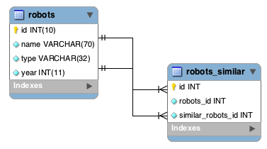

Travailler avec les Modèles
===========================

Un modèle représente l'information (donnée) d'une application et les règles pour manipuler cette donnée. Les modèles sont principalement utilisés pour gérer
les règles d'interaction avec la table correspondante dans la base données. La plupart du temps, à chaque table dans la base correspondra un modèle dans
votre application. L'essentiel de la logique métier de votre application sera concentré dans les modèles.

:doc:`Phalcon\\Mvc\\Model <../api/Phalcon_Mvc_Model>` est la base de chaque modèle dans une application Phalcon. Il fournit une indépendance vis à vis de la base de données,
une fonctionnalité _CRUD élémentaire, des capacités de recherche avancées et la possibilité de relier les modèles entre eux au travers d'autres service.
:doc:`Phalcon\\Mvc\\Model <../api/Phalcon_Mvc_Model>` évite la nécessité d'utiliser des instructions SQL parce qu'il traduit dynamiquement les méthodes vers
les opérations du moteur de bases de données respectif.

.. highlights::

    Les modèles sont prévus pour travailler sur les bases de données avec une couche élevée d'abstraction. Si vous devez exploiter des bases de données à un bas niveau
    consultez la documentation du composant :doc:`Phalcon\\Db <../api/Phalcon_Db>`.

Création de modèles
-------------------
Le modèle est une classe qui étend :doc:`Phalcon\\Mvc\\Model <../api/Phalcon_Mvc_Model>`. Il est placé dans dossier des modèles, le fichier ne contenant qu'une seule classe.
Son nom de classe doit suivre la notation camel:

.. code-block:: php

    <?php

    use Phalcon\Mvc\Model;

    class Robots extends Model
    {

    }

L'exemple ci-dessus montre l'implémentation du modèle "Robots". Notez que la classe Robots hérite de :doc:`Phalcon\\Mvc\\Model <../api/Phalcon_Mvc_Model>`.
Ce composant fournit beaucoup de fonctionnalités aux modèles qui en héritent, incluant des opérations
CRUD élémentaires (Create, Read, Update, Delete), la validation de données, ainsi qu'un support de recherche complexe et la possibilité de relier plusieurs modèles
entre eux.

.. highlights::

    Si vous utilisez PHP 5.4/5.5, il est recommandé que vous déclariez chaque colonne qui fait partie du modèle afin
    de préserver la mémoire et de réduire les allocations en mémoire.

Par défaut, le modèle "Robots" fait référence à la table "robots". Si vous souhaitez spécifiez un autre nom pour la table,
vous pouvez utiliser la méthode :code:`getSource()`:

.. code-block:: php

    <?php

    use Phalcon\Mvc\Model;

    class Robots extends Model
    {
        public function getSource()
        {
            return "the_robots";
        }
    }

Le modèle Robots est maintenant associé à la table "the_robots". La méthode :code:`initialize()` permet d'ajuster le comportement du modèle comme par exemple un autre nom de table.
La méthode :code:`initialize()` n'est invoquée qu'une seule fois lors de la requête.

.. code-block:: php

    <?php

    use Phalcon\Mvc\Model;

    class Robots extends Model
    {
        public function initialize()
        {
            $this->setSource("the_robots");
        }
    }

La méthode :code:`initialize()` n'est invoquée qu'une seule fois lors de la requête, il est destiné à effectuer des initialisations qui
s'appliquent à toutes les instances du modèle créées au sein de l'application. Si vous voulez réaliser des tâches d'initialisation à chaque instanciation
vous le pouvez avec 'onConstruct':

.. code-block:: php

    <?php

    use Phalcon\Mvc\Model;

    class Robots extends Model
    {
        public function onConstruct()
        {
            // ...
        }
    }

Propriétés publiques contre Accesseurs
^^^^^^^^^^^^^^^^^^^^^^^^^^^^^^^^^^^^^^
Les modèles peuvent être implémentés avec des propriétés à portée publique, ce qui signifie que chaque propriété peut être
lue ou écrite sans aucune restriction à partir de n'importe quel code qui instancie le modèle:

.. code-block:: php

    <?php

    use Phalcon\Mvc\Model;

    class Robots extends Model
    {
        public $id;

        public $name;

        public $price;
    }

Avec des accesseurs, vous contrôlez quelles sont les propriétés qui sont visibles publiquement et vous pouvez effectuer diverses transformations
sur les données (qui ne seraient pas possible autrement) ainsi qu'ajouter des règles de validation sur les données portées par l'objet:

.. code-block:: php

    <?php

    use Phalcon\Mvc\Model;

    class Robots extends Model
    {
        protected $id;

        protected $name;

        protected $price;

        public function getId()
        {
            return $this->id;
        }

        public function setName($name)
        {
            // Le nom est-il trop court ?
            if (strlen($name) < 10) {
                throw new \InvalidArgumentException('Le nom est trop court');
            }
            $this->name = $name;
        }

        public function getName()
        {
            return $this->name;
        }

        public function setPrice($price)
        {
            // Les prix négatifs sont interdits
            if ($price < 0) {
                throw new \InvalidArgumentException('Le prix ne peut être négatif');
            }
            $this->price = $price;
        }

        public function getPrice()
        {
            // Conversion de la valeur en type double avant utilisation
            return (double) $this->price;
        }
    }

Les propriétés publiques sont moins complexes à développer. Cependant, les accesseurs augmentent grandement la testabilité,
l'extensibilité et la maintenabilité des applications. C'est au développeur de décider quelle est la stratégie est la plus appropriée pour
l'application en cours de création. L'ORM est compatible avec les deux approches de définition de propriétés.

.. highlights::

    Les tirets bas (_) dans les noms de propriétés peuvent être problématiques avec les accesseurs

Si vous utilisez des tirets bas dans les noms de propriété, vous devez toujours utiliser la forme camelcase pour la déclaration de vos accesseurs pour
une utilisation des méthodes magiques (par ex. $model->getPropertyName au lieu de $model->getProperty_name, $model->findByPropertyName
au lieu de $model->findByProperty_name, etc.). Comme le système s'attend à une forme camelcase, et que les tirets bas sont généralement
supprimés, il est recommandé de nommer vos propriétés de la manière indiquée dans la documentation. Vous pouvez utiliser un mapping
de colonnes (comme décrit avant) pour assurer une bonne correspondance entre vos propriétés et les homologues dans la base de données.

Modèles et Espaces de Nom
^^^^^^^^^^^^^^^^^^^^^^^^^
Les espaces de noms sont utilisés pour éviter les conflits dans les noms de classe. Le nom de la table associée est dérivée du nom de la classe, dans ce cas 'Robots':

.. code-block:: php

    <?php

    namespace Store\Toys;

    use Phalcon\Mvc\Model;

    class Robots extends Model
    {
        // ...
    }

Les espaces de noms font partie du nom de modèle dans chaînes de caractères:

.. code-block:: php

    <?php

    namespace Store\Toys;

    use Phalcon\Mvc\Model;

    class Robots extends Model
    {
        public $id;

        public $name;

        public function initialize()
        {
            $this->hasMany('id', 'Store\Toys\RobotsParts', 'robots_id');
        }
    }

Comprendre le lien entre les Enregistrements et les Objets
----------------------------------------------------------
Chaque instance d'un modèle représente une ligne dans la table. Vous accédez facilement aux données de l'enregistrement en lisant les propriétés de l'objet.
Par exemple, pour une table "robots" avec ces enregistrements:

.. code-block:: bash

    mysql> select * from robots;
    +----+------------+------------+------+
    | id | name       | type       | year |
    +----+------------+------------+------+
    |  1 | Robotina   | mechanical | 1972 |
    |  2 | Astro Boy  | mechanical | 1952 |
    |  3 | Terminator | cyborg     | 2029 |
    +----+------------+------------+------+
    3 rows in set (0.00 sec)

Vous pourriez trouver un enregistrement particulier d'après sa clé primaire et imprimer son nom:

.. code-block:: php

    <?php

    // Trouve l'enrgt avec  id = 3
    $robot = Robots::findFirst(3);

    // Imprime "Terminator"
    echo $robot->name;

Une fois que l'enregistrement est en mémoire, vous pouvez effectuer des modifications sur ces données et enregistrer les changements:

.. code-block:: php

    <?php

    $robot       = Robots::findFirst(3);
    $robot->name = "RoboCop";
    $robot->save();

Comme vous pouvez le constater, il n'est pas nécessaire d'utiliser directement des instructions SQL. :doc:`Phalcon\\Mvc\\Model <../api/Phalcon_Mvc_Model>` fournit
une haute abstraction de la base de données pour les applications web.

Trouver des enregistrements
---------------------------
:doc:`Phalcon\\Mvc\\Model <../api/Phalcon_Mvc_Model>` offre également différentes méthodes pour chercher des enregistrements. Les exemples qui suivent vous
montrent comment extraire un ou plusieurs enregistrements à partir d'un modèle:

.. code-block:: php

    <?php

    // Combien y-a-t'il de robots ?
    $robots = Robots::find();
    echo "There are ", count($robots), "\n";

    // Combien y-a-t'il de robots 'mechanical' ?
    $robots = Robots::find("type = 'mechanical'");
    echo "There are ", count($robots), "\n";

    // Récupère et imprime les robots 'virtual' par ordre de nom
    $robots = Robots::find(
        array(
            "type = 'virtual'",
            "order" => "name"
        )
    );
    foreach ($robots as $robot) {
        echo $robot->name, "\n";
    }

    // Récupère les 100 premier robots 'virtual' par ordre de nom
    $robots = Robots::find(
        array(
            "type = 'virtual'",
            "order" => "name",
            "limit" => 100
        )
    );
    foreach ($robots as $robot) {
       echo $robot->name, "\n";
    }

.. highlights::

    Si vous voulez trouver un enregistrement d'après une donnée externe (telle qu'une entrée utilisateur) ou une variable, vous devez utiliser la `liaison de paramètres`_.

Vous pouvez également utiliser la méthode :code:`findFirst()` pour récupérer le premier enregistrement qui correspond au critère fournit:

.. code-block:: php

    <?php

    // Quel est le premier robot dans la table robots ?
    $robot = Robots::findFirst();
    echo "The robot name is ", $robot->name, "\n";

    // Quel est le premier robot 'mechanical' dans la table robots ?
    $robot = Robots::findFirst("type = 'mechanical'");
    echo "The first mechanical robot name is ", $robot->name, "\n";

    // Récupère le premier robot 'virtual' par ordre de nom
    $robot = Robots::findFirst(
        array(
            "type = 'virtual'",
            "order" => "name"
        )
    );
    echo "The first virtual robot name is ", $robot->name, "\n";

Les deux méthodes :code:`find()` et :code:`findFirst()` acceptent un tableau associatif spécifiant les critères de recherche:

.. code-block:: php

    <?php

    $robot = Robots::findFirst(
        array(
            "type = 'virtual'",
            "order" => "name DESC",
            "limit" => 30
        )
    );

    $robots = Robots::find(
        array(
            "conditions" => "type = ?1",
            "bind"       => array(1 => "virtual")
        )
    );

Les différentes options de requête sont:

+-------------+----------------------------------------------------------------------------------------------------------------------------------------------------------------------------------------------------------------------------------------------------------------+---------------------------------------------------------------------------------+
| Paramètre   | Description                                                                                                                                                                                                                                                    | Exemple                                                                         |
+=============+================================================================================================================================================================================================================================================================+=================================================================================+
| conditions  | Conditions pour l'opération de recherche. Il est utilisé pour extraire seulement les enregistrements qui répondent au critère spécifié. Par défaut :doc:`Phalcon\\Mvc\\Model <../api/Phalcon_Mvc_Model>` suppose que les conditions sont en premier paramètre. | :code:`"conditions" => "name LIKE 'steve%'"`                                    |
+-------------+----------------------------------------------------------------------------------------------------------------------------------------------------------------------------------------------------------------------------------------------------------------+---------------------------------------------------------------------------------+
| columns     | Spécifie les colonnes à renvoyer au lieu de toutes colonnes du modèles. Avec cette option, l'objet est incomplet lorsqu'il est retourné                                                                                                                        | :code:`"columns" => "id, name"`                                                 |
+-------------+----------------------------------------------------------------------------------------------------------------------------------------------------------------------------------------------------------------------------------------------------------------+---------------------------------------------------------------------------------+
| bind        | Bind est utilisé conjointement avec des options en remplaçant des espaces réservés et échappant les valeurs augmentant ainsi la sécurité                                                                                                                       | :code:`"bind" => array("status" => "A", "type" => "some-time")`                 |
+-------------+----------------------------------------------------------------------------------------------------------------------------------------------------------------------------------------------------------------------------------------------------------------+---------------------------------------------------------------------------------+
| bindTypes   | Lors de la liaison de paramètres, vous pouvez utiliser ce paramètre pour introduire une conversion de type du paramètre lié, augmentant encore la sécurité                                                                                                     | :code:`"bindTypes" => array(Column::BIND_PARAM_STR, Column::BIND_PARAM_INT)`    |
+-------------+----------------------------------------------------------------------------------------------------------------------------------------------------------------------------------------------------------------------------------------------------------------+---------------------------------------------------------------------------------+
| order       | Est utilisé pour trier le résultat. Un ou plusieurs champs séparés par une virgule.                                                                                                                                                                            | :code:`"order" => "name DESC, status"`                                          |
+-------------+----------------------------------------------------------------------------------------------------------------------------------------------------------------------------------------------------------------------------------------------------------------+---------------------------------------------------------------------------------+
| limit       | Limite le résultat à une certaine plage                                                                                                                                                                                                                        | :code:`"limit" => 10`                                                           |
+-------------+----------------------------------------------------------------------------------------------------------------------------------------------------------------------------------------------------------------------------------------------------------------+---------------------------------------------------------------------------------+
| offset      | Décale le resultat d'un certain nombre de lignes.                                                                                                                                                                                                              | :code:`"offset" => 5`                                                           |
+-------------+----------------------------------------------------------------------------------------------------------------------------------------------------------------------------------------------------------------------------------------------------------------+---------------------------------------------------------------------------------+
| group       | Collecte les données au travers de plusieurs enregistrement et regroupe les résultats selon une ou plusieurs colonnes                                                                                                                                          | :code:`"group" => "name, status"`                                               |
+-------------+----------------------------------------------------------------------------------------------------------------------------------------------------------------------------------------------------------------------------------------------------------------+---------------------------------------------------------------------------------+
| for_update  | Avec cette option doc:`Phalcon\\Mvc\\Model <../api/Phalcon_Mvc_Model>` lit les dernières données disponibles en activant un verrou exclusif sur chaque enregistrement                                                                                          | :code:`"for_update" => true`                                                    |
+-------------+----------------------------------------------------------------------------------------------------------------------------------------------------------------------------------------------------------------------------------------------------------------+---------------------------------------------------------------------------------+
| shared_lock | Avec cette option doc:`Phalcon\\Mvc\\Model <../api/Phalcon_Mvc_Model>` lit les dernières données disponibles en activant un verrou partagé sur chaque enregistrement                                                                                           | :code:`"shared_lock" => true`                                                   |
+-------------+----------------------------------------------------------------------------------------------------------------------------------------------------------------------------------------------------------------------------------------------------------------+---------------------------------------------------------------------------------+
| cache       | Met en cache le résultat, réduisant les accès au système relationnel                                                                                                                                                                                           | :code:`"cache" => array("lifetime" => 3600, "key" => "my-find-key")`            |
+-------------+----------------------------------------------------------------------------------------------------------------------------------------------------------------------------------------------------------------------------------------------------------------+---------------------------------------------------------------------------------+
| hydration   | Définit la stratégie d'hydratation pour alimenter chaque enregistrement du résultat                                                                                                                                                                            | :code:`"hydration" => Resultset::HYDRATE_OBJECTS`                               |
+-------------+----------------------------------------------------------------------------------------------------------------------------------------------------------------------------------------------------------------------------------------------------------------+---------------------------------------------------------------------------------+

Si vous préférez, il existe une façon plus orientée objet pour créer des requêtes plutôt qu'utiliser un tableau de paramètres:

.. code-block:: php

    <?php

    $robots = Robots::query()
        ->where("type = :type:")
        ->andWhere("year < 2000")
        ->bind(array("type" => "mechanical"))
        ->order("name")
        ->execute();

La méthode statique :code:`query()` retourne un objet :doc:`Phalcon\\Mvc\\Model\\Criteria <../api/Phalcon_Mvc_Model_Criteria>` qui plus favorable à l'autocomplétion des IDE.

Toutes les requêtes sont gérées en interne comme des requêtes :doc:`PHQL <phql>`. PHQL est un langage de haut niveau semblable au SQL et orienté objet.
Ce langage dispose d'autre caractéristiques pour réaliser des requêtes comme des jointures avec d'autres modèles, des regroupement, des aggrégats, etc.

Enfin, il existe la méthode :code:`findFirstBy<property-name>()`. Cette méthode étend la méthode :code:`findFirst()` mentionnée plus tôt. Elle permet de réaliser rapidement une
restitution depuis la table en exploitant le nom de la propriété elle-même et en transmettant en paramètre les données à rechercher sur cette colonne.
Suivons un exemple en reprenant notre modèle Robots mentionné précédemment:

.. code-block:: php

    <?php

    use Phalcon\Mvc\Model;

    class Robots extends Model
    {
        public $id;

        public $name;

        public $price;
    }

Nous disposons de trois propriétés pour travailler avec: :code:`$id`, :code:`$name` et :code:`$price`. Bon, mettons que vous voulez récupérer le
premier enregistrement de la table avec le nom "Terminator". Ceci peut être écrit ainsi:

.. code-block:: php

    <?php

    $name  = "Terminator";
    $robot = Robots::findFirstByName($name);

    if ($robot) {
        echo "Le premier robot avec le nom " . $name . " coûte " . $robot->price . ".";
    } else {
        echo "Il n'existe pas dans la table de robot avec le nom " . $name . ".";
    }

Notez que nous avons utilisé "Name" dans l'appel de la méthode et transmis la variable :code:`$name` qui contient le nom
que nous recherchons dans notre table. Notez également que lorsque nous trouvons une correspondance avec notre requête, toutes les autres propriétés
nous sont également disponibles.

Jeux de résultat de modèles
^^^^^^^^^^^^^^^^^^^^^^^^^^^
Alors que :code:`findFirst()` retourne directement une instance de la classe appelée (s'il existe des données à renvoyer), la méthode :code:`find()` retourne
un :doc:`Phalcon\\Mvc\\Model\\Resultset\\Simple <../api/Phalcon_Mvc_Model_Resultset_Simple>`. C'est un objet qui encapsule toutes les fonctionnalités
d'un jeu d'enregistrement comme le parcours, la recherche d'enregistrements spécifiques, le décompte, etc.

Ces objets sont plus puissants que les tableaux standards. Une des plus intéressantes caractéristiques de :doc:`Phalcon\\Mvc\\Model\\Resultset <../api/Phalcon_Mvc_Model_Resultset>`
est qu'à n'importe quel moment il n'y a qu'un seul enregistrement en mémoire. Ceci facilite grandement la gestion de la mémoire surtout lorsqu'on travaille avec de grands volumes de données.

.. code-block:: php

    <?php

    // Récupère tous les robots
    $robots = Robots::find();

    // Parcours avec un foreach
    foreach ($robots as $robot) {
        echo $robot->name, "\n";
    }

    // Parcours avec un while
    $robots->rewind();
    while ($robots->valid()) {
        $robot = $robots->current();
        echo $robot->name, "\n";
        $robots->next();
    }

    // Décompte du jeu de résultat
    echo count($robots);

    // Une autre façon de décompter le jeu de résultat
    echo $robots->count();

    // Déplace le curseur interne au troisième robot
    $robots->seek(2);
    $robot = $robots->current();

    // Accède au robot par sa position dans le jeu de résultat
    $robot = $robots[5];

    // Vérifie qu'il existe un enregistrement à une certaine position
    if (isset($robots[3])) {
       $robot = $robots[3];
    }

    // Prend le premier enregistrement dans le résultat
    $robot = $robots->getFirst();

    // Prend le dernier enregistrement
    $robot = $robots->getLast();

Les jeux de résultat de Phalcon émulent les curseurs défilables. Vous pouvez prendre n'importe quel ligne juste d'après sa position, ou déplacer le pointeur interne
à une position spécifique. Notez que certains SGBD ne supportent pas les curseurs défilables ce qui oblige à re-exécuter la requête
pour faire repartir le curseur depuis le début et d'obtenir l'enregistrement à la position demandée. De même, si un jeu de résultat
doit être parcouru plusieurs fois, la requête sera exécutée d'autant de fois.

Le stockage en mémoire de volumineux résultats peut être gourmand en ressources, et à cause de ceci, les jeux de résultat sont extraits
de la base données par morceaux de 32 lignes, réduisant la nécessité de re-exécuter la requête dans la plupart des cas et épargnant aussi de la mémoire.

Notez que les jeux de résultats peuvent être sérialisés et stockés dans un cache serveur. :doc:`Phalcon\\Cache <cache>` peut aider dans cette tâche. Cependant,
la sérialisation de données oblige :doc:`Phalcon\\Mvc\\Model <../api/Phalcon_Mvc_Model>` à récupérer toutes les données de la base dans un tableau
consommant ainsi plus de mémoire que nécessaire.

.. code-block:: php

    <?php

    // Demande tous les enregistrements depuis le modèle
    $parts = Parts::find();

    // Stocke le jeu de résultat dans un fichier
    file_put_contents("cache.txt", serialize($parts));

    // Récupère les données depuis un fichier
    $parts = unserialize(file_get_contents("cache.txt"));

    // Parcours les données
    foreach ($parts as $part) {
        echo $part->id;
    }

Filtrer les jeux d'enregistrement
^^^^^^^^^^^^^^^^^^^^^^^^^^^^^^^^^
La méthode la plus efficace pour filtrer les données est de définir des critères de recherche, les bases de données exploitant les index pour retourner les données plus rapidement.
Phalcon vous permet de filtrer les données avec PHP en utilisant n'importe quelle ressource qui n'est pas disponible dans la base de données:

.. code-block:: php

    <?php

    $customers = Customers::find()->filter(
        function ($customer) {

            // Retourne que les clients avec un e-mail valide
            if (filter_var($customer->email, FILTER_VALIDATE_EMAIL)) {
                return $customer;
            }
        }
    );

Liaison de Paramètres
^^^^^^^^^^^^^^^^^^^^^
La liaison de paramètres est également supportée dans :doc:`Phalcon\\Mvc\\Model <../api/Phalcon_Mvc_Model>`. Vous êtes encouragés à utiliser
cette méthode pour éliminer la possibilité que votre code soit le sujet d'attaques par injection SQL.

.. code-block:: php

    <?php

    // Interrogation de robots en liant les paramètres avec des marqueurs texte
    //
    $conditions = "name = :name: AND type = :type:";

    // Paramètres dont les clés sont les même que les marqueurs
    $parameters = array(
        "name" => "Robotina",
        "type" => "maid"
    );

    // Perform the query
    $robots = Robots::find(
        array(
            $conditions,
            "bind" => $parameters
        )
    );

    // Interrogation de robots en liant les paramètres avec les marqueurs numériques
    $conditions = "name = ?1 AND type = ?2";
    $parameters = array(1 => "Robotina", 2 => "maid");
    $robots     = Robots::find(
        array(
            $conditions,
            "bind" => $parameters
        )
    );

    // Interrogation de robots avec à la fois des marqueurs numériques et textuels
    $conditions = "name = :name: AND type = ?1";

    // Paramètres dont les clés sont les même que les marqueurs
    $parameters = array(
        "name" => "Robotina",
        1      => "maid"
    );

    // Exécution de la requête
    $robots = Robots::find(
        array(
            $conditions,
            "bind" => $parameters
        )
    );

En plaçant des marqueurs numériques, vous devez les écrire sous forme d'entier comme 1 ou 2. Dans ce cas "1" ou "2" sont considérés comme du texte
et non des nombres, donc l'espace marqué ne peut pas être remplacé avec succès.

Les chaînes de caractères sont automatiquement échappées à l'aide de PDO_. Cette fonction prend en compte le jeu de caractères de la connexion, donc il est recommandé de définir
le bon jeu de caractères dans les paramètres de la connexion ou bien dans la configuration de la base de données. Un mauvais jeu de caractères risque de produire des effets indésirables
lors du stockage ou de la récupération des données.

De plus, vous pouvez définir le paramètre "bindTypes" qui permet de définir comment les paramètres sont liés en accord avec leurs types de données.

.. code-block:: php

    <?php

    use Phalcon\Db\Column;

    // Paramètre lié
    $parameters = array(
        "name" => "Robotina",
        "year" => 2008
    );

    // Conversion de type
    $types = array(
        "name" => Column::BIND_PARAM_STR,
        "year" => Column::BIND_PARAM_INT
    );

    // Interrogation de robots en liant les paramètres à des marqueurs textuels
    $robots = Robots::find(
        array(
            "name = :name: AND year = :year:",
            "bind"      => $parameters,
            "bindTypes" => $types
        )
    );

.. highlights::

    Comme le type par défaut est :code:`Phalcon\Db\Column::BIND_PARAM_STR`, il n'est pas nécessaire de préciser
    le paramètre "bindTypes" si toutes les colonnes sont de ce type.

Si vous attachez des tableaux aux paramètres liés, conservez à l'esprit que les index sont basés zéro:

.. code-block:: php

    <?php

    $array = ["a","b","c"]; // $array: [[0] => "a", [1] => "b", [2] => "c"]

    unset($array[1]); // $array: [[0] => "a", [2] => "c"]

    // Maintenant nous devons réindexer le tableau
    $array = array_values($array); // $array: [[0] => "a", [1] => "c"]

    $robots = Robots::find(
        array(
            'letter IN ({letter:array})',
            'bind' => array(
                'letter' => $array
            )
        )
    );

.. highlights::

    La liaison de paramètres est disponible pour chaque méthode de requêtage tel que :code:`find()` et :code:`findFirst()` mais aussi les méthodes
    de calcul comme :code:`count()`, :code:`sum()`, :code:`average()`, etc.

Si vous utilisez les "finders", les paramètres sont automatiquement liés:

.. code-block:: php

    <?php

    // Requête liant explicitement un paramètre
    $robots = Robots::find(
        array(
            "name = ?0",
            "bind" => ["Ultron"],
        )
    );

    // Requête liant implicitement un paramètre
    $robots = Robots::findByName("Ultron");

Initialisation et Préparation d'Enregistrement récupéré
-------------------------------------------------------
Il peut arriver qu'après avoir obtenu un enregistrement depuis la base de données, il soit nécessaire d'initialiser les données avant
qu'elles ne soient utilisées dans le reste de l'application. Vous implémentez pour cela la méthode "afterFetch" dans le modèle, cet événement
sera exécuté juste après la création de l'instance et l'assignation des données:

.. code-block:: php

    <?php

    use Phalcon\Mvc\Model;

    class Robots extends Model
    {
        public $id;

        public $name;

        public $status;

        public function beforeSave()
        {
            // Conversion du tableau en chaîne de caractères
            $this->status = join(',', $this->status);
        }

        public function afterFetch()
        {
            // Conversion de la chaîne de caractères en tableau
            $this->status = explode(',', $this->status);
        }

        public function afterSave()
        {
            // Conversion de la chaîne de caractères en tableau
            $this->status = explode(',', $this->status);
        }
    }

Si vous utilisez les accesseurs et/ou les propriétés publiques, vous pouvez initialiser le champ une fois
qu'il est accédé:

.. code-block:: php

    <?php

    use Phalcon\Mvc\Model;

    class Robots extends Model
    {
        public $id;

        public $name;

        public $status;

        public function getStatus()
        {
            return explode(',', $this->status);
        }
    }

Relations entre modèles
-----------------------
Il existe quatre types de relations: un-à-un, un-à-plusieurs, plusieurs-à-un, plusieurs-à-plusieurs. La relation peut être
unidirectionnelle ou bidirectionnelle, et chacune peut être simple (entre deux modèles) ou plus complexe (une combinaison de modèles).
Le gestionnaire de modèles s'occupe des contraintes de clés étrangères pour ces relations, la définition de celles-ci contribue à l'intégrité
référentielle aussi aisément que l'accès rapide aux enregistrements liés à un modèle. Grâce à la mise en œuvre de relations,
il devient facile d'accéder aux données des modèles associés à chaque enregistrement d'une manière uniforme.

Relations Unidirectionnelles
^^^^^^^^^^^^^^^^^^^^^^^^^^^^
Les relations unidirectionnelles sont celles qui sont dirigés d'un modèle vers un autre mais pas réciproquement.

Relations Bidirectionnelles
^^^^^^^^^^^^^^^^^^^^^^^^^^^
Les relations bidirectionnelles construisent des relations entre deux modèles, et chaque modèle établit une relation réciproque à l'autre.

Définition de relations
^^^^^^^^^^^^^^^^^^^^^^^
Dans Phalcon, les relations doivent être définies dans la méthode :code:`initialize()` d'un modèle. Les méthodes :code:`belongsTo()`, :code:`hasOne()`,
:code:`hasMany()` et :code:`hasManyToMany()` définissent la relation entre un ou plusieurs champs du modèle courant vers des champs d'un
autre modèle. Chacune de ces méthodes requiert 3 paramètres: champs locaux, modèle référencé, champs référencés.

+---------------+----------------------------+
| Méthode       | Description                |
+===============+============================+
| hasMany       | Définit une relation 1-n   |
+---------------+----------------------------+
| hasOne        | Définit une relation 1-1   |
+---------------+----------------------------+
| belongsTo     | Définit une relation n-1   |
+---------------+----------------------------+
| hasManyToMany | Définit une relation n-n   |
+---------------+----------------------------+

Le schéma suivant montre 3 tables dont les relations vont nous servir d'exemples sur les relations:

.. code-block:: sql

    CREATE TABLE `robots` (
        `id` int(10) unsigned NOT NULL AUTO_INCREMENT,
        `name` varchar(70) NOT NULL,
        `type` varchar(32) NOT NULL,
        `year` int(11) NOT NULL,
        PRIMARY KEY (`id`)
    );

    CREATE TABLE `robots_parts` (
        `id` int(10) unsigned NOT NULL AUTO_INCREMENT,
        `robots_id` int(10) NOT NULL,
        `parts_id` int(10) NOT NULL,
        `created_at` DATE NOT NULL,
        PRIMARY KEY (`id`),
        KEY `robots_id` (`robots_id`),
        KEY `parts_id` (`parts_id`)
    );

    CREATE TABLE `parts` (
        `id` int(10) unsigned NOT NULL AUTO_INCREMENT,
        `name` varchar(70) NOT NULL,
        PRIMARY KEY (`id`)
    );

* Le modèle "Robots" a plusieurs "RobotsParts".
* Le modèle "Parts" a plusieurs "RobotsParts".
* Le modèle "RobotsParts" appartient aux modèles "Robots" et "Parts" dans une relation plusieurs-à-un.
* Le modèle "Robots" a une relation plusieurs-à-plusieurs vers "Parts" au travers de "RobotsParts".

Regardez le diagramme EER pour mieux comprendre les relations:

.. figure:: ../_static/img/eer-1.png
    :align: center

Les modèles et leurs relations pourraient être implémentées comme suit:

.. code-block:: php

    <?php

    use Phalcon\Mvc\Model;

    class Robots extends Model
    {
        public $id;

        public $name;

        public function initialize()
        {
            $this->hasMany("id", "RobotsParts", "robots_id");
        }
    }

.. code-block:: php

    <?php

    use Phalcon\Mvc\Model;

    class Parts extends Model
    {
        public $id;

        public $name;

        public function initialize()
        {
            $this->hasMany("id", "RobotsParts", "parts_id");
        }
    }

.. code-block:: php

    <?php

    use Phalcon\Mvc\Model;

    class RobotsParts extends Model
    {
        public $id;

        public $robots_id;

        public $parts_id;

        public function initialize()
        {
            $this->belongsTo("robots_id", "Robots", "id");
            $this->belongsTo("parts_id", "Parts", "id");
        }
    }

Le premier paramètre indique le champ dans le modèle local impliqué dans la relation; le deuxième indique le nom
du modèle référencé et le troisième le nom du champ dans le modèle référencé. Vous pouvez également utiliser des tableaux pour définir plusieurs champs dans la relation.

Les relations de type plusieurs à plusieurs nécessitent 3 modèles et de définir les attributs impliqués dans la relation:

.. code-block:: php

    <?php

    use Phalcon\Mvc\Model;

    class Robots extends Model
    {
        public $id;

        public $name;

        public function initialize()
        {
            $this->hasManyToMany(
                "id",
                "RobotsParts",
                "robots_id", "parts_id",
                "Parts",
                "id"
            );
        }
    }

Profiter de l'avantage des relations
^^^^^^^^^^^^^^^^^^^^^^^^^^^^^^^^^^^^
En définissant explicitement les relations entre modèles, il est aisé de trouver les enregistrements relatifs à un enregistrement particulier.

.. code-block:: php

    <?php

    $robot = Robots::findFirst(2);
    foreach ($robot->robotsParts as $robotPart) {
        echo $robotPart->parts->name, "\n";
    }

Phalcon utilise les méthodes magiques :code:`__set`/:code:`__get`/:code:`__call` pour stocker ou récupérer les données relatives.

En accédant à un attribut du même nom que la relation, nous récupérons tous les enregistrements relatifs.

.. code-block:: php

    <?php

    $robot       = Robots::findFirst();
    $robotsParts = $robot->robotsParts; // Tous les enregistrements relatifs dans RobotsParts

De même, vous pouvez utiliser un accesseur magique:

.. code-block:: php

    <?php

    $robot       = Robots::findFirst();
    $robotsParts = $robot->getRobotsParts(); // Tous les enregistrements relatifs dans RobotsParts
    $robotsParts = $robot->getRobotsParts(array('limit' => 5)); // Transmision de paramètres

Si une méthode appelée porte le préfixe "get" alors :doc:`Phalcon\\Mvc\\Model <../api/Phalcon_Mvc_Model>` retournera un résultat
:code:`findFirst()`/:code:`find()`. L'exemple suivant compare la récupération de résultats relatif avec 
et sans les méthodes magiques:

.. code-block:: php

    <?php

    $robot       = Robots::findFirst(2);

    // Le modèle Robots a une relation 1-n
    // (hasMany) avec RobotsParts
    $robotsParts = $robot->robotsParts;

    // Seulement les "parts" qui répondent à la condition
    $robotsParts = $robot->getRobotsParts("created_at = '2015-03-15'");

    // Ou avec un paramètre lié
    $robotsParts = $robot->getRobotsParts(
        array(
            "created_at = :date:",
            "bind" => array(
                "date" => "2015-03-15"
            )
        )
    );

    $robotPart   = RobotsParts::findFirst(1);

    // le modèle RobotsParts a une relation n-1
    // (belongsTo) avec Robots
    $robot = $robotPart->robots;

Obtenir des enregistrements relatifs manuellement:

.. code-block:: php

    <?php

    $robot       = Robots::findFirst(2);

    // Le modèle Robots a une relation 1-n
    // (hasMany) avec RobotsParts
    $robotsParts = RobotsParts::find("robots_id = '" . $robot->id . "'");

    // Seulement les "parts" qui répondent à la condition
    $robotsParts = RobotsParts::find(
        "robots_id = '" . $robot->id . "' AND created_at = '2015-03-15'"
    );

    $robotPart   = RobotsParts::findFirst(1);

    // le modèle RobotsParts a une relation n-1
    // (belongsTo) avec Robots
    $robot = Robots::findFirst("id = '" . $robotPart->robots_id . "'");

Les méthodes "get" sont utilisées pour rechercher avec :code:`find()` ou :code:`findFirst()` les enregistrements associés selon
le type de la relation:

+---------------------+------------------------------------------------------------------------------------------------------------------------------+------------------------+
| Type                | Description                                                                                                                  | Méthode implicite      |
+=====================+==============================================================================================================================+========================+
| Belongs-To          | Retourne une instance du modèle de l'enregistrement directement associé                                                      | findFirst              |
+---------------------+------------------------------------------------------------------------------------------------------------------------------+------------------------+
| Has-One             | Retourne une instance du modèle de l'enregistrement directement associé                                                      | findFirst              |
+---------------------+------------------------------------------------------------------------------------------------------------------------------+------------------------+
| Has-Many            | Retourne une collection d'instances du modèle référencé                                                                      | find                   |
+---------------------+------------------------------------------------------------------------------------------------------------------------------+------------------------+
| Has-Many-to-Many    | Retourne une collection d'instances du modèle référencé. Réalise implicitement des "innner joins" avec les modèles concernés | (requête complexe)     |
+---------------------+------------------------------------------------------------------------------------------------------------------------------+------------------------+

Vous pouvez également utiliser le préfixe "count" pour retourner un entier qui indique le nombre d'enregistrements relatifs:

.. code-block:: php

    <?php

    $robot = Robots::findFirst(2);
    echo "The robot has ", $robot->countRobotsParts(), " parts\n";

Alias dans les relations
^^^^^^^^^^^^^^^^^^^^^^^^
Pour mieux expliquer comment les alias marchent, consultez l'exemple suivant:

La table "robots_similar" contient une fonction pour indiquer comment chaque robot est similaire à d'autres:

.. code-block:: bash

    mysql> desc robots_similar;
    +-------------------+------------------+------+-----+---------+----------------+
    | Field             | Type             | Null | Key | Default | Extra          |
    +-------------------+------------------+------+-----+---------+----------------+
    | id                | int(10) unsigned | NO   | PRI | NULL    | auto_increment |
    | robots_id         | int(10) unsigned | NO   | MUL | NULL    |                |
    | similar_robots_id | int(10) unsigned | NO   |     | NULL    |                |
    +-------------------+------------------+------+-----+---------+----------------+
    3 rows in set (0.00 sec)

Les deux champs "robots_id" and "similar_robots_id" possèdent une relation vers le modèle Robots:

Un modèle qui définie une association de cette table et de ses relation est le suivant:

.. code-block:: php

    <?php

    class RobotsSimilar extends Phalcon\Mvc\Model
    {
        public function initialize()
        {
            $this->belongsTo('robots_id', 'Robots', 'id');
            $this->belongsTo('similar_robots_id', 'Robots', 'id');
        }
    }

Tant que les deux relations pointent le même modèle (Robots), obtenir les enregistrements associés par les relations n'est pas très clair:

.. code-block:: php

    <?php

    $robotsSimilar = RobotsSimilar::findFirst();

    // Retourne l'enregistrement sous-jacent à la colonne robots_id
    // Mais c'est aussi un belongsTo qui ne retourne qu'un seul enregistrement
    // mais le nom "getRobots" semble indiquer qu'il en retourne plus d'un
    $robot = $robotsSimilar->getRobots();

    // Mais alors, comment récupérer l'enregistrement sous-jacent à la colonne similar_robots_id
    // Si les deux relations possèdent le même nom ?

Les alias nous permettent de renommer chacune des relations, pour résoudre ce type de problèmes:

.. code-block:: php

    <?php

    use Phalcon\Mvc\Model;

    class RobotsSimilar extends Model
    {
        public function initialize()
        {
            $this->belongsTo(
                'robots_id',
                'Robots',
                'id',
                array(
                    'alias' => 'Robot'
                )
            );

            $this->belongsTo(
                'similar_robots_id',
                'Robots',
                'id',
                array(
                    'alias' => 'SimilarRobot'
                )
            );
        }
    }

Avec ces définitions d'alias nous pouvons récupérer aisément les enregistrements relatifs:

.. code-block:: php

    <?php

    $robotsSimilar = RobotsSimilar::findFirst();

    // Retourne l'enregistrement sous-jacent à la colonne (robots_id)
    $robot = $robotsSimilar->getRobot();
    $robot = $robotsSimilar->robot;

    // Retourne l'enregistrement sous-jacent à la colonne (similar_robots_id)
    $similarRobot = $robotsSimilar->getSimilarRobot();
    $similarRobot = $robotsSimilar->similarRobot;

Accesseurs magiques contre méthodes explicites
^^^^^^^^^^^^^^^^^^^^^^^^^^^^^^^^^^^^^^^^^^^^^^
La plupart des IDEs et des éditeurs ayant une autocomplétion ne peuvent pas déterminer le bon type avec les accesseurs magiques.
Donc, au lieu d'utiliser les accesseurs magiques vous pouvez éventuellement définir explicitement ces méthodes avec leur docblock
respectif aidant ainsi les IDE de produire une meilleur autocomplétion:

.. code-block:: php

    <?php

    use Phalcon\Mvc\Model;

    class Robots extends Model
    {
        public $id;

        public $name;

        public function initialize()
        {
            $this->hasMany("id", "RobotsParts", "robots_id");
        }

        /**
         * Return the related "robots parts"
         *
         * @return \RobotsParts[]
         */
        public function getRobotsParts($parameters = null)
        {
            return $this->getRelated('RobotsParts', $parameters);
        }
    }

Clés étrangères virtuelles
--------------------------
Par défaut, les relations n'agissent pas comme les clés étrangères des bases de données, ce qui fait que si vous tentez d'insérer ou de mettre à jour une valeur sans avoir une valeur
valide dans le modèle référencé, Phalcon ne produira pas de message de validation. Vous pouvez modifier de comportement en ajoutant un quatrième paramètre
lors de la définition de la relation.

Le modèle RobotsParts peut être modifié pour montrer cette capacité:

.. code-block:: php

    <?php

    use Phalcon\Mvc\Model;

    class RobotsParts extends Model
    {
        public $id;

        public $robots_id;

        public $parts_id;

        public function initialize()
        {
            $this->belongsTo(
                "robots_id",
                "Robots",
                "id",
                array(
                    "foreignKey" => true
                )
            );

            $this->belongsTo(
                "parts_id",
                "Parts",
                "id",
                array(
                    "foreignKey" => array(
                        "message" => "The part_id does not exist on the Parts model"
                    )
                )
            );
        }
    }

Si vous altérez une relation :code:`belongsTo()` pour qu'elle agisse comme une clé étrangère, elle vérifiera que les valeurs insérées ou mises à jour sur ces champs sont valides
dans le modèle référencé. De même, si une relation :code:`hasMany()`/:code:`hasOne()` est altérée, elle vérifiera que les enregistrements ne peuvent pas être supprimés
si l'enregistrement en question est utilisé dans le modèle référencé.

.. code-block:: php

    <?php

    use Phalcon\Mvc\Model;

    class Parts extends Model
    {
        public function initialize()
        {
            $this->hasMany(
                "id",
                "RobotsParts",
                "parts_id",
                array(
                    "foreignKey" => array(
                        "message" => "The part cannot be deleted because other robots are using it"
                    )
                )
            );
        }
    }

Une clé étrangère virtuelle peut être modifiée pour autoriser des valeurs nulles comme suit:

.. code-block:: php

    <?php

    use Phalcon\Mvc\Model;

    class RobotsParts extends Model
    {
        public $id;

        public $robots_id;

        public $parts_id;

        public function initialize()
        {
            $this->belongsTo(
                "parts_id",
                "Parts",
                "id",
                array(
                    "foreignKey" => array(
                        "allowNulls" => true,
                        "message"    => "The part_id does not exist on the Parts model"
                    )
                )
            );
        }
    }

Action en cascade ou Restrictions
^^^^^^^^^^^^^^^^^^^^^^^^^^^^^^^^^
Les relations qui agissent en tant que relation étrangère virtuelle restreignent par défaut la création, la suppression et la mise à jours d'enregistrements
afin de maintenir l'intégrité des données:

.. code-block:: php

    <?php

    namespace Store\Models;

    use Phalcon\Mvc\Model;
    use Phalcon\Mvc\Model\Relation;

    class Robots extends Model
    {
        public $id;

        public $name;

        public function initialize()
        {
            $this->hasMany(
                'id',
                'Store\\Models\\Parts',
                'robots_id',
                array(
                    'foreignKey' => array(
                        'action' => Relation::ACTION_CASCADE
                    )
                )
            );
        }
    }

Le code ci-dessus fait en sorte que les enregistrements référencés (parts) soient supprimés si l'enregistrement maître (robot) est supprimé.

Génération de calculs
---------------------
Les calculs (ou les aggrégations) sont des aides pour les fonctions couramment utilisées des SGBD comme COUNT, SUM, MAX, MIN ou AVG.
:doc:`Phalcon\\Mvc\\Model <../api/Phalcon_Mvc_Model>` permet d'utiliser ces fonctions directement depuis les méthodes exposées.

Exemples de Count:

.. code-block:: php

    <?php

    // Combien y-a-t'il d'employés ?
    $rowcount = Employees::count();

    // Combien de zones différentes sont assignées aux employés ?
    $rowcount = Employees::count(
        array(
            "distinct" => "area"
        )
    );

    // Combien y-a-t'il d'employés dans le secteur "Testing" ?
    $rowcount = Employees::count(
        "area = 'Testing'"
    );

    // Dénombre les employés en groupant le résultat par secteur
    $group = Employees::count(
        array(
            "group" => "area"
        )
    );
    foreach ($group as $row) {
       echo "There are ", $row->rowcount, " in ", $row->area;
    }

    // Dénombre les employés en les groupant par secteur et ordonnant le résultat sur le compte
    $group = Employees::count(
        array(
            "group" => "area",
            "order" => "rowcount"
        )
    );

    // Évite les injections SQL avec des paramètres liés
    $group = Employees::count(
        array(
            "type > ?0",
            "bind" => array($type)
        )
    );

Exemples de Sum:

.. code-block:: php

    <?php

    // A combien s'élève le salaire de tous les employés ?
    $total = Employees::sum(
        array(
            "column" => "salary"
        )
    );

    // A combien s'élève le salaire de tous les employés du secteur des ventes ?
    $total = Employees::sum(
        array(
            "column"     => "salary",
            "conditions" => "area = 'Sales'"
        )
    );

    // Génère un regroupement des salaires par secteur
    $group = Employees::sum(
        array(
            "column" => "salary",
            "group"  => "area"
        )
    );
    foreach ($group as $row) {
       echo "The sum of salaries of the ", $row->area, " is ", $row->sumatory;
    }

	// Génère un regroupement des salaires par secteur en ordonnant
	// les salaires du plus grand au plus petit
    $group = Employees::sum(
        array(
            "column" => "salary",
            "group"  => "area",
            "order"  => "sumatory DESC"
        )
    );

    // Évite les injections SQL avec des paramètres liés
    $group = Employees::sum(
        array(
            "conditions" => "area > ?0",
            "bind"       => array($area)
        )
    );

Exemples d'Average:

.. code-block:: php

    <?php

    // Quel est le salaire moyen de tous les employés ?
    $average = Employees::average(
        array(
            "column" => "salary"
        )
    );

    // Quel est le salaire moyen de tous les employés du secteur des ventes ?
    $average = Employees::average(
        array(
            "column"     => "salary",
            "conditions" => "area = 'Sales'"
        )
    );

    // Évite les injections SQL avec des paramètres liés
    $average = Employees::average(
        array(
            "column"     => "age",
            "conditions" => "area > ?0",
            "bind"       => array($area)
        )
    );

Exemples Max/Min:

.. code-block:: php

    <?php

    // Quel est l'âge le plus élevé de tous les employés ?
    $age = Employees::maximum(
        array(
            "column" => "age"
        )
    );

    // Quel est l'âge le plus élevé de tous les employés du secteur des ventes ?
    $age = Employees::maximum(
        array(
            "column"     => "age",
            "conditions" => "area = 'Sales'"
        )
    );

    // Quel est le salaire le plus bas de tous les employés ?
    $salary = Employees::minimum(
        array(
            "column" => "salary"
        )
    );

Modes d'hydratation de données
------------------------------
Comme mentionné plus haut, les jeux de résultat sont des collections complètes d'objets, ce qui signifie que chaque résultat renvoyé est un objet
qui représente une ligne dans la base de données. Ces objets peuvent être modifiés et re-sauvegardés pour la persistence:

.. code-block:: php

    <?php

    // Manipulation d'un jeu complet de résultats d'objets
    foreach (Robots::find() as $robot) {
        $robot->year = 2000;
        $robot->save();
    }

Parfois les enregistrement récupérés ne doivent être présentées à l'utilisateur qu'en lecture seule. Dans ces cas il peut être utile
de changer la manière dont les enregistrement sont présentés afin de faciliter leur manipulation. La statégie utilisée pour présenter
les objets retournés dans un jeu de résultat est appelée "mode d'hydratation":

.. code-block:: php

    <?php

    use Phalcon\Mvc\Model\Resultset;

    $robots = Robots::find();

    // Retourne tous les robots dans un tableau
    $robots->setHydrateMode(Resultset::HYDRATE_ARRAYS);

    foreach ($robots as $robot) {
        echo $robot['year'], PHP_EOL;
    }

    // Retourne tous les robots dans une stdClass
    $robots->setHydrateMode(Resultset::HYDRATE_OBJECTS);

    foreach ($robots as $robot) {
        echo $robot->year, PHP_EOL;
    }

    // Retourne tous les robots dans une instance de Robots
    $robots->setHydrateMode(Resultset::HYDRATE_RECORDS);

    foreach ($robots as $robot) {
        echo $robot->year, PHP_EOL;
    }

Le mode d'hydratation peut également être transmis en paramètre de "find":

.. code-block:: php

    <?php

    use Phalcon\Mvc\Model\Resultset;

    $robots = Robots::find(
        array(
            'hydration' => Resultset::HYDRATE_ARRAYS
        )
    );

    foreach ($robots as $robot) {
        echo $robot['year'], PHP_EOL;
    }

Création et Mise à jour d'Enregistrements
-----------------------------------------
La méthode :code:`Phalcon\Mvc\Model::save()` vous permet de créer ou de mettre à jour les enregistrement selon s'ils existent déjà dans la table
associée au modèle. La méthode "save" est appelée en interne par les méthodes "create" et "update" de :doc:`Phalcon\\Mvc\\Model <../api/Phalcon_Mvc_Model>`.
Pour que cela fonctionne comme prévu, il est nécessaire d'avoir correctement défini une clé primaire dans l'entité pour déterminer si un enregistrement
devrait être mis à jour ou créé.

De plus, la méthode exécute les validateurs associés, les clés étrangères virtuelle ainsi que les événements qui sont définis dans le modèle:

.. code-block:: php

    <?php

    $robot       = new Robots();
    $robot->type = "mechanical";
    $robot->name = "Astro Boy";
    $robot->year = 1952;

    if ($robot->save() == false) {
        echo "Umh, We can't store robots right now: \n";
        foreach ($robot->getMessages() as $message) {
            echo $message, "\n";
        }
    } else {
        echo "Great, a new robot was saved successfully!";
    }

Un tableau peut être transmis à "save" pour éviter d'assigner chaque colonne manuellement. :doc:`Phalcon\\Mvc\\Model <../api/Phalcon_Mvc_Model>` va vérifier s'il existe des setters
pour les colonnes indiquées dans le tableau en leur donnant priorité plutôt que d'affecter directement les valeurs des attributs:

.. code-block:: php

    <?php

    $robot = new Robots();

    $robot->save(
        array(
            "type" => "mechanical",
            "name" => "Astro Boy",
            "year" => 1952
        )
    );

Les valeurs qui sont assignées soit directement, soit à l'aide d'un tableau d'attributs, sont échappées et assainies selon le type de données relatif à l'attribut. Donc, n'ayez crainte des 
injections SQL lors de la transmission d'un tableau peu sûr:

.. code-block:: php

    <?php

    $robot = new Robots();
    $robot->save($_POST);

.. highlights::

	Sans précaution, une affectation de masse pourrait permettre de définir la valeur à n'importe quelle colonne de la base de données. N'utilisez uniquement cette fonction
	que si vous voulez permettre à un utilisateur d'insérer ou de mettre à jour toutes les colonnes du modèle, même si ces champs ne sont pas soumis
	par le formulaire.
	
Vous pouvez ajouter un paramètre supplémentaire à "save" pour indiquer la liste blanche des champs qui seront pris en compte
lors de l'assignation de masse:

.. code-block:: php

    <?php

    $robot = new Robots();

    $robot->save(
        $_POST,
        array(
            'name',
            'type'
        )
    );

Créer/Mettre à jour avec Confiance
^^^^^^^^^^^^^^^^^^^^^^^^^^^^^^^^^^
Lorsqu'une application contient beaucoup d'accès concurrents, nous pourrions nous attendre à créer un enregistrement alors qu'il est mis à jour. Cela
peut arriver en utilisant :code:`Phalcon\Mvc\Model::save()` lors de la persistance des enregistrement en base. Pour être absolument certain
que l'enregistrement soit créé ou mis à jour, nous pouvons remplacer l'appel de :code:`save()` par :code:`create()` ou :code:`update()`:

.. code-block:: php

    <?php

    $robot       = new Robots();
    $robot->type = "mechanical";
    $robot->name = "Astro Boy";
    $robot->year = 1952;

    // Cet enregistrement sera seulement créé
    if ($robot->create() == false) {
        echo "Umh, We can't store robots right now: \n";
        foreach ($robot->getMessages() as $message) {
            echo $message, "\n";
        }
    } else {
        echo "Great, a new robot was created successfully!";
    }

Les méthodes "create" et "update" acceptent également un tableau de valeurs en paramètre.

Les colonnes identité auto-générées
^^^^^^^^^^^^^^^^^^^^^^^^^^^^^^^^^^^
Certains modèles peuvent avoir une colonne identité. Ces colonnes servent habituellement de clé primaire dans la table rattachée. :doc:`Phalcon\\Mvc\\Model <../api/Phalcon_Mvc_Model>`
peut reconnaître la colonne identité et l'omet dans l'instruction SQL INSERT générée, laissant le SGBD générer ainsi automatiquement la valeur pour lui.
Systématiquement après chaque création d'enregistrement, le champ identité est rempli avec la valeur générée par le SGBD:

.. code-block:: php

    <?php

    $robot->save();

    echo "The generated id is: ", $robot->id;

:doc:`Phalcon\\Mvc\\Model <../api/Phalcon_Mvc_Model>` est capable de reconnaître la colonne identité. Selon le SGBD, ces colonnes peut être des
colonnes "serial" comme dans PostgreSQL ou "auto_increment" dans le cas de MySQL.

PostgreSQL utilise les séquences pour générer des valeurs numérique. Par défaut, Phalcon tente d'obtenir les valeurs depuis la séquence "<table>_<field>_seq",
comme par exemple "robots_id_seq". Si cette séquence a un nom différent, alors la méthode "getSequenceName" doit être réalisée:

.. code-block:: php

    <?php

    use Phalcon\Mvc\Model;

    class Robots extends Model
    {
        public function getSequenceName()
        {
            return "robots_sequence_name";
        }
    }

Stockage des enregistrements relatifs
^^^^^^^^^^^^^^^^^^^^^^^^^^^^^^^^^^^^^
Les propriétés magiques peuvent être utilisée pour stocker les enregistrements et les propriétés associées:

.. code-block:: php

    <?php

    // Création d'un artiste
    $artist          = new Artists();
    $artist->name    = 'Shinichi Osawa';
    $artist->country = 'Japan';

    // Création d'un album
    $album         = new Albums();
    $album->name   = 'The One';
    $album->artist = $artist; // Assigne l'artiste
    $album->year   = 2008;

    // Sauvegarde les 2 enregistrements
    $album->save();

Sauvegarder un enregistrement et ses enregistrements associés dans une relation has-many:

.. code-block:: php

    <?php

    // Récupère un artiste existant
    $artist = Artists::findFirst('name = "Shinichi Osawa"');

    // Création d'un album
    $album         = new Albums();
    $album->name   = 'The One';
    $album->artist = $artist;

    $songs = array();

    // Création du premier morceau 
    $songs[0]           = new Songs();
    $songs[0]->name     = 'Star Guitar';
    $songs[0]->duration = '5:54';

    // Création du deuxième morceau 
    $songs[1]           = new Songs();
    $songs[1]->name     = 'Last Days';
    $songs[1]->duration = '4:29';

    // Assignation du tableau de morceaux
    $album->songs = $songs;

    // Enregistre l'album et ses morceaux
    $album->save();

L'enregistrement simultané de l'album et de l'artiste implique l'utilisation implicite d'une transaction, ainsi 
s'il y a un problème lors de la sauvegarde des enregistrement associés, le parent ne sera pas sauvegardé non plus. Les messages
sont renvoyés à l'utilisateur pour l'informer d'éventuelles erreurs.

Note: L'ajout d'entités relatives en surchargeant les méthodes suivantes n'est pas possible:

 - :code:`Phalcon\Mvc\Model::beforeSave()`
 - :code:`Phalcon\Mvc\Model::beforeCreate()`
 - :code:`Phalcon\Mvc\Model::beforeUpdate()`

Vous devez surcharger la méthode :code:`Phalcon\Mvc\Model::save()` dans un modèle pour que cela fonctionne.

Messages de Validation
^^^^^^^^^^^^^^^^^^^^^^
:doc:`Phalcon\\Mvc\\Model <../api/Phalcon_Mvc_Model>` dispose d'un sous-système de messages qui fournit une façon flexible d'afficher ou de stocker
les messages de validation générés lors du processus d'insertion/mise à jour.

Chaque message consiste en une instance de la classe :doc:`Phalcon\\Mvc\\Model\\Message <../api/Phalcon_Mvc_Model_Message>`. L'ensemble
de messages générés peut être récupérer avec la méthode :code:`getMessages()`. Chaque message contient une information étendue comme le nom du champ
à l'origine du message ou bien le type du message:

.. code-block:: php

    <?php

    if ($robot->save() == false) {
        foreach ($robot->getMessages() as $message) {
            echo "Message: ", $message->getMessage();
            echo "Field: ", $message->getField();
            echo "Type: ", $message->getType();
        }
    }

:doc:`Phalcon\\Mvc\\Model <../api/Phalcon_Mvc_Model>` peut générer les types suivants de messages de validation:

+----------------------+------------------------------------------------------------------------------------------------------------------------------------+
| Type                 | Description                                                                                                                        |
+======================+====================================================================================================================================+
| PresenceOf           | Généré lorsqu'un champ avec un attribut non-nul en base tente d'insérer/mettre à jour une valeur nulle                             |
+----------------------+------------------------------------------------------------------------------------------------------------------------------------+
| ConstraintViolation  | Généré lorsqu'un champ à clé étrangère tente d'insérer/mettre à jour une valeur qui n'existe pas dans le modèle référencé          |
+----------------------+------------------------------------------------------------------------------------------------------------------------------------+
| InvalidValue         | Généré lorsqu'un validateur échoue à cause d'une valeur invalide                                                                   |
+----------------------+------------------------------------------------------------------------------------------------------------------------------------+
| InvalidCreateAttempt | Produit lors de la tentative de création d'un enregistrement qui existe déjà                                                       |
+----------------------+------------------------------------------------------------------------------------------------------------------------------------+
| InvalidUpdateAttempt | Produit lors de la tentative de mise à jour d'un enregistrement qui n'existe pas                                                   |
+----------------------+------------------------------------------------------------------------------------------------------------------------------------+

La méthode :code:`getMessages()` peut être surchargée dans un modèle pour remplacer/traduire le message par défaut qui est généré automatiquement par l'ORM:

.. code-block:: php

    <?php

    use Phalcon\Mvc\Model;

    class Robots extends Model
    {
        public function getMessages()
        {
            $messages = array();
            foreach (parent::getMessages() as $message) {
                switch ($message->getType()) {
                    case 'InvalidCreateAttempt':
                        $messages[] = 'The record cannot be created because it already exists';
                        break;
                    case 'InvalidUpdateAttempt':
                        $messages[] = 'The record cannot be updated because it doesn\'t exist';
                        break;
                    case 'PresenceOf':
                        $messages[] = 'The field ' . $message->getField() . ' is mandatory';
                        break;
                }
            }

            return $messages;
        }
    }

Événements et Gestionnaire d'événements
^^^^^^^^^^^^^^^^^^^^^^^^^^^^^^^^^^^^^^^
Les modèles vous permettent d'écrire des événements qui seront générés lors de la réalisation d'une insertion/mise à jour(m.à.j.)/suppression. Il permettent de définir les règles métiers pour un 
modèle précis. Les événements qui suivent sont supportés par :doc:`Phalcon\\Mvc\\Model <../api/Phalcon_Mvc_Model>` dans leur ordre d'exécution:

+--------------------+--------------------------+---------------------------+-------------------------------------------------------------------------------------------------------------------------------------+
| Opération          | Nom                      | Peut stopper l'opération? | Explication                                                                                                                         |
+====================+==========================+===========================+=====================================================================================================================================+
| insertion / m.à.j. | beforeValidation         | OUI                       | Est exécuté avant la validation des champs sur du texte nul ou vide ou bien des clés étrangères                                     |
+--------------------+--------------------------+---------------------------+-------------------------------------------------------------------------------------------------------------------------------------+
| insertion          | beforeValidationOnCreate | OUI                       | Est exécuté avant la validation des champs sur du texte nul ou vide ou bien des clés étrangères lors d'une opération d'insertion    |
+--------------------+--------------------------+---------------------------+-------------------------------------------------------------------------------------------------------------------------------------+
| m.à.j.             | beforeValidationOnUpdate | OUI                       | Est exécuté avant la validation des champs sur du texte nul ou vide ou bien des clés étrangères lors d'une opération de mise à jour |
+--------------------+--------------------------+---------------------------+-------------------------------------------------------------------------------------------------------------------------------------+
| insertion/m.à.j.   | onValidationFails        | OUI (systématiquement)    | Est exécuté lors de l'échec d'une validation d'intégrité                                                                            |
+--------------------+--------------------------+---------------------------+-------------------------------------------------------------------------------------------------------------------------------------+
| insertion          | afterValidationOnCreate  | OUI                       | Est exécuté après la validation des champs sur du texte nul ou vide ou bien des clés étrangères lors d'une opération d'insertion    |
+--------------------+--------------------------+---------------------------+-------------------------------------------------------------------------------------------------------------------------------------+
| m.à.j.             | afterValidationOnUpdate  | OUI                       | Est exécuté après la validation des champs sur du texte nul ou vide ou bien des clés étrangères lors d'une opération de mise à jour |
+--------------------+--------------------------+---------------------------+-------------------------------------------------------------------------------------------------------------------------------------+
| insertion/m.à.j.   | afterValidation          | OUI                       | Est exécuté après la validation des champs sur du texte nul ou vide ou bien des clés étrangères                                     |
+--------------------+--------------------------+---------------------------+-------------------------------------------------------------------------------------------------------------------------------------+
| insertion/m.à.j.   | beforeSave               | OUI                       | Lancé avant l'opération requise sur le SGBD                                                                                         |
+--------------------+--------------------------+---------------------------+-------------------------------------------------------------------------------------------------------------------------------------+
| m.à.j.             | beforeUpdate             | OUI                       | Lancé avant l'opération de mise à jour requise sur le SGBD                                                                          |
+--------------------+--------------------------+---------------------------+-------------------------------------------------------------------------------------------------------------------------------------+
| insertion          | beforeCreate             | OUI                       | Lancé avant l'opération d'insertion requise sur le SGBD                                                                             |
+--------------------+--------------------------+---------------------------+-------------------------------------------------------------------------------------------------------------------------------------+
| m.à.j.             | afterUpdate              | NON                       | Lancé après l'opération de mise à jour requise sur le SGBD                                                                          |
+--------------------+--------------------------+---------------------------+-------------------------------------------------------------------------------------------------------------------------------------+
| insertion          | afterCreate              | NON                       | Lancé après l'opération d'insertion requise sur le SGBD                                                                             |
+--------------------+--------------------------+---------------------------+-------------------------------------------------------------------------------------------------------------------------------------+
| insertion/m.à.j.   | afterSave                | NON                       | Lancé après l'opération requise sur le SGBD                                                                                         |
+--------------------+--------------------------+---------------------------+-------------------------------------------------------------------------------------------------------------------------------------+

Mise en œuvre d'événements dans la classe du Modèle
^^^^^^^^^^^^^^^^^^^^^^^^^^^^^^^^^^^^^^^^^^^^^^^^^^^
La façon la plus facile pour faire en sorte qu'un modèle réagisse aux événement est de réaliser dans la classe une méthode du même nom que l'événement:

.. code-block:: php

    <?php

    use Phalcon\Mvc\Model;

    class Robots extends Model
    {
        public function beforeValidationOnCreate()
        {
            echo "Ceci est exécuté avant la création d'un Robot !";
        }
    }

Les événements peuvent être utiles pour assigner des valeurs avant la réalisation d'une opération comme par exemple:

.. code-block:: php

    <?php

    use Phalcon\Mvc\Model;

    class Products extends Model
    {
        public function beforeCreate()
        {
            // Établir la date de création
            $this->created_at = date('Y-m-d H:i:s');
        }

        public function beforeUpdate()
        {
            // Établir la date de modification
            $this->modified_in = date('Y-m-d H:i:s');
        }
    }

Utilisation d'un Gestionnaire d'Événements personnalisés
^^^^^^^^^^^^^^^^^^^^^^^^^^^^^^^^^^^^^^^^^^^^^^^^^^^^^^^^
De plus, ce composant est intégré dans :doc:`Phalcon\\Events\\Manager <../api/Phalcon_Events_Manager>`,
ce qui signifie que nous pouvons créer des écouteurs qui s'exécutent lors du déclenchement d'un événement.

.. code-block:: php

    <?php

    use Phalcon\Mvc\Model;
    use Phalcon\Events\Manager as EventsManager;

    class Robots extends Model
    {
        public function initialize()
        {
            $eventsManager = new EventsManager();

            // Attache une fonction anonyme pour écouter les événements de "model"
            $eventsManager->attach('model', function ($event, $robot) {
                if ($event->getType() == 'beforeSave') {
                    if ($robot->name == 'Scooby Doo') {
                        echo "Scooby Doo isn't a robot!";
                        return false;
                    }
                }

                return true;
            });

            // Attache le gestionnaire d'événement à l'événement
            $this->setEventsManager($eventsManager);
        }
    }

Dans l'exemple précédent, le Gestionnaire d'Événements agit comme un pont entre l'objet et l'écouteur (la fonction anonyme).
Les événements fuseront vers les écouteurs lors de la sauvegarde de 'robots':

.. code-block:: php

    <?php

    $robot       = new Robots();
    $robot->name = 'Scooby Doo';
    $robot->year = 1969;

    $robot->save();

Si vous voulez que tous les objets créés dans votre application utilisent le même EventsManager, vous devez alors l'assigner au Gestionnaire de Modèles:

.. code-block:: php

    <?php

    // Inscription du service "modelsManager"
    $di->setShared('modelsManager', function () {

        $eventsManager = new \Phalcon\Events\Manager();

        // Attache une fonction anonyme en tant qu'écouteur pour les événements de "model"
        $eventsManager->attach('model', function ($event, $model) {

            // Capture les événements produits par le modèle "Robots"
            if (get_class($model) == 'Robots') {

                if ($event->getType() == 'beforeSave') {
                    if ($model->name == 'Scooby Doo') {
                        echo "Scooby Doo isn't a robot!";
                        return false;
                    }
                }
            }

            return true;
        });

        // Établissement d'un EventsManager par défaut
        $modelsManager = new ModelsManager();
        $modelsManager->setEventsManager($eventsManager);

        return $modelsManager;
    });

Si un écouteur retourne "faux" alors ceci interrompt l'opération en cours d'exécution.

Mise en œuvre de Règles Métier
^^^^^^^^^^^^^^^^^^^^^^^^^^^^^^
Lorsqu'une instruction "insert", "update" ou "delete" est exécutée, le modèle vérifie s'il existe des méthodes avec
le nom des événements listés dans la table ci-dessus.

Nous recommandons que les méthodes de validation soient déclarées "protected" pour éviter que l'implémentation de la 
logique métier soit exposée publiquement.

L'exemple suivant met en œuvre un événément qui valide l'année pour quelle ne soit pas plus petite que 0 lors de la mise à jour ou de l'insertion:

.. code-block:: php

    <?php

    use Phalcon\Mvc\Model;

    class Robots extends Model
    {
        public function beforeSave()
        {
            if ($this->year < 0) {
                echo "Year cannot be smaller than zero!";
                return false;
            }
        }
    }

Certains événements retournent "false" comme indication de l'arrêt de l'opération courante. Si un événement ne retourne rien alors :doc:`Phalcon\\Mvc\\Model <../api/Phalcon_Mvc_Model>`
considère qu'il s'agit d'une valeur "true".

Validation de l'intégrité des données
^^^^^^^^^^^^^^^^^^^^^^^^^^^^^^^^^^^^^
:doc:`Phalcon\\Mvc\\Model <../api/Phalcon_Mvc_Model>` fournit plusieurs événements pour valider les données et rédiger les règles métier. L'événement spécial "validation"
nous permet d'appeler des validateurs prédéfinis sur l'enregistrement. Phalcon expose quelques validateurs déjà prêts à l'emploi à ce niveau de validation.

L'exemple suivant montre comment l'utiliser:

.. code-block:: php

    <?php

    use Phalcon\Mvc\Model;
    use Phalcon\Mvc\Model\Validator\Uniqueness;
    use Phalcon\Mvc\Model\Validator\InclusionIn;

    class Robots extends Model
    {
        public function validation()
        {
            $this->validate(
                new InclusionIn(
                    array(
                        "field"  => "type",
                        "domain" => array("Mechanical", "Virtual")
                    )
                )
            );

            $this->validate(
                new Uniqueness(
                    array(
                        "field"   => "name",
                        "message" => "The robot name must be unique"
                    )
                )
            );

            return $this->validationHasFailed() != true;
        }
    }

L'exemple précédent réalise une validation en utilisant le validateur prédéfini "InclusionIn". Il vérifie que la valeur du champ "type" soit dans la liste de "domain".
Si la valeur n'est pas inclue dans la méthode alors le validateur échoue et retourne "faux". Les validateurs prédéfinis qui suivent sont disponibles:

+--------------+--------------------------------------------------------------------------------------------------------------------------------------+------------------------------------------------------------------+
| Nom          | Explication                                                                                                                          | Exemple                                                          |
+==============+======================================================================================================================================+==================================================================+
| PresenceOf   | Vérifie que la valeur d'un champ ne soit ni nulle ni vide. Ce validateur est automatiquement ajouté aux attributs marqués non nuls.  | :doc:`Example <../api/Phalcon_Mvc_Model_Validator_PresenceOf>`   |
+--------------+--------------------------------------------------------------------------------------------------------------------------------------+------------------------------------------------------------------+
| Email        | Vérifie que les champs contiennent un format d'adresse de courriel valide                                                            | :doc:`Example <../api/Phalcon_Mvc_Model_Validator_Email>`        |
+--------------+--------------------------------------------------------------------------------------------------------------------------------------+------------------------------------------------------------------+
| ExclusionIn  | Vérifie que la valeur ne soit pas dans la liste des valeurs possibles                                                                | :doc:`Example <../api/Phalcon_Mvc_Model_Validator_Exclusionin>`  |
+--------------+--------------------------------------------------------------------------------------------------------------------------------------+------------------------------------------------------------------+
| InclusionIn  | Vérifie qu'une valeur soit dans la liste des valeurs possibles                                                                       | :doc:`Example <../api/Phalcon_Mvc_Model_Validator_Inclusionin>`  |
+--------------+--------------------------------------------------------------------------------------------------------------------------------------+------------------------------------------------------------------+
| Numericality | Vérifie qu'un champ soit au format numérique                                                                                         | :doc:`Example <../api/Phalcon_Mvc_Model_Validator_Numericality>` |
+--------------+--------------------------------------------------------------------------------------------------------------------------------------+------------------------------------------------------------------+
| Regex        | Vérifie que la valeur d'un champ corresponde à une expression régulière                                                              | :doc:`Example <../api/Phalcon_Mvc_Model_Validator_Regex>`        |
+--------------+--------------------------------------------------------------------------------------------------------------------------------------+------------------------------------------------------------------+
| Uniqueness   | Vérifie qu'un champ ou qu'un ensemble de champs ne soient pas présent plus d'une fois dans l'enregistrement de la table relative     | :doc:`Example <../api/Phalcon_Mvc_Model_Validator_Uniqueness>`   |
+--------------+--------------------------------------------------------------------------------------------------------------------------------------+------------------------------------------------------------------+
| StringLength | Vérifie la longueur d'une chaîne de caractères                                                                                       | :doc:`Example <../api/Phalcon_Mvc_Model_Validator_StringLength>` |
+--------------+--------------------------------------------------------------------------------------------------------------------------------------+------------------------------------------------------------------+
| Url          | Vérifie qu'une valeur corresponde au format URL                                                                                      | :doc:`Example <../api/Phalcon_Mvc_Model_Validator_Url>`          |
+--------------+--------------------------------------------------------------------------------------------------------------------------------------+------------------------------------------------------------------+

En plus des validateurs prédéfinis, vous pouvez créer les votre:

.. code-block:: php

    <?php

    use Phalcon\Mvc\Model\Validator;
    use Phalcon\Mvc\Model\ValidatorInterface;
    use Phalcon\Mvc\EntityInterface;

    class MaxMinValidator extends Validator implements ValidatorInterface
    {
        public function validate(EntityInterface $model)
        {
            $field = $this->getOption('field');

            $min   = $this->getOption('min');
            $max   = $this->getOption('max');

            $value = $model->$field;

            if ($min <= $value && $value <= $max) {
                $this->appendMessage(
                    "The field doesn't have the right range of values",
                    $field,
                    "MaxMinValidator"
                );

                return false;
            }

            return true;
        }
    }

.. highlights::

    *NOTE* Up to version 2.0.4 :code:`$model` must be :doc:`Phalcon\\Mvc\\ModelInterface <../api/Phalcon_Mvc_ModelInterface>`
    instance (:code:`public function validate(Phalcon\Mvc\ModelInterface $model)`).

Adding the validator to a model:

.. code-block:: php

    <?php

    use Phalcon\Mvc\Model;

    class Customers extends Model
    {
        public function validation()
        {
            $this->validate(
                new MaxMinValidator(
                    array(
                        "field" => "price",
                        "min"   => 10,
                        "max"   => 100
                    )
                )
            );

            if ($this->validationHasFailed() == true) {
                return false;
            }
        }
    }

The idea of creating validators is make them reusable between several models. A validator can also be as simple as:

.. code-block:: php

    <?php

    use Phalcon\Mvc\Model;
    use Phalcon\Mvc\Model\Message;

    class Robots extends Model
    {
        public function validation()
        {
            if ($this->type == "Old") {
                $message = new Message(
                    "Sorry, old robots are not allowed anymore",
                    "type",
                    "MyType"
                );

                $this->appendMessage($message);

                return false;
            }

            return true;
        }
    }

Avoiding SQL injections
^^^^^^^^^^^^^^^^^^^^^^^
Every value assigned to a model attribute is escaped depending of its data type. A developer doesn't need to escape manually
each value before storing it on the database. Phalcon uses internally the `bound parameters <http://php.net/manual/en/pdostatement.bindparam.php>`_
capability provided by PDO to automatically escape every value to be stored in the database.

.. code-block:: bash

    mysql> desc products;
    +------------------+------------------+------+-----+---------+----------------+
    | Field            | Type             | Null | Key | Default | Extra          |
    +------------------+------------------+------+-----+---------+----------------+
    | id               | int(10) unsigned | NO   | PRI | NULL    | auto_increment |
    | product_types_id | int(10) unsigned | NO   | MUL | NULL    |                |
    | name             | varchar(70)      | NO   |     | NULL    |                |
    | price            | decimal(16,2)    | NO   |     | NULL    |                |
    | active           | char(1)          | YES  |     | NULL    |                |
    +------------------+------------------+------+-----+---------+----------------+
    5 rows in set (0.00 sec)

If we use just PDO to store a record in a secure way, we need to write the following code:

.. code-block:: php

    <?php

    $name           = 'Artichoke';
    $price          = 10.5;
    $active         = 'Y';
    $productTypesId = 1;

    $sql = 'INSERT INTO products VALUES (null, :productTypesId, :name, :price, :active)';
    $sth = $dbh->prepare($sql);

    $sth->bindParam(':productTypesId', $productTypesId, PDO::PARAM_INT);
    $sth->bindParam(':name', $name, PDO::PARAM_STR, 70);
    $sth->bindParam(':price', doubleval($price));
    $sth->bindParam(':active', $active, PDO::PARAM_STR, 1);

    $sth->execute();

The good news is that Phalcon do this for you automatically:

.. code-block:: php

    <?php

    $product                   = new Products();
    $product->product_types_id = 1;
    $product->name             = 'Artichoke';
    $product->price            = 10.5;
    $product->active           = 'Y';

    $product->create();

Skipping Columns
----------------
To tell :doc:`Phalcon\\Mvc\\Model <../api/Phalcon_Mvc_Model>` that always omits some fields in the creation and/or update of records in order
to delegate the database system the assignation of the values by a trigger or a default:

.. code-block:: php

    <?php

    use Phalcon\Mvc\Model;

    class Robots extends Model
    {
        public function initialize()
        {
            // Skips fields/columns on both INSERT/UPDATE operations
            $this->skipAttributes(
                array(
                    'year',
                    'price'
                )
            );

            // Skips only when inserting
            $this->skipAttributesOnCreate(
                array(
                    'created_at'
                )
            );

            // Skips only when updating
            $this->skipAttributesOnUpdate(
                array(
                    'modified_in'
                )
            );
        }
    }

This will ignore globally these fields on each INSERT/UPDATE operation on the whole application.
If you want to ignore different attributes on different INSERT/UPDATE operations, you can specify the second parameter (boolean) - true
for replacement. Forcing a default value can be done in the following way:

.. code-block:: php

    <?php

    use Phalcon\Db\RawValue;

    $robot             = new Robots();
    $robot->name       = 'Bender';
    $robot->year       = 1999;
    $robot->created_at = new RawValue('default');

    $robot->create();

A callback also can be used to create a conditional assignment of automatic default values:

.. code-block:: php

    <?php

    use Phalcon\Mvc\Model;
    use Phalcon\Db\RawValue;

    class Robots extends Model
    {
        public function beforeCreate()
        {
            if ($this->price > 10000) {
                $this->type = new RawValue('default');
            }
        }
    }

.. highlights::

    Never use a :doc:`Phalcon\\Db\\RawValue <../api/Phalcon_Db_RawValue>` to assign external data (such as user input)
    or variable data. The value of these fields is ignored when binding parameters to the query.
    So it could be used to attack the application injecting SQL.

Dynamic Update
^^^^^^^^^^^^^^
SQL UPDATE statements are by default created with every column defined in the model (full all-field SQL update).
You can change specific models to make dynamic updates, in this case, just the fields that had changed
are used to create the final SQL statement.

In some cases this could improve the performance by reducing the traffic between the application and the database server,
this specially helps when the table has blob/text fields:

.. code-block:: php

    <?php

    use Phalcon\Mvc\Model;

    class Robots extends Model
    {
        public function initialize()
        {
            $this->useDynamicUpdate(true);
        }
    }

Deleting Records
----------------
The method :code:`Phalcon\Mvc\Model::delete()` allows to delete a record. You can use it as follows:

.. code-block:: php

    <?php

    $robot = Robots::findFirst(11);

    if ($robot != false) {
        if ($robot->delete() == false) {
            echo "Sorry, we can't delete the robot right now: \n";

            foreach ($robot->getMessages() as $message) {
                echo $message, "\n";
            }
        } else {
            echo "The robot was deleted successfully!";
        }
    }

You can also delete many records by traversing a resultset with a foreach:

.. code-block:: php

    <?php

    foreach (Robots::find("type='mechanical'") as $robot) {
        if ($robot->delete() == false) {
            echo "Sorry, we can't delete the robot right now: \n";

            foreach ($robot->getMessages() as $message) {
                echo $message, "\n";
            }
        } else {
            echo "The robot was deleted successfully!";
        }
    }

The following events are available to define custom business rules that can be executed when a delete operation is
performed:

+-----------+--------------+---------------------+------------------------------------------+
| Operation | Name         | Can stop operation? | Explanation                              |
+===========+==============+=====================+==========================================+
| Deleting  | beforeDelete | YES                 | Runs before the delete operation is made |
+-----------+--------------+---------------------+------------------------------------------+
| Deleting  | afterDelete  | NO                  | Runs after the delete operation was made |
+-----------+--------------+---------------------+------------------------------------------+

With the above events can also define business rules in the models:

.. code-block:: php

    <?php

    use Phalcon\Mvc\Model;

    class Robots extends Model
    {
        public function beforeDelete()
        {
            if ($this->status == 'A') {
                echo "The robot is active, it can't be deleted";

                return false;
            }

            return true;
        }
    }

Validation Failed Events
------------------------
Another type of events are available when the data validation process finds any inconsistency:

+--------------------------+--------------------+--------------------------------------------------------------------+
| Operation                | Name               | Explanation                                                        |
+==========================+====================+====================================================================+
| Insert or Update         | notSaved           | Triggered when the INSERT or UPDATE operation fails for any reason |
+--------------------------+--------------------+--------------------------------------------------------------------+
| Insert, Delete or Update | onValidationFails  | Triggered when any data manipulation operation fails               |
+--------------------------+--------------------+--------------------------------------------------------------------+

Behaviors
---------
Behaviors are shared conducts that several models may adopt in order to re-use code, the ORM provides an API to implement
behaviors in your models. Also, you can use the events and callbacks as seen before as an alternative to implement Behaviors with more freedom.

A behavior must be added in the model initializer, a model can have zero or more behaviors:

.. code-block:: php

    <?php

    use Phalcon\Mvc\Model;
    use Phalcon\Mvc\Model\Behavior\Timestampable;

    class Users extends Model
    {
        public $id;

        public $name;

        public $created_at;

        public function initialize()
        {
            $this->addBehavior(
                new Timestampable(
                    array(
                        'beforeCreate' => array(
                            'field'  => 'created_at',
                            'format' => 'Y-m-d'
                        )
                    )
                )
            );
        }
    }

The following built-in behaviors are provided by the framework:

+----------------+-------------------------------------------------------------------------------------------------------------------------------+
| Name           | Description                                                                                                                   |
+================+===============================================================================================================================+
| Timestampable  | Allows to automatically update a model's attribute saving the datetime when a record is created or updated                    |
+----------------+-------------------------------------------------------------------------------------------------------------------------------+
| SoftDelete     | Instead of permanently delete a record it marks the record as deleted changing the value of a flag column                     |
+----------------+-------------------------------------------------------------------------------------------------------------------------------+

Timestampable
^^^^^^^^^^^^^
This behavior receives an array of options, the first level key must be an event name indicating when the column must be assigned:

.. code-block:: php

    <?php

    use Phalcon\Mvc\Model\Behavior\Timestampable;

    public function initialize()
    {
        $this->addBehavior(
            new Timestampable(
                array(
                    'beforeCreate' => array(
                        'field'  => 'created_at',
                        'format' => 'Y-m-d'
                    )
                )
            )
        );
    }

Each event can have its own options, 'field' is the name of the column that must be updated, if 'format' is a string it will be used
as format of the PHP's function date_, format can also be an anonymous function providing you the free to generate any kind timestamp:

.. code-block:: php

    <?php

    use Phalcon\Mvc\Model\Behavior\Timestampable;

    public function initialize()
    {
        $this->addBehavior(
            new Timestampable(
                array(
                    'beforeCreate' => array(
                        'field'  => 'created_at',
                        'format' => function () {
                            $datetime = new Datetime(new DateTimeZone('Europe/Stockholm'));
                            return $datetime->format('Y-m-d H:i:sP');
                        }
                    )
                )
            )
        );
    }

If the option 'format' is omitted a timestamp using the PHP's function time_, will be used.

SoftDelete
^^^^^^^^^^
This behavior can be used in the following way:

.. code-block:: php

    <?php

    use Phalcon\Mvc\Model;
    use Phalcon\Mvc\Model\Behavior\SoftDelete;

    class Users extends Model
    {
        const DELETED = 'D';

        const NOT_DELETED = 'N';

        public $id;

        public $name;

        public $status;

        public function initialize()
        {
            $this->addBehavior(
                new SoftDelete(
                    array(
                        'field' => 'status',
                        'value' => Users::DELETED
                    )
                )
            );
        }
    }

This behavior accepts two options: 'field' and 'value', 'field' determines what field must be updated and 'value' the value to be deleted.
Let's pretend the table 'users' has the following data:

.. code-block:: bash

    mysql> select * from users;
    +----+---------+--------+
    | id | name    | status |
    +----+---------+--------+
    |  1 | Lana    | N      |
    |  2 | Brandon | N      |
    +----+---------+--------+
    2 rows in set (0.00 sec)

If we delete any of the two records the status will be updated instead of delete the record:

.. code-block:: php

    <?php

    Users::findFirst(2)->delete();

The operation will result in the following data in the table:

.. code-block:: bash

    mysql> select * from users;
    +----+---------+--------+
    | id | name    | status |
    +----+---------+--------+
    |  1 | Lana    | N      |
    |  2 | Brandon | D      |
    +----+---------+--------+
    2 rows in set (0.01 sec)

Note that you need to specify the deleted condition in your queries to effectively ignore them as deleted records, this behavior doesn't support that.

Creating your own behaviors
^^^^^^^^^^^^^^^^^^^^^^^^^^^
The ORM provides an API to create your own behaviors. A behavior must be a class implementing the :doc:`Phalcon\\Mvc\\Model\\BehaviorInterface <../api/Phalcon_Mvc_Model_BehaviorInterface>`.
Also, :doc:`Phalcon\\Mvc\\Model\\Behavior <../api/Phalcon_Mvc_Model_Behavior>` provides most of the methods needed to ease the implementation of behaviors.

The following behavior is an example, it implements the Blameable behavior which helps identify the user
that is performed operations over a model:

.. code-block:: php

    <?php

    use Phalcon\Mvc\Model\Behavior;
    use Phalcon\Mvc\Model\BehaviorInterface;

    class Blameable extends Behavior implements BehaviorInterface
    {
        public function notify($eventType, $model)
        {
            switch ($eventType) {

                case 'afterCreate':
                case 'afterDelete':
                case 'afterUpdate':

                    $userName = // ... get the current user from session

                    // Store in a log the username, event type and primary key
                    file_put_contents(
                        'logs/blamable-log.txt',
                        $userName . ' ' . $eventType . ' ' . $model->id
                    );

                    break;

                default:
                    /* ignore the rest of events */
            }
        }
    }

The former is a very simple behavior, but it illustrates how to create a behavior, now let's add this behavior to a model:

.. code-block:: php

    <?php

    use Phalcon\Mvc\Model;

    class Profiles extends Model
    {
        public function initialize()
        {
            $this->addBehavior(new Blameable());
        }
    }

A behavior is also capable of intercepting missing methods on your models:

.. code-block:: php

    <?php

    use Phalcon\Tag;
    use Phalcon\Mvc\Model\Behavior;
    use Phalcon\Mvc\Model\BehaviorInterface;

    class Sluggable extends Behavior implements BehaviorInterface
    {
        public function missingMethod($model, $method, $arguments = array())
        {
            // If the method is 'getSlug' convert the title
            if ($method == 'getSlug') {
                return Tag::friendlyTitle($model->title);
            }
        }
    }

Call that method on a model that implements Sluggable returns a SEO friendly title:

.. code-block:: php

    <?php

    $title = $post->getSlug();

Using Traits as behaviors
^^^^^^^^^^^^^^^^^^^^^^^^^
Starting from PHP 5.4 you can use Traits_ to re-use code in your classes, this is another way to implement
custom behaviors. The following trait implements a simple version of the Timestampable behavior:

.. code-block:: php

    <?php

    trait MyTimestampable
    {
        public function beforeCreate()
        {
            $this->created_at = date('r');
        }

        public function beforeUpdate()
        {
            $this->updated_at = date('r');
        }
    }

Then you can use it in your model as follows:

.. code-block:: php

    <?php

    use Phalcon\Mvc\Model;

    class Products extends Model
    {
        use MyTimestampable;
    }

Independent Column Mapping
--------------------------
The ORM supports an independent column map, which allows the developer to use different column names in the model to the ones in
the table. Phalcon will recognize the new column names and will rename them accordingly to match the respective columns in the database.
This is a great feature when one needs to rename fields in the database without having to worry about all the queries
in the code. A change in the column map in the model will take care of the rest. For example:

.. code-block:: php

    <?php

    use Phalcon\Mvc\Model;

    class Robots extends Model
    {
        public $code;

        public $theName;

        public $theType;

        public $theYear;

        public function columnMap()
        {
            // Keys are the real names in the table and
            // the values their names in the application
            return array(
                'id'       => 'code',
                'the_name' => 'theName',
                'the_type' => 'theType',
                'the_year' => 'theYear'
            );
        }
    }

Then you can use the new names naturally in your code:

.. code-block:: php

    <?php

    // Find a robot by its name
    $robot = Robots::findFirst("theName = 'Voltron'");
    echo $robot->theName, "\n";

    // Get robots ordered by type
    $robot = Robots::find(
        array(
            'order' => 'theType DESC'
        )
    );
    foreach ($robots as $robot) {
        echo 'Code: ', $robot->code, "\n";
    }

    // Create a robot
    $robot          = new Robots();
    $robot->code    = '10101';
    $robot->theName = 'Bender';
    $robot->theType = 'Industrial';
    $robot->theYear = 2999;

    $robot->save();

Take into consideration the following the next when renaming your columns:

* References to attributes in relationships/validators must use the new names
* Refer the real column names will result in an exception by the ORM

The independent column map allow you to:

* Write applications using your own conventions
* Eliminate vendor prefixes/suffixes in your code
* Change column names without change your application code

Operations over Resultsets
--------------------------
If a resultset is composed of complete objects, the resultset is in the ability to perform operations on the records obtained in a simple manner:

Updating related records
^^^^^^^^^^^^^^^^^^^^^^^^
Instead of doing this:

.. code-block:: php

    <?php

    foreach ($robots->getParts() as $part) {
        $part->stock      = 100;
        $part->updated_at = time();

        if ($part->update() == false) {
            foreach ($part->getMessages() as $message) {
                echo $message;
            }

            break;
        }
    }

you can do this:

.. code-block:: php

    <?php

    $robots->getParts()->update(
        array(
            'stock'      => 100,
            'updated_at' => time()
        )
    );

'update' also accepts an anonymous function to filter what records must be updated:

.. code-block:: php

    <?php

    $data = array(
        'stock'      => 100,
        'updated_at' => time()
    );

    // Update all the parts except those whose type is basic
    $robots->getParts()->update($data, function ($part) {
        if ($part->type == Part::TYPE_BASIC) {
            return false;
        }

        return true;
    });

Deleting related records
^^^^^^^^^^^^^^^^^^^^^^^^
Instead of doing this:

.. code-block:: php

    <?php

    foreach ($robots->getParts() as $part) {
        if ($part->delete() == false) {
            foreach ($part->getMessages() as $message) {
                echo $message;
            }

            break;
        }
    }

you can do this:

.. code-block:: php

    <?php

    $robots->getParts()->delete();

'delete' also accepts an anonymous function to filter what records must be deleted:

.. code-block:: php

    <?php

    // Delete only whose stock is greater or equal than zero
    $robots->getParts()->delete(function ($part) {
        if ($part->stock < 0) {
            return false;
        }

        return true;
    });

Record Snapshots
----------------
Specific models could be set to maintain a record snapshot when they're queried. You can use this feature to implement auditing or just to know what
fields are changed according to the data queried from the persistence:

.. code-block:: php

    <?php

    use Phalcon\Mvc\Model;

    class Robots extends Model
    {
        public function initialize()
        {
            $this->keepSnapshots(true);
        }
    }

When activating this feature the application consumes a bit more of memory to keep track of the original values obtained from the persistence.
In models that have this feature activated you can check what fields changed:

.. code-block:: php

    <?php

    // Get a record from the database
    $robot = Robots::findFirst();

    // Change a column
    $robot->name = 'Other name';

    var_dump($robot->getChangedFields()); // ['name']
    var_dump($robot->hasChanged('name')); // true
    var_dump($robot->hasChanged('type')); // false

Pointing to a different schema
------------------------------
If a model is mapped to a table that is in a different schemas/databases than the default. You can use the getSchema method to define that:

.. code-block:: php

    <?php

    use Phalcon\Mvc\Model;

    class Robots extends Model
    {
        public function getSchema()
        {
            return "toys";
        }
    }

Setting multiple databases
--------------------------
In Phalcon, all models can belong to the same database connection or have an individual one. Actually, when
:doc:`Phalcon\\Mvc\\Model <../api/Phalcon_Mvc_Model>` needs to connect to the database it requests the "db" service
in the application's services container. You can overwrite this service setting it in the initialize method:

.. code-block:: php

    <?php

    use Phalcon\Db\Adapter\Pdo\Mysql as MysqlPdo;
    use Phalcon\Db\Adapter\Pdo\PostgreSQL as PostgreSQLPdo;

    // This service returns a MySQL database
    $di->set('dbMysql', function () {
        return new MysqlPdo(
            array(
                "host"     => "localhost",
                "username" => "root",
                "password" => "secret",
                "dbname"   => "invo"
            )
        );
    });

    // This service returns a PostgreSQL database
    $di->set('dbPostgres', function () {
        return new PostgreSQLPdo(
            array(
                "host"     => "localhost",
                "username" => "postgres",
                "password" => "",
                "dbname"   => "invo"
            )
        );
    });

Then, in the initialize method, we define the connection service for the model:

.. code-block:: php

    <?php

    use Phalcon\Mvc\Model;

    class Robots extends Model
    {
        public function initialize()
        {
            $this->setConnectionService('dbPostgres');
        }
    }

But Phalcon offers you more flexibility, you can define the connection that must be used to 'read' and for 'write'. This is specially useful
to balance the load to your databases implementing a master-slave architecture:

.. code-block:: php

    <?php

    use Phalcon\Mvc\Model;

    class Robots extends Model
    {
        public function initialize()
        {
            $this->setReadConnectionService('dbSlave');
            $this->setWriteConnectionService('dbMaster');
        }
    }

The ORM also provides Horizontal Sharding facilities, by allowing you to implement a 'shard' selection
according to the current query conditions:

.. code-block:: php

    <?php

    use Phalcon\Mvc\Model;

    class Robots extends Model
    {
        /**
         * Dynamically selects a shard
         *
         * @param array $intermediate
         * @param array $bindParams
         * @param array $bindTypes
         */
        public function selectReadConnection($intermediate, $bindParams, $bindTypes)
        {
            // Check if there is a 'where' clause in the select
            if (isset($intermediate['where'])) {

                $conditions = $intermediate['where'];

                // Choose the possible shard according to the conditions
                if ($conditions['left']['name'] == 'id') {
                    $id = $conditions['right']['value'];

                    if ($id > 0 && $id < 10000) {
                        return $this->getDI()->get('dbShard1');
                    }

                    if ($id > 10000) {
                        return $this->getDI()->get('dbShard2');
                    }
                }
            }

            // Use a default shard
            return $this->getDI()->get('dbShard0');
        }
    }

The method 'selectReadConnection' is called to choose the right connection, this method intercepts any new
query executed:

.. code-block:: php

    <?php

    $robot = Robots::findFirst('id = 101');

Logging Low-Level SQL Statements
--------------------------------
When using high-level abstraction components such as :doc:`Phalcon\\Mvc\\Model <../api/Phalcon_Mvc_Model>` to access a database, it is
difficult to understand which statements are finally sent to the database system. :doc:`Phalcon\\Mvc\\Model <../api/Phalcon_Mvc_Model>`
is supported internally by :doc:`Phalcon\\Db <../api/Phalcon_Db>`. :doc:`Phalcon\\Logger <../api/Phalcon_Logger>` interacts
with :doc:`Phalcon\\Db <../api/Phalcon_Db>`, providing logging capabilities on the database abstraction layer, thus allowing us to log SQL
statements as they happen.

.. code-block:: php

    <?php

    use Phalcon\Logger;
    use Phalcon\Events\Manager;
    use Phalcon\Logger\Adapter\File as FileLogger;
    use Phalcon\Db\Adapter\Pdo\Mysql as Connection;

    $di->set('db', function () {

        $eventsManager = new EventsManager();

        $logger = new FileLogger("app/logs/debug.log");

        // Listen all the database events
        $eventsManager->attach('db', function ($event, $connection) use ($logger) {
            if ($event->getType() == 'beforeQuery') {
                $logger->log($connection->getSQLStatement(), Logger::INFO);
            }
        });

        $connection = new Connection(
            array(
                "host"     => "localhost",
                "username" => "root",
                "password" => "secret",
                "dbname"   => "invo"
            )
        );

        // Assign the eventsManager to the db adapter instance
        $connection->setEventsManager($eventsManager);

        return $connection;
    });

As models access the default database connection, all SQL statements that are sent to the database system will be logged in the file:

.. code-block:: php

    <?php

    $robot             = new Robots();
    $robot->name       = "Robby the Robot";
    $robot->created_at = "1956-07-21";

    if ($robot->save() == false) {
        echo "Cannot save robot";
    }

As above, the file *app/logs/db.log* will contain something like this:

.. code-block:: irc

    [Mon, 30 Apr 12 13:47:18 -0500][DEBUG][Resource Id #77] INSERT INTO robots
    (name, created_at) VALUES ('Robby the Robot', '1956-07-21')

Profiling SQL Statements
------------------------
Thanks to :doc:`Phalcon\\Db <../api/Phalcon_Db>`, the underlying component of :doc:`Phalcon\\Mvc\\Model <../api/Phalcon_Mvc_Model>`,
it's possible to profile the SQL statements generated by the ORM in order to analyze the performance of database operations. With
this you can diagnose performance problems and to discover bottlenecks.

.. code-block:: php

    <?php

    use Phalcon\Db\Profiler as ProfilerDb;
    use Phalcon\Events\Manager as EventsManager;
    use Phalcon\Db\Adapter\Pdo\Mysql as MysqlPdo;

    $di->set('profiler', function () {
        return new ProfilerDb();
    }, true);

    $di->set('db', function () use ($di) {

        $eventsManager = new EventsManager();

        // Get a shared instance of the DbProfiler
        $profiler      = $di->getProfiler();

        // Listen all the database events
        $eventsManager->attach('db', function ($event, $connection) use ($profiler) {
            if ($event->getType() == 'beforeQuery') {
                $profiler->startProfile($connection->getSQLStatement());
            }

            if ($event->getType() == 'afterQuery') {
                $profiler->stopProfile();
            }
        });

        $connection = new MysqlPdo(
            array(
                "host"     => "localhost",
                "username" => "root",
                "password" => "secret",
                "dbname"   => "invo"
            )
        );

        // Assign the eventsManager to the db adapter instance
        $connection->setEventsManager($eventsManager);

        return $connection;
    });

Profiling some queries:

.. code-block:: php

    <?php

    // Send some SQL statements to the database
    Robots::find();
    Robots::find(
        array(
            "order" => "name"
        )
    );
    Robots::find(
        array(
            "limit" => 30
        )
    );

    // Get the generated profiles from the profiler
    $profiles = $di->get('profiler')->getProfiles();

    foreach ($profiles as $profile) {
       echo "SQL Statement: ", $profile->getSQLStatement(), "\n";
       echo "Start Time: ", $profile->getInitialTime(), "\n";
       echo "Final Time: ", $profile->getFinalTime(), "\n";
       echo "Total Elapsed Time: ", $profile->getTotalElapsedSeconds(), "\n";
    }

Each generated profile contains the duration in milliseconds that each instruction takes to complete as well as the generated SQL statement.

Injecting services into Models
------------------------------
You may be required to access the application services within a model, the following example explains how to do that:

.. code-block:: php

    <?php

    use Phalcon\Mvc\Model;

    class Robots extends Model
    {
        public function notSaved()
        {
            // Obtain the flash service from the DI container
            $flash = $this->getDI()->getFlash();

            // Show validation messages
            foreach ($this->getMessages() as $message) {
                $flash->error($message);
            }
        }
    }

The "notSaved" event is triggered every time that a "create" or "update" action fails. So we're flashing the validation messages
obtaining the "flash" service from the DI container. By doing this, we don't have to print messages after each save.

Disabling/Enabling Features
---------------------------
In the ORM we have implemented a mechanism that allow you to enable/disable specific features or options globally on the fly.
According to how you use the ORM you can disable that you aren't using. These options can also be temporarily disabled if required:

.. code-block:: php

    <?php

    use Phalcon\Mvc\Model;

    Model::setup(
        array(
            'events'         => false,
            'columnRenaming' => false
        )
    );

The available options are:

+---------------------+---------------------------------------------------------------------------------------+---------------+
| Option              | Description                                                                           | Default       |
+=====================+=======================================================================================+===============+
| events              | Enables/Disables callbacks, hooks and event notifications from all the models         | :code:`true`  |
+---------------------+---------------------------------------------------------------------------------------+---------------+
| columnRenaming      | Enables/Disables the column renaming                                                  | :code:`true`  |
+---------------------+---------------------------------------------------------------------------------------+---------------+
| notNullValidations  | The ORM automatically validate the not null columns present in the mapped table       | :code:`true`  |
+---------------------+---------------------------------------------------------------------------------------+---------------+
| virtualForeignKeys  | Enables/Disables the virtual foreign keys                                             | :code:`true`  |
+---------------------+---------------------------------------------------------------------------------------+---------------+
| phqlLiterals        | Enables/Disables literals in the PHQL parser                                          | :code:`true`  |
+---------------------+---------------------------------------------------------------------------------------+---------------+
| lateStateBinding    | Enables/Disables late state binding of the method :code:`Mvc\Model::cloneResultMap()` | :code:`false` |
+---------------------+---------------------------------------------------------------------------------------+---------------+

Stand-Alone component
---------------------
Using :doc:`Phalcon\\Mvc\\Model <models>` in a stand-alone mode can be demonstrated below:

.. code-block:: php

    <?php

    use Phalcon\Di;
    use Phalcon\Mvc\Model;
    use Phalcon\Mvc\Model\Manager as ModelsManager;
    use Phalcon\Db\Adapter\Pdo\Sqlite as Connection;
    use Phalcon\Mvc\Model\Metadata\Memory as MetaData;

    $di = new Di();

    // Setup a connection
    $di->set(
        'db',
        new Connection(
            array(
                "dbname" => "sample.db"
            )
        )
    );

    // Set a models manager
    $di->set('modelsManager', new ModelsManager());

    // Use the memory meta-data adapter or other
    $di->set('modelsMetadata', new MetaData());

    // Create a model
    class Robots extends Model
    {

    }

    // Use the model
    echo Robots::count();

.. _CRUD: https://fr.wikipedia.org/wiki/CRUD
.. _PDO: http://php.net/manual/fr/pdo.prepared-statements.php
.. _date: http://php.net/manual/fr/function.date.php
.. _time: http://php.net/manual/fr/function.time.php
.. _Traits: http://php.net/manual/fr/language.oop5.traits.php
