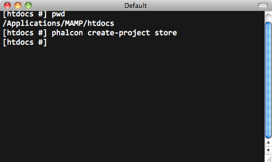
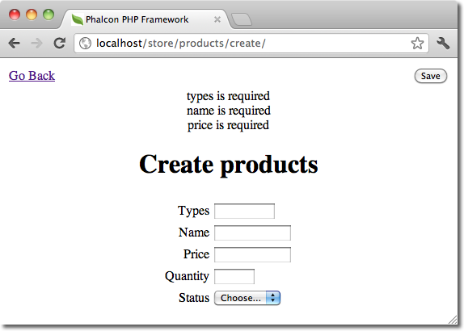

Outils pour développeurs Phalcon
=======================
Ces outils sont une collection de scripts utiles pour générer un squelette de code. 
Des composants principaux de votre application peuvent être générés avec une simple commande, vous permettant de développer des applications facilement avec phalcon.

.. highlights::
    **Important:** Le framework Phalcon version 0.5.0 ou supérieur est nécessaire pour utiliser les outils pour développeurs. Il est fortement recommandé d'utilisé PHP 5.3.6 ou supérieur. Si vous préférez utiliser la version web plutôt que la console ce `blog post`_ donne plus d'informations.

Téléchargement
--------
Vous pouvez télécharger ou cloner un packet multi-plateforme contenant les outils pour développeurs à partir de Github_.

Installation
^^^^^^^^^^^^
Vous trouverez des informations détaillés pour chaque plateforme aux adresses suivantes :

.. toctree::
   :maxdepth: 1

   wintools
   mactools
   linuxtools

Les commandes disponibles
--------------------------
Vous pouvez obtenir la liste des commandes phalcon disponibles en tapant : phalcon commands

.. figure:: ../_static/img/tools-4.png
   :align: center

Générer un squelette de Project
-----------------------------
Vous pouvez utiliser les outils Phalcon pour générer un squelette de projet prédéfini pour vos applications.
Par défaut le générateur de squelette de projet utilise le module d'url rewriting (mod_rewrite) d'Apache.
Ecrivez la ligne de commande suivante à l'endroit où vous désirez créer votre projet : 

La structure suivante sera générée :

.. figure:: ../_static/img/tools-2.png
   :align: center

Vous pouvez ajouter le paramètre *--help* pour obtenir de l'aide sur l'utilisation de certains scripts:

Accédez à l'url de votre projet et vous obtiendrez ceci :

.. figure:: ../_static/img/tools-6.png
   :align: center

Générer des controlleurs
----------------------
La commande "create-controller" génère un controlleur type. 
Il est important de faire cette commande à l'intérieur du dossier qui contient le projet Phalcon.

.. figure:: ../_static/img/tools-5.png
   :align: center

Le code suivant sera généré par le script :

.. code-block:: php

    <?php

    class TestController extends Phalcon\Mvc\Controller
    {

        public function indexAction()
        {

        }

    }

Préparez les paramètres de base de données
---------------------------
Quand un projet est généré avec les outils pour développeurs, un fichier de configuration sera disponible dans *app/config/config.ini*.
Pour générer un model vous devrez changer les paramètres utilisés pour se connecter à la base de données.

.. code-block:: ini

    [database]
    adapter  = Mysql
    host     = "127.0.0.1"
    username = "root"
    password = "secret"
    name     = "store_db"

    [phalcon]
    controllersDir = "../app/controllers/"
    modelsDir      = "../app/models/"
    viewsDir       = "../app/views/"
    baseUri        = "/store/"

Générer des models
-----------------
Il y a plusieurs manières de générer des models. Vous pouvez créer tous les models à partir de la connexion par défaut à la base de données ou de manière plus sélective.
Les models peuvent avoir des attributs public pour la représentation des champs ou des setters/getters peuvent être utilisés.
La manière la plus simple de générer un model est d'écrire cela :

.. figure:: ../_static/img/tools-7.png
   :align: center

Tous les champs de la table seront déclarés public pour un accès direct.

.. code-block:: php

    <?php

    class Products extends \Phalcon\Mvc\Model
    {

        /**
         * @var integer
         */
        public $id;

        /**
         * @var integer
         */
        public $types_id;

        /**
         * @var string
         */
        public $name;

        /**
         * @var string
         */
        public $price;

        /**
         * @var integer
         */
        public $quantity;

        /**
         * @var string
         */
        public $status;

    }

En ajoutant le paramètre *--get-set*, vous pouvez générer les champs avec des variables protégés et y accéder avec les setter/getter.

.. code-block:: php

    <?php

    class Products extends \Phalcon\Mvc\Model
    {

        /**
         * @var integer
         */
        protected $id;

        /**
         * @var integer
         */
        protected $types_id;

        /**
         * @var string
         */
        protected $name;

        /**
         * @var string
         */
        protected $price;

        /**
         * @var integer
         */
        protected $quantity;

        /**
         * @var string
         */
        protected $status;

        /**
         * Method to set the value of field id
         * @param integer $id
         */
        public function setId($id)
        {
            $this->id = $id;
        }

        /**
         * Method to set the value of field types_id
         * @param integer $types_id
         */
        public function setTypesId($types_id)
        {
            $this->types_id = $types_id;
        }

        ...

        /**
         * Returns the value of field status
         * @return string
         */
        public function getStatus()
        {
            return $this->status;
        }

    }

Une fonctionnalité intéressante de la génération de model est qu'il garde trace des changements fait par les développeurs entre les générations de code.
Cela permet d'ajouter ou de supprimer des champs ou des propriétés sans peur de perdre les changements déjà apportés au model.
La vidéo suivante vous montre comment cela fonctionne :

.. raw:: html

   
<iframe src="http://player.vimeo.com/video/39213020" width="500" height="266" frameborder="0" webkitAllowFullScreen mozallowfullscreen allowFullScreen></iframe>

L'échaffaudage d'un CRUD
---------------
"L'échaffaudage" est un moyen rapide de générer la plupart des parties importante d'une application.
Si vous voulez créer les models, vues et les controlleurs pour une nouvelle ressource en une seule action, l'échaffaudage est l'outil qu'il vous faut.

Une fois le code généré, il lui faudra être modifié pour répondre à vos besoins. Beaucoup de développeurs évitent l'échaffaudage complètement, 
choisissant de tout écrire eux-même. La génération de code peux servir de guide pour mieux comprendre comment le framework fonctionne.
La capture d'écran suivante montre un échaffaudage basé sur la table "products" :

.. figure:: ../_static/img/tools-9.png
   :align: center

Le générateur d'échaffaudage va créer plusieurs fichiers/dossiers dans votre application. Voici un aperçu de ce qui sera généré:

+----------------------------------------+--------------------------------+
| Fichier                                | Objectif                       |
+========================================+================================+
| app/controllers/ProductsController.php | Le Controller de Products      |
+----------------------------------------+--------------------------------+
| app/models/Products.php                | Le model Products Products     |
+----------------------------------------+--------------------------------+
| app/views/layout/products.phtml        | Controller layout for Products |
+----------------------------------------+--------------------------------+
| app/views/products/new.phtml           | Vue pour l'action "new"        |
+----------------------------------------+--------------------------------+
| app/views/products/edit.phtml          | Vue pour l'action "edit"       |
+----------------------------------------+--------------------------------+
| app/views/products/search.phtml        | Vue pour l'action "search"     |
+----------------------------------------+--------------------------------+
| app/views/products/edit.phtml          | Vue pour l'action "edit"       |
+----------------------------------------+--------------------------------+

Quand on se déplace sur la page du controlleur généré, on voit un champ de recherche et un lien pour créer un nouveau produit:

.. figure:: ../_static/img/tools-10.png
   :align: center

La création de page permet de créer des produits qui doivent valider les validations du model. Phalcon va automatiquement vérifier les champs nuls et indiquer des avertissements pour ceux qui sont requis.

Après avoir effectué une recherche, un composant de pagination est disponible pour voir les résultats. Utilisez les liens "Edit" ou "Delete" sur chaque ligne pour effectuer l'action d'édition ou de suppression.

L'interface web des outils
----------------------
Si vous préférez il est tout à fait possible d'utiliser les outils de développeur Phalcon à partir d'une interface web.
Regardez la vidéo suivante pour voir comment faire :

.. raw:: html

   
<iframe src="http://player.vimeo.com/video/42367665" width="500" height="266" frameborder="0" webkitAllowFullScreen mozallowfullscreen allowFullScreen></iframe>

Intégrer les outils sur PhpStorm
-----------------------------------
La vidéo suivante vous montre comment intégrer les outils de développeur avec  `PhpStorm IDE`_. 
La configuration peut facilement être adaptée à d'autres IDE pour PHP.

.. raw:: html

   
<iframe src="http://player.vimeo.com/video/43455647" width="500" height="266" frameborder="0" webkitAllowFullScreen mozallowfullscreen allowFullScreen></iframe>

Conclusion
----------
Les outils pour développeurs Phalcon fournissent un moyen simple de générer du code pour votre application. 
Cela réduit le temps de développement et diminue le nombre potentiel d'erreur de code.

.. _blog post: http://blog.phalconphp.com/post/23251010409/dont-like-command-line-and-consoles-no-problem
.. _Github: https://github.com/phalcon/phalcon-devtools
.. _Bootstrap: http://twitter.github.com/bootstrap/
.. _PhpStorm IDE: http://www.jetbrains.com/phpstorm/
