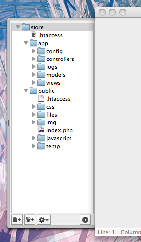

Outils pour développeurs Phalcon
================================

Ces outils sont une collection de scripts utiles pour générer un squelette de code. Des composants principaux de votre application peuvent être générés avec 
une simple commande, vous permettant de développer des applications facilement avec phalcon.

.. highlights::

    Si vous préférez utiliser la version web plutôt que la console ce `ticket de blog`_ donne plus d'informations.

Téléchargement
--------------
Vous pouvez télécharger ou cloner un packet multi-plateforme contenant les outils pour développeurs à partir de Github_.

Installation
^^^^^^^^^^^^
Vous trouverez des informations détaillés pour chaque plateforme aux adresses suivantes :

.. toctree::
   :maxdepth: 1

   wintools
   mactools
   linuxtools

Les commandes disponibles
-------------------------
Vous pouvez obtenir la liste des commandes Phalcon disponibles en tapant : :code:`phalcon commands`

.. code-block:: sh

    $ phalcon commands

    Phalcon DevTools (3.0.0)

    Available commands:
      commands         (alias of: list, enumerate)
      controller       (alias of: create-controller)
      module           (alias of: create-module)
      model            (alias of: create-model)
      all-models       (alias of: create-all-models)
      project          (alias of: create-project)
      scaffold         (alias of: create-scaffold)
      migration        (alias of: create-migration)
      webtools         (alias of: create-webtools)

Générer un squelette de Project
-------------------------------
Vous pouvez utiliser les outils Phalcon pour générer un squelette de projet prédéfini pour vos applications. Par défaut le générateur 
de squelette de projet utilise le module de réécriture d'url (mod_rewrite) d'Apache. Ecrivez la ligne de commande suivante à l'endroit où vous désirez créer votre projet :

.. code-block:: sh

    $ pwd

    /Applications/MAMP/htdocs

    $ phalcon create-project store

La structure suivante sera générée :

Vous pouvez ajouter le paramètre *--help* pour obtenir de l'aide sur l'utilisation de certains scripts:

.. code-block:: sh

    $ phalcon project --help

    Phalcon DevTools (3.0.0)

    Help:
      Creates a project

    Usage:
      project [name] [type] [directory] [enable-webtools]

    Arguments:
      help    Shows this help text

    Example
      phalcon project store simple

    Options:
     --name               Name of the new project
     --enable-webtools    Determines if webtools should be enabled [optional]
     --directory=s        Base path on which project will be created [optional]
     --type=s             Type of the application to be generated (cli, micro, simple, modules)
     --template-path=s    Specify a template path [optional]
     --use-config-ini     Use a ini file as configuration file [optional]
     --trace              Shows the trace of the framework in case of exception. [optional]
     --help               Shows this help

Accédez à l'url de votre projet et vous obtiendrez ceci :

.. figure:: ../_static/img/tools-6.png
   :align: center

Générer des contrôleurs
-----------------------
La commande "create-controller" génère un contrôleur type.
Il est important de faire cette commande à l'intérieur du dossier qui contient le projet Phalcon.

.. code-block:: sh

    $ phalcon create-controller --name test

Le code suivant sera généré par le script :

.. code-block:: php

    <?php

    use Phalcon\Mvc\Controller;

    class TestController extends Controller
    {
        public function indexAction()
        {

        }
    }

Préparez les paramètres de base de données
------------------------------------------
Quand un projet est généré avec les outils pour développeurs, un fichier de configuration sera disponible dans *app/config/config.ini*.
Pour générer un modèle vous devrez changer les paramètres utilisés pour se connecter à la base de données.

Modifiez la section "database" dans votre fichier config.ini:

.. code-block:: ini

    [database]
    adapter  = Mysql
    host     = "127.0.0.1"
    username = "root"
    password = "secret"
    dbname   = "store_db"

    [phalcon]
    controllersDir = "../app/controllers/"
    modelsDir      = "../app/models/"
    viewsDir       = "../app/views/"
    baseUri        = "/store/"

Générer des modèles
-------------------
Il y a plusieurs manières de générer des modèles. Vous pouvez créer tous les modèles à partir de la connexion par défaut à la base de données ou de manière plus sélective.
Les modèles peuvent avoir des attributs public pour la représentation des champs ou des accesseurs peuvent être utilisés.

Options:
 --name=s             Table name
 --schema=s           Name of the schema. [optional]
 --namespace=s        Model's namespace [optional]
 --get-set            Attributes will be protected and have setters/getters. [optional]
 --extends=s          Model extends the class name supplied [optional]
 --excludefields=l    Excludes fields defined in a comma separated list [optional]
 --doc                Helps to improve code completion on IDEs [optional]
 --directory=s        Base path on which project will be created [optional]
 --force              Rewrite the model. [optional]
 --trace              Shows the trace of the framework in case of exception. [optional]
 --mapcolumn          Get some code for map columns. [optional]
 --abstract           Abstract Model [optional]

La manière la plus simple de générer un modèle est d'écrire ceci:

.. code-block:: sh

    $ phalcon model products

.. code-block:: sh

    $ phalcon model --name tablename

Tous les champs de la table seront déclarés public pour un accès direct.

.. code-block:: php

    <?php

    use Phalcon\Mvc\Model;

    class Products extends Model
    {
        /**
         * @var integer
         */
        public $id;

        /**
         * @var integer
         */
        public $typesId;

        /**
         * @var string
         */
        public $name;

        /**
         * @var string
         */
        public $price;

        /**
         * @var integer
         */
        public $quantity;

        /**
         * @var string
         */
        public $status;
    }

En ajoutant le paramètre *--get-set*, vous pouvez générer les champs avec des variables protégés et y accéder avec les accesseurs. Ces méthodes
peuvent aider à la mise en œuvre de la logique métier à l'intérieur des accesseurs.

.. code-block:: php

    <?php

    use Phalcon\Mvc\Model;

    class Products extends Model
    {
        /**
         * @var integer
         */
        protected $id;

        /**
         * @var integer
         */
        protected $typesId;

        /**
         * @var string
         */
        protected $name;

        /**
         * @var string
         */
        protected $price;

        /**
         * @var integer
         */
        protected $quantity;

        /**
         * @var string
         */
        protected $status;

        /**
         * Method to set the value of field id
         *
         * @param integer $id
         */
        public function setId($id)
        {
            $this->id = $id;
        }

        /**
         * Method to set the value of field typesId
         *
         * @param integer $typesId
         */
        public function setTypesId($typesId)
        {
            $this->typesId = $typesId;
        }

        // ...

        /**
         * Returns the value of field status
         *
         * @return string
         */
        public function getStatus()
        {
            return $this->status;
        }
    }

Une fonctionnalité intéressante de la génération de modèle est qu'il conserve les changements fait par les développeurs entre les générations de code.
Cela permet d'ajouter ou de supprimer des champs ou des propriétés sans craindre de perdre les changements déjà apportés au modèle.
La vidéo suivante vous montre comment cela fonctionne :

.. raw:: html

   
<iframe src="https://player.vimeo.com/video/39213020" width="500" height="266" frameborder="0" webkitAllowFullScreen mozallowfullscreen allowFullScreen></iframe>

L'échaffaudage d'un CRUD
------------------------
"L'échaffaudage" est un moyen rapide de générer la plupart des parties importante d'une application.
Si vous voulez créer les modèles, vues et les contrôleurs pour une nouvelle ressource en une seule action, l'échafaudage est l'outil qu'il vous faut.

Une fois le code généré, il lui faudra être modifier pour répondre à vos besoins. Beaucoup de développeurs évitent l'échafaudage complètement,
choisissant de tout écrire eux-même. La génération de code peut aider à mieux comprendre comment le framework fonctionne ou bien 
pour développer des prototypes. Sur l'exemple de code suivant illustre le liner sur la base de la table "products":

.. code-block:: sh

    $ phalcon scaffold --table-name products

Le générateur d'échafaudage va créer plusieurs fichiers dans votre application ainsi que quelques dossiers. Voici un aperçu rapide de ce qui sera généré:

+----------------------------------------+--------------------------------+
| Fichier                                | Objectif                       |
+========================================+================================+
| app/controllers/ProductsController.php | Le Controller de Products      |
+----------------------------------------+--------------------------------+
| app/models/Products.php                | Le model Products Products     |
+----------------------------------------+--------------------------------+
| app/views/layout/products.phtml        | Controller layout for Products |
+----------------------------------------+--------------------------------+
| app/views/products/new.phtml           | Vue pour l'action "new"        |
+----------------------------------------+--------------------------------+
| app/views/products/edit.phtml          | Vue pour l'action "edit"       |
+----------------------------------------+--------------------------------+
| app/views/products/search.phtml        | Vue pour l'action "search"     |
+----------------------------------------+--------------------------------+

En naviguant sur la page du contrôleur récemment généré, on voit un formulaire de recherche et un lien pour créer un nouveau produit:

.. figure:: ../_static/img/tools-10.png
   :align: center

La création de page vous permet de créer des produits en appliquant les validations du modèle Products. Phalcon va automatiquement vérifier 
les champs nuls et générer des avertissements pour ceux qui sont requis.

.. figure:: ../_static/img/tools-11.png
   :align: center

Après avoir effectué une recherche, un composant de pagination est disponible pour voir les résultats. Utilisez les liens "Edit" ou "Delete" sur chaque ligne pour effectuer l'action d'édition ou de suppression.

.. figure:: ../_static/img/tools-12.png
   :align: center

L'interface web des outils
--------------------------
Si vous préférez il est tout à fait possible d'utiliser les outils de développeur Phalcon à partir d'une interface web. Regardez la vidéo suivante pour voir comment faire :

.. raw:: html

   
<iframe src="https://player.vimeo.com/video/42367665" width="500" height="266" frameborder="0" webkitAllowFullScreen mozallowfullscreen allowFullScreen></iframe>

Intégration des outils sur l'IDE PhpStorm
-----------------------------------------
La vidéo suivante vous montre comment intégrer les outils de développeur avec l'`IDE PhpStorm`_. La configuration peut facilement être adaptée à d'autres IDE pour PHP.

.. raw:: html

   
<iframe src="https://player.vimeo.com/video/43455647" width="500" height="266" frameborder="0" webkitAllowFullScreen mozallowfullscreen allowFullScreen></iframe>

Conclusion
----------
Les outils pour développeurs Phalcon fournissent un moyen simple de générer du code pour votre application. Cela réduit le temps de développement et diminue le nombre potentiel d'erreur de code.

.. _ticket de blog: https://blog.phalconphp.com/post/dont-like-command-line-and-consoles-no-problem
.. _Github: https://github.com/phalcon/phalcon-devtools
.. _Bootstrap: http://twitter.github.com/bootstrap/
.. _IDE PhpStorm: http://www.jetbrains.com/phpstorm/
