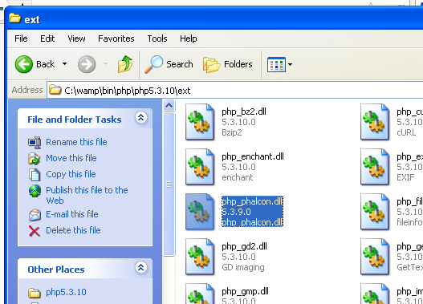

Installation sur WAMP
=====================

WampServer_ est un environnement de développement web pour Windows. Il vous permet de créer des applications web avec Apache2, PHP et des base MySQL. L'installation de Phalcon sur Wampserer est détaillée ci-dessous. L'utilisation de la dernière version de WampServer est fortement recommandée.

Télécharger la bonne version de Phalcon
---------------------------------------
WAMP existe en version 32 et 64 bits. Dans la section de téléchargement, choisissez Phalcon pour Windows en fonction de l'architecture utilisée.

Après le téléchargement de la librairie Phalcon, vous obtenez un fichier zip comme celui montré ci-dessous:

.. figure:: ../_static/img/xampp-1.png
    :align: center

Extrayez la librairie depuis l'archive pour obtenir la DLL Phalcon:

.. figure:: ../_static/img/xampp-2.png
    :align: center

Copiez le fichier php_phalcon.dll à coté des autres extensions PHP. Si WAMP est installé dans le dossier C:\\wamp, l'extension devra être dans C:\\wamp\\bin\\php\\php5.5.12\\ext 

Modifiez le fichier php.ini qui se trouve à C:\\wamp\\bin\\php\\php5.5.12\\php.ini. Il peut être édité avec le bloc-notes (Notepad) ou tout autre programme similaire. Nous recommandons Notepad++ pour éviter les problèmes avec les fins de ligne. Ajoutez à la fin du fichier: extension=php_phalcon.dll et enregistrez-le.

.. figure:: ../_static/img/wamp-2.png
    :align: center

Modifiez aussi un autre fichier php.ini qui se trouve à C:\\wamp\\bin\\apache\\apache2.4.9\\bin\\php.ini. Ajoutez à la fin du fichier: extension=php_phalcon.dll et enregistrez-le.

Redémarrer le serveur Apache. Faites un clic simple sur l'icone de WampServer qui se trouve dans la zone de notifications. Choisissez "Redémarrer les services" dans le menu. Vérifier que l'icone de notification redevienne verte.

.. figure:: ../_static/img/wamp-3.png
    :align: center

Ouvrez votre navigateur à l'adresse http://localhost. La page d'accueil de de WAMP doit apparaître. Consultez la section des extensions chargées pour contrôler que Phalcon soit bien chargée.

.. figure:: ../_static/img/wamp-4.png
    :align: center

Féliciations! Vous volez désormais avec Phalcon.

Voir aussi
----------
* :doc:`Installation générale </reference/install>`
* :doc:`Installation détaillée avec XAMPP pour Windows </reference/xampp>`

.. _WampServer: http://www.wampserver.com/
