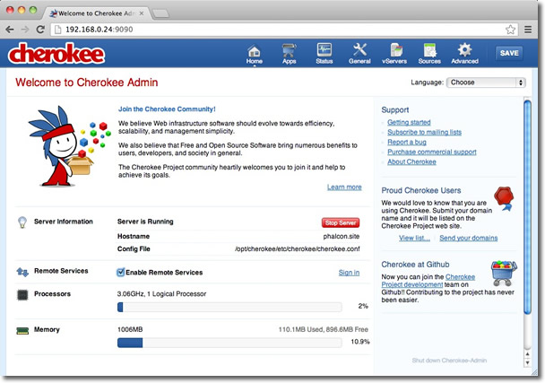
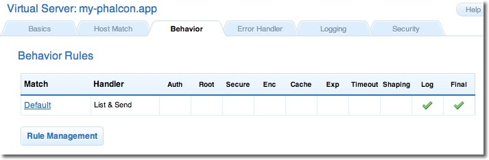

Catatan Instalasi Cherokee
==========================

Cherokee_ adalah web server berkinerja tinggi. Ia sangat cepat, fleksibel dan mudah dikonfigurasi.

Mengkonfigurasi Cherokee untuk Phalcon
--------------------------------------
Cherokee menyediakan antarmuka grafis bersahabat untuk mengkonfigurasi hampir semua pengaturan yang tersedia di web server ini.
Mulai sebagai administrator cherokee dengan menjalankan sebagai root /path-to-cherokee/sbin/cherokee-admin

Menitpakan virtual host baru dengan mengklik pada 'vServers', lalu menambahkan virtual server baru:

.. figure:: ../_static/img/cherokee-2.jpg
    :align: center

Virtual server yang baru ditambahkan muncul di sisi kiri layar. Di tab 'Behaviors'
anda akan melihat default behaviors untuk virtual server ini. Klik tombol 'Rule Management'.
Hapus yang ditandai sebagai 'Directory /cherokee_themes' dan 'Directory /icons':

Tambahkan 'PHP Language' behavior menggunakan wizard. Behavior ini memungkinkan anda menjalankan aplikasi PHP:

.. figure:: ../_static/img/cherokee-4.jpg
    :align: center

Normalnya behavior ini tidak membutuhkan pengaturan tambahan. Tambahkan behavior lain,
kali ini dibagian 'Manual Configuration'. Di 'Rule Type' pilih 'File Exists',
lalu pastikan pilihan 'Match any file' dihidupkan:

.. figure:: ../_static/img/cherokee-55.jpg
    :align: center

Di tab 'Handler' pilih 'List & Send' sebagai handler:

.. figure:: ../_static/img/cherokee-7.jpg
    :align: center

Edit behavior default 'Default' untuk menghidupkan URL-rewrite engine. Ubah handler ke 'Redirection',
lalu tambahkan regular expression berikut ke engine ^(.*)$:

.. figure:: ../_static/img/cherokee-6.jpg
    :align: center

Akhirnya, pastikan behavior memiliki urutan berikut:

.. figure:: ../_static/img/cherokee-8.jpg
    :align: center

Eksekusi aplikasi di browser:

.. figure:: ../_static/img/cherokee-9.jpg
    :align: center

.. _Cherokee: http://www.cherokee-project.com/
