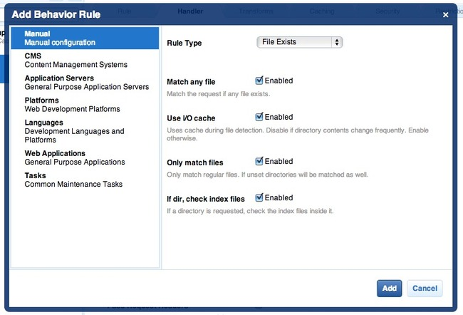

Cherokee インストール ノート
===========================
Cherokee_ はハイパフォーマンスWebサーバです。早く、フレキシブルで設定も簡単です。

PhalconのためのCherokeeの設定
--------------------------------
Cherokee はWebサーバで設定可能なほぼ全ての設定を構成するための、使いやすいグラフィカルインターフェースを提供します。
Cherokeeの管理者はrootで/path-to-cherokee/sbin/cherokee-admin を実行して始めてください。

.. figure:: ../_static/img/cherokee-1.jpg
    :align: center

新しいバーチャルホストの作成は、'vServers'をクリックして、新しいバーチャルサーバを追加してください:
Create a new virtual host by clicking on 'vServers', then add a new virtual server:

.. figure:: ../_static/img/cherokee-2.jpg
    :align: center

の追加したばかりのバーチャルサーバは画面左端のバーに表示されます。
'Behaviors' タブにこのバーチャルサーバのデフォルトのbehaviorセットが表示されます。
'Rule Management' ボタンをクリックします。'Directory /cherokee_themes' と 'Directory /icons' ラベルを削除します。:

.. figure:: ../_static/img/cherokee-3.jpg
    :align: center

ウィザードを使用して、'PHP Language' behaviorを追加します。このbehaviorはPHPアプリケーションを実行できるようにします。

.. figure:: ../_static/img/cherokee-4.jpg
    :align: center

通常このbehaviorは、追加の設定は必要ありません。
別のbehavior、今回は'Manual Configuraion'セクション、を追加します。
'Rule Type' で 'File Exists' を選択し、'Match any file' オプションが有効になっていることを確認してください。:

'Handler' タブで handlerを 'List & Send' で選びます:

.. figure:: ../_static/img/cherokee-7.jpg
    :align: center

URL-rewriteエンジンを有効にするために、'Default' の behaviorを編集します。
handlerを'Redirection'に変更し、^(.*)$ を regular expressionに追加します。

.. figure:: ../_static/img/cherokee-6.jpg
    :align: center

最後に、behaviorが次の順番になっていることを確認してください:

.. figure:: ../_static/img/cherokee-8.jpg
    :align: center

ブラウザでアプリケーションを実行します:

.. figure:: ../_static/img/cherokee-9.jpg
    :align: center

.. _Cherokee: http://www.cherokee-project.com/
