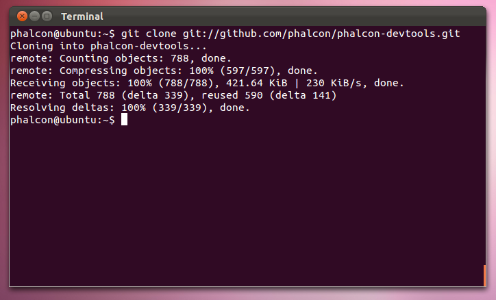

Phalcon 開発者ツール / Linux 向け
================================

下記のステップは Linux に Phalcon 開発者ツールをインストールするための手順を示すものです。

前提条件
-------------
Phalcon 開発者ツールの実行には、Phalcon PHP 拡張が必須です。もしまだインストールしていないのなら、
:doc:`インストール <install>` を参照してください。

ダウンロード
--------
Download_ セクションで、開発者ツールを同梱したクロスプラットフォームのパッケージがダウンロードできます。また、Github_ から clone でもできます。

ターミナルを開き、下記のコマンドを入力します:

.. code-block:: bash

    git clone git://github.com/phalcon/phalcon-devtools.git

ツールを clone したフォルダに移動し、". ./phalcon.sh" を実行します（コマンドの最初のドットを忘れないでください）。:

.. code-block:: bash

    cd phalcon-devtools/

    . ./phalcon.sh

.. figure:: ../_static/img/linux-2.png
   :align: center

スクリプト phalcon.php へのシンボリックリンクを作成します:

.. code-block:: bash

    ln -s ~/phalcon-devtools/phalcon.php /usr/bin/phalcon

    chmod ugo+x /usr/bin/phalcon

おめでとうございます！これで Phalcon 開発者ツールがインストールされました！

関連ガイド
^^^^^^^^^^^^^^
* :doc:`Phalcon 開発者ツール <tools>`
* :doc:`Phalcon 開発者ツール / Windows 向け <wintools>`
* :doc:`Phalcon 開発者ツール / Mac OS X 向け <mactools>`

.. _Download: http://phalconphp.com/download
.. _Github: https://github.com/phalcon/phalcon-devtools
