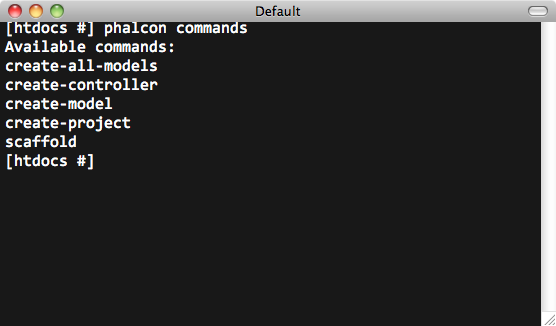
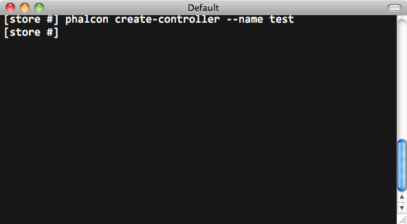
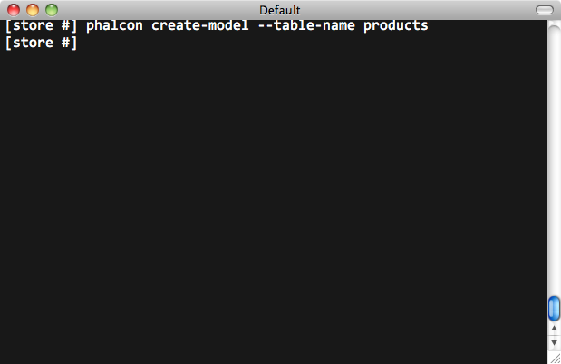
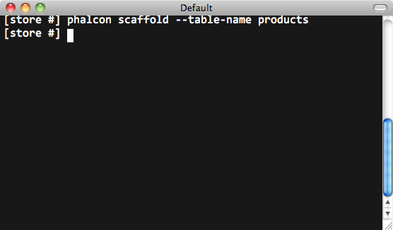

Phalcon 開発者ツール
=======================
These tools are a collection of useful scripts to generate skeleton code. Core components of your application can be generated with
a simple command, allowing you to easily develop applications using Phalcon.

.. highlights::
    **Important:** Phalcon Framework version 0.5.0 or greater is needed to use developer tools. It is highly recommended
    to use PHP 5.3.6 or greater. If you prefer to use the web version instead of the console, this `blog post`_ offers more information.

ダウンロード
--------
You can download or clone a cross platform package containing the developer tools from Github_.

インストール
^^^^^^^^^^^^
These are detailed instructions on how to install the developer tools on different platforms:

.. toctree::
   :maxdepth: 1

   wintools
   mactools
   linuxtools

利用可能なコマンドの取得
--------------------------
You can get a list of available commands in Phalcon tools by typing: phalcon commands

プロジェクトスケルトンの生成
-----------------------------
You can use Phalcon tools to generate pre-defined project skeletons for your applications with Phalcon framework. By default the
project skeleton generator will use mod_rewrite for Apache. Type the following command on your web server document root:

.. figure:: ../_static/img/tools-1.png
   :align: center

The above recommended project structure was generated:

.. figure:: ../_static/img/tools-2.png
   :align: center

You could add the parameter *--help* to get help on the usage of a certain script:

.. figure:: ../_static/img/tools-3.png
   :align: center

Accessing the project from the web server will show you:

.. figure:: ../_static/img/tools-6.png
   :align: center

コントローラの生成
----------------------
The command "create-controller" generates controller skeleton structures. It's important to invoke this command inside a directory
that already has a Phalcon project.

The following code is generated by the script:

.. code-block:: php

    <?php

    class TestController extends Phalcon\Mvc\Controller
    {

        public function indexAction()
        {

        }

    }

データベース設定の準備
---------------------------
When a project is generated using developer tools. A configuration file can be found in *app/config/config.ini* To generate models
or scaffold, you will need to change the settings used to connect to your database.

Change the database section in your config.ini file:

.. code-block:: ini

    [database]
    adapter  = Mysql
    host     = "127.0.0.1"
    username = "root"
    password = "secret"
    name     = "store_db"

    [phalcon]
    controllersDir = "../app/controllers/"
    modelsDir      = "../app/models/"
    viewsDir       = "../app/views/"
    baseUri        = "/store/"

モデルの生成
-----------------
There are several ways to create models. You can create all models from the default database connection or some selectively. Models
can have public attributes for the field representations or setters/getters can be used. The simplest way to generate a model is:

All table fields are declared public for direct access.

.. code-block:: php

    <?php

    class Products extends \Phalcon\Mvc\Model
    {

        /**
         * @var integer
         */
        public $id;

        /**
         * @var integer
         */
        public $types_id;

        /**
         * @var string
         */
        public $name;

        /**
         * @var string
         */
        public $price;

        /**
         * @var integer
         */
        public $quantity;

        /**
         * @var string
         */
        public $status;

    }

By adding the *--get-set* you can generate the fields with protected variables and public setter/getter methods. Those methods
can help in business logic implementation within the setter/getter methods.

.. code-block:: php

    <?php

    class Products extends \Phalcon\Mvc\Model
    {

        /**
         * @var integer
         */
        protected $id;

        /**
         * @var integer
         */
        protected $types_id;

        /**
         * @var string
         */
        protected $name;

        /**
         * @var string
         */
        protected $price;

        /**
         * @var integer
         */
        protected $quantity;

        /**
         * @var string
         */
        protected $status;

        /**
         * Method to set the value of field id
         * @param integer $id
         */
        public function setId($id)
        {
            $this->id = $id;
        }

        /**
         * Method to set the value of field types_id
         * @param integer $types_id
         */
        public function setTypesId($types_id)
        {
            $this->types_id = $types_id;
        }

        ...

        /**
         * Returns the value of field status
         * @return string
         */
        public function getStatus()
        {
            return $this->status;
        }

    }

A nice feature of the model generator is that it keeps changes made by the developer between code generations. This allows the
addition or removal of fields and properties, without worrying about losing changes made to the model itself.
The following screencast shows you how it works:

.. raw:: html

   
<iframe src="http://player.vimeo.com/video/39213020" width="500" height="266" frameborder="0" webkitAllowFullScreen mozallowfullscreen allowFullScreen></iframe>

CRUDのScaffolding
---------------
Scaffolding is a quick way to generate some of the major pieces of an application. If you want to create the models, views, and
controllers for a new resource in a single operation, scaffolding is the tool for the job.

Once the code is generated, it will have to be customized to meet your needs. Many developers avoid scaffolding entirely, opting
to write all or most of their source code from scratch. The generated code can serve as a guide to better understand of how the
framework works or develop prototypes. The screenshot below shows a scaffold based on the table "products":

The scaffold generator will build several files in your application, along with some folders. Here's a quick overview of what will be generated:

+----------------------------------------+--------------------------------+
| File                                   | Purpose                        |
+========================================+================================+
| app/controllers/ProductsController.php | The Products controller        |
+----------------------------------------+--------------------------------+
| app/models/Products.php                | The Products model             |
+----------------------------------------+--------------------------------+
| app/views/layout/products.phtml        | Controller layout for Products |
+----------------------------------------+--------------------------------+
| app/views/products/new.phtml           | View for the action "new"      |
+----------------------------------------+--------------------------------+
| app/views/products/edit.phtml          | View for the action "edit"     |
+----------------------------------------+--------------------------------+
| app/views/products/search.phtml        | View for the action "search"   |
+----------------------------------------+--------------------------------+
| app/views/products/edit.phtml          | View for the action "edit"     |
+----------------------------------------+--------------------------------+

When browsing the recently generated controller, you will see a search form and a link to create a new Product:

.. figure:: ../_static/img/tools-10.png
   :align: center

The "create page" allows you to create products applying validations on the Products model. Phalcon will automatically validate
not null fields producing warnings if any of them is required.

.. figure:: ../_static/img/tools-11.png
   :align: center

After performing a search, a pager component is available to show paged results. Use the "Edit" or "Delete" links in front of each result to perform such actions.

.. figure:: ../_static/img/tools-12.png
   :align: center

ツールへのWEBインターフェース
----------------------
Also, if you prefer, it's possible to use Phalcon Developer Tools from a web interface. Check out the following screencast to figure out how it works:

.. raw:: html

   
<iframe src="http://player.vimeo.com/video/42367665" width="500" height="266" frameborder="0" webkitAllowFullScreen mozallowfullscreen allowFullScreen></iframe>

ツールとPhpStorm IDEとの統合
-----------------------------------
The screencast below shows how to integrate developer tools with the `PhpStorm IDE`_. The configuration steps could be easily adapted to other IDEs for PHP.

.. raw:: html

   
<iframe src="http://player.vimeo.com/video/43455647" width="500" height="266" frameborder="0" webkitAllowFullScreen mozallowfullscreen allowFullScreen></iframe>

まとめ
----------
Phalcon Developer Tools provides an easy way to generate code for your application, reducing development time and potential coding errors.

.. _blog post: http://blog.phalconphp.com/post/23251010409
.. _Github: https://github.com/phalcon/phalcon-devtools
.. _Bootstrap: http://twitter.github.com/bootstrap/
.. _PhpStorm IDE: http://www.jetbrains.com/phpstorm/
