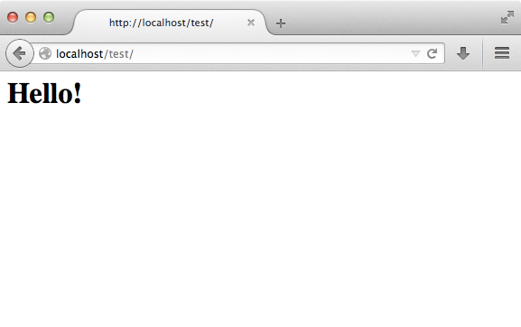
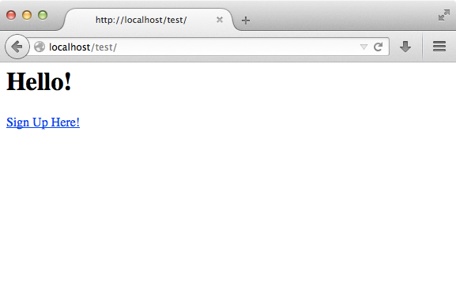

チュートリアル 1: 例題で学習しよう
==================================
この最初のチュートリアルでは、簡単な登録フォームを使用したアプリケーションをゼロから作成する手順を見ていきます。
また、フレームワークの動作の基本的な側面を説明していきます。もしあなたが Phalconのコード自動生成ツールに興味があるのでしたら、
次のドキュメントを参照ください。 :doc:`developer tools <tools>`.

インストールの確認
--------------------------
すでにPhalconはインストールされていると思います。 phpinfo() の "Phalcon"のセクションの出力を確認するか、
次のコードスニペットを実行してみてください。

.. code-block:: php

    <?php print_r(get_loaded_extensions()); ?>

Phalcon拡張モジュールは下記のように出力の一部に現れるでしょう。

.. code-block:: php

    Array
    (
        [0] => Core
        [1] => libxml
        [2] => filter
        [3] => SPL
        [4] => standard
        [5] => phalcon
        [6] => pdo_mysql
    )

プロジェクトの作成
------------------
このガイドを使用する最良の方法は、順番にそれぞれのステップに従うことです。完全なコードは、`ここ <https://github.com/phalcon/tutorial>`_ から取得することができます。

ファイル構造
^^^^^^^^^^^^^^
Phalconはアプリケーション開発において特定のファイル構造を強制しません。Phalconは疎結合になっているため、あなたのやりやすいファイル構造でアプリケーションを実装することができます。

このチュートリアルの出発点として、次のような構造にしてみましょう。

.. code-block:: php

    tutorial/
      app/
        controllers/
        models/
        views/
      public/
        css/
        img/
        js/

Phalconに関連した "library" ディレクトリを必要としないことに注意してください。フレームワークはメモリ内で利用可能となっています。

きれいなURL
^^^^^^^^^^^^^^
このチュートリアルでは、きれいな、使いやすいURLを使用します。使いやすいURLはSEOに良いだけでなく、ユーザーが覚えやすいという利点もあります。Phalconは一般的なWEBサーバーにより提供されるrewriteモジュールをサポートしています。ただし、あなたのアプリケーションを使いやすいURLにすることは必須条件ではありません。それなしでも同様に開発することができます。

この例では、Apacheの rewriteモジュールを使用します。/tutorial/.htaccess というファイルに、rewrite ルールを記述してみましょう。

.. code-block:: apacheconf

    #/tutorial/.htaccess
    <IfModule mod_rewrite.c>
        RewriteEngine on
        RewriteRule  ^$ public/    [L]
        RewriteRule  ((?s).*) public/$1 [L]
    </IfModule>

プロジェクトへの全てのリクエストは ドキュメントルートに指定した public/ ディレクトリにリライトされます。これにより、プロジェクトの内部フォルダを閲覧されることを防ぎ、セキュリティの脅威を排除することが保証されます。

第二のルールは、リクエストされたファイルが存在するかチェックし、ファイルが存在した場合はWebサーバーモジュールによるリライトは行われません。

.. code-block:: apacheconf

    #/tutorial/public/.htaccess
    <IfModule mod_rewrite.c>
        RewriteEngine On
        RewriteCond %{REQUEST_FILENAME} !-d
        RewriteCond %{REQUEST_FILENAME} !-f
        RewriteRule ^((?s).*)$ index.php?_url=/$1 [QSA,L]
    </IfModule>

Bootstrap
^^^^^^^^^
あなたが最初に作成する必要のあるファイルは bootstrap ファイルです。このファイルはとても重要であり、アプリケーションのベースとなり、すべての側面をコントロールすることを可能にします。このファイルでは、コンポーネントの初期化だけでなく、アプリケーションの振る舞いを実装することができます。

tutorial/public/index.php は次のようになります。

.. code-block:: php

    <?php

    try {

        // オートローダにディレクトリを登録する
        $loader = new \Phalcon\Loader();
        $loader->registerDirs(array(
            '../app/controllers/',
            '../app/models/'
        ))->register();

        // DIコンテナを作る
        $di = new Phalcon\DI\FactoryDefault();

        // ビューのコンポーネントの組み立て
        $di->set('view', function () {
            $view = new \Phalcon\Mvc\View();
            $view->setViewsDir('../app/views/');
            return $view;
        });
        
        // ベースURIを設定して、生成される全てのURIが「tutorial」を含むようにする
        $di->set('url', function () {
            $url = new \Phalcon\Mvc\Url();
            $url->setBaseUri('/tutorial/');
            return $url;
        });        

        // リクエストを処理する
        $application = new \Phalcon\Mvc\Application($di);

        echo $application->handle()->getContent();

    } catch (\Phalcon\Exception $e) {
         echo "PhalconException: ", $e->getMessage();
    }

オートローダ
^^^^^^^^^^^
bootstrapの最初の部分では、オートローダを登録しています。これは、アプリケーション内のコントローラやモデルなどのクラスをロードするために使用されます。例えば、アプリケーションの柔軟性を増加させる、コントローラの1つまたは複数のディレクトリを登録することができます。この例では、Phalcon\\ Loaderコンポーネントを使用しています。

これにより、様々な方法でクラスをロードすることができますが、この例ではあらかじめ定義されたディレクトリに基づいてクラスを検索することを選択しました。 

.. code-block:: php

    <?php

    $loader = new \Phalcon\Loader();
    $loader->registerDirs(
        array(
            '../app/controllers/',
            '../app/models/'
        )
    )->register();

依存性の管理
^^^^^^^^^^^^^^^^^^^^^
Phalconで開発する際に、理解するべき非常に重要なコンセプトは :doc:`dependency injection container <di>` です。それは複雑に聞こえますが、実際にはシンプルで実用的なものです。

サービスコンテナは、アプリケーションが機能するために使用するサービスをグローバルに保存する入れ物です。フレームワークはコンポーネントを必要とするたびに、サービスに決められた名称でコンテナに問い合わせます。Phalconはとても疎結合なフレームワークです。Phalcon\\ DI は接着剤として機能し、透過的にさまざまなコンポーネントを統合し、協調して動作できるように機能します。

.. code-block:: php

    <?php

    // Create a DI
    $di = new Phalcon\DI\FactoryDefault();

:doc:`Phalcon\\DI\\FactoryDefault <../api/Phalcon\_DI_FactoryDefault>` は Phalcon\\DI の異形です。 それには、処理をシンプルにするため、Phalconに付属しているコンポーネントのほとんどが登録されています。 したがって、それらをひとつひとつ登録するべきではありません。あとで生成するサービスを変更しても問題ありません。

次のパートでは、フレームワークがviewファイルを探すディレクトリを示す "view" サービスを登録します。 viewファイルはクラスでないため、オートローダで補完されません。

サービスを登録する方法はいくつかありますが、このチュートリアルでは、無名関数 ( `anonymous function`_ ) を使用します。

.. code-block:: php

    <?php

    // Setup the view component
    $di->set('view', function () {
        $view = new \Phalcon\Mvc\View();
        $view->setViewsDir('../app/views/');
        return $view;
    });
    
次に、Phalconにより生成されるすべてのURI に "/tutorial/" が含まれるように、base URIを登録します。 これは、このチュートリアルで、ハイパーリンクを生成するために、 :doc:`\Phalcon\\Tag <../api/Phalcon_Tag>` を使用する際に重要になってきます。

.. code-block:: php

    <?php

    // Setup a base URI so that all generated URIs include the "tutorial" folder
    $di->set('url', function () {
        $url = new \Phalcon\Mvc\Url();
        $url->setBaseUri('/tutorial/');
        return $url;
    });   

このファイルの最後のパートで、:doc:`Phalcon\\Mvc\\Application <../api/Phalcon_Mvc_Application>` を見つけるでしょう。この目的は、リクエスト環境を初期化し、リクエストのルートを決め、発見したアクションを起動することであり、処理が完了した際にレスポンスを集約し、返却することです。

.. code-block:: php

    <?php

    $application = new \Phalcon\Mvc\Application($di);

    echo $application->handle()->getContent();

ご覧のように、bootstrap ファイルはとても短く、追加のファイルを読み込む必要はありません。柔軟なMVCアプリケーションの設定が、30行足らずのコードで行えるのです。

コントローラの作成
^^^^^^^^^^^^^^^^^^^^^
デフォルトでは、Phalcon は、"Index" という名称のコントローラを探します。これは、リクエストでいずれのコントローラ、アクションも渡されていない場合の出発点となります。index コントローラ (app/controllers/IndexController.php) は、次のようになります。

.. code-block:: php

    <?php

    class IndexController extends \Phalcon\Mvc\Controller
    {

        public function indexAction()
        {
            echo "<h1>Hello!</h1>";
        }

    }

コントローラクラスには、"Controller" という接尾語をつける必要があり、コントローラアクションには、"Action" という接尾語をつける必要があります。あなたがブラウザからアプリケーションにアクセスしたならば、次のように見えるでしょう。

おめでとうございます。あなたはPhalconで飛び立つことができました！

Viewへのアウトプットの送信
^^^^^^^^^^^^^^^^^^^^^^^^
コントローラーから画面に出力を送信することは時に必要ですが、しかしMVC主義者のコミュニティが証明するように、望ましくはありません。レスポンスを返せるために画面上に出力するデータ全てをviewに渡す必要があります。Phalconは、最後に実行されたコントローラとして指定されたディレクトリ内部の最後に実行されたアクションと同じ名前のビューを探します。私たちのケースでは(app/views/index/index.phtml)です。

.. code-block:: php

    <?php echo "<h1>Hello!</h1>";

私たちのコントローラー(app/controllers/IndexController.php)は、今はアクションの定義は空です。

.. code-block:: php

    <?php

    class IndexController extends \Phalcon\Mvc\Controller
    {

        public function indexAction()
        {

        }

    }

ブラウザの出力は同じままにしてください。アクションの実行が終了すると:doc:`Phalcon\\Mvc\\View <../api/Phalcon_Mvc_View>` スタティックコンポーネントが自動的に生成されます。Viewの使い方について詳しくは :doc:`こちら <views>` を参照ください。

サインアップフォームのデザイン
^^^^^^^^^^^^^^^^^^^^^^^^
今度は、index.phtmlを編集して、「signup」という名前の新しいコントローラーへのリンクを追加してみましょう。目標は、ユーザーがアプリケーションにログインできるようにすることです。

.. code-block:: php

    <?php

    echo "<h1>Hello!</h1>";

    echo Phalcon\Tag::linkTo("signup", "Sign Up Here!");

生成されたHTMLコードは、新しいコントローラーへリンクをしているアンカー(<a>)タグです。

.. code-block:: html

    <h1>Hello!</h1> <a href="/tutorial/signup">Sign Up Here!</a>

タグを生成するためには、 :doc:`\Phalcon\\Tag <../api/Phalcon_Tag>` を使用します。このユーティリティクラスによって、フレームワークの規約に従ったHTMLタグを生成することができます。HTML生成機能の詳細については、 :doc:`found here <tags>` を参照してください。

以下が、Signupコントローラーです(app/controllers/SignupController.php)。

.. code-block:: php

    <?php

    class SignupController extends \Phalcon\Mvc\Controller
    {

        public function indexAction()
        {

        }

    }

空のindexアクションは、ビューに何も渡しません。ビューでは、フォームが定義されています(app/views/signup/index.phtml)。

.. code-block:: html+php

    <?php use Phalcon\Tag; ?>

    <h2>Sign up using this form</h2>

    <?php echo Tag::form("signup/register"); ?>

     

        <label for="name">Name</label>
        <?php echo Tag::textField("name") ?>
     

     

        <label for="email">E-Mail</label>
        <?php echo Tag::textField("email") ?>
     

     

        <?php echo Tag::submitButton("Register") ?>
     

    </form>

ブラウザーでフォームを確認すると、以下のように表示されるはずです。

.. figure:: ../_static/img/tutorial-3.png
    :align: center

:doc:`Phalcon\\Tag <../api/Phalcon_Tag>` はまた、フォーム要素を組み立てるのに役に立つ方法を提供します。

Phalcon\\Tag::form メソッドは、 controller/action への相対URIを唯一のパラメータとして受け取ります。

送信ボタンをクリックすると、「signup」コントローラーの「register」アクションが見つからない、という例外が投げられることに気づくはずです。 public/index.php が以下の例外を投げています：

    PhalconException: Action "register" was not found on controller "signup"

以下のようにメソッドを実装すれば、例外が無くなります：

.. code-block:: php

    <?php

    class SignupController extends \Phalcon\Mvc\Controller
    {

        public function indexAction()
        {

        }

        public function registerAction()
        {

        }

    }

送信ボタンをもう一度クリックすると、空のページが表示されるでしょう。ユーザーが入力した名前とEメールアドレスは、データベースに保存すべきです。MVCのガイドラインによると、データベースとの連携はモデルで行わなければなりません。そうすることで、きれいなオブジェクト指向のコードを保つことができます。

モデルの作成
^^^^^^^^^^^^^^^^
Phalconは、PHPに初めて全てC言語で書かれたORMを提供します。ORMは開発の複雑さを増幅させるのではなく、開発をシンプルにしてくれます。

最初のモデルを作る前に、Phalconの外でマッピングするデータベースのテーブルを作る必要があります。登録したユーザーの情報を保存するシンプルなテーブルは、以下のように定義できます:

.. code-block:: sql

    CREATE TABLE `users` (
      `id` int(10) unsigned NOT NULL AUTO_INCREMENT,
      `name` varchar(70) NOT NULL,
      `email` varchar(70) NOT NULL,
      PRIMARY KEY (`id`)
    );

モデルは app/models ディレクトリに配置してください (app/models/Users.php)。モデルは「users」テーブルをマッピングします:

.. code-block:: php

    <?php

    class Users extends \Phalcon\Mvc\Model
    {

    }

データベース接続の設定
^^^^^^^^^^^^^^^^^^^^^^^^^^^^^
データベース接続を使用できるようにし、モデルからデータにアクセスできるようにするため、ブートストラップの途中でデータベース接続を明確にする必要があります。データベース接続は、アプリケーションが所有し、他のコンポーネントで利用可能なサービスです:

.. code-block:: php

    <?php

    try {

        // Register an autoloader
        $loader = new \Phalcon\Loader();
        $loader->registerDirs(array(
            '../app/controllers/',
            '../app/models/'
        ))->register();

        // Create a DI
        $di = new Phalcon\DI\FactoryDefault();

        // データベースサービスのセットアップ
        $di->set('db', function () {
            return new \Phalcon\Db\Adapter\Pdo\Mysql(array(
                "host" => "localhost",
                "username" => "root",
                "password" => "secret",
                "dbname" => "test_db"
            ));
        });

        // Setup the view component
        $di->set('view', function () {
            $view = new \Phalcon\Mvc\View();
            $view->setViewsDir('../app/views/');
            return $view;
        });
        
        // Setup a base URI so that all generated URIs include the "tutorial" folder
        $di->set('url', function () {
            $url = new \Phalcon\Mvc\Url();
            $url->setBaseUri('/tutorial/');
            return $url;
        });       

        // Handle the request
        $application = new \Phalcon\Mvc\Application($di);

        echo $application->handle()->getContent();

    } catch (Exception $e) {
         echo "PhalconException: ", $e->getMessage();
    }

正しいデータベースのパラメーターが設定されれば、モデルが使用可能になり、アプリケーションの他の部分とやりとりできるようになります。

モデルを使用したデータの保存
^^^^^^^^^^^^^^^^^^^^^^^^^
次のステップでは、フォームからデータを受け取って、テーブルに保存します。

.. code-block:: php

    <?php

    class SignupController extends \Phalcon\Mvc\Controller
    {

        public function indexAction()
        {

        }

        public function registerAction()
        {

            $user = new Users();

            // データを保存し、エラーをチェックする
            $success = $user->save($this->request->getPost(), array('name', 'email'));

            if ($success) {
                echo "Thanks for registering!";
            } else {
                echo "Sorry, the following problems were generated: ";
                foreach ($user->getMessages() as $message) {
                    echo $message->getMessage(), " ";
                }
            }
            
            $this->view->disable();
        }

    }

まず、Users クラスをインスタンス化します。これはユーザーのレコードに対応しています。クラスのpublicプロパティは、users テーブルのレコードのフィールドをマッピングしています。適切な値を新しいレコードに設定し、save() を呼ぶと、そのレコードのデータがデータベースに保存されます。save() メソッドは真偽値を返し、データの保存の成否を示します。

ORMは自動的に入力値をエスケープし、SQLインジェクションを防ぎます。リクエストをsaveメソッドに渡すだけでよいのです。

Not Null (必須パラメーター) 制約の課されたフィールドには、自動的にバリデーションが追加されます。登録フォームに何も入力しなければ、以下のように表示されます:

.. figure:: ../_static/img/tutorial-4.png
    :align: center

まとめ
----------
ここまででお分かりのように、チュートリアルはとてもシンプルでした。Phalconでアプリケーションを作り始めることは簡単です。PhalconがWebサーバー上で動作するPHP拡張であるという点は、開発の容易さや、利用可能な機能に影響を与えません。このマニュアルを引き続き読むことで、Phalconが提供する様々な機能を知ることができるでしょう!

サンプル アプリケーション
-------------------
以下の、Phalcon製アプリケーションをご覧になることができます。これらは、より豊富な機能を備えたサンプルです:

* `INVO application`_: 送り状を生成するアプリケーションです。製品・会社・製品の種類等の管理ができます。
* `PHP Alternative website`_: 多言語対応と応用的なルーティングを行っているアプリケーションです
* `Album O'Rama`_: 音楽アルバムのショーケースです。巨大なデータを :doc:`PHQL <phql>` で操作し、 :doc:`Volt <volt>` をテンプレートエンジンとして使用しています
* `Phosphorum`_: シンプルできれいなフォーラムです

.. _anonymous function: http://php.net/manual/en/functions.anonymous.php
.. _INVO application: http://blog.phalconphp.com/post/20928554661/invo-a-sample-application
.. _PHP Alternative website: http://blog.phalconphp.com/post/24622423072/sample-application-php-alternative-site
.. _Album O'Rama: http://blog.phalconphp.com/post/37515965262/sample-application-album-orama
.. _Phosphorum: http://blog.phalconphp.com/post/41461000213/phosphorum-the-phalcons-forum
