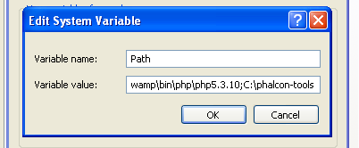

Phalcon 開発者ツール / Windows 向け
==================================

下記のステップは Windows に Phalcon 開発者ツールのインストールするための手順を示すものです。

前提条件
-------------
Phalcon 開発者ツールの実行には、Phalcon PHP 拡張が必須です。もしまだインストールしていないのなら、
:doc:`インストール <install>` を参照してください。

ダウンロード
------------
Download_ セクションで、開発者ツールを同梱したクロスプラットフォームのパッケージがダウンロードできます。また、Github_ から clone でもできます。

Windows プラットフォームでは、システム環境変数 PATH に、Phalcon と PHP の実行ファイルの場所を含むよう構成する必要があります。 開発者ツールを ZIP 書庫でダウンロードした場合は、 *c:\\phalcon-tools* といったローカル HDD の任意のパスに展開してください。以降のステップでそのパスが必要になります。それから、「phalcon.bat」を選択し、右クリックメニューから「編集」を選び、編集します。

.. figure:: ../_static/img/path-0.png
   :align: center

Phalcon 開発者ツールをインストールした場所にパスを変更します。 (ここでは PTOOLSPATH=C:\phalcon-tools\ に設定):

.. figure:: ../_static/img/path-01.png
   :align: center

変更したら保存します。

システムのパスに PHP とツールを追加
^^^^^^^^^^^^^^^^^^^^^^^^^^^^^^^^^^^^^^^^
スクリプトも PHP で書かれているので、あなたのマシンにも PHP のインストールが必要になります。PHP の実行ファイルはインストール方法に依存して様々な場所に配置されます。php.exe ファイルを検索してそのパスをコピーしてください。最新の WAMP スタックを使っている場合は、PHP は *C:\\wamp\bin\\php\\php5.3.10\\php.exe* にあります。

Windows のスタートメニューにて「コンピュータ」を右クリック、「プロパティ」を選びます。

.. figure:: ../_static/img/path-1.png
   :align: center

詳細設定のタブから「環境変数」を押します。

.. figure:: ../_static/img/path-2.png
   :align: center

下側の「システム環境変数」セクションから、変数「Path」を見つけて編集します。

.. figure:: ../_static/img/path-3.png
   :align: center

この手順は気をつけてください！ Path 変数の長い文字列の最後に、php.exe へのパスと開発者ツールをインストールしたパスを追加します。変数内の文字列で異なるパスを分けるには、「;（セミコロン）」を使います。

変更後「OK」を押し、ダイアログボックスを閉じましょう。スタートメニューから「ファイル名を指定して実行」を選びます。スタートメニューから見つけられない場合は、「ウィンドウズキー」と「R」を押してください。

.. figure:: ../_static/img/path-5.png
   :align: center

Windows のコマンドプロンプトを開くため、:code:`cmd` と入力してエンターキーを押してください。

.. figure:: ../_static/img/path-6.png
   :align: center

コマンド :code:`php -v` と :code:`phalcon` を入力して、こんなメッセージが出てくるのを確認しましょう。

.. figure:: ../_static/img/path-7.png
   :align: center

   おめでとうございます！これで Phalcon 開発者ツールがインストールされました！

関連ガイド
^^^^^^^^^^^^^^
* :doc:`Phalcon 開発者ツール <tools>`
* :doc:`Phalcon 開発者ツール / Mac OS X 向け <mactools>`
* :doc:`Phalcon 開発者ツール / Linux向け <linuxtools>`

.. _Download: http://phalconphp.com/download
.. _Github: https://github.com/phalcon/phalcon-devtools
