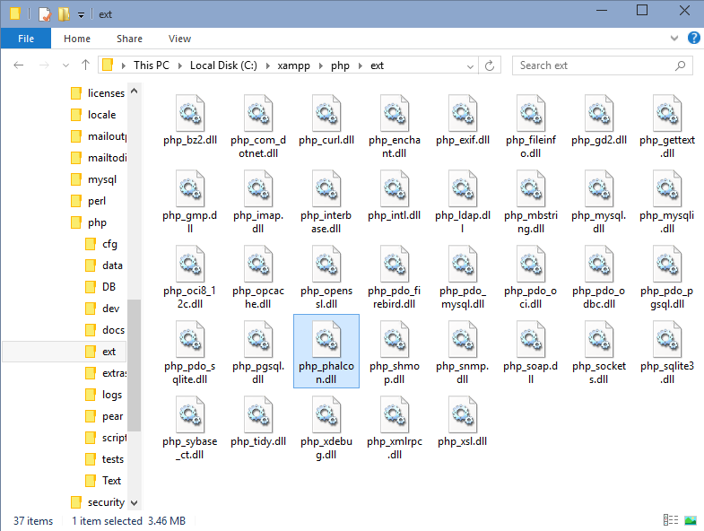

XAMPPへのインストール
=====================

XAMPP_\ はApache、MySQL、PHP、Perlを簡単にインストールできます。
まず、XAMPPをダウンロードし、解凍を行い、起動させます。
以下では、Windows版XAMPPを使用する場合のPhalconのインストール方法を記載しています。
XAMPPは最新のバージョンを使用するようにしてください。

Phalconのダウンロード
-------------------------------------
XAMPPでは、32 bitバージョンのApache、PHPを使用しています。
Windows版Phalconのx86 バージョンをダウンロードする必要があります。

Phalconライブラリをダウンロードすると、以下のようなzipファイルがあるはずです。

.. figure:: ../_static/img/xampp-1.png
    :align: center

アーカイブを解凍し、Phalcon DLLがあるか確認してください。

.. figure:: ../_static/img/xampp-2.png
    :align: center

PHPエクステンションにphp_phalcon.dllをコピーしてください。
C:\\xampp folder にXAMPPがインストールされている場合、エクステンションのパスは、C:\\xampp\\php\\ext となっているはずです。

C:\\xampp\\php\\php.ini にあるphp.iniファイルをテキストエディタなどで編集します。
ファイルの最後に extension=php_phalcon.dll を追記し保存します。

.. figure:: ../_static/img/xampp-4.png
    :align: center

XAMPPコントロールセンターからApacheを再起動させます。
新しいPHP設定が読み込まれるはずです。

.. figure:: ../_static/img/xampp-5.png
    :align: center

ブラウザでhttp://localhostを開くと、XAMPPのウェルカムページが表示されると思います。
そしたら、phpinfo()のリンクをクリックして開きます。

.. figure:: ../_static/img/xampp-6.png
    :align: center

phpinfo()で、phalconエクステンションがロードされているか確認します。

.. figure:: ../_static/img/xampp-7.png
    :align: center

phpinfo()でphalconのバージョンが表示されていれば、インストール成功です！

スクリーンキャスト
------------------
以下では、Windows版Phalconのインストール手順を説明しています。

.. raw:: html

   
<iframe src="https://player.vimeo.com/video/40265988" width="500" height="266" frameborder="0" webkitAllowFullScreen mozallowfullscreen allowFullScreen></iframe>

関連ガイド
--------------
* :doc:`General Installation </reference/install>`
* :doc:`Detailed Installation on WAMP for Windows </reference/wamp>`

.. _XAMPP: https://www.apachefriends.org/jp/download.html
