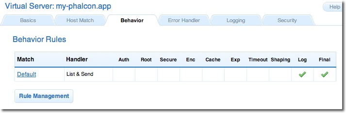

Notas para la instalación en Cherokee
=====================================

Cherokee_ es un servidor web de alto rendimiento. Es muy rápido, flexible y fácil de configurar.

Configurando Cherokee para Phalcon
----------------------------------
Cherokee provee una amistosa interfaz de usuario que permite configurar cada una de las opciones del servidor web.
Inicia el administrador de Cherokee ejecutando /path-to-cherokee/sbin/cherokee-admin.

.. figure:: ../_static/img/cherokee-1.jpg
    :align: center

Crea un host virtual haciendo click en 'vServers', luego añade un nuevo servidor virtual:

.. figure:: ../_static/img/cherokee-2.jpg
    :align: center

El servidor virtual recientemente añadido debe monstrace a la barra izquiderda. En la pestaña 'Behaviors'
podras ver el conjunto de comportamientos por defecto para este servidor virtual. Haz click en el botón 'Rule Management'.
Elimina los que dicen 'Directory /cherokee_themes' y 'Directory /icons':

Adiciona el comportamiento 'PHP Language' haciendo uso del asistente. Este comportamiento te permitira correr aplicaciones PHP:

.. figure:: ../_static/img/cherokee-4.jpg
    :align: center

Normalmente este comportamiento no requiere configuraciones adicionales. Adiciona otro comportamiento
esta vez en la sección 'Manual Configuration' section. En 'Rule Type' selecciona 'File Exists',
verifica que la opción 'Match any file' esta habilitada:

.. figure:: ../_static/img/cherokee-55.jpg
    :align: center

En la pestaña 'Handler' selecciona 'List & Send' como manejador:

.. figure:: ../_static/img/cherokee-7.jpg
    :align: center

Edita el comportamiento 'Default' para habilitar el motor URL-rewrite. Cambia el manejador a 'Redirection',
luego adiciona la expresión regular al motor ^(.*)$:

.. figure:: ../_static/img/cherokee-6.jpg
    :align: center

Finalmente, asegurate que los comportamientos posean el siguiente orden:

.. figure:: ../_static/img/cherokee-8.jpg
    :align: center

Ejecuta la aplicación en tu navegador:

.. figure:: ../_static/img/cherokee-9.jpg
    :align: center

.. _Cherokee: http://www.cherokee-project.com/
