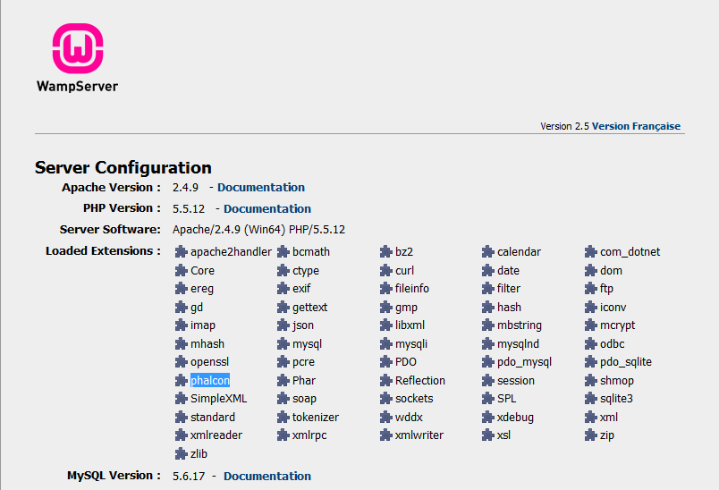

WAMPへのインストール
=====================

WampServer_\ は、Windowsのweb開発環境ツールです。 ウェブアプリケーションをApache2、PHP、MySQLで作成できます。 以下では、Windows版WampServerを使用する場合のPhalconのインストール方法を記載しています。 WampServerは最新のバージョンを使用するようにしてください。

Phalconのダウンロード
-------------------------------------
WAMPは32 bitと64 bitの両方のバージョンがあります。 自身の環境にあったWindows版Phalconをダウンロードしてください。

Phalconライブラリをダウンロードすると、以下のようなzipファイルがあるはずです。

.. figure:: ../_static/img/xampp-1.png
    :align: center

アーカイブを解凍し、Phalcon DLLがあるか確認してください。

.. figure:: ../_static/img/xampp-2.png
    :align: center

PHPエクステンションにphp_phalcon.dllをコピーしてください。 C:\\wamp folder にXAMPPがインストールされている場合、エクステンションのパスは、C:\\wamp\\bin\\php\\php5.5.12\\ext となっているはずです。

.. figure:: ../_static/img/wamp-1.png
    :align: center

C:\\wamp\\bin\\php\\php5.5.12\\php.ini にあるphp.iniファイルをテキストエディタなどで編集します。 ファイルの最後に extension=php_phalcon.dll を追記し保存します。 また、C:\\wamp\\bin\\apache\\apache2.4.9\\bin\\php.ini こちらにもphp.iniがある場合があります。

.. figure:: ../_static/img/wamp-2.png
    :align: center

Also edit another php.ini file, which is located at C:\\wamp\\bin\\apache\\apache2.4.9\\bin\\php.ini. Append at the end of the file: extension=php_phalcon.dll and save it.

Apacheを再起動させます。 Do a single click on the WampServer icon at system tray. Choose "Restart All Services" from the pop-up menu. Check out that tray icon will become green again.

.. figure:: ../_static/img/wamp-3.png
    :align: center

ブラウザでhttp://localhostを開くと、WAMPのウェルカムページが表示されると思います。 そしたら、phpinfo()のリンクをクリックして開きます。

Congrats!, You are now flying with Phalcon.

関連ガイド
--------------
* :doc:`General Installation </reference/install>`
* :doc:`Detailed Installation on XAMPP for Windows </reference/xampp>`

.. _WampServer: http://www.wampserver.com/en/
