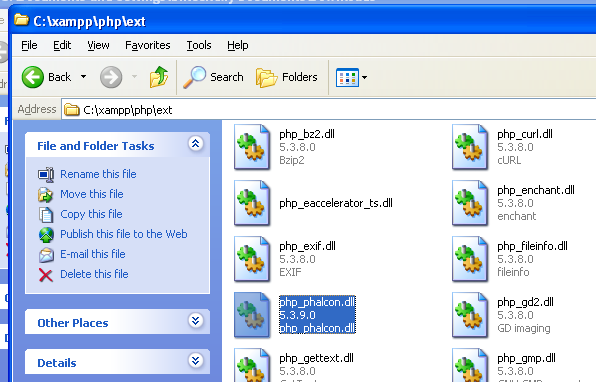
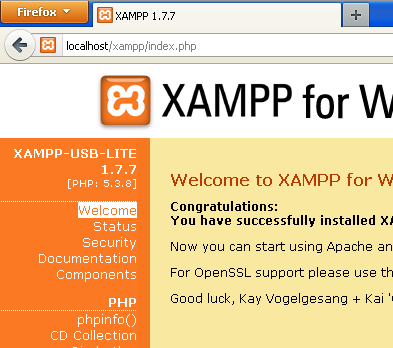

Instalacja na XAMPP
===================

XAMPP_ is an easy to install Apache distribution containing MySQL, PHP and Perl. Once you download XAMPP, all you have to do is extract it and start using it. Below are detailed instructions on how to install Phalcon on XAMPP for Windows. Using the latest XAMPP version is highly recommended.

Pobierz właściwą wersję Phalcona
--------------------------------
XAMPP wydaje zawsze 32-bitowe wersje Apache i PHP. Musisz pobrać wersję x86 Phalcona dla systemu Windows z sekcji Pobierz.

Po pobraniu biblioteki Phalcon, będziesz miał plik zip jak na obrazku poniżej:

.. figure:: ../_static/img/xampp-1.png
    :align: center

Wypakuj bibliotekę z archiwum aby otrzymać Phalcon DLL:

.. figure:: ../_static/img/xampp-2.png
    :align: center

Skopiuj plik php_phalcon.dll do folderu rozszerzeń PHP. Jeżeli zainstalowałeś XAMPP w folderze C:\\xampp, rozszerzenie musi być w C:\\xampp\\php\\ext

Edytuj plik php.ini, jest zlokalizowany w C:\\xampp\\php\\php.ini. Możesz go edytować Notatnikiem lub innym, podobnym programem. Polecamy Nodepad++, aby uniknąć problemów z zakończeniami linii. Dodaj na końcu pliku: extension=php_phalcon.dll i zapisz go.

.. figure:: ../_static/img/xampp-4.png
    :align: center

Zrestartuj serwer Apache z panelu kontrolnego XAMPP. To załaduje nową konfigurację PHP.

.. figure:: ../_static/img/xampp-5.png
    :align: center

Otwórz swoją przeglądarkę i przejdź do http://localhost. Pojawi się strona powitalna WAMP. Kliknij na link phpinfo().

phpinfo() wyświetli znaczną ilość informacji o obecnym stanie PHP. Przewiń w dół, aby sprawdzić czy rozszerzenie phalcon zostało załadowane poprawnie.

.. figure:: ../_static/img/xampp-7.png
    :align: center

Jeżeli widzisz wersję phalcona w phpinfo(), gratulacje!, Teraz latasz z Phalconem :)

Poradniki Wideo
---------------
Poniższy filmik jest przewodnikiem "krok po kroku" jak zainstalować Phalcona na systemie Windows:

.. raw:: html

   
<iframe src="https://player.vimeo.com/video/40265988" width="500" height="266" frameborder="0" webkitAllowFullScreen mozallowfullscreen allowFullScreen></iframe>

Powiązane przewodniki
---------------------
* :doc:`General Installation </reference/install>`
* :doc:`Detailed Installation on WAMP for Windows </reference/wamp>`

.. _XAMPP: https://www.apachefriends.org/pl/download.html
