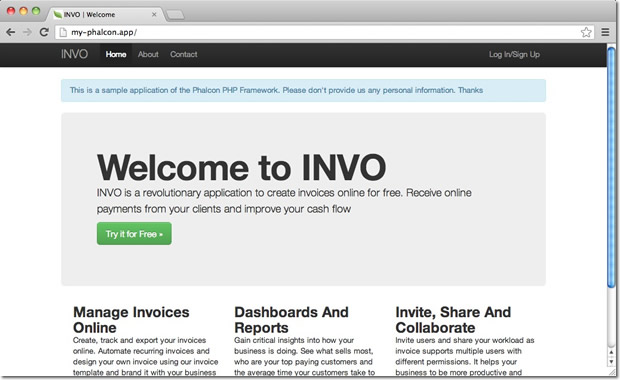

Notas de Instalação do Cherokee
===============================

Cherokee_ é um servidor web de alto desempenho, muito rápido, flexível e fácil de configurar.

Configurando o Cherokee Para o Phalcon
--------------------------------------
Cherokee provê uma interface gráfica amigável para configurar a maioria de todas as configurações disponíveis no servidor web.
Inicie o administrativo do cherokee executando com o root: /path-para-cherokee/sbin/cherokee-admin

.. figure:: ../_static/img/cherokee-1.jpg
    :align: center

Crie um novo host virtual clicando em 'vServers', e em seguida adicione um novo servidor virtual:

.. figure:: ../_static/img/cherokee-2.jpg
    :align: center

O servidor virtual adicionado recentemente, deverá aparecer na barra esquerda da tela. Na aba 'Behaviors'
você encontrará um conjunto de behaviors* padrão para esse servidor virtal. Clique no botão 'Rule Management'.
Remova os rotulados como 'Directory /cherokee_themes' e 'Directory /icons':

.. figure:: ../_static/img/cherokee-3.jpg
    :align: center

Adicione a linguagem PHP usando o assistente de configuração (wizard). Esse behavior* permite você executar aplicações em PHP:

.. figure:: ../_static/img/cherokee-4.jpg
    :align: center

Normalmente esse behavior* não requer configurações adicionais. Adicione outro behavior*,
dessa vez na seção 'Manual Configuration'. Em 'Rule Type' selecione 'File Exists',
e certifique-se que a opção 'Match any file' esteja ativada:

.. figure:: ../_static/img/cherokee-55.jpg
    :align: center

Na aba 'Handler' escolha 'List & Send' como um “handler”:

.. figure:: ../_static/img/cherokee-7.jpg
    :align: center

Edite o behavior* padrão afim de permitir a ativação do mecanismo de URL-rewrite. Altere o “handler” para 'Redirection',
em seguida, adicione a seguinte expressão regular ^(.*)$:

.. figure:: ../_static/img/cherokee-6.jpg
    :align: center

Finalmente, certifique-se que os behaviors* tenham a seguinte ordem:

.. figure:: ../_static/img/cherokee-8.jpg
    :align: center

Execute a aplicação no browser:

.. rubric::  \*Notas de tradução para behavior

Tradução ao pé da letra para o Português é “comportamento”, todavia esse termo aqui é aplicado de forma mais abrangente, como extensões de funcionalidade do servidor. Como se trata de um termo técnico, e a semântica aqui aplicada não seria adequada a tradução para comportamento, foi mantida a palavra original.

.. _Cherokee: http://www.cherokee-project.com/