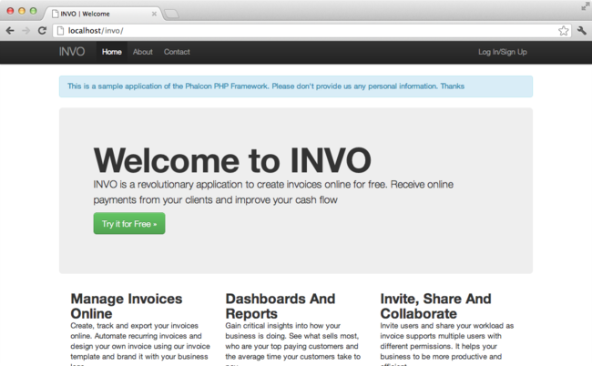

Tutorial 2: Introducing INVO
============================

In this second tutorial, we'll explain a more complete application in order to gain a deeper understanding of
developing with Phalcon. INVO is one of the sample applications we have created. INVO is a small website that
allows users to generate invoices and do other tasks such as manage customers and products. You can clone its
code from Github_.

INVO was made with the client-side framework `Bootstrap`_. Although the application does not generate actual
invoices, it still serves as an example showing how the framework works.

Project Structure
-----------------
Once you clone the project in your document root you'll see the following structure:

.. code-block:: bash

    invo/
        app/
            config/
            controllers/
            forms/
            library/
            logs/
            models/
            plugins/
            views/
        cache/
            volt/
        docs/
        public/
            css/
            fonts/
            js/
        schemas/

As you know, Phalcon does not impose a particular file structure for application development. This project
has a simple MVC structure and a public document root.

Once you open the application in your browser http://localhost/invo you'll see something like this:

The application is divided into two parts: a frontend and a backend. The frontend is a public area where
visitors can receive information about INVO and request contact information. The backend is an
administrative area where registered users can manage their products and customers.

Routing
-------
INVO uses the standard route that is built-in with the :doc:`Router <routing>` component. These routes match the following
pattern: /:controller/:action/:params. This means that the first part of a URI is the controller, the second the
controller action and the rest are the parameters.

The following route `/session/register` executes the controller SessionController and its action registerAction.

Configuration
-------------
INVO has a configuration file that sets general parameters in the application. This file is located at
app/config/config.ini and is loaded in the very first lines of the application bootstrap (public/index.php):

.. code-block:: php

    <?php

    use Phalcon\Config\Adapter\Ini as ConfigIni;

    // ...

    // Read the configuration
    $config = new ConfigIni(
        APP_PATH . "app/config/config.ini"
    );

:doc:`Phalcon\\Config <config>` allows us to manipulate the file in an object-oriented way.
In this example, we're using an ini file for configuration but Phalcon has :doc:`adapters <config>` for other file types
as well. The configuration file contains the following settings:

.. code-block:: ini

    [database]
    host     = localhost
    username = root
    password = secret
    name     = invo

    [application]
    controllersDir = app/controllers/
    modelsDir      = app/models/
    viewsDir       = app/views/
    pluginsDir     = app/plugins/
    formsDir       = app/forms/
    libraryDir     = app/library/
    baseUri        = /invo/

Phalcon doesn't have any pre-defined settings convention. Sections help us to organize the options as appropriate.
In this file there are two sections to be used later: "application" and "database".

Autoloaders
-----------
The second part that appears in the bootstrap file (public/index.php) is the autoloader:

.. code-block:: php

    <?php

    /**
     * Auto-loader configuration
     */
    require APP_PATH . "app/config/loader.php";

The autoloader registers a set of directories in which the application will look for
the classes that it will eventually need.

.. code-block:: php

    <?php

    $loader = new Phalcon\Loader();

    // We're a registering a set of directories taken from the configuration file
    $loader->registerDirs(
        [
            APP_PATH . $config->application->controllersDir,
            APP_PATH . $config->application->pluginsDir,
            APP_PATH . $config->application->libraryDir,
            APP_PATH . $config->application->modelsDir,
            APP_PATH . $config->application->formsDir,
        ]
    );

    $loader->register();

Note that the above code has registered the directories that were defined in the configuration file. The only
directory that is not registered is the viewsDir because it contains HTML + PHP files but no classes.
Also, note that we use a constant called APP_PATH. This constant is defined in the bootstrap
(public/index.php) to allow us to have a reference to the root of our project:

.. code-block:: php

    <?php

    // ...

    define(
        "APP_PATH",
        realpath("..") . "/"
    );

Registering services
--------------------
Another file that is required in the bootstrap is (app/config/services.php). This file allows
us to organize the services that INVO uses.

.. code-block:: php

    <?php

    /**
     * Load application services
     */
    require APP_PATH . "app/config/services.php";

Service registration is achieved as in the previous tutorial, making use of closures to lazily load
the required components:

.. code-block:: php

    <?php

    use Phalcon\Mvc\Url as UrlProvider;

    // ...

    /**
     * The URL component is used to generate all kind of URLs in the application
     */
    $di->set(
        "url",
        function () use ($config) {
            $url = new UrlProvider();

            $url->setBaseUri(
                $config->application->baseUri
            );

            return $url;
        }
    );

We will discuss this file in depth later.

Handling the Request
--------------------
If we skip to the end of the file (public/index.php), the request is finally handled by :doc:`Phalcon\\Mvc\\Application <../api/Phalcon_Mvc_Application>`
which initializes and executes all that is necessary to make the application run:

.. code-block:: php

    <?php

    use Phalcon\Mvc\Application;

    // ...

    $application = new Application($di);

    $response = $application->handle();

    $response->send();

Dependency Injection
--------------------
In the first line of the code block above, the Application class constructor is receiving the variable
:code:`$di` as an argument. What is the purpose of that variable? Phalcon is a highly decoupled framework
so we need a component that acts as glue to make everything work together. That component is :doc:`Phalcon\\Di <../api/Phalcon_Di>`.
It's a service container that also performs dependency injection and service location,
instantiating all components as they are needed by the application.

There are many ways of registering services in the container. In INVO, most services have been registered using
anonymous functions/closures. Thanks to this, the objects are instantiated in a lazy way, reducing the resources needed
by the application.

For instance, in the following excerpt the session service is registered. The anonymous function will only be
called when the application requires access to the session data:

.. code-block:: php

    <?php

    use Phalcon\Session\Adapter\Files as Session;

    // ...

    // Start the session the first time a component requests the session service
    $di->set(
        "session",
        function () {
            $session = new Session();

            $session->start();

            return $session;
        }
    );

Here, we have the freedom to change the adapter, perform additional initialization and much more. Note that the service
was registered using the name "session". This is a convention that will allow the framework to identify the active
service in the services container.

A request can use many services and registering each service individually can be a cumbersome task. For that reason,
the framework provides a variant of :doc:`Phalcon\\Di <../api/Phalcon_Di>` called :doc:`Phalcon\\Di\\FactoryDefault <../api/Phalcon_Di_FactoryDefault>` whose task is to register
all services providing a full-stack framework.

.. code-block:: php

    <?php

    use Phalcon\Di\FactoryDefault;

    // ...

    // The FactoryDefault Dependency Injector automatically registers the
    // right services providing a full-stack framework
    $di = new FactoryDefault();

It registers the majority of services with components provided by the framework as standard. If we need to override
the definition of some service we could just set it again as we did above with "session" or "url".
This is the reason for the existence of the variable :code:`$di`.

In next chapter, we will see how authentication and authorization is implemented in INVO.

.. _Github: https://github.com/phalcon/invo
.. _Bootstrap: http://getbootstrap.com/
