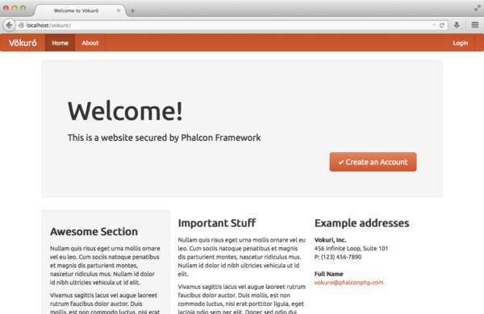

Tutorial 6: Vökuró
==================
Vökuró é outro exemplo de aplicativo que você pode usar para aprender mais sobre Phalcon.
Vökuró é um pequeno site que mostra como implementar recursos de segurança e
gerenciamento de usuários e permissões. É possível clonar o seu código do Github_.

Estrutura do Projeto
-----------------
Depois de clonar o projeto em sua raiz do documento você verá a seguinte estrutura:

.. code-block:: bash

    vokuro/
        app/
            config/
            controllers/
            forms/
            library/
            models/
            views/
        cache/
        public/
            css/
            img/
        schemas/

Este projecto segue uma estrutura bastante semelhante ao INVO. Uma vez que você abrir o aplicativo em seu
navegador http://localhost/vokuro você verá algo parecido com isto:

O aplicativo é dividido em duas partes, a frontend, onde os visitantes podem se inscrever no serviço
e uma backend onde os usuários administrativos podem gerenciar usuários registrados. Ambos frontend e backend
são combinados num único módulo.

Load Classes and Dependencies
-----------------------------
Este projeto utiliza :doc:`Phalcon\\Loader <../api/Phalcon_Loader>` para carregar controladores, modelos, formulários, etc. dentro do projeto e composer_
para carregar as dependências do projeto. Assim, a primeira coisa que você tem que fazer antes de executar Vökuró é
instalar suas dependências via composer_. Supondo que você tenha corretamente instalado, digite o
seguinte comando no console:

.. code-block:: bash

    cd vokuro
    composer install

Vökuró envia e-mails para confirmar a inscrição de usuários registrados que utilizam Swift,
o composer.json se parece com:

.. code-block:: json

    {
        "require" : {
            "php" : ">=5.5.0",
            "ext-phalcon" : ">=3.0.0",
            "swiftmailer/swiftmailer" : "^5.4",
            "amazonwebservices/aws-sdk-for-php" : "~1.0"
        }
    }

Now, there is a file called app/config/loader.php where all the auto-loading stuff is set up. At the end of
this file you can see that the composer autoloader is included enabling the application to autoload
any of the classes in the downloaded dependencies:

.. code-block:: php

    <?php

    // ...

    // Use composer autoloader to load vendor classes
    require_once BASE_PATH . "/vendor/autoload.php";

Além disso, Vökuró, ao contrário do INVO, utiliza namespaces para os controllers e models
que é a prática recomendada para estruturar um projeto. Desta forma, o carregador automático parece um pouco
diferente do que vimos antes (app/config/loader.php):

.. code-block:: php

    <?php

    use Phalcon\Loader;

    $loader = new Loader();

    $loader->registerNamespaces(
        [
            "Vokuro\\Models"      => $config->application->modelsDir,
            "Vokuro\\Controllers" => $config->application->controllersDir,
            "Vokuro\\Forms"       => $config->application->formsDir,
            "Vokuro"              => $config->application->libraryDir,
        ]
    );

    $loader->register();

    // ...

Ao invés de usar :code:`registerDirectories()`, nós usamos :code:`registerNamespaces()`. Cada namespace aponta para um diretório
definido no arquivo de configuração (app/config/config.php). Por exemplo, o namespace Vokuro\\Controllers
points to app/controllers por isso todas as classes requeridas pela aplicação dentro deste namespace
são requiridos em sua definição:

.. code-block:: php

    <?php

    namespace Vokuro\Controllers;

    class AboutController extends ControllerBase
    {
        // ...
    }

Sign Up
-------
Primeiro, vamos verificar como os usuários são registrados no Vökuró. Quando um usuário clica no botão "Create an Account",
o controller SessionController é chamado e a ação "signup" é executado:

.. code-block:: php

    <?php

    namespace Vokuro\Controllers;

    use Vokuro\Forms\SignUpForm;

    class RegisterController extends ControllerBase
    {
        public function signupAction()
        {
            $form = new SignUpForm();

            // ...

            $this->view->form = $form;
        }
    }

Esta ação simplesmente passa uma instância de SignUpForm para a view, que em si é processado para
permitir que o usuário digite os detalhes de login:

.. code-block:: html+jinja

    {{ form("class": "form-search") }}

        <h2>
            Sign Up
        </h2>

        
{{ form.label("name") }}

        

            {{ form.render("name") }}
            {{ form.messages("name") }}
        

        
{{ form.label("email") }}

        

            {{ form.render("email") }}
            {{ form.messages("email") }}
        

        
{{ form.label("password") }}

        

            {{ form.render("password") }}
            {{ form.messages("password") }}
        

        
{{ form.label("confirmPassword") }}

        

            {{ form.render("confirmPassword") }}
            {{ form.messages("confirmPassword") }}
        

        

            {{ form.render("terms") }} {{ form.label("terms") }}
            {{ form.messages("terms") }}
        

        
{{ form.render("Sign Up") }}

        {{ form.render("csrf", ["value": security.getToken()]) }}
        {{ form.messages("csrf") }}

        

    {{ endForm() }}

.. _Github: https://github.com/phalcon/vokuro
.. _composer: https://getcomposer.org/
