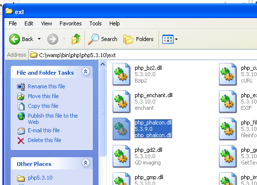

Instalação no WAMP
==================

WampServer_ é um ambiente de desenvolvimento web do Windows. Ele permite a você criar aplicações web utilizando Apache2, PHP e MySQL. Abaixo existem instruções detalhadas de como instalar o Phalcon no WampServer para Windows. É altamente recomendado o uso da versão mais atualizada do WampServer.

Baixe a versão correta do Phalcon
---------------------------------
o WAMP tem ambas versões, 32 e 64 bit. Na seção de downloads, você pode selecionar o Phalcon para Windows de acordo com a arquitetura desejada.

Após realizar o download da biblioteca Phalcon, você terá um arquivo zip como o mostrado abaixo:

.. figure:: ../_static/img/xampp-1.png
    :align: center

Extraia o arquivo para obter a DLL Phalcon:

.. figure:: ../_static/img/xampp-2.png
    :align: center

Copie o arquivo php_phalcon.dll para a pasta de extensões do PHP. Se o WAMP está instalado na pasta C:\\wamp, a extensão precisa estar em C:\\wamp\\bin\\php\\php5.5.12\\ext

Edite o arquivo php.ini, ele está localizado em C:\\wamp\\bin\\php\\php5.5.12\\php.ini. Ele pode ser editado com o Notepad (Bloco de notas) ou outro programa similar. Nós recomendamos o Notepad++ para evitar problemas com caracteres de controle de final de linha. Acrescente ao final do arquivo: extension=php_phalcon.dll e salve-o.

.. figure:: ../_static/img/wamp-2.png
    :align: center

Também edite outro arquivo php.ini, que está localizado em C:\\wamp\\bin\\apache\\apache2.4.9\\bin\\php.ini. Acrescente ao final do arquivo: extension=php_phalcon.dll e salve-o.

Reinicie o servidor Web Apache. Clique uma única vez no ícone do WampServer na bandeja do sistema. Escolha "Reiniciar todos os serviços" no menu de pop-up. Observe que o ícone ficará verde novamente.

.. figure:: ../_static/img/wamp-3.png
    :align: center

Abra seu navegador e navegue até o endereço: http://localhost. A página de boas-vindas do WAMP será mostrada. Olhe na seção "extensões carregadas" para checar se o phalcon foi carregado.

.. figure:: ../_static/img/wamp-4.png
    :align: center

Parabens!, você agora está voando com Phalcon.

Guias Relacionados
------------------
* :doc:`General Installation </reference/install>`
* :doc:`Detailed Installation on XAMPP for Windows </reference/xampp>`

.. _WampServer: http://www.wampserver.com/en/
