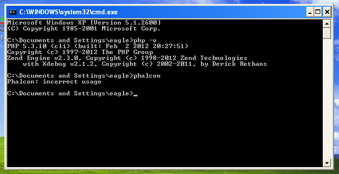

Phalcon Developer Tools no Windows
==================================

Estas medidas irão guiá-lo através do processo de instalação da Phalcon Developer Tools para Windows.

Pré-requisitos
--------------

A extensão Phalcon PHP é necessário para executar Phalcon Tools. Se você não tiver instalado ainda, por favor consulte o: doc:`Instalação <install>` seção para obter instruções.

Download
--------
Você pode baixar um pacote da plataforma que contém as ferramentas de desenvolvimento a partir da seção Download_ . Também você pode cloná-lo do Github_.

Na plataforma Windows, você precisa configurar o caminho do sistema para incluir Phalcon tools, bem como o executável no PHP. Se você baixar Phalcon Tools como um arquivo zip, extraia-o em qualquer caminho de sua unidade local ou seja, *c:\\phalcon-tools*. Você terá este caminho nos passos abaixo. Editar o arquivo "phalcon.bat" clicando com o botão direito no arquivo e selecione "Editar":

.. figure:: ../_static/img/path-0.png
   :align: center

Altere o caminho para onde você instalou o Phalcon tools (set PTOOLSPATH=C:\phalcon-tools\):

.. figure:: ../_static/img/path-01.png
   :align: center

Salvar as alterações.

Adicionando PHP e ferramentas para o seu caminho do sistema
^^^^^^^^^^^^^^^^^^^^^^^^^^^^^^^^^^^^^^^^^^^^^^^^^^^^^^^^^^^
Porque os scripts são escritos em PHP, você precisa instalá-lo em sua máquina. Dependendo de sua instalação PHP, o executável pode ser localizado em vários lugares. . Procure o php.exe arquivo e copie o caminho que está localizado em por exemplo, se estiver usando a mais recente pilha WAMP, PHP está localizado em: *C:\\wamp\bin\\php\\php5.3.10\\php .exe*.

A partir do menu Iniciar do Windows, botão direito do mouse clique no ícone "Computador" e selecione "Propriedades":

.. figure:: ../_static/img/path-1.png
   :align: center

Clique na aba "Avançado" e depois no botão "Variáveis de Ambiente":

.. figure:: ../_static/img/path-2.png
   :align: center

Na parte inferior, procure a seção "System varialbles" e editar o "Path" variável:

.. figure:: ../_static/img/path-3.png
   :align: center

Tenha muito cuidado nesta etapa! Você precisa acrescentar no final da longa cadeia o caminho onde o seu php.exe foi localizado eo caminho onde o Phalcon Tools estão instalados. Use o ";" caractere para separar os diferentes caminhos na variável:

.. figure:: ../_static/img/path-4.png
   :align: center

Aceite as alterações feitas clicando em "OK" e feche o diálogo aberto. A partir do menu Iniciar, clique na opção "Executar". Se você não consegue encontrar essa opção, pressione "Windows Key" + "R".

.. figure:: ../_static/img/path-5.png
   :align: center

Digite "cmd" e pressione Enter para abrir o utilitário Windows linha de comando:

.. figure:: ../_static/img/path-6.png
   :align: center

Digite os comandos "php -v" e "Phalcon" e você vai ver algo como isto:

Congratulations you now have Phalcon tools installed!

Parabéns, você agora têm o Phalcon tools instalado!

Related Guides
^^^^^^^^^^^^^^
* :doc:`Using Developer Tools <tools>`
* :doc:`Installation on OS X <mactools>`
* :doc:`Installation on Linux <linuxtools>`

.. _Download: http://phalconphp.com/download
.. _Github: https://github.com/phalcon/phalcon-devtools
