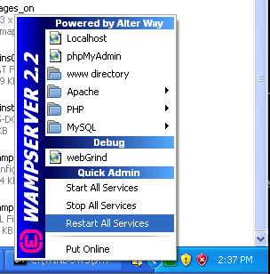

Установка на WAMP
=================

WampServer_ - это платформа для веб-разработки под Windows, позволяющая создавать веб-приложения с использованием Apache2, PHP и MySQL. Ниже представлена детальная инструкция по установке Phalcon на WampServer для Windows. Крайне рекомендуем использовать последнюю версию WampServer.

Скачайте правильную версию Phalcon
----------------------------------
WAMP существует в 32- и 64-битных версиях. В разделе скачивания выберите нужную версию Phalcon для Windows в зависимости от имеющейся архитектуры.

После скачивания библиотеки Phalcon у вас будет zip файл, примерно такой как показано ниже:

Распакуйте архив и получите файл библиотеки Phalcon DLL:

.. figure:: ../_static/img/xampp-2.png
    :align: center

Скопируйте файл php_phalcon.dll в каталог PHP расширений. Если вы установили WAMP в каталог C:\\wamp, то расширения будут в C:\\wamp\\bin\\php\\php5.5.12\\ext

.. figure:: ../_static/img/wamp-1.png
    :align: center

Отредактируйте ваш php.ini файл, он располагается в C:\\wamp\\bin\\php\\php5.5.12\\php.ini. Для редактирования можно использовать Блокнот или любую подобную программу. Мы рекомендуем использовать Notepad++ для избегания проблем с окончанием и переводом строк. Добавьте в конец файла: extension=php_phalcon.dll и сохраните его.

.. figure:: ../_static/img/wamp-2.png
    :align: center

Так же отредактируйте файл php.ini file, располагающийся в C:\\wamp\\bin\\apache\\apache2.4.9\\bin\\php.ini. Добавьте в самый конец файла: extension=php_phalcon.dll и сохраните его.

Перезапустите Apache. Кликните один раз на значок WampServer в системном трее. Выберите "Restart All Services" из выпадающего меню. Проверьте, что значок в трее снова стал зелёным.

Откройте ваш браузер и перейдите на http://localhost. Должна появиться страница приветствия WAMP. Найдите раздел "extensions loaded" и проверьте, что расширение phalcon загружено.

.. figure:: ../_static/img/wamp-4.png
    :align: center

Поздравляем! Вы готовы к полёту с Phalcon.

Дополнительные руководства
--------------------------
* :doc:`Информация по установке </reference/install>`
* :doc:`Подробная установка на XAMPP для Windows </reference/xampp>`

.. _WampServer: http://www.wampserver.com/ru/
