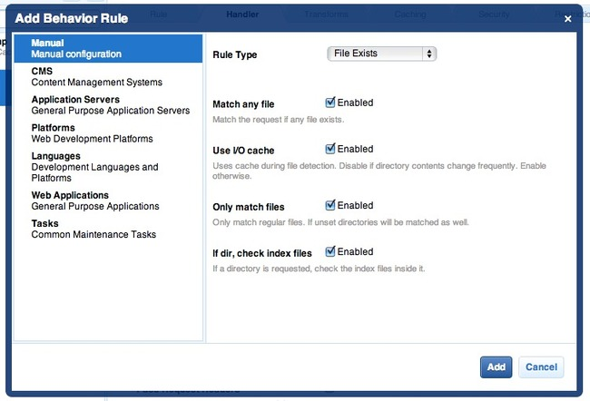

Cherokee 安装说明（Cherokee Installation Notes）
================================================

Cherokee_ 是一个高性能的web服务器。它非常快，运行稳定并且易于配置。

针对Phalcon的Cherokee配置
-------------------------
Cherokee提供了友好的界面来设置几乎web服务器全部可用的配置。
使用root帐号执行 /path-to-cherokee/sbin/cherokee-admin 可以开启cherokee管理员。

.. figure:: ../_static/img/cherokee-1.jpg
    :align: center

通过点击“vServers”便可创建一个新的虚拟机，然后添加一个新的虚拟服务器：

.. figure:: ../_static/img/cherokee-2.jpg
    :align: center

屏幕左栏会显示最近添加的虚拟服务器。在“Behaviors”（行为）标签中，你可以看到这个虚拟服务器一系列默认的行为操作。
点击“Rule Management”（规则管理）按钮。删除“Directory /cherokee_themes”和“Directory /icons”这些标签。

.. figure:: ../_static/img/cherokee-3.jpg
    :align: center

接着使用向导添加“PHP Language”（PHP语言）。这样你就可以运行你的PHP应用了：

.. figure:: ../_static/img/cherokee-4.jpg
    :align: center

通常这个操作不需要额外的配置。在“Manual Configuration”（配置管理）部分，添加另一个操作。
在“Rule Type”（规则类型）下拉中选择“File Exists”（已存在的文件），然后确保选项“Match any file”（匹配任何文件）勾选了enabled（开启）：

在“Handler”（处理器）标签中选择“List & Send”作为处理器：

.. figure:: ../_static/img/cherokee-7.jpg
    :align: center

编辑“Default”（默认）行为以便可以开启URL重写引擎。修改处理器为“Redirection”（重定向），
然后将以下正则表达式 ^(.*)$ 添加到引擎中：

.. figure:: ../_static/img/cherokee-6.jpg
    :align: center

最后，确保上面的行为操作符合以下的顺序：

.. figure:: ../_static/img/cherokee-8.jpg
    :align: center

在浏览器中执行对应的应用：

.. figure:: ../_static/img/cherokee-9.jpg
    :align: center

.. _Cherokee: http://www.cherokee-project.com/
