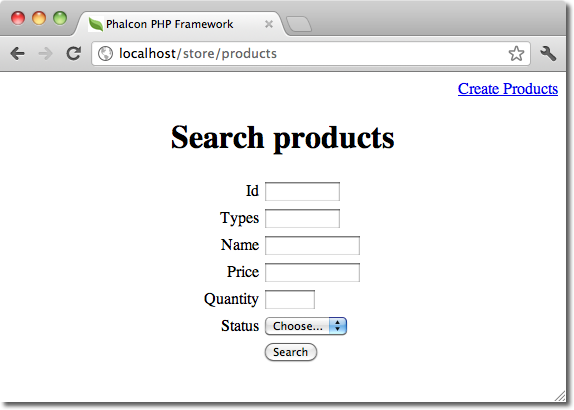

Phalcon 开发工具（Phalcon Developer Tools）
===========================================

Phalcon提供的这个开发工具主要是用来辅助开发，比如生成一些程序的基本框架，生成控制器模型等。使用这个工具我们只需要一个简单的命令即可生成应用的基本框架。

.. highlights::

    如果你喜欢使用web版而非console版本的程序，那么在这里 `blog post`_ 可以看到更多的内容。

下载（Download）
----------------
我们可以从 Github_ 上下载或克隆下来这个跨平台的开发辅助工具。

安装（Installation）
^^^^^^^^^^^^^^^^^^^^
下面详尽的说明了如何在不同的操作系统平台上安装这个辅助开发工具：

.. toctree::
   :maxdepth: 1

   wintools
   mactools
   linuxtools

获取可用的命令（Getting Available Commands）
--------------------------------------------
我们可以在虚拟控制台上输入如下命令： :code:`phalcon commands`

.. code-block:: sh

    $ phalcon commands

    Phalcon DevTools (3.0.0)

    Available commands:可用命令
      commands         (alias of: list, enumerate)
      controller       (alias of: create-controller)
      module           (alias of: create-module)
      model            (alias of: create-model)
      all-models       (alias of: create-all-models)
      project          (alias of: create-project)
      scaffold         (alias of: create-scaffold)
      migration        (alias of: create-migration)
      webtools         (alias of: create-webtools)

生成项目框架（Generating a Project Skeleton）
---------------------------------------------
我们可以使用Phalcon开发辅助工具生成预先定义的项目架构。 默认情况下，phalcon开发辅助工具会使用apache的mod_rewrite来生成程序的骨架. 要创建项目我们只需要在我们的
web服务器根目录下输入如下命令：

.. code-block:: sh

    $ pwd

    /Applications/MAMP/htdocs

    $ phalcon create-project store

执行命令后会生成如下的文档结构的项目：

.. figure:: ../_static/img/tools-2.png
   :align: center

我们可以在命令上加 *--help* 以显示帮助信息（下面的帮助中的中文是翻译时加上去的）：

.. code-block:: sh

    $ phalcon project --help

    Phalcon DevTools (3.0.0)

    Help:帮助
      Creates a project 创建项目

    Usage:用法
      project [name] [type] [directory] [enable-webtools]

    Arguments: 参数
      help    Shows this help text 显示此帮助信息

    Example 例子
      phalcon project store simple

    Options: 选项
     --name               Name of the new project 新项目的名字
     --enable-webtools    Determines if webtools should be enabled [optional] 此选项决定了新的项目中是否使用webtools开发辅助组件
     --directory=s        Base path on which project will be created [optional] 在何外创建项目
     --type=s             Type of the application to be generated (cli, micro, simple, modules) 应用的种类（微型，简单，多模块，console等）
     --template-path=s    Specify a template path [optional] 指定模板路径
     --use-config-ini     Use a ini file as configuration file [optional] 使用ini文件作为配置保存文件
     --trace              Shows the trace of the framework in case of exception. [optional] 出错时是否显示框架的trace信息
     --help               Shows this help 显示帮助

我们访问新生成项目的地址显示如下：

.. figure:: ../_static/img/tools-6.png
   :align: center

生成控制器（Generating Controllers）
------------------------------------
我们可以使用phalcon create-controller --name test或phalcon controller --name test来生成名为test的控制器. 当然要使用此命令当前的执行命令目录必须为已存在的phalcon项目内.

.. code-block:: sh

    $ phalcon create-controller --name test

上面的命令会生成如下代码：

.. code-block:: php

    <?php

    use Phalcon\Mvc\Controller;

    class TestController extends Controller
    {
        public function indexAction()
        {

        }
    }

数据库配置（Preparing Database Settings）
-----------------------------------------
当我们使用phalcon的辅助开发工具生成项目时，则生成的配置信息会被放在 *app/config/config.ini* 文件内。 我们必须要正确的配置连接信息才可生成模型或基本的CRUD操作。

可以在config.ini中进行修改配置信息：

.. code-block:: ini

    [database]
    adapter  = Mysql
    host     = "127.0.0.1"
    username = "root"
    password = "secret"
    dbname   = "store_db"

    [phalcon]
    controllersDir = "../app/controllers/"
    modelsDir      = "../app/models/"
    viewsDir       = "../app/views/"
    baseUri        = "/store/"

生成模型（Generating Models）
-----------------------------
使用phalcon开发辅助工具我们可以有若干种方式来生成模型。 我人可以有选择的生成若干个模型或是全部生成。 亦可以指定生成公有属性或是生成setter和getter方法。

Options:
 --name=s             Table name 表名
 --schema=s           Name of the schema. [optional] schema名
 --namespace=s        Model's namespace [optional] 模型命名空间
 --get-set            Attributes will be protected and have setters/getters. [optional] 设置字段访问属性为私有 并添加setters/getters方法
 --extends=s          Model extends the class name supplied [optional] 指定扩展类名
 --excludefields=l    Excludes fields defined in a comma separated list [optional]
 --doc                Helps to improve code completion on IDEs [optional] 辅助IDE的自动完成功能
 --directory=s        Base path on which project will be created [optional] 项目的根目录
 --force              Rewrite the model. [optional] 重写模型
 --trace              Shows the trace of the framework in case of exception. [optional] 出错时显示框架trace信息
 --mapcolumn          Get some code for map columns. [optional] 生成字映射的代码
 --abstract           Abstract Model [optional] 抽象模型

最简单的生成模型的方式：

.. code-block:: sh

    $ phalcon model products

.. code-block:: sh

    $ phalcon model --name tablename

所有的字段设置为公有：

.. code-block:: php

    <?php

    use Phalcon\Mvc\Model;

    class Products extends Model
    {
        /**
         * @var integer
         */
        public $id;

        /**
         * @var integer
         */
        public $typesId;

        /**
         * @var string
         */
        public $name;

        /**
         * @var string
         */
        public $price;

        /**
         * @var integer
         */
        public $quantity;

        /**
         * @var string
         */
        public $status;
    }

我们可以在生成模型时指定 *--get-set* 参数以实现对字面的保护， 这样我们可以在setter/getter方法里执行一些业务逻辑。

.. code-block:: php

    <?php

    use Phalcon\Mvc\Model;

    class Products extends Model
    {
        /**
         * @var integer
         */
        protected $id;

        /**
         * @var integer
         */
        protected $typesId;

        /**
         * @var string
         */
        protected $name;

        /**
         * @var string
         */
        protected $price;

        /**
         * @var integer
         */
        protected $quantity;

        /**
         * @var string
         */
        protected $status;

        /**
         * 设置字段 id 值的方法
         *
         * @param integer $id
         */
        public function setId($id)
        {
            $this->id = $id;
        }

        /**
         * 设置字段 typsId 值的方法
         *
         * @param integer $typesId
         */
        public function setTypesId($typesId)
        {
            $this->typesId = $typesId;
        }

        // ...

        /**
         * 返回字段 status 值
         *
         * @return string
         */
        public function getStatus()
        {
            return $this->status;
        }
    }

另一个非常好的特性即是在我们多次生成模型时，原有的对模型的更改依然会存在。 这样我们就可以不用担心对模型的属性进行修会被后来再次执模型的生成命令所覆盖。下面的截图显示了这是如何工作的：

.. raw:: html

   
<iframe src="https://player.vimeo.com/video/39213020" width="500" height="266" frameborder="0" webkitAllowFullScreen mozallowfullscreen allowFullScreen></iframe>

生成基本的 CRUD（Scaffold a CRUD）
--------------------------------------
使用phalcon开发辅助工具我们可以直接快速的生成一个模型的CRUD操作。 如果我们想快速的生成模型的CRUD操作只需要使用phalcon辅助开发工具的中scaffold命令即可。

代码生成后，你可以根据自己的需要修改生成的代码。很多开发者可能不会去使用这个功能，其实这东西有时不是太好用，很多时候开发者往往会手动的书写相关代码。使用scaffold产生的代码可以
帮助我们理解框架是如何工作的当然也可以帮助我们制作出快速原型来。 下面的截图展示了基于products表的scaffold:

.. code-block:: sh

    $ phalcon scaffold --table-name products

scaffold生成器会在相关的文件夹中生成若干个文档。 下面是所生成文件的概览：

+----------------------------------------+--------------------------------+
| 文件                                   | 作用                           |
+========================================+================================+
| app/controllers/ProductsController.php | Products控制器                 |
+----------------------------------------+--------------------------------+
| app/models/Products.php                | Products模型                   |
+----------------------------------------+--------------------------------+
| app/views/layout/products.phtml        | Products控制器布局              |
+----------------------------------------+--------------------------------+
| app/views/products/new.phtml           | 方法"new"的视图                 |
+----------------------------------------+--------------------------------+
| app/views/products/edit.phtml          | 方法"edit"的视图                |
+----------------------------------------+--------------------------------+
| app/views/products/search.phtml        | 方法"search"的视图              |
+----------------------------------------+--------------------------------+

在生成的Products控制器中，我们可以看到一个搜索表单和一个生成新product的链接：

在创建页面我们可以生成经过验证的Products记录。 Phalcon会自动的验证数据库中的非空字段。

.. figure:: ../_static/img/tools-11.png
   :align: center

执行搜索后，分页组件会显示颁后的结果。 我们在结果列表的前面放置Edit或Delete链接，以实现相应的操作。

.. figure:: ../_static/img/tools-12.png
   :align: center

工具的 Web 界面（Web Interface to Tools）
-----------------------------------------
另外，如果你喜欢我们还可以在生成项目时通过添加参数以实现在项目中使用Phalcon开发工具的web接口。 下面的视频中展示了如何工作的：

.. raw:: html

   
<iframe src="https://player.vimeo.com/video/42367665" width="500" height="266" frameborder="0" webkitAllowFullScreen mozallowfullscreen allowFullScreen></iframe>

集成工具到 PhpStorm（Integrating Tools with PhpStorm IDE）
----------------------------------------------------------
下面的视频中展示了如何在 `PhpStorm IDE`_ 中集成辅助开发工具。 这个配置步骤也适用于其它的PHP IDE.

.. raw:: html

   
<iframe src="https://player.vimeo.com/video/43455647" width="500" height="266" frameborder="0" webkitAllowFullScreen mozallowfullscreen allowFullScreen></iframe>

结束语（Conclusion）
--------------------
Phalcon开发辅助工具为我们提供了一种简易的产生应用代码的方法， 这可以减少开发时间及潜在的错误。

.. _blog post: https://blog.phalconphp.com/post/dont-like-command-line-and-consoles-no-problem
.. _Github: https://github.com/phalcon/phalcon-devtools
.. _Bootstrap: http://twitter.github.com/bootstrap/
.. _PhpStorm IDE: http://www.jetbrains.com/phpstorm/
