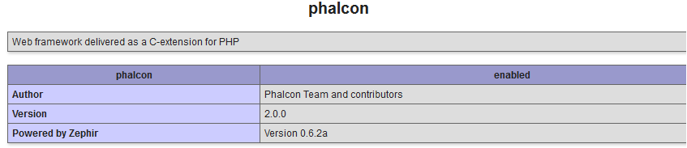

XAMPP 下的安装（Installation on XAMPP）
=======================================

XAMPP_ 是一个包含MySQL，PHP和Perl的易于安装的Apache发行版。一旦你下载了 XAMPP, 你所要做的就是将其解压并且使用它。下面是如何在Windows版XAMPP上面安装Phalcon的详细说明。强烈建议使用最新版本的XAMPP。

下载正确的 Phalcon 版本（Download the right version of Phalcon）
----------------------------------------------------------------
XAMPP总是发布32位版本的Apache和PHP。你需要从下面页面下载windows版x86位的Phalcon。

下载Phalcon扩展之后，你将会看到一个如下图所示的zip文件：

.. figure:: ../_static/img/xampp-1.png
    :align: center

解压zip文件，你将会发现多了一个Phalcon DLL文件:

.. figure:: ../_static/img/xampp-2.png
    :align: center

复制 php_phalcon.dll 文件到PHP扩展目录。如果你安装的XAMPP在C:\\xampp文件夹，那么该文件需要放在C:\\xampp\\php\\ext目录中：

.. figure:: ../_static/img/xampp-3.png
    :align: center

编辑 php.ini 文件， 它位于 C:\\xampp\\php\\php.ini。 它可以使用记事本或者类似程序来编辑它。我们推荐使用Notepad++，来避免行尾问题。在文件结果加上 extension=php_phalcon.dll 然后保存该文件。

.. figure:: ../_static/img/xampp-4.png
    :align: center

从XAMPP控制中心重新启动Apache Web服务器。这将会重新加载新的PHP配置。

.. figure:: ../_static/img/xampp-5.png
    :align: center

打开你的浏览器输入http://localhost并回车。将会出现XAMPP的欢迎页面。点击phpinfo()链接。

.. figure:: ../_static/img/xampp-6.png
    :align: center

phpinfo()将会在屏幕上输出当前PHP的重要的数字信息。向下滚动检测Phalcon扩展是否被正确加载了。

如果你能在phpinfo()输出的页面中看到Phalcon版本，那就恭喜你了，你已经成功的安装Phalcon扩展。

视频教程（Screencast）
----------------------
下面的视频介绍了如何在Windows中一步一步的安装Phalcon。

.. raw:: html

   
<iframe src="https://player.vimeo.com/video/40265988" width="500" height="266" frameborder="0" webkitAllowFullScreen mozallowfullscreen allowFullScreen></iframe>

相关指南 (Related Guides)
---------------------------
* :doc:`普通安装 </reference/install>`
* :doc:`在Windows版WAMP中安装详细说明 </reference/wamp>`

.. _XAMPP: https://www.apachefriends.org/zh_cn/download.html
