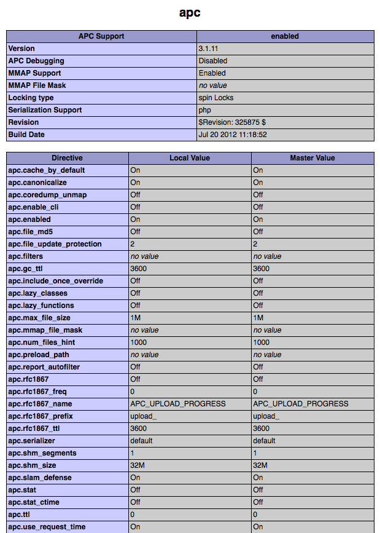

Porównanie Frameworków
====================
W przeszłości, wydajność nie była jednym z głównych priorytetów podczas tworzenia aplikacji internetowych. Rozsądny sprzęt był ją w stanie zrekompensować.
Jednak, gdy Google  decided_ to, że czas ładowania strony będzie miał wpływ na jej pozycję w rankingach wyszukiwań, wydajność stała się jednym z głównych priorytetów, tuż obok funkcjonalności. 
Jest to kolejny sposób, w którym poprawa wydajności strony ma pozytywny wpływ na stronę internetową.

Benchmarki poniżej pokazują jak efektywny jest Phalcon w porównaniu z innymi, tradycyjnymi frameworkami PHP. 
Benchmarki te są aktualizowane, gdy  tylko wydawane są stabilne wersje wspomnianych frameworków lub Phalcona.

Zachęcamy programistów do klonowania pakietów testowych, których używamy do naszych benchmarków. 
Jeżeli masz jakiekolwiek dodatkowe optymalizacje lub komentarze, prosimy  `write us`_. `Check out source at Github`_

Jakie było środowisko testowe?
------------------------------
APC_ intermediate cachowanie kodu było włączone dla wszystkich frameworków. Funkcje przepisywania linków Apache zostały wyłączone, aby uniknąć potencjalnych różnic .

Testowe środowisko sprzętowe jest następujące:

* System Operacyjny: Mac OS X Lion 10.7.4
* Serwer WWW: Apache httpd 2.2.22
* PHP: 5.3.15
* CPU: 2.04 Ghz Intel Core i5
* Pamięć RAM: 4GB 1333 MHz DDR3
* Dysk Twardy: 500GB SATA Disk

*Wersja PHP i phpinfo():*

.. figure:: ../_static/img/bench-4.png
    :align: center

*Ustawienia APC:*

Lista Benchmarków
------------------
.. toctree::
   :maxdepth: 1

   benchmark/hello-world
   benchmark/micro

Historia Zmian
---------
.. versionadded:: 1.0
    Aktualizacja 20 Marca 2012: Benchmarks redone changing the apc.stat setting to Off. More Info

.. versionchanged:: 1.1
    Aktualizacja 13 Maja 2012: Benchmarks redone PHP plain templating engine instead of Twig for Symfony. Configuration settings for Yii were also changed as recommended.

.. versionchanged:: 1.2
    Aktualizacja 20 Maja 2012: Dodano Fuel Framework.

.. versionchanged:: 1.3
    Aktualizacja 4 Czerwca 2012: Dodano Cake Framework. Jednakże nie jest obecny w zestawieniach, gdyż przez 30 sekund zdołał przetworzyć 10 z 1000 zapytań...

.. versionchanged:: 1.4
    Aktualizacja 27 Sierpnia 2012: PHP zaktualizowany do 5.3.15, APC zaktualizowany do 3.1.11, Yii  zaktualizowany do 1.1.12, Phalcon zaktualizowany do 0.5.0, Dodano Laravel, OS zaktualizowany do Mac OS X Lion. Uaktualnienie Hardware.

Źródła Zewnętrzne
------------------
* `For Impatient Web Users, an Eye Blink Is Just Too Long to Wait <http://www.nytimes.com/2012/03/01/technology/impatient-web-users-flee-slow-loading-sites.html?pagewanted=all&_r=0>`_
* `Millionaires performance cases: Impact of performance <https://github.com/zenorocha/browser-diet/wiki/Impact-of-performance>`_
* `How fast are we going now? <http://www.stevesouders.com/blog/2013/05/09/how-fast-are-we-going-now/>`_
* `Speed, performance and human perception` <http://chimera.labs.oreilly.com/books/1230000000545/ch10.html#SPEED_PERFORMANCE_HUMAN_PERCEPTION>`_

.. _decided: http://googlewebmastercentral.blogspot.com/2010/04/using-site-speed-in-web-search-ranking.html
.. _write us: https://github.com/phalcon/framework-bench
.. _Check out source at Github: https://github.com/phalcon/framework-bench
.. _APC: http://php.net/manual/en/book.apc.php
