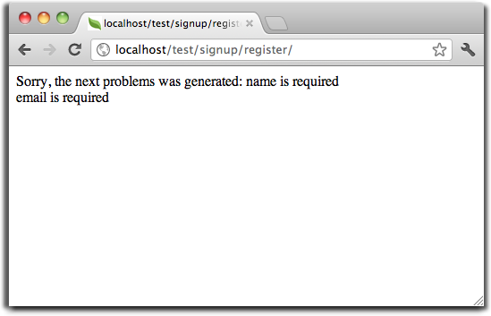

Tutorial 1: Nauczmy się przez przykład
==================================
W naszym pierwszym tutorialu, przeprowadzimy Cię przez  tworzenie aplikacji z prostym formularzem rejestracyjnym od podstaw. 
Wyjaśnimy również podstawowe aspekty działania frameworka. Jeżeli jesteś zainteresowany narzędziami do automatycznego generowania kodu, 
możesz sprawdzić nasze :doc:`developer tools <tools>`.

Sprawdzenie instalacji
--------------------------
Zakładamy że masz już zainstalowanego Phalcona. Sprawdź wynik funkcji phpinfo() w poszukiwaniu sekcji zawierającej "Phalcon" lub uruchom poniższy kod:

.. code-block:: php

    <?php print_r(get_loaded_extensions()); ?>

Rozszerzenie Phalcon powinno pojawić się jako część wyniku:

.. code-block:: php

    Array
    (
        [0] => Core
        [1] => libxml
        [2] => filter
        [3] => SPL
        [4] => standard
        [5] => phalcon
        [6] => pdo_mysql
    )

Tworzenie projektu
------------------
Najlepszym sposobem na skorzystanie z tego tutoriala jest jego śledzenie krok po kroku. Możesz uzyskać kompletny kod `tutaj  <https://github.com/phalcon/tutorial>`_.

Struktura plików
^^^^^^^^^^^^^^
Phalcon nie narzuca konkretnej struktury plików do tworzenia aplikacji. Ze względu na fakt, że jest ona dowolna, możesz zaimplementować aplikacje ze strukturą plików, która najbardziej Tobie odpowiada.

Na potrzeby tego tutoriala i jako punkt startowy, proponujemy następującą strukturę:

.. code-block:: php

    tutorial/
      app/
        controllers/
        models/
        views/
      public/
        css/
        img/
        js/

Zauważ, że nie potrzebujesz żadnych folderów "bibliotek" związanych z Phalconem. Framework jest dostępny w pamięci, gotowy do użycia.

Przyjazne URLe
^^^^^^^^^^^^^^
W tym tutorialu użyjemy ładnych (przyjaznych) URLi. Przyjazne URLe są lepsze dla SEO, jak również łatwe do zapamiętania dla użytkowników. Phalcon obsługuje moduły przepisywania dostarczone przez najbardziej popularne serwery WWW. 
Korzystanie przez Twoją aplikację z przyjaznych URLi nie jest obowiązkowe i możesz równie dobrze programować bez nich.

W tym przykładzie użyjemy modułu przepisywania dla Apache. Stwórzmy kilka reguł przepisywania w pliku /tutorial/.htaccess:

.. code-block:: apacheconf

    #/tutorial/.htaccess
    <IfModule mod_rewrite.c>
        RewriteEngine on
        RewriteRule  ^$ public/    [L]
        RewriteRule  ((?s).*) public/$1 [L]
    </IfModule>

Wszystkie żądania do projektu zostaną przepisane do folderu public/ czyniąc go głównym folderem. Ten etap zapewnia ukrycie wewnętrznych folderów projektu od widoku publicznego, eliminując różnego typu zagrożenia bezpieczeństwa.

Drugi zestaw reguł sprawdzi czy żądany plik istnieje i, jeśli istnieje, nie musi być przepisany przez moduł serwera:

.. code-block:: apacheconf

    #/tutorial/public/.htaccess
    <IfModule mod_rewrite.c>
        RewriteEngine On
        RewriteCond %{REQUEST_FILENAME} !-d
        RewriteCond %{REQUEST_FILENAME} !-f
        RewriteRule ^((?s).*)$ index.php?_url=/$1 [QSA,L]
    </IfModule>

Bootstrap
^^^^^^^^^
Pierwszym plikiem, który musisz stworzyć jest plik Bootstrap. Ten plik jest bardzo ważny; ponieważ służy jako baza Twojej aplikacji, dając Ci kontrolę nad wszystkimi jego aspektami. W tym pliku możesz zaimplementować inicjalizację komponentów, jak również zachowań aplikacji.

Plik tutorial/public/index.php powinien wyglądać następująco:

.. code-block:: php

    <?php

    try {

        //Register an autoloader
        $loader = new \Phalcon\Loader();
        $loader->registerDirs(array(
            '../app/controllers/',
            '../app/models/'
        ))->register();

        //Create a DI
        $di = new Phalcon\DI\FactoryDefault();

        //Setup the view component
        $di->set('view', function(){
            $view = new \Phalcon\Mvc\View();
            $view->setViewsDir('../app/views/');
            return $view;
        });
        
        //Setup a base URI so that all generated URIs include the "tutorial" folder
        $di->set('url', function(){
            $url = new \Phalcon\Mvc\Url();
            $url->setBaseUri('/tutorial/');
            return $url;
        });        

        //Handle the request
        $application = new \Phalcon\Mvc\Application($di);

        echo $application->handle()->getContent();

    } catch(\Phalcon\Exception $e) {
         echo "PhalconException: ", $e->getMessage();
    }

Autoloadery
^^^^^^^^^^^
Pierwszą częścią, którą znajdziemy w naszym pliku bootstrap jest rejestracja autoloadera. Autoloader ten będzie użyty do załadowania klas w aplikacji jako kontrolery i modele. Na przykład, możemy zarejestrować jeden lub więcej folderów kontrolerów, zwiększając elastyczność aplikacji. 
W naszym przykładzie użyliśmy komponentu Phalcon\\Loader.

Dzięki niemu, możemy załadować klasy z zastosowaniem różnych strategii, jednak w tym przykładzie zdecydowaliśmy się zlokalizować klasy w oparciu o predefiniowane katalogi:

.. code-block:: php

    <?php

    $loader = new \Phalcon\Loader();
    $loader->registerDirs(
        array(
            '../app/controllers/',
            '../app/models/'
        )
    )->register();

Zarządzanie zależnościami
^^^^^^^^^^^^^^^^^^^^^
Bardzo ważnym pojęciem, które musi być zrozumiane podczas pracy z Phalconem jest jego :doc:`dependency injection container <di>`. Może to brzmieć bardzo skomplikowanie, ale jest bardzo proste i praktyczne. 

A service container is a bag where we globally store the services that our application will use to function. Each time the framework requires a component, it will ask the container using an agreed upon name for the service. Since Phalcon is a highly decoupled framework, Phalcon\\DI acts as glue facilitating the integration of the different components achieving their work together in a transparent manner.

.. code-block:: php

    <?php

    //Stwórz DI
    $di = new Phalcon\DI\FactoryDefault();

:doc:`Phalcon\\DI\\FactoryDefault <../api/Phalcon\_DI_FactoryDefault>` is a variant of Phalcon\\DI. To make things easier, it has registered most of the components that come with Phalcon. Thus we should not register them one by one. Later there will be no problem in replacing a factory service.

In the next part, we register the "view" service indicating the directory where the framework will find the views files. As the views do not correspond to classes, they cannot be charged with an autoloader.

Services can be registered in several ways, but for our tutorial we'll use an `anonymous function`_:

.. code-block:: php

    <?php

    //Setup the view component
    $di->set('view', function(){
        $view = new \Phalcon\Mvc\View();
        $view->setViewsDir('../app/views/');
        return $view;
    });
    
Next we register a base URI so that all URIs generated by Phalcon include the "tutorial" folder we setup earlier. This will become important later on in this tutorial when we use the class :doc:`\Phalcon\\Tag <../api/Phalcon_Tag>` to generate a hyperlink. 

.. code-block:: php

    <?php

    //Setup a base URI so that all generated URIs include the "tutorial" folder
    $di->set('url', function(){
        $url = new \Phalcon\Mvc\Url();
        $url->setBaseUri('/tutorial/');
        return $url;
    });   

In the last part of this file, we find :doc:`Phalcon\\Mvc\\Application <../api/Phalcon_Mvc_Application>`. Its purpose is to initialize the request environment, route the incoming request, and then dispatch any discovered actions; it aggregates any responses and returns them when the process is complete.

.. code-block:: php

    <?php

    $application = new \Phalcon\Mvc\Application($di);

    echo $application->handle()->getContent();

As you can see, the bootstrap file is very short and we do not need to include any additional files. We have set ourselves a flexible MVC application in less than 30 lines of code.

Creating a Controller
^^^^^^^^^^^^^^^^^^^^^
By default Phalcon will look for a controller named "Index". It is the starting point when no controller or action has been passed in the request. The index controller (app/controllers/IndexController.php) looks like:

.. code-block:: php

    <?php

    class IndexController extends \Phalcon\Mvc\Controller
    {

        public function indexAction()
        {
            echo "<h1>Hello!</h1>";
        }

    }

The controller classes must have the suffix "Controller" and controller actions must have the suffix "Action". If you access the application from your browser, you should see something like this:

.. figure:: ../_static/img/tutorial-1.png
    :align: center

Congratulations, you're flying with Phalcon!

Sending output to a view
^^^^^^^^^^^^^^^^^^^^^^^^
Sending output to the screen from the controller is at times necessary but not desirable as most purists in the MVC community will attest. Everything must be passed to the view that is responsible for outputting data on screen. Phalcon will look for a view with the same name as the last executed action inside a directory named as the last executed controller. In our case (app/views/index/index.phtml):

.. code-block:: php

    <?php echo "<h1>Hello!</h1>";

Our controller (app/controllers/IndexController.php) now has an empty action definition:

.. code-block:: php

    <?php

    class IndexController extends \Phalcon\Mvc\Controller
    {

        public function indexAction()
        {

        }

    }

The browser output should remain the same. The :doc:`Phalcon\\Mvc\\View <../api/Phalcon_Mvc_View>` static component is automatically created when the action execution has ended. Learn more about :doc:`views usage here <views>` .

Designing a sign up form
^^^^^^^^^^^^^^^^^^^^^^^^
Now we will change the index.phtml view file, to add a link to a new controller named "signup". The goal is to allow users to sign up within our application.

.. code-block:: php

    <?php

    echo "<h1>Hello!</h1>";

    echo Phalcon\Tag::linkTo("signup", "Sign Up Here!");

The generated HTML code displays an anchor ("a") HTML tag linking to a new controller:

.. code-block:: html

    <h1>Hello!</h1> <a href="/tutorial/signup">Sign Up Here!</a>

To generate the tag we use the class :doc:`\Phalcon\\Tag <../api/Phalcon_Tag>`. This is a utility class that allows us to build HTML tags with framework conventions in mind. A more detailed article regarding HTML generation can be :doc:`found here <tags>`

.. figure:: ../_static/img/tutorial-2.png
    :align: center

Here is the Signup controller (app/controllers/SignupController.php):

.. code-block:: php

    <?php

    class SignupController extends \Phalcon\Mvc\Controller
    {

        public function indexAction()
        {

        }

    }

The empty index action gives the clean pass to a view with the form definition (app/views/signup/index.phtml):

.. code-block:: html+php

    <?php use Phalcon\Tag; ?>

    <h2>Sign up using this form</h2>

    <?php echo Tag::form("signup/register"); ?>

     

        <label for="name">Name</label>
        <?php echo Tag::textField("name") ?>
     

     

        <label for="email">E-Mail</label>
        <?php echo Tag::textField("email") ?>
     

     

        <?php echo Tag::submitButton("Register") ?>
     

    </form>

Viewing the form in your browser will show something like this:

.. figure:: ../_static/img/tutorial-3.png
    :align: center

:doc:`Phalcon\\Tag <../api/Phalcon_Tag>` also provides useful methods to build form elements.

The Phalcon\\Tag::form method receives only one parameter for instance, a relative URI to a controller/action in the application.

By clicking the "Send" button, you will notice an exception thrown from the framework, indicating that we are missing the "register" action in the controller "signup". Our public/index.php file throws this exception:

    PhalconException: Action "register" was not found on controller "signup"

Implementing that method will remove the exception:

.. code-block:: php

    <?php

    class SignupController extends \Phalcon\Mvc\Controller
    {

        public function indexAction()
        {

        }

        public function registerAction()
        {

        }

    }

If you click the "Send" button again, you will see a blank page. The name and email input provided by the user should be stored in a database. According to MVC guidelines, database interactions must be done through models so as to ensure clean object-oriented code.

Creating a Model
^^^^^^^^^^^^^^^^
Phalcon brings the first ORM for PHP entirely written in C-language. Instead of increasing the complexity of development, it simplifies it.

Before creating our first model, we need to create a database table outside of Phalcon to map it to. A simple table to store registered users can be defined like this:

.. code-block:: sql

    CREATE TABLE `users` (
      `id` int(10) unsigned NOT NULL AUTO_INCREMENT,
      `name` varchar(70) NOT NULL,
      `email` varchar(70) NOT NULL,
      PRIMARY KEY (`id`)
    );

A model should be located in the app/models directory (app/models/Users.php). The model maps to the "users" table:

.. code-block:: php

    <?php

    class Users extends \Phalcon\Mvc\Model
    {

    }

Setting a Database Connection
^^^^^^^^^^^^^^^^^^^^^^^^^^^^^
In order to be able to use a database connection and subsequently access data through our models, we need to specify it in our bootstrap process. A database connection is just another service that our application has that can be used for several components:

.. code-block:: php

    <?php

    try {

        //Register an autoloader
        $loader = new \Phalcon\Loader();
        $loader->registerDirs(array(
            '../app/controllers/',
            '../app/models/'
        ))->register();

        //Create a DI
        $di = new Phalcon\DI\FactoryDefault();

        //Setup the database service
        $di->set('db', function(){
            return new \Phalcon\Db\Adapter\Pdo\Mysql(array(
                "host" => "localhost",
                "username" => "root",
                "password" => "secret",
                "dbname" => "test_db"
            ));
        });

        //Setup the view component
        $di->set('view', function(){
            $view = new \Phalcon\Mvc\View();
            $view->setViewsDir('../app/views/');
            return $view;
        });
        
        //Setup a base URI so that all generated URIs include the "tutorial" folder
        $di->set('url', function(){
            $url = new \Phalcon\Mvc\Url();
            $url->setBaseUri('/tutorial/');
            return $url;
        });       

        //Handle the request
        $application = new \Phalcon\Mvc\Application($di);

        echo $application->handle()->getContent();

    } catch(Exception $e) {
         echo "PhalconException: ", $e->getMessage();
    }

With the correct database parameters, our models are ready to work and interact with the rest of the application.

Storing data using models
^^^^^^^^^^^^^^^^^^^^^^^^^
Receiving data from the form and storing them in the table is the next step.

.. code-block:: php

    <?php

    class SignupController extends \Phalcon\Mvc\Controller
    {

        public function indexAction()
        {

        }

        public function registerAction()
        {

            $user = new Users();

            //Store and check for errors
            $success = $user->save($this->request->getPost(), array('name', 'email'));

            if ($success) {
                echo "Thanks for registering!";
            } else {
                echo "Sorry, the following problems were generated: ";
                foreach ($user->getMessages() as $message) {
                    echo $message->getMessage(), " ";
                }
            }
            
            $this->view->disable();
        }

    }

We then instantiate the Users class, which corresponds to a User record. The class public properties map to the fields
of the record in the users table. Setting the relevant values in the new record and calling save() will store the data in the database for that record. The save() method returns a boolean value which indicates whether the storing of the data was successful or not.

The ORM automatically escapes the input preventing SQL injections so we only need to pass the request to the save method.

Additional validation happens automatically on fields that are defined as not null (required). If we don't enter any of the required fields in the sign up form our screen will look like this:

Conclusion
----------
This is a very simple tutorial and as you can see, it's easy to start building an application using Phalcon.
The fact that Phalcon is an extension on your web server has not interfered with the ease of development or
features available. We invite you to continue reading the manual so that you can discover additional features offered by Phalcon!

Sample Applications
-------------------
The following Phalcon-powered applications are also available, providing more complete examples:

* `INVO application`_: Invoice generation application. Allows for management of products, companies, product types. etc.
* `PHP Alternative website`_: Multilingual and advanced routing application
* `Album O'Rama`_: A showcase of music albums, handling big sets of data with :doc:`PHQL <phql>` and using :doc:`Volt <volt>` as template engine
* `Phosphorum`_: A simple and clean forum

.. _anonymous function: http://php.net/manual/en/functions.anonymous.php
.. _INVO application: http://blog.phalconphp.com/post/20928554661/invo-a-sample-application
.. _PHP Alternative website: http://blog.phalconphp.com/post/24622423072/sample-application-php-alternative-site
.. _Album O'Rama: http://blog.phalconphp.com/post/37515965262/sample-application-album-orama
.. _Phosphorum: http://blog.phalconphp.com/post/41461000213/phosphorum-the-phalcons-forum
