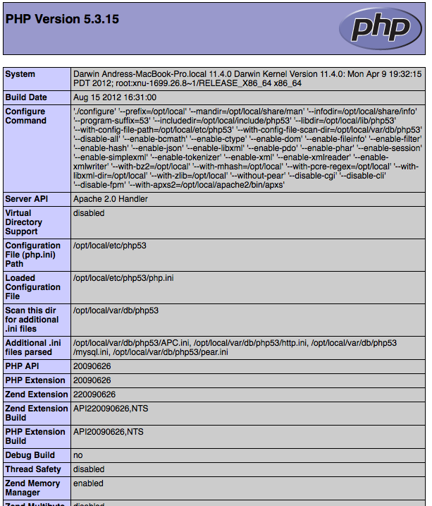

Benchmarks dos Frameworks 
====================
No passado, desempenho não era considerado uma das principais prioridades para o desenvolvimento de aplicações web. Hardware Razoáveis eram capazes de compensar a falta de desempenho das aplicações. Entretanto quando o Google decidiu_ levar em conta a velocidade dos sites nos rankings de pesquisas, desempenho tornou-se uma das principais prioridades juntamente com a funcionalidade. Essa é mais uma maneira em que a melhoria do desempenho terá um impacto positivo em um web site. 

Os benchmarks abaixo, mostram como o Phalcon é eficiente em relação aos outros tradicionais frameworks escritos em PHP. Esses benchmarks são atualizados de acordo com o lançamento das versões estáveis de cada um dos frameworks mencionados em comparação com as versões estáveis do Phalcon.

Nós encorajamos programadores copiarem nossas suítes de teste que utilizamos para nossos benchmarks. Caso você tenha qualquer otimizações adicionais ou comentários, por favor `contacte nos`_. `Verifique nossas fontes no Github`_ 

Qual foi o ambiente de teste utilizado?
------------------------------
O chace alternativo do PHP (APC_) foi ativado para todos os frameworks. O modulo  rewrite do Apache foi desativado, sempre que possível, para evitar potencial adição de overheads.

O hardware do ambiente de teste foi o seguinte:

* Sistema Operacional: Mac OS X Lion 10.7.4
* Web Server: Apache httpd 2.2.22
* PHP: 5.3.15
* CPU: 2.04 Ghz Intel Core i5
* Memória Principal: 4GB 1333 MHz DDR3
* Disco Rígido: 500GB SATA Disk

*Versão do PHP e info:*

*Configuração do APC:*

.. figure:: ../_static/img/bench-5.png
    :align: center

Listas dos Benchmarks
------------------
.. toctree::
   :maxdepth: 1

   benchmark/hello-world
   benchmark/micro

ChangeLog
---------
.. versionadded:: 1.0
    Update Mar-20-2012: Benchmarks redone changing the apc.stat setting to Off. More Info

.. versionchanged:: 1.1
    Update May-13-2012: Benchmarks redone PHP plain templating engine instead of Twig for Symfony. Configuration settings for Yii were also changed as recommended.

.. versionchanged:: 1.2
    Update May-20-2012: Fuel framework was added to benchmarks.

.. versionchanged:: 1.3
    Update Jun-4-2012: Cake framework was added to benchmarks. It is not however present in the graphics, since it takes  30 seconds to run only 10 of 1000.

.. versionchanged:: 1.4
    Update Ago-27-2012: PHP updated to 5.3.15, APC updated to 3.1.11, Yii updated to 1.1.12, Phalcon updated to 0.5.0, Added Laravel, OS updated to Mac OS X Lion. Hardware upgraded.

Recursos Adicionais
------------------
* `For Impatient Web Users, an Eye Blink Is Just Too Long to Wait <http://www.nytimes.com/2012/03/01/technology/impatient-web-users-flee-slow-loading-sites.html?pagewanted=all&_r=0>`_
* `Millionaires performance cases: Impact of performance <https://github.com/zenorocha/browser-diet/wiki/Impact-of-performance>`_
* `How fast are we going now? <http://www.stevesouders.com/blog/2013/05/09/how-fast-are-we-going-now/>`_
* `Speed, performance and human perception` <http://chimera.labs.oreilly.com/books/1230000000545/ch10.html#SPEED_PERFORMANCE_HUMAN_PERCEPTION>`_

.. _decided: http://googlewebmastercentral.blogspot.com/2010/04/using-site-speed-in-web-search-ranking.html
.. _contacte nos: https://github.com/phalcon/framework-bench
.. _Verifique nossas fontes no Github: https://github.com/phalcon/framework-bench
.. _APC: http://php.net/manual/en/book.apc.php
