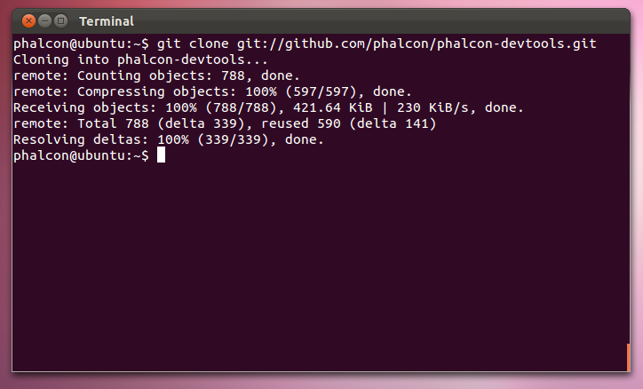
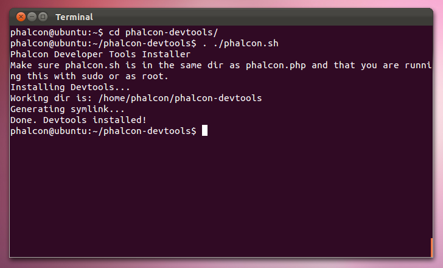

Ferramentas Phalcon Developer em Linux
======================================

Esses passos irá guiá-lo através do processo de instalação de Ferramentas Phalcon Developer para Linux.

Pré-requisitos
--------------
A extensão Phalcon PHP é necessário para executar Phalcon Tools. Se você não tiver instalado ainda, por favor consulte o :doc:`Intalação <install>` para obter instruções.

Download
--------
Você pode baixar um pacote de plataforma que contém as ferramentas de desenvolvedor da seção de Download_. Também você pode cloná-lo a partir de Github_.

Abra um terminal e digite os comando abaixo:

.. code-block:: bash

    git clone git://github.com/phalcon/phalcon-devtools.git

Em seguida, digite a pasta onde as ferramentas foram clonados e execute ". ./phalcon.sh", (não se esqueça do ponto no início do comando):

.. code-block:: bash

    cd phalcon-devtools/

    . ./phalcon.sh

Criar uma referência simbólica para o script phalcon.php:

.. code-block:: bash

    ln -s ~/phalcon-devtools/phalcon.php /usr/bin/phalcon

    chmod ugo+x /usr/bin/phalcon

Parabéns, você agora tem Phalcon tools instalado!

Guias relacionados
^^^^^^^^^^^^^^^^^^
* :doc:`Usando Ferramentas de Desenvolvimento <tools>`
* :doc:`Instalação no Windows <wintools>`
* :doc:`Instalação on Mac <mactools>`

.. _Download: http://phalconphp.com/download
.. _Github: https://github.com/phalcon/phalcon-devtools
