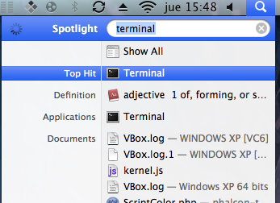

Phalcon Developer Tools no Mac OS X
===================================

Estas medidas irão guiá-lo através do processo de instalação da Phalcon Developer Tools para OS/X.

Pré-requisitos
--------------
A extensão Phalcon PHP é necessário para executar Phalcon Tools. Se você ainda não tiver instalado, por favor consulte o: doc:`Instalação <install>` seção para obter instruções.

Download
--------
Você pode baixar um pacote da plataforma que contém as ferramentas de desenvolvimento a partir da seção Download_ . Também você pode cloná-lo do Github_.

Abra o aplicativo de terminal:

Copie e cole os comandos abaixo em seu terminal:

.. code-block:: bash

    git clone git://github.com/phalcon/phalcon-devtools.git

Em seguida, digite a pasta onde as ferramentas foram clonadas e execute ". ./phalcon.sh", (não se esqueça do ponto no início do comando):

.. code-block:: bash

    cd phalcon-devtools/

    . ./phalcon.sh

Na janela do terminal, digite os seguintes comandos para criar um link simbólico para o script phalcon.php:

.. code-block:: bash

    ln -s ~/phalcon-tools/phalcon.php ~/phalcon-tools/phalcon

    chmod +x ~/phalcon-tools/phalcon

Digite o comando "phalcon" e você verá algo como isto:

.. figure:: ../_static/img/mac-5.png
   :align: center

Parabéns, agora você tem instalado a Phalcon tools!

Guias Relacionados
^^^^^^^^^^^^^^^^^^
* :doc:`Using Developer Tools <tools>`
* :doc:`Installation on Windows <wintools>`
* :doc:`Installation on Linux <linuxtools>`

.. _Download: http://phalconphp.com/download
.. _Github: https://github.com/phalcon/phalcon-devtools
