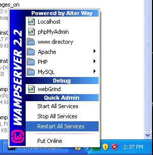

Installation on WAMP
=====================
WampServer_ é um ambiente de desenvolvimento web do Windows. Ele permite a você criar aplicações web utilizando Apache2, PHP e MySQL. Abaixo existem instruções detalhadas de como instalar o Phalcon no WampServer para Windows. É altamente recomendado o uso da versão mais atualizada do WampServer.

Baixe a versão correta do Phalcon
-------------------------------------
o WAMP tem ambas versões, 32 e 64 bit. Na seção de download, você pode selecionar o Phalcon para Windows de acordo com sua arquitetura desejada.

Após realizar o download da biblioteca Phalcon, você terá um arquivo zip como o mostrado abaixo:
After download the Phalcon library you will have a zip file like the one shown below:

.. figure:: ../_static/img/xampp-1.png
    :align: center

Extraia a biblioteca do arquivo para obter a DLL Phalcon:
Extract the library from the archive to get the Phalcon DLL:

.. figure:: ../_static/img/xampp-2.png
    :align: center

Copie o arquivo php_phalcon.dll para as extensões do PHP.
Se o WAMPP está instalado na pasta c:\\wamp, a extensão precisa estar em C:\\wamp\\bin\\php\\php5.3.10\\ext

Copy the file php_phalcon.dll to the PHP extensions. 
If WAMP is installed in the c:\\wamp folder, the extension needs to be in C:\\wamp\\bin\\php\\php5.3.10\\ext

.. figure:: ../_static/img/wamp-1.png
    :align: center

Edite o arquivo php.ini, ele está localizado em C:\\wamp\\bin\\php\\php5.3.10\\php.ini.
Ele pode ser editado com o Notepad (Bloco de notas) ou outro programa similar.
Nós recomendamos o Notepad++ para evitar problemas com os finais das linhas.
Acrescente ao final do arquivo: extension=php_phalcon.dll e salve-o.

Edit the php.ini file, it is located at C:\\wamp\\bin\\php\\php5.3.10\\php.ini. 
It can be edited with Notepad or a similar program. We recommend Notepad++ to avoid issues with line endings. 
Append at the end of the file: extension=php_phalcon.dll and save it.

.. figure:: ../_static/img/wamp-2.png
    :align: center

Também edite outro arquivo php.ini, que está localizado em C:\\wamp\\bin\\apache\\Apache2.2.21\\bin\\php.ini.
Acrescente ao final do arquivo: extension=php_phalcon.dll e salve-o.

Also edit another php.ini file, which is located at C:\\wamp\\bin\\apache\\Apache2.2.21\\bin\\php.ini. 
Append at the end of the file: extension=php_phalcon.dll and save it.

Restart the Apache Web Server. Do a single click on the WampServer icon at system tray. Choose "Restart All Services" from the pop-up menu. Check out that tray icon will become green again.

Open your browser to navigate to http://localhost. The WAMP welcome page will appear. Look at the section "extensions loaded" to check if phalcon was loaded.

.. figure:: ../_static/img/wamp-4.png
    :align: center

Congrats!, You are now flying with Phalcon.

Related Guides
--------------
* :doc:`General Installation </reference/install>`
* :doc:`Detailed Installation on XAMPP for Windows </reference/xampp>`

.. _WampServer: http://www.wampserver.com/en/
