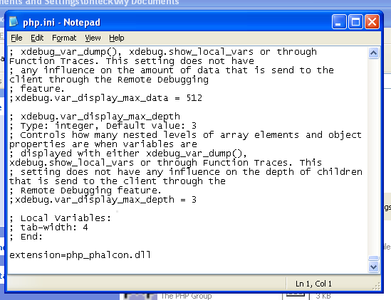

Instalação no XAMPP
===================

XAMPP_ é uma distribuição Apache fácil de instalar contendo MySQL, PHP e Perl. Uma vez feito o download do XAMPP, tudo que você precisa fazer é extrair-lo e começar a usa-lo. Abaixo existem instruções detalhadas de como instalar o Phalcon no XAMPP para o Windows. É fortemente recomendável utilizar a última versão do XAMPP.

Download da versão certa do Phalcon
-----------------------------------
XAMPP sempre é lançado para versões 32 bit do Apache e do PHP. Você precisará fazer o download da versão x86 do Phalcon para o Windows, na seção de download.

Após o download da biblioteca do Phalcon, você terá um arquivo zip como o da figura abaixo:

.. figure:: ../_static/img/xampp-1.png
    :align: center

Extraia a biblioteca DLL do phalcon do arquivo zip:

.. figure:: ../_static/img/xampp-2.png
    :align: center

Copie o arquivo php_phalcon.dll para o diretório de extensões do PHP. Se você tiver o XAMPP instalado no C:\\xampp, a extensão precisa estar no C:\\xampp\\php\\ext.

.. figure:: ../_static/img/xampp-3.png
    :align: center

Edite o arquivo php.ini localizado no diretório C:\\xampp\\php\\php.ini. Esse arquivo pode ser editado com o Notepad ou outro programa similar. Nós recomendamos o Notepad++ para evitar problemas com caracteres de controle de final de linha. Acrescente no final do arquivo a seguinte instrução: extension=php_phalcon.dll e salve-o.

Reinicie o servidor web Apache diretamente do Centro de Controle do XAMPP. Desta forma irá carregar as novas configurações do PHP (a nova extensão instalada).

.. figure:: ../_static/img/xampp-5.png
    :align: center

Abra o browser e navegue até o endereço http://localhost. A pagina de boas vindas do XAMPP será mostrada. Clique no link phpinfo().

.. figure:: ../_static/img/xampp-6.png
    :align: center

phpinfo() ira mostrar na tela um numero significante de informações a respeito do estado atual do PHP. Role a tela para baixo, verificando se a extensão do phalcon foi carregada corretamente.

.. figure:: ../_static/img/xampp-7.png
    :align: center

Se você conseguir ver o phalcon na saída do phpinfo(), parabéns! Agora você esta voando com o Phalcon.

Screencast
----------
O seguinte screencast é um guia passo-a-passo para instalação do Phalcon no Windows:

.. raw:: html

   
<iframe src="https://player.vimeo.com/video/40265988" width="500" height="266" frameborder="0" webkitAllowFullScreen mozallowfullscreen allowFullScreen></iframe>

Guias Relacionados
------------------
* :doc:`Instalação Geral </reference/install>`
* :doc:`Instalação Detalhada do WAMP para Windows </reference/wamp>`

.. _XAMPP: https://www.apachefriends.org/pt_br/download.html
