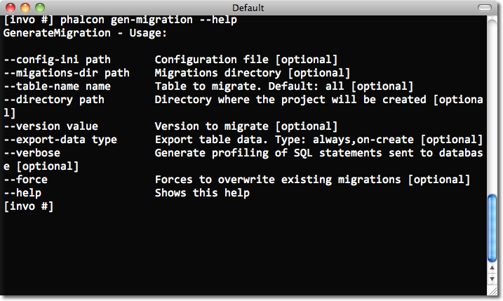

Миграции базы данных
====================
Миграции это удобный для вас способ, структурировано и организовано изменять ваши базы данных.

.. highlights::
    **Важно:** Миграции доступны через :doc:`Phalcon Developer Tools <tools>`.
    Вам потребуется Phalcon версии не ниже 0.5.0для использования инструментов разработчика.
    Также рекомендуется использовать PHP версии 5.3.11 или более поздней версии.

Часто при разработке необходимо вносить изменения на production окружении. Некоторые из этих изменений могут касаться
изменений в базе данных: новые столбцы, новые таблицы, удаление индексов и т.д.

При миграции создается набор классов, чтобы описать, как ваша база данных структурирована в данный момент. Эти классы
могут использоваться для синхронизации структуры схемы в удаленных базах данных и подготовки вашей базы данных к работе
с новыми изменениями, которые реализует ваше приложение. Миграции описывают эти изменения с использованием простого PHP.

.. raw:: html

    

        <iframe src="http://player.vimeo.com/video/41381817" width="500" height="281" frameborder="0" webkitAllowFullScreen mozallowfullscreen allowFullScreen></iframe>
    

Дампинг схемы
-------------
:doc:`Phalcon Developer Tools <tools>` предоставляет скрипт для управления миграциями (генерация, запуск и откат).

Доступные опции для генерации миграций:

Запуск скрипта без параметров делает простой дамп каждого объекта (таблиц и представлений) из базы данных в классы
миграции.

Каждая миграция имеет идентификатор версии связанный с ним. Номер версии позволяет нам определить, является ли миграция
старше или новее текущей версии нашей базы данных. Версии также сообщают Phalcon о рабочем состоянии при выполнении
миграции.

.. figure:: ../_static/img/migrations-2.png
   :align: center

При генерации миграций, инструкции отображаются в консоли для описания различных этапов миграции и времени выполнения
этих операторов. В конце концов, версия миграция будет создана.

По умолчанию :doc:`Phalcon Developer Tools <tools>` использует директорию *app/migrations* для дампа файлов миграции.
Вы можете изменить расположение, установив один из параметров по генерации скрипта. Каждая таблица в базе данных имеет
свой соответствующий класс, созданный в отдельном файле директории, ссылающейся на ее версию.

.. figure:: ../_static/img/migrations-3.png
   :align: center

Структура класса Migration
--------------------------
Каждый файл содержит уникальный класс, который расширяет Phalcon\Mvc\Model\Migration. Эти классы обычно имеют два
метода: up() и down(). Up() выполняет миграцию, а down() откатывает ее.

Метод Up() также содержит магический метод morphTable(). Магия начинается тогда, когда он распознает изменения,
требующие синхронизации фактической таблицы в базе данных, приведенные выше.

.. code-block:: php

    <?php

    use Phalcon\Db\Column as Column;
    use Phalcon\Db\Index as Index;
    use Phalcon\Db\Reference as Reference;

    class ProductsMigration_100 extends \Phalcon\Mvc\Model\Migration
    {

        public function up()
        {
            $this->morphTable(
                "products",
                array(
                    "columns" => array(
                        new Column(
                            "id",
                            array(
                                "type"          => Column::TYPE_INTEGER,
                                "size"          => 10,
                                "unsigned"      => true,
                                "notNull"       => true,
                                "autoIncrement" => true,
                                "first"         => true,
                            )
                        ),
                        new Column(
                            "product_types_id",
                            array(
                                "type"     => Column::TYPE_INTEGER,
                                "size"     => 10,
                                "unsigned" => true,
                                "notNull"  => true,
                                "after"    => "id",
                            )
                        ),
                        new Column(
                            "name",
                            array(
                                "type"    => Column::TYPE_VARCHAR,
                                "size"    => 70,
                                "notNull" => true,
                                "after"   => "product_types_id",
                            )
                        ),
                        new Column(
                            "price",
                            array(
                                "type"    => Column::TYPE_DECIMAL,
                                "size"    => 16,
                                "scale"   => 2,
                                "notNull" => true,
                                "after"   => "name",
                            )
                        ),
                    ),
                    "indexes" => array(
                        new Index(
                            "PRIMARY",
                            array("id")
                        ),
                        new Index(
                            "product_types_id",
                            array("product_types_id")
                        )
                    ),
                    "references" => array(
                        new Reference(
                            "products_ibfk_1",
                            array(
                                "referencedSchema"  => "invo",
                                "referencedTable"   => "product_types",
                                "columns"           => array("product_types_id"),
                                "referencedColumns" => array("id"),
                            )
                        )
                    ),
                    "options" => array(
                        "TABLE_TYPE"      => "BASE TABLE",
                        "ENGINE"          => "InnoDB",
                        "TABLE_COLLATION" => "utf8_general_ci",
                    )
                )
            );
        }

    }

Класс называется "ProductsMigration_100". Suffix 100 указывает на версию 1.0.0. morphTable() принимает ассоциативный
массив с 4 возможными типами данных:

+--------------+---------------------------------------------------------------------------------------------------------------------------------------------+----------+
| Индекс       | Описание                                                                                                                                    | Optional |
+==============+=============================================================================================================================================+==========+
| "columns"    | Массив с набором столбцов таблицы.                                                                                                          | No       |
+--------------+---------------------------------------------------------------------------------------------------------------------------------------------+----------+
| "indexes"    | Массив с набором индексов таблицы.                                                                                                          | Yes      |
+--------------+---------------------------------------------------------------------------------------------------------------------------------------------+----------+
| "references" | Массив с набором ссылок на таблицы (внешние ключи).                                                                                         | Yes      |
+--------------+---------------------------------------------------------------------------------------------------------------------------------------------+----------+
| "options"    | Массив с набором опций для создания таблицы. Эти опции зачастую связаны с системой базы данных, в которой миграция был сгенерирована.       | Yes      |
+--------------+---------------------------------------------------------------------------------------------------------------------------------------------+----------+

Определение столбцов
^^^^^^^^^^^^^^^^^^^^

:doc:`Phalcon\\Db\\Column <../api/Phalcon_Db_Column>` используется для определения столбцов таблицы. it encapsulates column related features. Его конструктор принимает в качестве первого параметра имя столбца и массив, описывающий колонки. Доступны следующие опции при описании столбцов:

+-----------------+--------------------------------------------------------------------------------------------------------------------------------------------+----------+
| Опция           | Описание                                                                                                                                   | Optional |
+=================+============================================================================================================================================+==========+
| "type"          | Тип столбца. :doc:`Phalcon_Db_Column <../api/Phalcon_Db_Column>` должен быть константой (смотрите ниже)                                    | No       |
+-----------------+--------------------------------------------------------------------------------------------------------------------------------------------+----------+
| "size"          | Некоторые типы столбцов, как VARCHAR или INTEGER  могут иметь определенный размер                                                          | Yes      |
+-----------------+--------------------------------------------------------------------------------------------------------------------------------------------+----------+
| "scale"         | Столбцы DECIMAL или NUMBER могут иметь разрешение точности, чтобы указать до какого десятичного знака необходимо хранить значение.         | Yes      |
+-----------------+--------------------------------------------------------------------------------------------------------------------------------------------+----------+
| "unsigned"      | INTEGER столбцы могут быть знаковыми или беззнаковыми. Эта опция не распространяется на другие типы столбцов                               | Yes      |
+-----------------+--------------------------------------------------------------------------------------------------------------------------------------------+----------+
| "notNull"       | Столбец может хранить нулевые значения?                                                                                                    | Yes      |
+-----------------+--------------------------------------------------------------------------------------------------------------------------------------------+----------+
| "autoIncrement" | С помощью этого атрибута столбец заполняется автоматически с автоинкрементным целым. Только один столбец в таблице может иметь этот атрибут| Yes      |
+-----------------+--------------------------------------------------------------------------------------------------------------------------------------------+----------+
| "first"         | Столбец должны быть расположены на первые позиции в порядке столбцов                                                                       | Yes      |
+-----------------+--------------------------------------------------------------------------------------------------------------------------------------------+----------+
| "after"         | Колонка должна быть помещена после указанного столбца                                                                                      | Yes      |
+-----------------+--------------------------------------------------------------------------------------------------------------------------------------------+----------+

Миграции базы данных поддерживают следующие типы столбцов базы данных:

* Phalcon\\Db\\Column::TYPE_INTEGER
* Phalcon\\Db\\Column::TYPE_DATE
* Phalcon\\Db\\Column::TYPE_VARCHAR
* Phalcon\\Db\\Column::TYPE_DECIMAL
* Phalcon\\Db\\Column::TYPE_DATETIME
* Phalcon\\Db\\Column::TYPE_CHAR
* Phalcon\\Db\\Column::TYPE_TEXT

Определение индексов
^^^^^^^^^^^^^^^^^^^^
:doc:`Phalcon\\Db\\Index <../api/Phalcon_Db_Index>` определяет индексы таблицы. Для создания индекса требуется
определить его имя и список столбцов. Заметим, что если любой индекс имеет название PRIMARY, то Phalcon создаст
индекс первичного ключа в этой таблице.

Определение внешних ключей
^^^^^^^^^^^^^^^^^^^^^^^^^^
:doc:`Phalcon\\Db\\Reference <../api/Phalcon_Db_Reference>` определяет ссылки на таблицы (также называемые внешними
ключами). Следующие опции могут быть использованы для определения внешних ключей:

+---------------------+-----------------------------------------------------------------------------------------------------------------+----------+
| Индекс              | Описание                                                                                                        | Optional |
+=====================+=================================================================================================================+==========+
| "referencedTable"   | It's auto-descriptive. Содержит имя ссылочной таблицы.                                                          | No       |
+---------------------+-----------------------------------------------------------------------------------------------------------------+----------+
| "columns"           | Массив с названием столбцов в таблице, которые имеют ссылки.                                                    | No       |
+---------------------+-----------------------------------------------------------------------------------------------------------------+----------+
| "referencedColumns" | Массив с именем столбцов в указанной таблице.                                                                   | No       |
+---------------------+-----------------------------------------------------------------------------------------------------------------+----------+
| "referencedTable"   | Ссылочной таблицы, может быть, находится в другой схеме или базе данных. Эта опция позволяет вам определить это.| Yes      |
+---------------------+-----------------------------------------------------------------------------------------------------------------+----------+

Запись миграций
---------------

Миграции не только предназначены для "морфинга" таблицы. Миграция является обычным классом PHP, так что вы не ограничены
этими функциями. Например, после добавления столбца можно написать код для установки значений этого столбца для
существующих записей. Для более подробной информации и примеров отдельных методов,
проверьте :doc:`database component <db>`.

.. code-block:: php

    <?php

    class ProductsMigration_100 extends \Phalcon\Mvc\Model\Migration
    {

        public function up()
        {
            //...
            self::$_connection->insert(
                "products",
                array("Malabar spinach", 14.50),
                array("name", "price")
            );
        }

    }

Запуск миграций
---------------
Как только сгенерированные миграции, загруженных на целевой сервер, вы можете легко запустить их, как показано в
следующем примере:

.. figure:: ../_static/img/migrations-4.png
   :align: center

.. figure:: ../_static/img/migrations-5.png
   :align: center

В зависимости от того, насколько сильно устаревшей является база данных по миграции, Phalcon может запускать несколько
версий миграции в одном процессе миграции. Если указать целевую версию, Phalcon будет запускать нужные миграций пока не
достигнет указанной версии.
