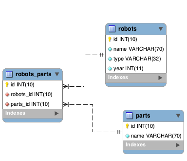

Работа с Моделями
=================
Модель представляет собой информацию (данные) приложения и правила для манипуляции этими данными. Модели в основном используются для управления правилами
взаимодействия с соответствующими таблицами базы данных. В большинстве случаев, каждая таблица в вашей базе данных соответствует одной модели в вашем приложении.
Большая часть всей бизнес-логики вашего приложения будет сосредоточена в моделях.

:doc:`Phalcon\\Mvc\\Model <../api/Phalcon_Mvc_Model>` является родительским классом. Когда процесс выполняет несколько операций для всех моделей в вашем приложении Phalcon. Он обеспечивает независимость данных
от вашей базы, основные CRUD операции, расширенные поисковые возможности, а также возможность построения зависимостей между моделями.
:doc:`Phalcon\\Mvc\\Model <../api/Phalcon_Mvc_Model>` исключает необходимость использования SQL запросов, потому как данный класс динамически переводит методы на соответствующие им операции СУБД.

.. highlights::

    Модели предназначены для работы с базой данных на высшем уровне абстракции. Если вы испытваете потребность в работе с базой данных на низшем уровне, обратитесь к документации
    компонента :doc:`Phalcon\\Db <../api/Phalcon_Db>`.

Создание Модели
---------------
Модель это класс, который расширяет :doc:`Phalcon\\Mvc\\Model <../api/Phalcon_Mvc_Model>`. Файл с моделью должен быть помещен в директорию models.
Файл должен содержать только один класс; его имя должно быть записано в CamelCase стиле.

.. code-block:: php

    <?php

    class Robots extends \Phalcon\Mvc\Model
    {

    }

Пример выше демонстрирует реализацию модели "Robots". Обратите внимание, что класс Robots наследуется от :doc:`Phalcon\\Mvc\\Model <../api/Phalcon_Mvc_Model>`.
Данный компонент предоставляет большой набор функционала для модели, которая наследует его, включая основные операции CRUD (Create, Read, Update, Delete),
валидацию данных, а также поддержку усложненного поиска и возможность связывать несколько моделей друг с другом.

.. highlights::

    Если вы используете PHP 5.4/5.5 рекомендовано объявлять каждый столбец базы данных, который входит в модель в целях экономии памяти и
    уменьшения общего выделения памяти на выполнение.

По умолчанию модель "Robots" будет ссылаться на таблицу 'robots'. Если вы захотите вручную указать другое имя для маппинга таблицы,
вы можете использовать метод getSource():

.. code-block:: php

    <?php

    class Robots extends \Phalcon\Mvc\Model
    {

        public function getSource()
        {
            return "the_robots";
        }

    }

Теперь модель Robots маппирует (использует) таблицу "the_robots". Метод initialize() помогает в создании модели с пользовательским поведением, т.е. использовании другой таблицы.
Метод initialize() вызывает лишь однажды во время запроса.

.. code-block:: php

    <?php

    class Robots extends \Phalcon\Mvc\Model
    {

        public function initialize()
        {
            $this->setSource("the_robots");
        }

    }

Метод initialize() вызывается один раз при обработке запроса к приложению и предназначен для инициализации экземпляров модели в приложении.
Если вам необходимо произвести некоторые настройки экземпляра объекта после того, как он создан, вы можете использовать метод 'onConstruct':

.. code-block:: php

    <?php

    class Robots extends \Phalcon\Mvc\Model
    {

        public function onConstruct()
        {
            //...
        }

    }

Публичные свойства и Setters/Getters
^^^^^^^^^^^^^^^^^^^^^^^^^^^^^^^^^^^^
Модели могут быть реализованы с помощью свойств с общим доступом (public), при этом свойства модели доступны для чтения/изменения из любой части кода без ограничений:

.. code-block:: php

    <?php

    class Robots extends \Phalcon\Mvc\Model
    {
        public $id;

        public $name;

        public $price;
    }

При использовании getters и setters вы можете полностью контролировать видимость свойств, их обработку и, например, применять различную валидацию при сохранении объекта:

.. code-block:: php

    <?php

    class Robots extends \Phalcon\Mvc\Model
    {
        protected $id;

        protected $name;

        protected $price;

        public function getId()
        {
            return $this->id;
        }

        public function setName($name)
        {
            if (strlen($name) < 10) {
                throw new \InvalidArgumentException('Имя слишком короткое');
            }
            $this->name = $name;
        }

        public function getName()
        {
            return $this->name;
        }

        public function setPrice($price)
        {
            if ($price < 0) {
                throw new \InvalidArgumentException('Цена не может быть отрицательной');
            }
            $this->price = $price;
        }

        public function getPrice()
        {
            //Преобразование значение в double (формат числа с плавающей запятой), прежде чем использовать
            return (double) $this->price;
        }
    }

Публичные свойства облегчают создание кода. Напротив, применение getters/setters делает ваш код тестируемым, расширяемым и удобным в сопровождении. Разработчик вправе сам определить способ описания модели. ORM совместим с обоими способами.

.. highlights::
    Прим. переводчика :
    В то же время, использование getters/setters позволяет использовать некоторые преимущества такого способа.
    Например, если модель имеет связь один-ко-многим с другой моделью, при запросе связанной модели будет произведено N+1 запросов к базе данных. Напротив, при использовании getters/setters модель сделает только 2 запроса.

.. code-block:: php

    <?php

    class Robots extends \Phalcon\Mvc\Model
    {

        protected $id;

        protected $name;

        public function getId()
        {
            return $this->id;
        }

        public function setName($name)
        {
            if (strlen($name) < 10) {
                throw new \InvalidArgumentException('Имя слишком короткое');
            }
            $this->name = $name;
        }

        public function getName()
        {
            return $this->name;
        }

        public function initialize()
        {
            $this->hasMany("id", "RobotsParts", "robots_id");
        }

        /**
         * Возвращает "robots parts" одним запросом
         *
         * @return \RobotsParts[]
         */
        public function getRobotsParts($parameters=null)
        {
            return $this->getRelated('RobotsParts', $parameters);
        }

    }

Модели в Пространствах Имен
---------------------------
Вы можете использовать пространства имен, чтобы избежать конфликтов, связанных с именами классов. В этом случае, имя таблицы, из которой модель получает данные, соответствует имени класса (преобразуется в нижний регистр).

.. code-block:: php

    <?php

    namespace Store\Toys;

    class Robots extends \Phalcon\Mvc\Model
    {

    }

Понимание Записей В Объектах
----------------------------
Каждый экземпляр объекта модели представляет собой строку таблицы базы данных. Вы можете легко получить доступ к любой записи, считывая свойство объекта.
К примеру, для таблицы "robots" с записями:

.. code-block:: bash

    mysql> select * from robots;
    +----+------------+------------+------+
    | id | name       | type       | year |
    +----+------------+------------+------+
    |  1 | Robotina   | mechanical | 1972 |
    |  2 | Astro Boy  | mechanical | 1952 |
    |  3 | Terminator | cyborg     | 2029 |
    +----+------------+------------+------+
    3 строки в наборе (0,00 сек)

Вы можете найти определенную запись по ее первичному ключу и напечатать ее имя:

.. code-block:: php

    <?php

    // Найти запись с id = 3
    $robot = Robots::findFirst(3);

    // Печатать "Terminator"
    echo $robot->name;

Как только запись будет зарезервирована в памяти, мы можете производить изменения ее данных, а затем сохранить изменения.

.. code-block:: php

    <?php

    $robot = Robots::findFirst(3);
    $robot->name = "RoboCop";
    $robot->save();

Как вы можете видеть, нет никакой необходимости в использовании необработанных SQL запросов. :doc:`Phalcon\\Mvc\\Model <../api/Phalcon_Mvc_Model>`
предоставляет высший уровень абстракции базы данных для веб-приложений.

Поиск записей
-------------
:doc:`Phalcon\\Mvc\\Model <../api/Phalcon_Mvc_Model>` также предлагает несколько методов для выборки записей. В следующем примере мы покажем вам как запросить одну или несколько записей из модели:

.. code-block:: php

    <?php

    // Сколько роботов есть?
    $robots = Robots::find();
    echo "There are ", count($robots), "\n";

    // Сколько существует механических роботов?
    $robots = Robots::find("type = 'mechanical'");
    echo "There are ", count($robots), "\n";

    // Получить и распечатать виртуальных роботов упорядоченные по имени
    $robots = Robots::find(array(
        "type = 'virtual'",
        "order" => "name"
    ));
    foreach ($robots as $robot) {
        echo $robot->name, "\n";
    }

    // Получить первые 100 виртуальных роботов упорядоченных по имени
    $robots = Robots::find(array(
        "type = 'virtual'",
        "order" => "name",
        "limit" => 100
    ));
    foreach ($robots as $robot) {
       echo $robot->name, "\n";
    }

.. highlights::

    Для исключения SQL-инъекций при поиске записей на основе пользовательского ввода или переменных вы должны
    использовать привязку параметров (см. ниже).

Вы также можете использовать метод findFirst(), чтобы получить только первую запись для данного критерия:

.. code-block:: php

    <?php

    // Первый робот в таблице роботов
    $robot = Robots::findFirst();
    echo "The robot name is ", $robot->name, "\n";

    // Первый  механический робот в таблице роботов
    $robot = Robots::findFirst("type = 'mechanical'");
    echo "The first mechanical robot name is ", $robot->name, "\n";

    // Первый  виртуальный робот  упорядоченный по имени в таблице роботов
    $robot = Robots::findFirst(array("type = 'virtual'", "order" => "name"));
    echo "The first virtual robot name is ", $robot->name, "\n";

Оба метода find() и findFirst() принимают ассоциативный массив, определяющий критерии поиска:

.. code-block:: php

    <?php

    $robot = Robots::findFirst(array(
        "type = 'virtual'",
        "order" => "name DESC",
        "limit" => 30
    ));

    $robots = Robots::find(array(
        "conditions" => "type = ?1",
        "bind"       => array(1 => "virtual")
    ));

Доступные параметры запроса:

+-------------+----------------------------------------------------------------------------------------------------------------------------------------------------------------------------------------------------------------+-------------------------------------------------------------------------+
| Parameter   | Description                                                                                                                                                                                                    | Пример                                                                  |
+=============+================================================================================================================================================================================================================+=========================================================================+
| conditions  | Условие поиска. Он используется для выделения только тех записей, которые полностью удовлетворяют условиям поиска. По умолчанию Phalcon\\Mvc\\Model предполагает что первый параметр является условием поиска  | "conditions" => "name LIKE 'steve%'"                                    |
+-------------+----------------------------------------------------------------------------------------------------------------------------------------------------------------------------------------------------------------+-------------------------------------------------------------------------+
| columns     | Используется для указания списка столбцов возвращаемого в модели. Объект будет не полным при использовании этого параметра                                                                                     | "columns" => "id, name"                                                 |
+-------------+----------------------------------------------------------------------------------------------------------------------------------------------------------------------------------------------------------------+-------------------------------------------------------------------------+
| bind        | Используется вместе с условием поиск, он заменяет указатели, освобождает значения для увеличения безопасности                                                                                                  | "bind" => array("status" => "A", "type" => "some-time")                 |
+-------------+----------------------------------------------------------------------------------------------------------------------------------------------------------------------------------------------------------------+-------------------------------------------------------------------------+
| bindTypes   | При использовании связующих указателей вы можете использовать этот параметр, для указания типа данных, что еще больше увеличит безопасность                                                                    | "bindTypes" => array(Column::BIND_TYPE_STR, Column::BIND_TYPE_INT)      |
+-------------+----------------------------------------------------------------------------------------------------------------------------------------------------------------------------------------------------------------+-------------------------------------------------------------------------+
| order       | Используется для сортировки результатов. Можно использовать несколько полей через запятую                                                                                                                      | "order" => "name DESC, status"                                          |
+-------------+----------------------------------------------------------------------------------------------------------------------------------------------------------------------------------------------------------------+-------------------------------------------------------------------------+
| limit       | Ограничивает результаты запроса.                                                                                                                                                                               | "limit" => 10 / "limit" => array("number" => 10, "offset" => 5)         |
+-------------+----------------------------------------------------------------------------------------------------------------------------------------------------------------------------------------------------------------+-------------------------------------------------------------------------+
| group       | Позволяет собирать данные на несколько записей и групп результатов по одному или нескольким столбцам                                                                                                           | "group" => "name, status"                                               |
+-------------+----------------------------------------------------------------------------------------------------------------------------------------------------------------------------------------------------------------+-------------------------------------------------------------------------+
| for_update  | С этой опцией, :doc:`Phalcon\\Mvc\\Model <../api/Phalcon_Mvc_Model>` читает последние доступные данные, устанавливает исключительные блокировки на каждую прочтенную запись                                    | "for_update" => true                                                    |
+-------------+----------------------------------------------------------------------------------------------------------------------------------------------------------------------------------------------------------------+-------------------------------------------------------------------------+
| shared_lock | С этой опцией, :doc:`Phalcon\\Mvc\\Model <../api/Phalcon_Mvc_Model>` читает последние доступные данные, устанавливает общие блокировки на каждую прочтенную запись                                             | "shared_lock" => true                                                   |
+-------------+----------------------------------------------------------------------------------------------------------------------------------------------------------------------------------------------------------------+-------------------------------------------------------------------------+
| cache       | Кэширует результаты, уменьшая нагрузку на реляционную систему.                                                                                                                                                 | "cache" => array("lifetime" => 3600, "key" => "my-find-key")            |
+-------------+----------------------------------------------------------------------------------------------------------------------------------------------------------------------------------------------------------------+-------------------------------------------------------------------------+
| hydration   | Устанавливает режим гидратации для представления каждой записи в результате                                                                                                                                    | "hydration" => Resultset::HYDRATE_OBJECTS                               |
+-------------+----------------------------------------------------------------------------------------------------------------------------------------------------------------------------------------------------------------+-------------------------------------------------------------------------+

Существует еще один вариант записи запросов поиска, в объектно-ориентированном стиле:

.. code-block:: php

    <?php

    $robots = Robots::query()
        ->where("type = :type:")
        ->andWhere("year < 2000")
        ->bind(array("type" => "mechanical"))
        ->order("name")
        ->execute();

Статический метод query() возвращает :doc:`Phalcon\\Mvc\\Model\\Criteria <../api/Phalcon_Mvc_Model_Criteria>` объект, который нормально работает с автокомплитом среды разработки.

Все запросы внутри обрабатываются как :doc:`PHQL <phql>` запросы. PHQL это высокоуровневый, объектно-ориентированный, SQL подобный язык.
Этот язык предоставит вам больше возможностей для выполнения запросов, таких как объединение с другими моделями, определение группировок, добавление агрегации и т.д.

Возвращение результатов моделью
^^^^^^^^^^^^^^^^^^^^^^^^^^^^^^^
В то время как findFirst() возвращает непосредственно экземпляр вызванного класса (когда это возвращаемые данные), метод find() возвращает
:doc:`Phalcon\\Mvc\\Model\\Resultset\\Simple <../api/Phalcon_Mvc_Model_Resultset_Simple>`. Этот объект включает в себя весь функционал такой как, обходы, поиск определенных записей, подсчет и прочее.

Эти объекты являются более мощными, чем стандартные массивы. Одна из важнейших особенностей :doc:`Phalcon\\Mvc\\Model\\Resultset <../api/Phalcon_Mvc_Model_Resultset>`
является то, что в любой момент времени, в памяти, есть только одна запись. Это очень помогает в управлении памятью особенно при работе с большими объемами данных.

.. code-block:: php

    <?php

    // Получить всех роботов
    $robots = Robots::find();

    // Обход в foreach
    foreach ($robots as $robot) {
        echo $robot->name, "\n";
    }

    // Обход в  while
    $robots->rewind();
    while ($robots->valid()) {
        $robot = $robots->current();
        echo $robot->name, "\n";
        $robots->next();
    }

    // Посчитать количество роботов
    echo count($robots);

    // Альтернативный способ посчитать количество записей
    echo $robots->count();

    // Перемещение внутреннего курсора к третьему роботу
    $robots->seek(2);
    $robot = $robots->current()

    // Access a robot by its position in the resultset
    $robot = $robots[5];

    // Доступ робота по его положению в наборе результатов
    if (isset($robots[3]) {
       $robot = $robots[3];
    }

    // Получить первую запись в наборе результатов
    $robot = $robots->getFirst();

    // Получить последнюю запись
    $robot = $robots->getLast();

Набор результатов в Phalcon эмулирует перемещение курсора, вы можете получить любую строку указав её позицию или найти внутренний указатель для определенной позиции.
Обратите внимание, что некоторые системы баз данных не поддерживают курсоры с прокруткой, это заставляет базу данных повторно выполнить запрос
для того, чтобы перемотать курсор в начало и получить запись в нужную позицию.
Аналогично, если набор результатов вызывается несколько раз, запрос должен быть выполнен такое же количество раз.

Хранение больших результатов запроса в памяти может потребовать много ресурсов, из-за этого наборы результатов получаются
из базы данных блоками по 32 строк снижая потребность в повторном выполнении запроса в ряде случаев экономя память.

Обратите внимание, что наборы результатов могут быть сериализованы и хранится в кэше бэкэнда. :doc:`Phalcon\\Cache <cache>` может помочь с этой задачей.
Тем не менее, сериализация данных вызывает :doc:`Phalcon\\Mvc\\Model <../api/Phalcon_Mvc_Model>` для получения всех данных из базы данных в массив,
таким образом, потребление памяти увеличивается.

.. code-block:: php

    <?php

    // Запрос всех записей из модели Parts
    $parts = Parts::find();

    // Сериализуем  результат и сохраняем в файл
    file_put_contents("cache.txt", serialize($parts));

    // Достаём Parts из файла
    $parts = unserialize(file_get_contents("cache.txt"));

    // Обходим parts в foreach
    foreach ($parts as $part) {
       echo $part->id;
    }

Привязка параметров
^^^^^^^^^^^^^^^^^^^
Привязка параметров также поддерживается в :doc:`Phalcon\\Mvc\\Model <../api/Phalcon_Mvc_Model>`. Использование привязки параметров рекомендуется,
чтобы исключить возможность SQL инъекции. Привязка параметров поддерживает строки и числа.

.. code-block:: php

    <?php

    // Запрос роботов с  связывающими параметрами с строковыми заполнителями
    $conditions = "name = :name: AND type = :type:";

    //Параметры с ключом, названия которого идентично заполнителю
    $parameters = array(
        "name" => "Robotina",
        "type" => "maid"
    );

    //Выполнение запроса
    $robots = Robots::find(array(
        $conditions,
        "bind" => $parameters
    ));

    // Запрос роботов с  связывающими параметрами с числовыми заполнителями
    $conditions = "name = ?1 AND type = ?2";
    $parameters = array(1 => "Robotina", 2 => "maid");
    $robots     = Robots::find(array(
        $conditions,
        "bind" => $parameters
    ));

    // Запрос роботов с  связывающими параметрами с строковыми и числовыми заполнителями
    $conditions = "name = :name: AND type = ?1";

    //Параметры с ключом, номер или название которого идентично заполнителям
    $parameters = array(
        "name" => "Robotina",
        1 => "maid"
    );

    //Выполнение запроса
    $robots = Robots::find(array(
        $conditions,
        "bind" => $parameters
    ));

При использовании цифровых указателей, необходимо определить их как целые числа, то есть 1 или 2. В этом случае "1" или "2" считаются строками,
поэтому указатель не может быть успешно заменен. Строки автоматически изолируются используя PDO_.
Эта функция принимает во внимание кодировку соединения с базой данных, поэтому её рекомендуется определять в параметрах соединения или в конфигурации базы данных,
неправильная кодировка будет приводить к некорректному хранению и извлеченюи данных.
Кроме того, вы можете установить параметр "bindTypes", что позволит определить, каким образом параметры должны быть связаны в соответствии с его типом данных:

.. code-block:: php

    <?php

    use \Phalcon\Db\Column;

    //Привязка параметров
    $parameters = array(
        "name" => "Robotina",
        "year" => 2008
    );

    //Привязка типов параметров
    $types = array(
        "name" => Column::BIND_PARAM_STR,
        "year" => Column::BIND_PARAM_INT
    );

    // Запрос роботов с  связывающими параметрами и типами строковых заполнителей
    $robots = Robots::find(array(
        "name = :name: AND year = :year:",
        "bind" => $parameters,
        "bindTypes" => $types
    ));

.. highlights::

    Поскольку тип-связывания по умолчанию \\Phalcon\\Db\\Column::BIND_PARAM_STR, нет необходимости указывать параметр "bindTypes", если все столбцы этого типа.

Привязка параметров доступна для всех запросов метода, таких как find() и findFirst(), а так же для методов count(), sum(), average() и т.д.

Инициализация/Изменение полученных записей
------------------------------------------

Может быть так, что вам необходимо произвести некоторые манипуляции с полученными записями. Для этого вы можете реализовать метод 'afterFetch' в модели. Этот метод выполняется каждый раз, когда экземпляр модели получает записи.

.. code-block:: php

    <?php

    class Robots extends Phalcon\Mvc\Model
    {

        public $id;

        public $name;

        public $status;

        public function beforeSave()
        {
            //Convert the array into a string
            $this->status = join(',', $this->status);
        }

        public function afterFetch()
        {
            //Convert the string to an array
            $this->status = explode(',', $this->status);
        }
    }

Независимо от того, используете вы getters/setters или публичные свойства, вы можете реализовать обработку поля при получении доступа к последнему:

.. code-block:: php

    <?php

    class Robots extends Phalcon\Mvc\Model
    {
        public $id;

        public $name;

        public $status;

        public function getStatus()
        {
            return explode(',', $this->status);
        }

    }

Отношения между моделями
------------------------
Существует четыре типа отношений: один-к-одному, один-ко-многим, многие-к-одному и многие-ко-многим.
Отношения могут быть однонаправленными или двунаправленными, и каждое может быть простым (один модель к одной) или более сложные (комбинация моделей).
Модель менеджер управляет ограничением внешних ключей для этих отношений, их определение помогает ссылочной целостности,
а также обеспечивает легкий и быстрый доступ к соответствующей записи в модели.
Благодаря реализации отношений, легко получить доступ к данным в связных моделях для любой выбранной записи(-ей).

Однонаправленные отношения
^^^^^^^^^^^^^^^^^^^^^^^^^^
Однонаправленные отношения это те отношения, которые генерируются в отношении друг к друга, но не наоборот.

Двунаправленные отношения
^^^^^^^^^^^^^^^^^^^^^^^^^
Двунаправленные отношения создают отношения в обеих моделях, и каждая модель определяет обратную связь от другой.

Определение отношений
^^^^^^^^^^^^^^^^^^^^^
В Phalcon, отношения должны быть определены в методе initialize() модели.
Методы belongsTo(), hasOne() or hasMany() определяют отношения между одним или несколькими полями из текущей модели в поля другой модели.
Каждый из этих методов требует 3 параметра: local fields, referenced model, referenced fields.

+---------------+--------------------------+
| Метод         | Описание                 |
+===============+==========================+
| hasMany       | Определяет 1-n отношения |
+---------------+--------------------------+
| hasOne        | Определяет 1-1 отношения |
+---------------+--------------------------+
| belongsTo     | Определяет n-1 отношения |
+---------------+--------------------------+
| hasManyToMany | Определяет n-n отношения |
+---------------+--------------------------+

Следующая схема показывает 3 таблицы, чьи отношения будут служить нам в качестве примера, касающиеся отношений:

.. code-block:: sql

    CREATE TABLE `robots` (
        `id` int(10) unsigned NOT NULL AUTO_INCREMENT,
        `name` varchar(70) NOT NULL,
        `type` varchar(32) NOT NULL,
        `year` int(11) NOT NULL,
        PRIMARY KEY (`id`)
    );

    CREATE TABLE `robots_parts` (
        `id` int(10) unsigned NOT NULL AUTO_INCREMENT,
        `robots_id` int(10) NOT NULL,
        `parts_id` int(10) NOT NULL,
        `created_at` DATE NOT NULL,
        PRIMARY KEY (`id`),
        KEY `robots_id` (`robots_id`),
        KEY `parts_id` (`parts_id`)
    );

    CREATE TABLE `parts` (
        `id` int(10) unsigned NOT NULL AUTO_INCREMENT,
        `name` varchar(70) NOT NULL,
        PRIMARY KEY (`id`)
    );

* Модель "Robots" имеет несколько "RobotsParts".
* Модель "Parts" имеет несколько "RobotsParts".
* Модель "RobotsParts" принадлежит обоим "Robots" и "Parts" моделям как многие-к-одному.
* Модель "Robots" имеет отношение многие-ко-многим к "Parts" через "RobotsParts"

Посмотрим EER схему, чтобы лучше понять отношения:

Модели с их отношениями могут быть реализованы следующим образом:

.. code-block:: php

    <?php

    class Robots extends \Phalcon\Mvc\Model
    {
        public $id;

        public $name;

        public function initialize()
        {
            $this->hasMany("id", "RobotsParts", "robots_id");
        }

    }

.. code-block:: php

    <?php

    class Parts extends \Phalcon\Mvc\Model
    {

        public $id;

        public $name;

        public function initialize()
        {
            $this->hasMany("id", "RobotsParts", "parts_id");
        }

    }

.. code-block:: php

    <?php

    class RobotsParts extends \Phalcon\Mvc\Model
    {

        public $id;

        public $robots_id;

        public $parts_id;

        public function initialize()
        {
            $this->belongsTo("robots_id", "Robots", "id");
            $this->belongsTo("parts_id", "Parts", "id");
        }

    }

Отношение "многие-ко-многим" требуют 3 модели и определение атрибутов, участвующих в отношениях:

.. code-block:: php

    <?php

    class Robots extends \Phalcon\Mvc\Model
    {
        public $id;

        public $name;

        public function initialize()
        {
            $this->hasManyToMany(
                "id",
                "RobotsParts",
                "robots_id", "parts_id",
                "Parts",
                "id"
            );
        }

    }

Первый параметр указывает локальные поля модели, используемые в отношениях; второй указывает имя модели и третье имя поля в указанной модели.
Вы также можете использовать массивы для определения нескольких полей в отношениях.

Преимущества отношений
^^^^^^^^^^^^^^^^^^^^^^
При явном определении отношений между моделями, легко найти относящиеся записи для конкретной записи.

.. code-block:: php

    <?php

    $robot = Robots::findFirst(2);
    foreach ($robot->robotsParts as $robotPart) {
        echo $robotPart->parts->name, "\n";
    }

Phalcon использует магические методы __set/__get/__call для сохранения или извлечения связанных данных, используя отношения.

По доступу к атрибуту с таким же именем, что и отношения, будем получать все связанные с ней записи.

.. code-block:: php

    <?php

    $robot = Robots::findFirst();
    $robotsParts = $robot->robotsParts; // все связанные записи с RobotsParts

Кроме того, вы можете использовать магию получателя:

.. code-block:: php

    <?php

    $robot = Robots::findFirst();
    $robotsParts = $robot->getRobotsParts(); // все связанные записи с RobotsParts
    $robotsParts = $robot->getRobotsParts(array('limit' => 5)); // передача параметров

Если вызываемый метод "get" префикс :doc:`Phalcon\\Mvc\\Model <../api/Phalcon_Mvc_Model>` вернет findFirst()/find().
В следующем примере сравниваются получение соответствующих результатов с использованием магических методов и без:

.. code-block:: php

    <?php

    $robot = Robots::findFirst(2);

    // Модель Robots имеет отношение один-ко-многим 1-n (hasMany)
    // Отношение к RobotsParts
    $robotsParts = $robot->robotsParts;

    // Только которые соответствуют условию
    $robotsParts = $robot->getRobotsParts("created_at = '2012-03-15'");

    // Или используя связанные параметры
    $robotsParts = $robot->getRobotsParts(array(
        "created_at = :date:",
        "bind" => array("date" => "2012-03-15")
    ));

    $robotPart = RobotsParts::findFirst(1);

    // Модель RobotsParts имеет отношение многие-к-одному n-1 (belongsTo)
    // Отношение к Robots
    $robot = $robotPart->robots;

Получение связанных записей вручную:

.. code-block:: php

    <?php

    $robot = Robots::findFirst(2);

    // Модель Robots имеет отношение один-ко-многим 1-n (hasMany)
    // Отношение к  RobotsParts
    $robotsParts = RobotsParts::find("robots_id = '" . $robot->id . "'");

    // Только которые соответствуют условиям
    $robotsParts = RobotsParts::find(
        "robots_id = '" . $robot->id . "' AND created_at = '2012-03-15'"
    );

    $robotPart = RobotsParts::findFirst(1);

    // Модель RobotsParts имеет отношение многие-к-одному n-1 (belongsTo)
    // Отношениеo к RobotsParts
    $robot = Robots::findFirst("id = '" . $robotPart->robots_id . "'");

Префикс "get" используется для find()/findFirst() связанных записей. В зависимости от типа отношений он будет использовать 'find' or 'findFirst':

+--------------------+----------------------------------------------------------------------------------------------------------------------------+---------------------+
| Тип                | Описание                                                                                                                   | Неявный метод       |
+====================+============================================================================================================================+=====================+
| Belongs-To         | Возвращает экземпляр модели взаимосвязанной записи                                                                         | findFirst           |
+--------------------+----------------------------------------------------------------------------------------------------------------------------+---------------------+
| Has-One            | Возвращает экземпляр модели взаимосвязанной записи                                                                         | findFirst           |
+--------------------+----------------------------------------------------------------------------------------------------------------------------+---------------------+
| Has-Many           | Возвращает коллекцию экземпляров модели для основной модели                                                                | find                |
+--------------------+----------------------------------------------------------------------------------------------------------------------------+---------------------+
| Has-Many-to-Many   | Returns a collection of model instances of the referenced model, it implicitly does 'inner joins' with the involved models | (complex query)     |
+--------------------+----------------------------------------------------------------------------------------------------------------------------+---------------------+

Вы можете также использовать префикс "count" для подсчета количества связанных записей:

.. code-block:: php

    <?php

    $robot = Robots::findFirst(2);
    echo "The robot has ", $robot->countRobotsParts(), " parts\n";

Алиасы отношений
^^^^^^^^^^^^^^^^
Чтобы лучше объяснить, как алиасы работают, давайте рассмотрим следующий пример:

В таблице "robots_similar" есть функция, для определения, что роботы похожи на других:

.. code-block:: bash

    mysql> desc robots_similar;
    +-------------------+------------------+------+-----+---------+----------------+
    | Field             | Type             | Null | Key | Default | Extra          |
    +-------------------+------------------+------+-----+---------+----------------+
    | id                | int(10) unsigned | NO   | PRI | NULL    | auto_increment |
    | robots_id         | int(10) unsigned | NO   | MUL | NULL    |                |
    | similar_robots_id | int(10) unsigned | NO   |     | NULL    |                |
    +-------------------+------------------+------+-----+---------+----------------+
    3 rows in set (0.00 sec)

Оба "robots_id" и "similar_robots_id" имеют отношение к модели Robots:

.. figure:: ../_static/img/eer-2.png
   :align: center

Модель, которая отображает эту таблицу и ее отношения выглядит так:

.. code-block:: php

    <?php

    class RobotsSimilar extends Phalcon\Mvc\Model
    {

        public function initialize()
        {
            $this->belongsTo('robots_id', 'Robots', 'id');
            $this->belongsTo('similar_robots_id', 'Robots', 'id');
        }

    }

Так как отношения указывают на ту же модель (Robots), получить записи, относящиеся к взаимосвязи корректно нельзя:

.. code-block:: php

    <?php

    $robotsSimilar = RobotsSimilar::findFirst();

    //Возвращает связанную запись на основе столбца (robots_id)
    //Потому как имеет отношение belongsTo , это только возвращение одной записи
    // но 'getRobots', кажется, подразумевает, что вернётся больше, чем одина запись
    $robot = $robotsSimilar->getRobots();

    //но, как получить соответствующую запись на основании столбца (similar_robots_id)
    //если оба отношения имеют одно и то же имя?

Алиасы позволяют переименовать оба отношения для решения этих проблем:

.. code-block:: php

    <?php

    class RobotsSimilar extends Phalcon\Mvc\Model
    {

        public function initialize()
        {
            $this->belongsTo('robots_id', 'Robots', 'id', array(
                'alias' => 'Robot'
            ));
            $this->belongsTo('similar_robots_id', 'Robots', 'id', array(
                'alias' => 'SimilarRobot'
            ));
        }

    }

С алиасами мы можем легко получить соответствующие записи:

.. code-block:: php

    <?php

    $robotsSimilar = RobotsSimilar::findFirst();

    //Возвращает связанную запись на основе столбца (robots_id)
    $robot = $robotsSimilar->getRobot();
    $robot = $robotsSimilar->robot;

    //Возвращает связанную запись основанную на колонке (similar_robots_id)
    $similarRobot = $robotsSimilar->getSimilarRobot();
    $similarRobot = $robotsSimilar->similarRobot;

Магические методы против явных
^^^^^^^^^^^^^^^^^^^^^^^^^^^^^^
Большинство сред IDE и редакторов с авто-заполнением не могут определить правильность типов при использовании магических методов, вместо того, для получения удобства вы можете задать эти методы явно с соответствующим docblocks, помогая IDE для получения лучшего авто-завершения:

.. code-block:: php

    <?php

    class Robots extends \Phalcon\Mvc\Model
    {

        public $id;

        public $name;

        public function initialize()
        {
            $this->hasMany("id", "RobotsParts", "robots_id");
        }

        /**
         * Вернуться соответствующий "robots parts"
         *
         * @return \RobotsParts[]
         */
        public function getRobotsParts($parameters=null)
        {
            return $this->getRelated('RobotsParts', $parameters);
        }

    }

Виртуальные внешние ключи
-------------------------
По умолчанию, отношения не действуют как внешние ключи базы данных, то есть, если вы пытаетесь вставить/обновить значение, не имея действительного значения в эталонной модели, Phalcon не будет производить проверку сообщений. Вы можете изменить данное поведение, добавив четвертый параметр при определении отношения.

Модель RobotsPart может быть изменена, чтобы продемонстрировать эту функцию:

.. code-block:: php

    <?php

    class RobotsParts extends \Phalcon\Mvc\Model
    {

        public $id;

        public $robots_id;

        public $parts_id;

        public function initialize()
        {
            $this->belongsTo("robots_id", "Robots", "id", array(
                "foreignKey" => true
            ));

            $this->belongsTo("parts_id", "Parts", "id", array(
                "foreignKey" => array(
                    "message" => "part_id не существует в модели Parts"
                )
            ));
        }

    }

Если вы изменяете belongsTo() отношения в качестве внешнего ключа, он будет проверять, что значения вставляется/обновляется на тех полях где значение допустимое для эталонной модели. Аналогичным образом, если HasMany()/hasOne() изменяется он будет проверять, что записи не могут быть удалены, если эта запись используется для эталонной моделью.

.. code-block:: php

    <?php

    class Parts extends \Phalcon\Mvc\Model
    {

        public function initialize()
        {
            $this->hasMany("id", "RobotsParts", "parts_id", array(
                "foreignKey" => array(
                    "message" => "id не может быть удален, потому что используется в RobotsParts"
                )
            ));
        }

    }

Cascade/Ограничить действия
^^^^^^^^^^^^^^^^^^^^^^^^^^^
Отношения, которые действуют в качестве виртуальных внешних ключей по умолчанию ограничивают создание/обновление/удаление записей для поддержания целостности данных:

.. code-block:: php

    <?php

    namespace Store\Models;

    use Phalcon\Mvc\Model,
        Phalcon\Mvc\Model\Relation;

    class Robots extends Model
    {

        public $id;

        public $name;

        public function initialize()
        {
            $this->hasMany('id', 'Store\Models\Parts', 'robots_id', array(
                'foreignKey' => array(
                    'action' => Relation::ACTION_CASCADE
                )
            ));
        }

    }

Код выше удалит все относящиеся записи (parts), если основная запись (robot) удаляется.

Использование Расчетов
----------------------
Расчеты являются помощниками для часто используемых функций СУБД, такие как COUNT, SUM, MAX, MIN или AVG.
:doc:`Phalcon\\Mvc\\Model <../api/Phalcon_Mvc_Model>` позволяет использовать эти функции непосредственно с доступными методами.

Пример подсчета:

.. code-block:: php

    <?php

    // Сколько сотрудников работает?
    $rowcount = Employees::count();

    // Сколько уникальных сфер деятельности рабочих?
    $rowcount = Employees::count(array("distinct" => "area"));

    // Сколько сотрудников работает в сфере тестирования?
    $rowcount = Employees::count("area = 'Testing'");

    // Количество сотрудников сгруппированных по сфере деятельности
    $group = Employees::count(array("group" => "area"));
    foreach ($group as $row) {
       echo  $row->rowcount , " cотрудников в ", $row->area;
    }

    // Количество сотрудников сгруппированных по сфере деятельности упорядочено по их количеству
    $group = Employees::count(array(
        "group" => "area",
        "order" => "rowcount"
    ));

    // Избегайте SQL инъекции, используя связанные параметры
    $group = Employees::count(array(
        "type > ?0"
        "bind" => array($type)
    ));

Пример суммы:

.. code-block:: php

    <?php

    // Какая заработная плата всех сотрудников?
    $total = Employees::sum(array("column" => "salary"));

    // Какая заработная плата всех сотруднииков в сфере продаж?
    $total = Employees::sum(array(
        "column"     => "salary",
        "conditions" => "area = 'Sales'"
    ));

    // Генерирует суммарную заработную плату каждой области
    $group = Employees::sum(array(
        "column" => "salary",
        "group"  => "area"
    ));
    foreach ($group as $row) {
       echo "Сумма заработной платы ", $row->area, " составляет ", $row->sumatory;
    }

    // Групирует зарплаты каждой сферы деятельности и упорядочивает их от большего к меньшему
    $group = Employees::sum(array(
        "column" => "salary",
        "group"  => "area",
        "order"  => "sumatory DESC"
    ));

    // Избегайте SQL инъекции, используя связанные параметры
    $group = Employees::sum(array(
        "conditions" => "area > ?0"
        "bind" => array($area)
    ));

Пример поиска среднего:

.. code-block:: php

    <?php

    // Какая средняя зарплата среди всех сотрудников?
    $average = Employees::average(array("column" => "salary"));

    // Какая средняя зарплата среди сотрудников сферы продаж?
    $average = Employees::average(array(
        "column" => "salary",
        "conditions" => "area = 'Sales'"
    ));

    // Избегайте SQL инъекции, используя связанные параметры
    $average = Employees::average(array(
        "column" => "age"
        "conditions" => "area > ?0"
        "bind" => array($area)
    ));

Пример нахождения максимального/минимального:

.. code-block:: php

    <?php

    // Какой максимальный возраст среди всех сотрудников?
    $age = Employees::maximum(array("column" => "age"));

    // Какой максимальный возраст среди сотрудников сферы продаж?
    $age = Employees::maximum(array(
        "column" => "age",
        "conditions" => "area = 'Sales'"
    ));

    // Какая минимальная зарплата среди сотрудников?
    $salary = Employees::minimum(array("column" => "salary"));

Режимы гидратации
-----------------
Как упоминалось выше, результирующие данные являются наборами комплексных объектов, это означает, что каждый возвращенный результат является объектом, представляющим собой строку в базе данных. Эти объекты могут быть изменены и сохранены снова :

.. code-block:: php

    <?php

    // Изменение и сохранение полученных обектов модели роботов
    foreach (Robots::find() as $robot) {
        $robot->year = 2000;
        $robot->save();
    }

Иногда записи могут быть представлены пользователю в режиме только для чтения, это может быть полезно чтобы изменить способ, в котором записи представлены для облегчения их обработки. Способ, используемый для представления объектов, возвращаемых в наборе результатов называется 'режим гидратации':

.. code-block:: php

    <?php

    use Phalcon\Mvc\Model\Resultset;

    $robots = Robots::find();

    //Вернёт каждого робота в виде массива
    $robots->setHydrateMode(Resultset::HYDRATE_ARRAYS);

    foreach ($robots as $robot) {
        echo $robot['year'], PHP_EOL;
    }

    //Вернёт каждого робота в stdClass
    $robots->setHydrateMode(Resultset::HYDRATE_OBJECTS);

    foreach ($robots as $robot) {
        echo $robot->year, PHP_EOL;
    }

    //Вернёт каждого робота как экземпляр объекта Robots
    $robots->setHydrateMode(Resultset::HYDRATE_RECORDS);

    foreach ($robots as $robot) {
        echo $robot->year, PHP_EOL;
    }

Режим гидратации также может быть передан в качестве параметра в 'find':

.. code-block:: php

    <?php

    use Phalcon\Mvc\Model\Resultset;

    $robots = Robots::find(array(
        'hydration' => Resultset::HYDRATE_ARRAYS
    ));

    foreach ($robots as $robot) {
        echo $robot['year'], PHP_EOL;
    }

Создание/Обновление записей
--------------------------
Метод Phalcon\\Mvc\\Model::save() позволяет создавать/обновлять записи в зависимости от того, существуют ли они уже в таблице, связанной с моделью.
Метод save вызывает методы  create и update родительского класса :doc:`Phalcon\\Mvc\\Model <../api/Phalcon_Mvc_Model>`.
Чтобы это работало, как и ожидалось, необходимо определить первичный ключ в таблице, чтобы определялось, запись должна быть создана или обновлена.

Также метод выполняет связанные валидаторы, виртуальные внешние ключи и события, которые определены в модели:

.. code-block:: php

    <?php

    $robot       = new Robots();
    $robot->type = "mechanical";
    $robot->name = "Astro Boy";
    $robot->year = 1952;
    if ($robot->save() == false) {
        echo "Мы не можем сохранить робота прямо сейчас: \n";
        foreach ($robot->getMessages() as $message) {
            echo $message, "\n";
        }
    } else {
        echo "Отлично, новый робот был успешно сохранен!";
    }

В метод “save” может быть передан массив , чтобы избежать назначения каждому столбцу вручную.
Phalcon\\Mvc\\Model будет проверять, есть ли сеттеры, реализованные для столбцов, для значений переданных в массиве, отдавая приоритет им, вместо назначения значений непосредственно свойствам:

.. code-block:: php

    <?php

    $robot = new Robots();
    $robot->save(array(
        "type" => "mechanical",
        "name" => "Astro Boy",
        "year" => 1952
    ));

Значения, назначеные непосредственно через атрибуты или через массив, экранируются/проверяются в соответствии с типом данных атрибута. Таким образом, вы можете передать ненадежный массив, не беспокоясь о возможных SQL инъекциях :

.. code-block:: php

    <?php

    $robot = new Robots();
    $robot->save($_POST);

.. highlights::

    Без мер предосторожности к переданным данным от пользователей позволяет злоумышленнику установить значение любого столбца
    базы данных. Используйте эту функцию, если вы хотите, чтобы пользователь мог добалять/обновлять каждый столбец в модели,
    даже если этих полей нет в отправленной форме.

Вы можете передать дополнительный параметр в метод 'save', чтобы установить список полей, которые должены быть прининяты во внимание при выполнении переданных пользователем значений:

.. code-block:: php

    <?php

    $robot = new Robots();
    $robot->save($_POST, array('name', 'type'));

Создание/Обновление с уверенностью
^^^^^^^^^^^^^^^^^^^^^^^^^^^^^^^^^^
При разработке мы можем столкнуться с ситуацией, когда две идентичные записи происходят одновременно.
Это может произойти, если мы используем Phalcon\\Mvc\\Model::save() для сохранения элемента в БД. 
Если мы хотим быть абсолютно уверены, что запись будет создана или обновлена, мы можем заменить save() на вызов create() или update():

.. code-block:: php

    <?php

    $robot       = new Robots();
    $robot->type = "mechanical";
    $robot->name = "Astro Boy";
    $robot->year = 1952;

    //Эта запись только должна быть создана 
    if ($robot->create() == false) {
        echo "Хм, мы не можем хранить роботов прямо сейчас: \n";
        foreach ($robot->getMessages() as $message) {
            echo $message, "\n";
        }
    } else {
        echo "Замечательно, новый робот был создан успешно!";
    }

Эти методы "create" and "update"  также принимают массив значений в качестве параметра.

Автоматическая генерация идентификации столбцов
^^^^^^^^^^^^^^^^^^^^^^^^^^^^^^^
Некоторые модели могут иметь столбцы идентификации.  Эти столбцы - обычно первичный ключ таблици. 
 :doc:`Phalcon\\Mvc\\Model <../api/Phalcon_Mvc_Model>` может распознать столбец идентификации, минуя его в созданном SQL INSERT, 
так система баз данных может генерировать значение для него автоматически.
Всегда после создания записи, в поле идентификатора будет зарегистрирована величина, сгенерированая в системе базы данных для него:

.. code-block:: php

    <?php

    $robot->save();

    echo "Генерируется идентификатор: ", $robot->id;

:doc:`Phalcon\\Mvc\\Model <../api/Phalcon_Mvc_Model>` способна распознавать столбец идентификации. В зависимости от системы баз данных, 
этот столбец может быть serial columns как в PostgreSQL или auto_increment columns в случае MySQL.

PostgreSQL  использует последовательности, чтобы сгенерировать  auto-numeric значения по умолчанию, 
Phalcon пытается получить сгенерированное значение из последовательности "table_field_seq",
например: robots_id_seq, если эта последовательность имеет другое имя, то должен быть вызван метод "getSequenceName":

.. code-block:: php

    <?php

    class Robots extends \Phalcon\Mvc\Model
    {

        public function getSequenceName()
        {
            return "robots_sequence_name";
        }

    }

Связаное сохранение записей
^^^^^^^^^^^^^^^^^^^^^^^
Магические свойства могут быть использованы для хранения записей и связанных с ним свойств:

.. code-block:: php

    <?php

    // Создать робота
    $artist = new Artists();
    $artist->name = 'Shinichi Osawa';
    $artist->country = 'Japan';

    // Создать альбом
    $album = new Albums();
    $album->name = 'The One';
    $album->artist = $artist; //Назначить артиста
    $album->year = 2008;

    // Сохранить обе записи
    $album->save();

Сохранение записи и связанных с ней записей в has-many соотношении:

.. code-block:: php

    <?php

    // Получить существующего артиста
    $artist = Artists::findFirst('name = "Shinichi Osawa"');

    // Создать альбом
    $album = new Albums();
    $album->name = 'The One';
    $album->artist = $artist;

    $songs = array();

    // Создать первую песню
    $songs[0] = new Songs();
    $songs[0]->name = 'Star Guitar';
    $songs[0]->duration = '5:54';

    // Создать вторую песню
    $songs[1] = new Songs();
    $songs[1]->name = 'Last Days';
    $songs[1]->duration = '4:29';

    // Связать массив песен
    $album->songs = $songs;

    // Сохранить альбом + эти песни
    $album->save();

При сохранении альбома и группы неявно используются транзакции, 
так что если что-то пойдет не так с сохранением соответствующих записей,
то родитель не будет сохранен. Пользователю будут переданы собщения с информацией об ошибках.

Собщения об ошибках
^^^^^^^^^^^^^^^^^^^
:doc:`Phalcon\\Mvc\\Model <../api/Phalcon_Mvc_Model>` имеет подсистему обмена сообщениями, которая обеспечивает 
гибкий способ генерации или хранения сообщений об ошибках, сгенерированные во время процессов вставки / обновления.

Каждое сообщение состоит из экземпляра класса :doc:`Phalcon\\Mvc\\Model\\Message <../api/Phalcon_Mvc_Model_Message>`. 
Набор генерируемых сообщений могут быть получены с помощью метода GetMessages (). 
Каждое сообщение содержит расширенную информацию, такую как имя поля генерируемого сообщение или тип сообщения:

.. code-block:: php

    <?php

    if ($robot->save() == false) {
        foreach ($robot->getMessages() as $message) {
            echo "Message: ", $message->getMessage();
            echo "Field: ", $message->getField();
            echo "Type: ", $message->getType();
        }
    }

:doc:`Phalcon\\Mvc\\Model <../api/Phalcon_Mvc_Model>`  может генерировать следующие типы сообщений:

+----------------------+------------------------------------------------------------------------------------------------------------------------------------+
| Type                 | Description                                                                                                                        |
+======================+====================================================================================================================================+
| PresenceOf           | Генерируется, когда поле с атрибутом non-null в базе данных пытается вставить / обновить null значение                             |
+----------------------+------------------------------------------------------------------------------------------------------------------------------------+
| ConstraintViolation  | Генерируется, когда поле являющеся частью виртуального внешнего ключа пытается вставить / обновить значение,                       |
|                      | не существующе в указанной модели                                                                                                  |
+----------------------+------------------------------------------------------------------------------------------------------------------------------------+
| InvalidValue         | Генерируется  когда валидация не удалась из-за недопустимого значения                                                              |
+----------------------+------------------------------------------------------------------------------------------------------------------------------------+
| InvalidCreateAttempt | Генерируется когда была предпринята попытка создать запись , но она уже существует                                                 |
+----------------------+------------------------------------------------------------------------------------------------------------------------------------+
| InvalidUpdateAttempt | Генерируется когда была предпринята попытка обновить запись , но она еще не существует                                             |
+----------------------+------------------------------------------------------------------------------------------------------------------------------------+

Метод `GetMessages()` может быть переопределен в модели, чтобы заменить/перевести сообщения по умолчанию, автоматически генерируемые ОРМ:

.. code-block:: php

    <?php

    class Robots extends Phalcon\Mvc\Model
    {
        public function getMessages()
        {
            $messages = array();
            foreach (parent::getMessages() as $message) {
                switch ($message->getType()) {
                    case 'InvalidCreateAttempt':
                        $messages[] = 'Запись не может быть создана, потому что она уже существует';
                        break;
                    case 'InvalidUpdateAttempt':
                        $messages[] = 'Запись не может быть обновлена, потому что она еще не существует';
                        break;
                    case 'PresenceOf':
                        $messages[] = 'The field ' . $message->getField() . ' is mandatory';
                        break;
                }
            }
            return $messages;
        }
    }

События и управление событиями.
^^^^^^^^^^^^^^^^^^^^^^^^^
Модели позволяют реализовать события, которые будут инициированны при выполнении вставки / обновления / удаления. 
Они помогают определить рабочие правила для определенной модели. Ниже приведены события, поддерживаемые
:doc:`Phalcon\\Mvc\\Model <../api/Phalcon_Mvc_Model>` и порядок их исполнения:

+--------------------+--------------------------+----------------------------+-----------------------------------------------------------------------------------------------------------------------+
| Операция           | Название                 | Может остановить операцию? | Пояснение                                                                                                             |
+====================+==========================+============================+=======================================================================================================================+
| Inserting/Updating | beforeValidation         | ДА                         | Выполняется до проверки поля на не нулевую / пустую строку или на внешние ключи                                       |
+--------------------+--------------------------+----------------------------+-----------------------------------------------------------------------------------------------------------------------+
| Inserting          | beforeValidationOnCreate | ДА                         | Выполняется до проверки поля на не нулевую / пустую строку или на внешние ключи при выполнении операции вставки       |
+--------------------+--------------------------+----------------------------+-----------------------------------------------------------------------------------------------------------------------+
| Updating           | beforeValidationOnUpdate | ДА                         | Выполняется до проверки поля на не нулевую / пустую строку или на внешние ключи при выполнении операции обновления    |
+--------------------+--------------------------+----------------------------+-----------------------------------------------------------------------------------------------------------------------+
| Inserting/Updating | onValidationFails        | ДА (уже остановлена)       | Выполняется после обнаружения нарушения целостности                                                                   |
+--------------------+--------------------------+----------------------------+-----------------------------------------------------------------------------------------------------------------------+
| Inserting          | afterValidationOnCreate  | ДА                         | Выполняется после проверки поля на не нулевую / пустую строку или на внешние ключи при выполнении операции вставки    |
+--------------------+--------------------------+----------------------------+-----------------------------------------------------------------------------------------------------------------------+
| Updating           | afterValidationOnUpdate  | ДА                         | Выполняется после проверки поля на не нулевую / пустую строку или на внешние ключи при выполнении операции обновления |
+--------------------+--------------------------+----------------------------+-----------------------------------------------------------------------------------------------------------------------+
| Inserting/Updating | afterValidation          | ДА                         | Выполняется после проверки поля на не нулевую / пустую строку или на внешние ключи                                    |
+--------------------+--------------------------+----------------------------+-----------------------------------------------------------------------------------------------------------------------+
| Inserting/Updating | beforeSave               | ДА                         | Выполняется до требуемой операции над системой базы данных                                                            |
+--------------------+--------------------------+----------------------------+-----------------------------------------------------------------------------------------------------------------------+
| Updating           | beforeUpdate             | ДА                         | Выполняется до требуемой операции над системой базы данных для операции обновления                                    |
+--------------------+--------------------------+----------------------------+-----------------------------------------------------------------------------------------------------------------------+
| Inserting          | beforeCreate             | ДА                         | Выполняется до требуемой операции над системой базы данных для операции вставки                                       |
+--------------------+--------------------------+----------------------------+-----------------------------------------------------------------------------------------------------------------------+
| Updating           | afterUpdate              | НЕТ                        | Выполняется после требуемой операции над системой базы данных для операции обновления                                 |
+--------------------+--------------------------+----------------------------+-----------------------------------------------------------------------------------------------------------------------+
| Inserting          | afterCreate              | НЕТ                        | Выполняется после требуемой операции над системой базы данных для операции вставки                                    |
+--------------------+--------------------------+----------------------------+-----------------------------------------------------------------------------------------------------------------------+
| Inserting/Updating | afterSave                | НЕТ                        | Выполняется после требуемой операции над системой базы данных                                                         |
+--------------------+--------------------------+----------------------------+-----------------------------------------------------------------------------------------------------------------------+

Реализация событий в классе модели
^^^^^^^^^^^^^^^^^^^^^^^^^^^^^^^^^^^^^^^^
Простой способ заставить модель реагировать на события, это реализовать метод с тем же именем события в классе модели:

.. code-block:: php

    <?php

    class Robots extends \Phalcon\Mvc\Model
    {

        public function beforeValidationOnCreate()
        {
            echo "Это выполняется перед созданием робота!";
        }

    }

События могут быть полезны для присвоения значений перед выполнением операции, например:

.. code-block:: php

    <?php

    class Products extends \Phalcon\Mvc\Model
    {

        public function beforeCreate()
        {
            //Установить дату создания
            $this->created_at = date('Y-m-d H:i:s');
        }

        public function beforeUpdate()
        {
            //Установить дату модификации
            $this->modified_in = date('Y-m-d H:i:s');
        }

    }

Использование пользовательского менеджера событий
^^^^^^^^^^^^^^^^^^^^^^^^^^^^^^^^^^^^^^^^^^^^^^^^^^
Кроме того, этот компонент интегрируется с  :doc:`Phalcon\\Events\\Manager <../api/Phalcon_Events_Manager>`,
это означает, что мы можем создать слушателей, которые запускаются при наступлении события.

.. code-block:: php

    <?php

    use Phalcon\Mvc\Model,
        Phalcon\Events\Manager as EventsManager;

    class Robots extends Model
    {

        public function initialize()
        {

            $eventsManager = new EventsManager();

            //Прикрепить анонимную функцию в качестве слушателя для событий "model"
            $eventsManager->attach('model', function($event, $robot) {
                if ($event->getType() == 'beforeSave') {
                    if ($robot->name == 'Scooby Doo') {
                        echo "Scooby Doo isn't a robot!";
                        return false;
                    }
                }
                return true;
            });

            //Прикрепите менеджер событий для события
            $this->setEventsManager($eventsManager);
        }

    }

В примере, приведенном выше, EventsManager действует только в качестве моста между объектом и слушателем 
(анонимная функция). События будут сброшены до слушателя, перед сохренением "robots":

.. code-block:: php

    <?php

    $robot = new Robots();
    $robot->name = 'Scooby Doo';
    $robot->year = 1969;
    $robot->save();

Если мы хотим, чтобы все объекты, созданные в нашем приложении использовать один и тот же EventsManager, 
то мы должны назначить его менеджеру модели:

.. code-block:: php

    <?php

    //Регистрация сервиса modelsManager
    $di->setShared('modelsManager', function() {

        $eventsManager = new \Phalcon\Events\Manager();

        //Прикрепить анонимную функцию в качестве слушателя для событий "model"
        $eventsManager->attach('model', function($event, $model){

            //Перехватывать события, производимые моделью Robots
            if (get_class($model) == 'Robots') {

                if ($event->getType() == 'beforeSave') {
                    if ($modle->name == 'Scooby Doo') {
                        echo "Scooby Doo isn't a robot!";
                        return false;
                    }
                }

            }
            return true;
        });

        //Установки EventsManager по умолчанию
        $modelsManager = new ModelsManager();
        $modelsManager->setEventsManager($eventsManager);
        return $modelsManager;
    });

Если слушатель возвращает false: это прервет работу, исполняемую в настоящее время.

Реализация Рабочих Правил
^^^^^^^^^^^^^^^^^^^^^^^^^
Когда выполняется вставка, изменение или удаление: модель проверяет, есть ли какие-либо методы 
с именами событий, из перечисленных в таблице выше.

Мы рекомендуем объявлять методы проверки как protected, чтобы предотвратить обнародование рабочей логики
методов проверки.

Следующий пример реализует событие, которое проверяет что год не может быть меньше 0 при обновлении или вставке:

.. code-block:: php

    <?php

    class Robots extends \Phalcon\Mvc\Model
    {

        public function beforeSave()
        {
            if ($this->year < 0) {
                echo "Год не может быть меньше нуля!";
                return false;
            }
        }

    }

Некоторые события возвращают false как указание, что надо прервать текущую операцию. 
Если событие не возвращает ничего, :doc:`Phalcon\\Mvc\\Model <../api/Phalcon_Mvc_Model>`
возвращается значение true.

Проверка целостности данных
^^^^^^^^^^^^^^^^^^^^^^^^^
:doc:`Phalcon\\Mvc\\Model <../api/Phalcon_Mvc_Model>` обеспечивает ряд мероприятий для проверки данных и реализации рабочих правил. Специальное событие "validation"  позволяет вызвать встроенные валидаторы при записи.  Phalcon имеет несколько встроенных средств проверки, которые можно использовать на этой стадии.

Следующий пример показывает, как это можно использовать:

.. code-block:: php

    <?php

    use Phalcon\Mvc\Model\Validator\InclusionIn,
        Phalcon\Mvc\Model\Validator\Uniqueness;

    class Robots extends \Phalcon\Mvc\Model
    {

        public function validation()
        {

            $this->validate(new InclusionIn(
                array(
                    "field"  => "type",
                    "domain" => array("Mechanical", "Virtual")
                )
            ));

            $this->validate(new Uniqueness(
                array(
                    "field"   => "name",
                    "message" => "Название робота должен быть уникальным"
                )
            ));

            return $this->validationHasFailed() != true;
        }

    }

Приведенный выше пример выполняет проверку с помощью встроенного валидатора "InclusionIn". 
Он проверяет значение поля "type" в списке "domain". Если значение отсутствует в методе, 
то валидация будет прервана и будет возвращено значение false. 
Доступны следующие валидаторы:

+--------------+------------------------------------------------------------------------------------------------------------------------------------------------------+-------------------------------------------------------------------+
| Название     | Пояснение                                                                                                                                            | Пример                                                            |
+==============+======================================================================================================================================================+===================================================================+
| PresenceOf   | Проверяет, чтобы значение поля не являлось NULL или пустой строкой. Этот валидатор автоматически добавляется на основе атрибутов  NOT NULL в таблице | :doc:`Пример  <../api/Phalcon_Mvc_Model_Validator_PresenceOf>`    |
+--------------+------------------------------------------------------------------------------------------------------------------------------------------------------+-------------------------------------------------------------------+
| Email        | Проверяет, чтобы поле содержало допустимый формат электронной почты                                                                                  | :doc:`Пример  <../api/Phalcon_Mvc_Model_Validator_Email>`         |
+--------------+------------------------------------------------------------------------------------------------------------------------------------------------------+-------------------------------------------------------------------+
| ExclusionIn  | Проверяет, чтобы значение не находилось в пределах списка возможных значений                                                                         | :doc:`Пример  <../api/Phalcon_Mvc_Model_Validator_Exclusionin>`   |
+--------------+------------------------------------------------------------------------------------------------------------------------------------------------------+-------------------------------------------------------------------+
| InclusionIn  | Проверяет, чтобы значение находилось в пределах списка возможных значений                                                                            | :doc:`Пример  <../api/Phalcon_Mvc_Model_Validator_Inclusionin>`   |
+--------------+------------------------------------------------------------------------------------------------------------------------------------------------------+-------------------------------------------------------------------+
| Numericality | Проверяет, чтобы поле имело числовой формат                                                                                                          | :doc:`Пример  <../api/Phalcon_Mvc_Model_Validator_Numericality>`  |
+--------------+------------------------------------------------------------------------------------------------------------------------------------------------------+-------------------------------------------------------------------+
| Regex        | Проверяет, чтобы значение поля соответствовало регулярному выражению                                                                                 | :doc:`Пример  <../api/Phalcon_Mvc_Model_Validator_Regex>`         |
+--------------+------------------------------------------------------------------------------------------------------------------------------------------------------+-------------------------------------------------------------------+
| Uniqueness   | Проверяет, чтобы поле или комбинация из набора полей встречалось не более одного раза в записях связанной таблицы                                    | :doc:`Пример  <../api/Phalcon_Mvc_Model_Validator_Uniqueness>`    |
+--------------+------------------------------------------------------------------------------------------------------------------------------------------------------+-------------------------------------------------------------------+
| StringLength | Проверяет длину строки                                                                                                                               | :doc:`Пример  <../api/Phalcon_Mvc_Model_Validator_StringLength>`  |
+--------------+------------------------------------------------------------------------------------------------------------------------------------------------------+-------------------------------------------------------------------+
| Url          | Проверяет, чтобы значение имело правильный формат URL                                                                                                | :doc:`Пример  <../api/Phalcon_Mvc_Model_Validator_Url>`           |
+--------------+------------------------------------------------------------------------------------------------------------------------------------------------------+-------------------------------------------------------------------+

В дополнение ко встроенным, вы можете создавать свои собственные валидаторы:

.. code-block:: php

    <?php

    use Phalcon\Mvc\Model\Validator,
        Phalcon\Mvc\Model\ValidatorInterface;

    class MaxMinValidator extends Validator implements ValidatorInterface
    {

        public function validate($model)
        {
            $field = $this->getOption('field');

            $min = $this->getOption('min');
            $max = $this->getOption('max');

            $value = $model->$field;

            if ($min <= $value && $value <= $max) {
                $this->appendMessage(
                    "Поле не имеет нужном диапазоне значений",
                    $field,
                    "MaxMinValidator"
                );
                return false;
            }
            return true;
        }

    }

Добавление валидатора в модель:

.. code-block:: php

    <?php

    class Customers extends \Phalcon\Mvc\Model
    {

        public function validation()
        {
            $this->validate(new MaxMinValidator(
                array(
                    "field"  => "price",
                    "min" => 10,
                    "max" => 100
                )
            ));
            if ($this->validationHasFailed() == true) {
                return false;
            }
        }

    }

Идея создания валидаторов - использовать повторно в нескольких моделях. 
Валидатор может простым, например:

.. code-block:: php

    <?php

    use Phalcon\Mvc\Model,
        Phalcon\Mvc\Model\Message;

    class Robots extends Model
    {

        public function validation()
        {
            if ($this->type == "Old") {
                $message = new Message(
                    "Sorry, old robots are not allowed anymore",
                    "type",
                    "MyType"
                );
                $this->appendMessage($message);
                return false;
            }
            return true;
        }

    }

Предотвращение SQL инъекции
^^^^^^^^^^^^^^^^^^^^^^^
Каждое значение присвоенное атрибуту модели экранируется в зависимости от типа данных. 
Разработчику не нужно экранировать вручную каждое значение перед сохранением в базе данных. 
Phalcon использует внутреннее `связывание параметров <http://php.net/manual/en/pdostatement.bindparam.php>`_
предоставляемое PDO для автоматического экранирования каждого значения сохраняемого в базе данных.

.. code-block:: bash

    mysql> desc products;
    +------------------+------------------+------+-----+---------+----------------+
    | Field            | Type             | Null | Key | Default | Extra          |
    +------------------+------------------+------+-----+---------+----------------+
    | id               | int(10) unsigned | NO   | PRI | NULL    | auto_increment |
    | product_types_id | int(10) unsigned | NO   | MUL | NULL    |                |
    | name             | varchar(70)      | NO   |     | NULL    |                |
    | price            | decimal(16,2)    | NO   |     | NULL    |                |
    | active           | char(1)          | YES  |     | NULL    |                |
    +------------------+------------------+------+-----+---------+----------------+
    5 rows in set (0.00 sec)

Если мы используем только PDO для хранения записи в безопасном режиме, мы должны писать такой код:

.. code-block:: php

    <?php

    $productTypesId = 1;
    $name = 'Artichoke';
    $price = 10.5;
    $active = 'Y';

    $sql = 'INSERT INTO products VALUES (null, :productTypesId, :name, :price, :active)';
    $sth = $dbh->prepare($sql);

    $sth->bindParam(':productTypesId', $productTypesId, PDO::PARAM_INT);
    $sth->bindParam(':name', $name, PDO::PARAM_STR, 70);
    $sth->bindParam(':price', doubleval($price));
    $sth->bindParam(':active', $active, PDO::PARAM_STR, 1);

    $sth->execute();

Хорошей новостью является то, что Phalcon сделает это за вас автоматически:

.. code-block:: php

    <?php

    $product = new Products();
    $product->product_types_id = 1;
    $product->name = 'Artichoke';
    $product->price = 10.5;
    $product->active = 'Y';
    $product->create();

Пропуск столбцов
----------------
Можно указать Phalcon\\Mvc\\Model опускать некоторые поля при создании и/или обновлении записей для того, 
чтобы делегировать в систему баз данных установку значений триггеров или по значений умолчанию:

.. code-block:: php

    <?php

    class Robots extends \Phalcon\Mvc\Model
    {

        public function initialize()
        {
            //Пропуск поля.столбца при всех INSERT/UPDATE операциях
            $this->skipAttributes(array('year', 'price'));

            //Пропуск только при вставке
            $this->skipAttributesOnCreate(array('created_at'));

            //Пропуск только при обновлении
            $this->skipAttributesOnUpdate(array('modified_in'));
        }

    }

Это заставит игнорировать глобально эти поля на каждой операции INSERT/UPDATE для всего приложения. 
Принудительно значение по умолчанию может быть сделано следующим образом:

.. code-block:: php

    <?php

    $robot = new Robots();
    $robot->name = 'Bender';
    $robot->year = 1999;
    $robot->created_at = new \Phalcon\Db\RawValue('default');
    $robot->create();

Обратный вызов также может быть использован для создания условного назначения автоматических значений по умолчанию:

.. code-block:: php

    <?php

    use Phalcon\Mvc\Model,
        Phalcon\Db\RawValue;

    class Robots extends Model
    {
        public function beforeCreate()
        {
            if ($this->price > 10000) {
                $this->type = new RawValue('default');
            }
        }
    }

.. highlights::

    Никогда не используйте \\Phalcon\\Db\\RawValue при вводе внешних данных (такие как ввод пользователя)
     или переменных данных. Значение этих полей игнорируется при связывании параметров в запросе. 
     Это может быть использованно для взлома с помощью SQL инъекций.

Динамическое обновление
^^^^^^^^^^^^^^^^^^^^^^^^
SQL UPDATE операции по умолчанию приводят к изменению каждого столбца, определенного в модели (полное SQL update).
Вы можете изменить спецификации модели, чтобы уcтановить динамическое обновление, в этом случае, 
в окончательной SQL команде будут использоваться только измененные поля.

В некоторых случаях это может улучшить производительность за счет снижения трафика между приложением и сервером базы данных, 
этот особо помогает, когда таблица имеет BLOB/TEXT поля:

.. code-block:: php

    <?php

    class Robots extends Phalcon\Mvc\Model
    {
        public function initialize()
        {
            $this->useDynamicUpdate(true);
        }
    }

Удаление записей
----------------
Метод Phalcon\\Mvc\\Model::delete() позволяет удалить запись. Вы можете использовать его следующим образом:

.. code-block:: php

    <?php

    $robot = Robots::findFirst(11);
    if ($robot != false) {
        if ($robot->delete() == false) {
            echo "К сожалению, мы не можем удалить робота прямо сейчас: \n";
            foreach ($robot->getMessages() as $message) {
                echo $message, "\n";
            }
        } else {
            echo "Робот был успешно удален!";
        }
    }

Вы также можете удалить много записей путем обхода набор результатов с помощью foreach:

.. code-block:: php

    <?php

    foreach (Robots::find("type='mechanical'") as $robot) {
        if ($robot->delete() == false) {
            echo "К сожалению, мы не можем удалить робота прямо сейчас: \n";
            foreach ($robot->getMessages() as $message) {
                echo $message, "\n";
            }
        } else {
            echo "Робот был успешно удален!";
        }
    }

Следующие события доступны для определения пользовательских рабочих правил, 
которые могут быть выполнены при выполнении операции удаления:

+-----------+--------------+----------------------------+---------------------------------------+
| Операция  | Название     | Может остановить операцию? | Пояснения                             |
+===========+==============+============================+=======================================+
| Deleting  | beforeDelete | ДА                         |  Выполняется до операции удаления     |
+-----------+--------------+----------------------------+---------------------------------------+
| Deleting  | afterDelete  | НЕТ                        |  Выполняется после операции удаления  |
+-----------+--------------+----------------------------+---------------------------------------+

С учетом указанных выше событий также может определять рабочие правила в моделях:

.. code-block:: php

    <?php

    class Robots extends Phalcon\Mvc\Model
    {

        public function beforeDelete()
        {
            if ($this->status == 'A') {
                echo "Робот активен, он не может быть удален";
                return false;
            }
            return true;
        }

    }

События ошибок при проверке
------------------------
Другой тип событий доступен, когда процесс проверки данных находит каких-либо несоответствия:

+---------------------------+--------------------+-------------------------------------------------------------------------------+
| Операция                  | Название           | Пояснения                                                                     |
+===========================+====================+===============================================================================+
| Insert или Update         | notSave            | Срабатывает, когда INSERT или UPDATE операция не выполняется по любой причине |
+---------------------------+--------------------+-------------------------------------------------------------------------------+
| Insert, Delete или Update | onValidationFails  | Срабатывает, когда не удается любая операция обработки данных                 |
+---------------------------+--------------------+-------------------------------------------------------------------------------+

Поведение
---------
Поведения - алгоритмы, являющиеся общими для нескольких моделей, они могут приняться 
в целях повторного использования кода, ORM предоставляет API для реализации поведения 
в вашей модели.  Кроме того, вы можете использовать события и обратные вызовы, 
как видели раньше в качестве альтернативы для реализации поведения с большей свободой.

Поведение должно быть добавлено при инициализации модели, модель может иметь ноль или более поведений:

.. code-block:: php

    <?php

    use Phalcon\Mvc\Model\Behavior\Timestampable;

    class Users extends \Phalcon\Mvc\Model
    {
        public $id;

        public $name;

        public $created_at;

        public function initialize()
        {
            $this->addBehavior(new Timestampable(
                array(
                    'beforeCreate' => array(
                        'field' => 'created_at',
                        'format' => 'Y-m-d'
                    )
                )
            ));
        }

    }

Фреймворком обеспечиваются следующие встроенные поведения:

+----------------+---------------------------------------------------------------------------------------------------------------------+
| Название       | Описание                                                                                                            |
+================+=====================================================================================================================+
| Timestampable  | Позволяет автоматически обновлять атрибут модели сохранения Дата и время, когда запись создается или обновляется    |
+----------------+---------------------------------------------------------------------------------------------------------------------+
| SoftDelete     | Вместо того, чтобы окончательно удалить записи, он помечает записи как удаленные изменяя значения флага столбца     |
+----------------+---------------------------------------------------------------------------------------------------------------------+

Timestampable
^^^^^^^^^^^^^
Это поведение получает массив вариантов, первый параметр
должен быть "событием" события с указанием времени, когда столбец должен быть присвоен:

.. code-block:: php

    <?php

    public function initialize()
    {
        $this->addBehavior(new Timestampable(
            array(
                'beforeCreate' => array(
                    'field' => 'created_at',
                    'format' => 'Y-m-d'
                )
            )
        ));
    }

Каждое событие может иметь свои собственные настройки,  'field' -  имя столбца, который необходимо обновить, 
если 'format' - это строка, то она будет использоваться в качестве формата PHP функции date_,  
format  может быть анонимной функции, позволяющей вам свободно создавать любые метки:

.. code-block:: php

    <?php

    public function initialize()
    {
        $this->addBehavior(new Timestampable(
            array(
                'beforeCreate' => array(
                    'field' => 'created_at',
                    'format' => function() {
                        $datetime = new Datetime(new DateTimeZone('Europe/Stockholm'));
                        return $datetime->format('Y-m-d H:i:sP');
                    }
                )
            )
        ));
    }

Если опция 'format' опущена, то будет использованна метка времени PHP функции time_.

SoftDelete
^^^^^^^^^^
Это "поведение" может быть использовано следующим образом:

.. code-block:: php

    <?php

    use Phalcon\Mvc\Model\Behavior\SoftDelete;

    class Users extends \Phalcon\Mvc\Model
    {

        const DELETED = 'D';

        const NOT_DELETED = 'N';

        public $id;

        public $name;

        public $status;

        public function initialize()
        {
            $this->addBehavior(new SoftDelete(
                array(
                    'field' => 'status',
                    'value' => Users::DELETED
                )
            ));
        }

    }

Это поведение принимает две опции: 'field' и 'value', 'field' определяет, что поле должно быть обновлено и 
'value' значение, которое будет удалено.
Давайте представим, что таблица 'users'  имеет следующие данные:

.. code-block:: bash

    mysql> select * from users;
    +----+---------+--------+
    | id | name    | status |
    +----+---------+--------+
    |  1 | Lana    | N      |
    |  2 | Brandon | N      |
    +----+---------+--------+
    2 rows in set (0.00 sec)

Если мы удалим любой из двух записей изменится status вместо удаления записи:

.. code-block:: php

    <?php

    Users::findFirst(2)->delete();

Операция приводит к следующим данным в таблице:

.. code-block:: bash

    mysql> select * from users;
    +----+---------+--------+
    | id | name    | status |
    +----+---------+--------+
    |  1 | Lana    | N      |
    |  2 | Brandon | D      |
    +----+---------+--------+
    2 rows in set (0.01 sec)

Обратите внимание, что в запросах вам нужно указывать  состояние DELETED. 
Эфект игнорирования их как удаленные записи, не поддерживается как поведение.

Создание собственных поведений
^^^^^^^^^^^^^^^^^^^^^^^^^^^
ORM предоставляет API для создания собственных поведения. Поведение должно быть класс, наследующий  
:doc:`Phalcon\\Mvc\\Model\\BehaviorInterface <../api/Phalcon_Mvc_Model_BehaviorInterface>`
Кроме того, Phalon\\Mvc\\Model\\Behavior обеспечивает большую часть методов, необходимых, 
чтобы облегчить реализацию поведения.

Следующее "поведение" является примером, он реализует поведение Blameable, которое помогает 
идентифицировать пользователя,  выполняющего операции с моделью:

.. code-block:: php

    <?php

    use Phalcon\Mvc\Model\Behavior,
        Phalcon\Mvc\Model\BehaviorInterface;

    class Blameable extends Behavior implements BehaviorInterface
    {

        public function notify($eventType, $model)
        {
            switch ($eventType) {

                case 'afterCreate':
                case 'afterDelete':
                case 'afterUpdate':

                    $userName = // ... получить текущего пользователя из сессии

                    //Сохранить в журнале Новости - тип события и первичного ключа
                    file_put_contents(
                        'logs/blamable-log.txt',
                        $userName . ' ' . $eventType . ' ' . $model->id
                    );

                    break;

                default:
                    /* игнорировать остальную часть событий */
            }
        }

    }

Вышеизложенное является очень простым "поведением", но оно показывает, как создать "поведение".
Теперь давайте добавим такое "поведение" для  модели:

.. code-block:: php

    <?php

    class Profiles extends \Phalcon\Mvc\Model
    {

        public function initialize()
        {
            $this->addBehavior(new Blamable());
        }

    }

Поведение также может перехватывать отсутствующие методы ваших моделей:

.. code-block:: php

    <?php

    use Phalcon\Mvc\Model\Behavior,
        Phalcon\Mvc\Model\BehaviorInterface;

    class Sluggable extends Behavior implements BehaviorInterface
    {

        public function missingMethod($model, $method, $arguments=array())
        {
            // iЕсли метод - 'getSlug ", то преобразовать  title
            if ($method == 'getSlug') {
                return Phalcon\Tag::friendlyTitle($model->title);
            }
        }

    }

Вызовите этот метод из модели, которая реализует Sluggable и возвращает SEO Friendly название:

.. code-block:: php

    <?php

    $title = $post->getSlug();

Использование Трейтов, как поведения
^^^^^^^^^^^^^^^^^^^^^^^^^^^^^^^^^^^^
Начиная с PHP 5.4 вы можете использовать Traits_ чтобы повторно использовать код в ваших классах, 
это еще один способ для реализации пользовательского поведения. Следующий трейт реализует простой 
вариант Timestampable поведения:

.. code-block:: php

    <?php

    trait MyTimestampable
    {

        public function beforeCreate()
        {
            $this->created_at = date('r');
        }

        public function beforeUpdate()
        {
            $this->updated_at = date('r');
        }

    }

Затем вы можете использовать его в вашей модели следующим образом:

.. code-block:: php

    <?php

    class Products extends \Phalcon\Mvc\Model
    {
        use MyTimestampable;
    }

Транзакции
------------
Когда приложение выполняет несколько операций в базе данных одновременно, нет гарантии, что каждый процес будет успешно завершен.
Транзакции дают возможность гарантировать, чтобы все операции с базой 
данных были успешно выполнены прежде, чем данные фиксируются в базе данных.

Транзакции в Phalcon позволяют совершать все операции, если они были успешно выполнены или откатить все операции, 
если что-то пошло не так.

Ручные Транзакции
^^^^^^^^^^^^^^^^^^^
Если приложение использует только одно соединение и транзакции не очень сложным, транзакция может быть 
создана просто переводом текущего соединения в режим транзакции, и система делает откат или выполняет, 
если операция успешно или нет:

.. code-block:: php

    <?php

    class RobotsController extends Phalcon\Mvc\Controller
    {
        public function saveAction()
        {
            $this->db->begin();

            $robot = new Robots();

            $robot->name = "WALL·E";
            $robot->created_at = date("Y-m-d");
            if ($robot->save() == false) {
                $this->db->rollback();
                return;
            }

            $robotPart = new RobotParts();
            $robotPart->robots_id = $robot->id;
            $robotPart->type = "head";
            if ($robotPart->save() == false) {
                $this->db->rollback();
                return;
            }

            $this->db->commit();
        }
    }

Неявные транзакции
^^^^^^^^^^^^^^^^^^^^^
Существующие отношения могут быть использованы для хранения записей и связанных с ними случаев, 
этот вид операций неявно создает транзакцию, чтобы удостовериться, что данные правильно храняются:

.. code-block:: php

    <?php

    $robotPart = new RobotParts();
    $robotPart->type = "head";

    $robot = new Robots();
    $robot->name = "WALL·E";
    $robot->created_at = date("Y-m-d");
    $robot->robotPart = $robotPart;

    $robot->save(); // Создает неявную транзакцию, чтобы сохранить обе записи

Изолированные транзакции
^^^^^^^^^^^^^^^^^^^^^
Изолированные транзакции выполняются  в новом соединении, гарантируя, что все сгенерированные SQL, 
виртуальные проверки внешних ключей и рабочие правила изолированы от основного соединения. 
Этот вид транзакции требует менеджера транзакций, который глобально управляет каждой транзакции, 
гарантируя правильные откат/совершение операций перед окончанием запроса:

.. code-block:: php

    <?php

    use Phalcon\Mvc\Model\Transaction\Manager as TxManager,
        Phalcon\Mvc\Model\Transaction\Failed as TxFailed;

    try {

        // Создать менеджер транзакций
        $manager = new TxManager();

        // Запрос транзакции
        $transaction = $manager->get();

        $robot = new Robots();
        $robot->setTransaction($transaction);
        $robot->name = "WALL·E";
        $robot->created_at = date("Y-m-d");
        if ($robot->save() == false) {
            $transaction->rollback("Невозможно сохранить robot");
        }

        $robotPart = new RobotParts();
        $robotPart->setTransaction($transaction);
        $robotPart->robots_id = $robot->id;
        $robotPart->type = "head";
        if ($robotPart->save() == false) {
            $transaction->rollback("Невозможно сохранить robotPart");
        }

        // Все идет хорошо, совершить транзакцию
        $transaction->commit();

    } catch(TxFailed $e) {
        echo "Не удалось, причина: ", $e->getMessage();
    }

Транзакции могут быть использованы для удаления нескольких записей на постоянной основе:

.. code-block:: php

    <?php

    use Phalcon\Mvc\Model\Transaction\Manager as TxManager,
        Phalcon\Mvc\Model\Transaction\Failed as TxFailed;

    try {

        // Создать менеджер транзакций
        $manager = new TxManager();

        // Запрос транзакции
        $transaction = $manager->get();

        // Получить роботов для удаления
        foreach (Robots::find("type = 'mechanical'") as $robot) {
            $robot->setTransaction($transaction);
            if ($robot->delete() == false) {
                // Что-то идет не так, мы должны откатить транзакцию
                foreach ($robot->getMessages() as $message) {
                    $transaction->rollback($message->getMessage());
                }
            }
        }

        // Все идет хорошо, давайте совершить транзакцию
        $transaction->commit();

        echo "Роботы успешно удалены!";

    } catch(TxFailed $e) {
        echo "Не удалось, причина: ", $e->getMessage();
    }

Транзакция продолжается, независимо от того, где получается объект транзакции. 
Новая транзакция формируется только при выполнении методов commit() или rollback(). 
Вы можете воспользоваться di контейнером, чтобы создать общий менеджер транзакций 
для всего приложения:

.. code-block:: php

    <?php

    $di->setShared('transactions', function(){
        return new \Phalcon\Mvc\Model\Transaction\Manager();
    });

Тогда доступ к нему из контроллера или вида:

.. code-block:: php

    <?php

    class ProductsController extends \Phalcon\Mvc\Controller
    {

        public function saveAction()
        {

            // Получить TransactionsManager из контейнера услуг
            $manager = $this->di->getTransactions();

            // Или
            $manager = $this->transactions;

            // Запрос транзакции
            $transaction = $manager->get();

            //...
        }

    }

Пока транзакция активна, менеджер транзакций по заявке будет всегда возвращать одну и ту же транзакцию.

Независимое сопоставление столбцов
--------------------------
ORM поддерживает независимую карту столбцов, позволяющую разработчику использовать различные именования в модели и таблице. 
Phalcon зарегистрирует новые имена и будет переименовывать их при запросах к базе соответственно указанным значениям.
Это отличная возможность изменить названия полей в базе данных без необходимости беспокоиться о запросах в коде,
Phalcon сделает за вас все остальное. Например:

.. code-block:: php

    <?php

    class Robots extends \Phalcon\Mvc\Model
    {

        public function columnMap()
        {
            // Ключи - реальные имена в таблице и
            //  значения - их имена в приложении
            return array(
                'id' => 'code',
                'the_name' => 'theName',
                'the_type' => 'theType',
                'the_year' => 'theYear'
            );
        }

    }

Затем вы можете использовать новые переменные в вашем коде:

.. code-block:: php

    <?php

    // Найти робота по имени
    $robot = Robots::findFirst("theName = 'Voltron'");
    echo $robot->theName, "\n";

    // Получить роботов сгруппированных по типу
    $robot = Robots::find(array('order' => 'theType DESC'));
    foreach ($robots as $robot) {
        echo 'Code: ', $robot->code, "\n";
    }

    // Создать робота
    $robot = new Robots();
    $robot->code = '10101';
    $robot->theName = 'Bender';
    $robot->theType = 'Industrial';
    $robot->theYear = 2999;
    $robot->save();

При переименовании столбцов примите во внимание:

* Ссылки на атрибуты в отношениях/валидаторах должны использовать новые имена
* Ссылка на реальное имя столбца приведет к выбросу исключения в ORM

Независимая карта столбцов позволит вам:

* Писать приложения, используя ваши собственные правила именования 
* Ликвидировать префиксы/суффиксы вендоров в вашем коде
* Изменить имена столбцов без изменения кода приложения

Операции над набором результатов
--------------------------
Если набор результатов состоит из завершенных объектов, 
то он заключается в способности выполнять операции над записями, полученными в простой форме:

Обновление связанных записей
^^^^^^^^^^^^^^^^^^^^^^^^
Вместо того, чтобы сделать:

.. code-block:: php

    <?php

    foreach ($robots->getParts() as $part) {
        $part->stock = 100;
        $part->updated_at = time();
        if ($part->update() == false) {
            foreach ($part->getMessages() as $message) {
                echo $message;
            }
            break;
        }
    }

Вы можете сделать:

.. code-block:: php

    <?php

    $robots->getParts()->update(array(
        'stock' => 100,
        'updated_at' => time()
    ));

'update' также принимает анонимную функцию, чтобы отфильтровать какие записи должны быть обновлены:

.. code-block:: php

    <?php

    $data = array(
        'stock' => 100,
        'updated_at' => time()
    );

    // Обновить все части, кроме тех, чей тип базовый
    $robots->getParts()->update($data, function($part) {
        if ($part->type == Part::TYPE_BASIC) {
            return false;
        }
        return true;
    }

Удаление связанных записей
^^^^^^^^^^^^^^^^^^^^^^^^
Вместо того, чтобы сделать:

.. code-block:: php

    <?php

    foreach ($robots->getParts() as $part) {
        if ($part->delete() == false) {
            foreach ($part->getMessages() as $message) {
                echo $message;
            }
            break;
        }
    }

Вы можете сделать:

.. code-block:: php

    <?php

    $robots->getParts()->delete();

'delete' также принимает анонимные функции фильтрации, какие записи должны быть удалены:

.. code-block:: php

    <?php

    // Удалить только чьи акции больше или равно нулю
    $robots->getParts()->delete(function($part) {
        if ($part->stock < 0) {
            return false;
        }
        return true;
    });

Запись снимков
----------------
В определенных моделях может быть установленно сохранение снимока, когда они вызываются. 
Вы можете использовать эту функцию для осуществления аудита или просто чтобы знать, 
какие поля были изменены в соответствии с запросом данныех из дампа.

.. code-block:: php

    <?php

    class Robots extends Phalcon\Mvc\Model
    {
        public function initialize()
        {
            $this->keepSnapshots(true);
        }
    }

При активации этой функции приложение потребляет немного больше памяти для отслеживания исходных значений, 
полученных из дампа. В моделях, которые имеют эту функцию, вы можете увидеть, какие поля изменились:

.. code-block:: php

    <?php

    // Получить запись из базы данных
    $robot = Robots::findFirst();

    // Изменить столбец
    $robot->name = 'Other name';

    var_dump($robot->getChangedFields()); // ['name']
    var_dump($robot->hasChanged('name')); // true
    var_dump($robot->hasChanged('type')); // false

Модели Meta-Data
----------------
Для ускорения разработки :doc:`Phalcon\\Mvc\\Model <../api/Phalcon_Mvc_Model>` позволяет запрашивать поля и ограничения из таблиц, 
связанных с моделями. Для этого, :doc:`Phalcon\\Mvc\\Model\\MetaData <../api/Phalcon_Mvc_Model_MetaData>` 
позволяет управлять и кэшировать метаданные таблицы.

Иногда это необходимо, чтобы получить атрибуты при работе с моделями. 
Вы можете получить экземпляр мета-данных следующим образом:

.. code-block:: php

    <?php

    $robot = new Robots();

    // Получить экземпляр Phalcon\Mvc\Model\Metadata
    $metaData = $robot->getModelsMetaData();

    // Получить имена полей робота
    $attributes = $metaData->getAttributes($robot);
    print_r($attributes);

    // Получить типы данных полей робота
    $dataTypes = $metaData->getDataTypes($robot);
    print_r($dataTypes);

Кэширование мета-данных
^^^^^^^^^^^^^^^^^
После того как, приложение переведено в рабочий режим, нет необходимости запрашивать мета-данные таблицы, 
из базы данных системы каждый раз, когда вы используете таблицу. 
Это может быть сделано кэшированием метаданных с использованием любой из следующих адаптеров:

+---------+------------------------------------------------------------------------------------------------------------------------------------------------------------------------------------------------------------------------------------------------------------------------------------------------------------------------------------------------------------------+-------------------------------------------------------------------------------------------+
| Адаптер | Описание                                                                                                                                                                                                                                                                                                                                                         | API                                                                                       |
+=========+==================================================================================================================================================================================================================================================================================================================================================================+===========================================================================================+
| Memory  | Этот адаптер по умолчанию. В запросе кэшируются только Мета-данные.   Когда запрос выполнен, Мета-данные будут представлены как часть обычной памяти запроса. Данный адаптер идеально подходит, когда приложение находится в стадии разработки, так как  Мета-данные обновляются в каждом запросе, содержащим новые и/или измененные поля.                       | :doc:`Phalcon\\Mvc\\Model\\MetaData\\Memory <../api/Phalcon_Mvc_Model_MetaData_Memory>`   |
+---------+------------------------------------------------------------------------------------------------------------------------------------------------------------------------------------------------------------------------------------------------------------------------------------------------------------------------------------------------------------------+-------------------------------------------------------------------------------------------+
| Session | Этот адаптер сохраняет Мета-данные в суперглобальной переменной $_SESSION. Данный адаптер рекомендуется использовать только тогда, когда приложение использует небольшое количество моделей. Мета-данные обновляются каждый раз когда начинается новая сессия. Это требует использования session_start (), для начала сеанса перед использованием любых моделей. | :doc:`Phalcon\\Mvc\\Model\\MetaData\\Session <../api/Phalcon_Mvc_Model_MetaData_Session>` |
+---------+------------------------------------------------------------------------------------------------------------------------------------------------------------------------------------------------------------------------------------------------------------------------------------------------------------------------------------------------------------------+-------------------------------------------------------------------------------------------+
| Apc     | Этот адаптер использует  `Alternative PHP Cache (APC)`_ , для хранения таблицы Мета-данных. Вы можете задать время жизни Мета-данных с параметрами. Это наиболее Рекомендуемый способ хранения Мета-данных, когда приложение находится в рабочем режиме.                                                                                                         | :doc:`Phalcon\\Mvc\\Model\\MetaData\\Apc <../api/Phalcon_Mvc_Model_MetaData_Apc>`         |
+---------+------------------------------------------------------------------------------------------------------------------------------------------------------------------------------------------------------------------------------------------------------------------------------------------------------------------------------------------------------------------+-------------------------------------------------------------------------------------------+
| XCache  | Этот адаптер использует `XCache`_ для хранения таблицы Мета-данных. Вы можете задать время жизни Мета-данных с параметрами. Это наиболее Рекомендуемый способ хранения Мета-данных, когда приложение находится в рабочем режиме.                                                                                                                                 | :doc:`Phalcon\\Mvc\\Model\\MetaData\\Xcache <../api/Phalcon_Mvc_Model_MetaData_Xcache>`   |
+---------+------------------------------------------------------------------------------------------------------------------------------------------------------------------------------------------------------------------------------------------------------------------------------------------------------------------------------------------------------------------+-------------------------------------------------------------------------------------------+
| Files   | Этот адаптер использует текстовые файлы для хранения Мета-данных. При этом адаптере нагрузка на чтение диска увеличивается, но для доступа к базе данных снижается                                                                                                                                                                                               | :doc:`Phalcon\\Mvc\\Model\\MetaData\\Files <../api/Phalcon_Mvc_Model_MetaData_Files>`     |
+---------+------------------------------------------------------------------------------------------------------------------------------------------------------------------------------------------------------------------------------------------------------------------------------------------------------------------------------------------------------------------+-------------------------------------------------------------------------------------------+

Как и другие зависимости ORM, в менеджер метаданных запрашивается из контейнера сервисов:

.. code-block:: php

    <?php

    $di['modelsMetadata'] = function() {

        // Создать менеджер мета-данных с APC
        $metaData = new \Phalcon\Mvc\Model\MetaData\Apc(array(
            "lifetime" => 86400,
            "prefix"   => "my-prefix"
        ));

        return $metaData;
    };

Стратегии Мета-Данных
^^^^^^^^^^^^^^^^^^^^
Как уже упоминалось выше стратегией по умолчанию, для получения Мета-данных модели является самоанализ базы данных. 
В этой стратегии используется информационная схема, чтобы узнать поля таблицы, ее первичный ключ, 
 обнуляемые поля, типы данных и др.

Вы можете изменить самоанализ мета-данных по умолчанию в следующим образом:

.. code-block:: php

    <?php

    $di['modelsMetadata'] = function() {

        // Создание экземпляра адаптера мета-данные
        $metaData = new \Phalcon\Mvc\Model\MetaData\Apc(array(
            "lifetime" => 86400,
            "prefix"   => "my-prefix"
        ));

        // Установка пользовательской стратегии интроспекции мета-данных
        $metaData->setStrategy(new MyInstrospectionStrategy());

        return $metaData;
    };

Стратегия самоанализа Базы Данных
^^^^^^^^^^^^^^^^^^^^^^^^^^^^^^^
Эта стратегия не требует никакой настройки и неявно используется всеми адаптерами мета-данных.

Аннотации Стратегии
^^^^^^^^^^^^^^^^^^^^
Эта стратегия позволяет использовать :doc:`аннотации <annotations>` для описания столбцов в модели:

.. code-block:: php

    <?php

    class Robots extends \Phalcon\Mvc\Model
    {

        /**
         * @Primary
         * @Identity
         * @Column(type="integer", nullable=false)
         */
        public $id;

        /**
         * @Column(type="string", length=70, nullable=false)
         */
        public $name;

        /**
         * @Column(type="string", length=32, nullable=false)
         */
        public $type;

        /**
         * @Column(type="integer", nullable=false)
         */
        public $year;

    }

Аннотации должны быть помещены в свойствах, которые отображаются в колонки отображаемого источника. 
Свойства без аннотации @Column обрабатываются как простые атрибуты класса.

Поддерживаются следующие аннотации:

+----------+-------------------------------------------------------+
| Имя      | Описание                                              |
+==========+=======================================================+
| Primary  | Отмечает поле как часть первичного ключа таблицы      |
+----------+-------------------------------------------------------+
| Identity | Поле как auto_increment/serial столбец                |
+----------+-------------------------------------------------------+
| Column   | Отмечает атрибут в качестве отображаемого столюца     |
+----------+-------------------------------------------------------+

Анотация @Column поддерживает следующие параметры:

+----------+-----------------------------------------------------------+
| Name     | Description                                               |
+==========+===========================================================+
| type     | Тип столбца (строки, целое число, десятичное, логический) |
+----------+-----------------------------------------------------------+
| length   | Длина столбца, если есть                                  |
+----------+-----------------------------------------------------------+
| nullable | Принимает ли столбец нулевые значения или нет             |
+----------+-----------------------------------------------------------+

Стратегия аннотаций могут быть созданы таким образом:

.. code-block:: php

    <?php

    use Phalcon\Mvc\Model\MetaData\Apc as ApcMetaData,
        Phalcon\Mvc\Model\MetaData\Strategy\Annotations as StrategyAnnotations;

    $di['modelsMetadata'] = function() {

        // Создание экземпляра адаптера мета-данных
        $metaData = new ApcMetaData(array(
            "lifetime" => 86400,
            "prefix"   => "my-prefix"
        ));

        // Установить пользовательский самоанализ мета-данных базы данных 
        $metaData->setStrategy(new StrategyAnnotations());

        return $metaData;
    };

Установка Мета-Данных в ручную
^^^^^^^^^^^^^^^^^^^^^^^^^^^^^^
Phalcon может получить метаданные для каждой модели автоматически, без того, чтобы разработчик установливал 
их вручную, с помощью любой из стратегий самоанализа, представленных выше.

Разработчик также имеет возможность определить метаданные вручную. Эта стратегия перекрывает любые стратегии, 
заданные в менеджере мета-данных. Новые колонки добавлены/изменены/удалены так же и в связанной таблице 
должны быть добавлены/изменены/удалены, чтобы работать должным образом.

Следующий пример показывает, как определить мета-данные вручную:

.. code-block:: php

    <?php

    use Phalcon\Mvc\Model,
        Phalcon\Db\Column,
        Phalcon\Mvc\Model\MetaData;

    class Robots extends Model
    {

        public function metaData()
        {
            return array(

                // Каждый столбец в отображаемой таблице
                MetaData::MODELS_ATTRIBUTES => array(
                    'id', 'name', 'type', 'year'
                ),

                // Каждый столбец частью первичного ключа
                MetaData::MODELS_PRIMARY_KEY => array(
                    'id'
                ),

                // Каждый столбец, который не является частью первичного ключа
                MetaData::MODELS_NON_PRIMARY_KEY => array(
                    'name', 'type', 'year'
                ),

                // Каждый столбец, который не позволяет нулевые значения
                MetaData::MODELS_NOT_NULL => array(
                    'id', 'name', 'type', 'year'
                ),

                // Каждый столбец и их типы данных
                MetaData::MODELS_DATA_TYPES => array(
                    'id' => Column::TYPE_INTEGER,
                    'name' => Column::TYPE_VARCHAR,
                    'type' => Column::TYPE_VARCHAR,
                    'year' => Column::TYPE_INTEGER
                ),

                // Колонки, которые имеют числовые типы данных
                MetaData::MODELS_DATA_TYPES_NUMERIC => array(
                    'id' => true,
                    'year' => true,
                ),

                // Столбец идентификаторов, используйте логическое значение FALSE, если модель не имеет
                // столбец идентификации
                MetaData::MODELS_IDENTITY_COLUMN => 'id',

                // Как каждый столбец должен быть связан/слит
                MetaData::MODELS_DATA_TYPES_BIND => array(
                    'id' => Column::BIND_PARAM_INT,
                    'name' => Column::BIND_PARAM_STR,
                    'type' => Column::BIND_PARAM_STR,
                    'year' => Column::BIND_PARAM_INT,
                ),

                //Поля, которые должны быть проигнорированы в INSERT SQL инструкциях
                MetaData::MODELS_AUTOMATIC_DEFAULT_INSERT => array(
                    'year' => true
                ),

                //Поля, которые должны быть проигнорированы в UPDATE SQL инструкциях
                MetaData::MODELS_AUTOMATIC_DEFAULT_UPDATE => array(
                    'year' => true
                )

            );
        }

    }

Ссылка на другую схему
------------------------------
Если модель отображает таблицу, которая находится в другой схеме/базе данных, чем по умолчанию.
Вы можете использовать метод GetSchema, чтобы определить это:

.. code-block:: php

    <?php

    class Robots extends \Phalcon\Mvc\Model
    {

        public function getSchema()
        {
            return "toys";
        }

    }

Установка нескольких баз данных
--------------------------
В Phalcon все модели могут принадлежать к одному и тому же подключению к базе данных или иметь индивидуальное. 
На самом деле, когда 
:doc:`Phalcon\\Mvc\\Model <../api/Phalcon_Mvc_Model>` необходимо подключиться к базе данных, он запрашивает "db" 
сервис в контейнере сервисов приложений. Вы можете переписать этот сервис, установив его в методе initialize:

.. code-block:: php

    <?php

    // Этот сервис возвращает базу данных MySQL
    $di->set('dbMysql', function() {
         return new \Phalcon\Db\Adapter\Pdo\Mysql(array(
            "host" => "localhost",
            "username" => "root",
            "password" => "secret",
            "dbname" => "invo"
        ));
    });

    // Этот сервис возвращает базу данных PostgreSQL
    $di->set('dbPostgres', function() {
         return new \Phalcon\Db\Adapter\Pdo\PostgreSQL(array(
            "host" => "localhost",
            "username" => "postgres",
            "password" => "",
            "dbname" => "invo"
        ));
    });

Затем в методе Initialize, определим сервис соединения для модели:

.. code-block:: php

    <?php

    class Robots extends \Phalcon\Mvc\Model
    {

        public function initialize()
        {
            $this->setConnectionService('dbPostgres');
        }

    }

Но Phalcon предлагает вам больше гибкости, вы можете определить соединение, которое необходимо использовать 
для 'read' и для 'write'. Это особенно полезно для балансировки нагрузки с базами данных, 
реализующих архитектуру ведущий-ведомый:

.. code-block:: php

    <?php

    class Robots extends \Phalcon\Mvc\Model
    {

        public function initialize()
        {
            $this->setReadConnectionService('dbSlave');
            $this->setWriteConnectionService('dbMaster');
        }

    }

ORM так же обеспечивает  устройство горизонтального шардинга, 
позволяя вам реализовать выбор между текущими условиями запроса:

.. code-block:: php

    <?php

    class Robots extends Phalcon\Mvc\Model
    {
        /**
         * Dynamically selects a shard
         *
         * @param array $intermediate
         * @param array $bindParams
         * @param array $bindTypes
         */
        public function selectReadConnection($intermediate, $bindParams, $bindTypes)
        {
            // Проверка есть ли  'where' в select
            if (isset($intermediate['where'])) {

                $conditions = $intermediate['where'];

                // Выбор возможного осколка в соответствии с условиями
                if ($conditions['left']['name'] == 'id') {
                    $id = $conditions['right']['value'];
                    if ($id > 0 && $id < 10000) {
                        return $this->getDI()->get('dbShard1');
                    }
                    if ($id > 10000) {
                        return $this->getDI()->get('dbShard2');
                    }
                }
            }

            //Использовать осколок умолчанию
            return $this->getDI()->get('dbShard0');
        }

    }

Метод 'selectReadConnection' вызывается для правильного выбора соединения, 
этот метод перехватывает выполнение любого нового запроса:

.. code-block:: php

    <?php

    $robot = Robots::findFirst('id = 101');

Вход операторов SQL низкого уровня
--------------------------------
При использовании компонентов абстракции высокого уровня, такие как  :doc:`Phalcon\\Mvc\\Model <../api/Phalcon_Mvc_Model>` 
для доступа к базе данных, трудно понять, какие операторы, в конечном итоге, посылаются системе баз данных. 
:doc:`Phalcon\\Mvc\\Model <../api/Phalcon_Mvc_Model>` поддерживаемый изнутри :doc:`Phalcon\\Db <../api/Phalcon_Db>`. 
:doc:`Phalcon\\Logger <../api/Phalcon_Logger>` взаимодействует с :doc:`Phalcon\\Db <../api/Phalcon_Db>`, 
обеспечивая возможность ведения логов на уровне абстракции базы данных, таким образом позволяя нам наблюдать в SQL, 
как это происходит.

.. code-block:: php

    <?php

    use Phalcon\Logger,
        Phalcon\Db\Adapter\Pdo\Mysql as Connection,
        Phalcon\Events\Manager,
        Phalcon\Logger\Adapter\File;

    $di->set('db', function() {

        $eventsManager = new EventsManager();

        $logger = new Logger("app/logs/debug.log");

        // Слушать все события базы данных
        $eventsManager->attach('db', function($event, $connection) use ($logger) {
            if ($event->getType() == 'beforeQuery') {
                $logger->log($connection->getSQLStatement(), Logger::INFO);
            }
        });

        $connection = new Connection(array(
            "host" => "localhost",
            "username" => "root",
            "password" => "secret",
            "dbname" => "invo"
        ));

        // Назначить EventsManager к экземпляру адаптера БД
        $connection->setEventsManager($eventsManager);

        return $connection;
    });

В качестве моделей доступа соединения с базой данных по умолчанию, все команды SQL, 
которые отправляются в СуБД будут записываться в файл:

.. code-block:: php

    <?php

    $robot = new Robots();
    $robot->name = "Robby the Robot";
    $robot->created_at = "1956-07-21"
    if ($robot->save() == false) {
        echo "Невозможно сохранить робот";
    }

Упомянутый выше файл *app/logs/db.log* будет содержать что-то вроде этого:

.. code-block:: irc

    [Mon, 30 Apr 12 13:47:18 -0500][DEBUG][Resource Id #77] INSERT INTO robots
    (name, created_at) VALUES ('Robby the Robot', '1956-07-21')

Профилирование SQL команд
------------------------
Благодаря  :doc:`Phalcon\\Db <../api/Phalcon_Db>`, основной составляющей :doc:`Phalcon\\Mvc\\Model <../api/Phalcon_Mvc_Model>`,
возможно профилирование SQL-операторов, генерируемых ORM, в целях анализа производительности операций с базами данных.
При этом вы можете диагностировать проблемы производительности и выявления узких мест.

.. code-block:: php

    <?php

    $di->set('profiler', function(){
        return new \Phalcon\Db\Profiler();
    }, true);

    $di->set('db', function() use ($di) {

        $eventsManager = new \Phalcon\Events\Manager();

        // Получить общий экземпляр DbProfiler
        $profiler = $di->getProfiler();

        // Слушать все события базы данных
        $eventsManager->attach('db', function($event, $connection) use ($profiler) {
            if ($event->getType() == 'beforeQuery') {
                $profiler->startProfile($connection->getSQLStatement());
            }
            if ($event->getType() == 'afterQuery') {
                $profiler->stopProfile();
            }
        });

        $connection = new \Phalcon\Db\Adapter\Pdo\Mysql(array(
            "host" => "localhost",
            "username" => "root",
            "password" => "secret",
            "dbname" => "invo"
        ));

        // Назначить EventsManager к экземпляру адаптера БД
        $connection->setEventsManager($eventsManager);

        return $connection;
    });

Профилирование некоторых запросов:

.. code-block:: php

    <?php

    // Отправить некоторые  SQL операторы  базы данных
    Robots::find();
    Robots::find(array("order" => "name");
    Robots::find(array("limit" => 30);

    // Получить сгенерированные профили из профилировщика
    $profiles = $di->get('profiler')->getProfiles();

    foreach ($profiles as $profile) {
       echo "SQL Statement: ", $profile->getSQLStatement(), "\n";
       echo "Start Time: ", $profile->getInitialTime(), "\n";
       echo "Final Time: ", $profile->getFinalTime(), "\n";
       echo "Total Elapsed Time: ", $profile->getTotalElapsedSeconds(), "\n";
    }

Каждый генерируемый профиль содержит длительность в миллисекундах необходимую для выполнения каждой команды, 
а также генерируемые SQL команды.

Инъекция сервисов в модели
------------------------------
Вам может потребоваться доступ к службам приложений в рамках модели, следующий пример объясняет, как это сделать:

.. code-block:: php

    <?php

    class Robots extends \Phalcon\Mvc\Model
    {

        public function notSave()
        {
            // Получить флэш службу из контейнера DI
            $flash = $this->getDI()->getFlash();

            // Показать сообщения проверки
            foreach ($this->getMesages() as $message) {
                $flash->error($message);
            }
        }

    }

Событие "notSave" срабатывает каждый раз, когда не удаются действия "create" или "update". 
Таким образом, мы показываем сообщения проверки при помощи пакета "Flash", полученного из контейнера DI. 
Делая так, мы не должны выводить сообщения после каждого сохранения.

Отключение/Включение возможностей
---------------------------
IВ ORM мы внедрили механизм, который позволит вам включить/отключить конкретные особенности 
или опции в глобальном масштабе на лету. По тому, как вы используете ORM можно отключить, 
что вы не используете. Эти параметры также могут быть временно отключена, если требуется:

.. code-block:: php

    <?php

    \Phalcon\Mvc\Model::setup(array(
        'events' => false,
        'columnRenaming' => false
    ));

Доступные опции:

+---------------------+-------------------------------------------------------------------------------------------------+--------------+
| Опция               | Описание                                                                                        | По умолчанию |
+=====================+=================================================================================================+==============+
| events              | Включение/выключение функции обратного вызова, крючков и уведомлений о событиях из всех моделей | true         |
+---------------------+-------------------------------------------------------------------------------------------------+--------------+
| columnRenaming      | Включение/выключение переименования столбцов                                                    | true         |
+---------------------+-------------------------------------------------------------------------------------------------+--------------+
| notNullValidations  | ORM автоматически проверяет на NOT NULL столбцы, присутствующие в отображаемой таблице          | true         |
+---------------------+-------------------------------------------------------------------------------------------------+--------------+
| virtualForeignKeys  | Включение/выключение виртуальных внешних ключей                                                 | true         |
+---------------------+-------------------------------------------------------------------------------------------------+--------------+
| phqlLiterals        | Включение/выключение литералов в PHQL парсере                                                   | true         |
+---------------------+-------------------------------------------------------------------------------------------------+--------------+

Автономный компонент
---------------------
Использовать :doc:`Phalcon\\Mvc\\Model <models>` в автономном режиме можно как показано ниже:

.. code-block:: php

    <?php

    use Phalcon\DI,
        Phalcon\Db\Adapter\Pdo\Sqlite as Connection,
        Phalcon\Mvc\Model\Manager as ModelsManager,
        Phalcon\Mvc\Model\Metadata\Memory as MetaData,
        Phalcon\Mvc\Model;

    $di = new DI();

    // Настройка подключения
    $di->set('db', new Connection(array(
        "dbname" => "sample.db"
    )));

    // Установить менеджер модели
    $di->set('modelsManager', new ModelsManager());

    // Использовать адаптер памяти мета-данных или другой
    $di->set('modelsMetadata', new MetaData());

    // Создание модели
    class Robots extends Model
    {

    }

    // Использовать модель
    echo Robots::count();

.. _Alternative PHP Cache (APC): http://www.php.net/manual/en/book.apc.php
.. _XCache: http://xcache.lighttpd.net/
.. _PDO: http://www.php.net/manual/en/pdo.prepared-statements.php
.. _date: http://php.net/manual/en/function.date.php
.. _time: http://php.net/manual/en/function.time.php
.. _Traits: http://php.net/manual/en/language.oop5.traits.php
