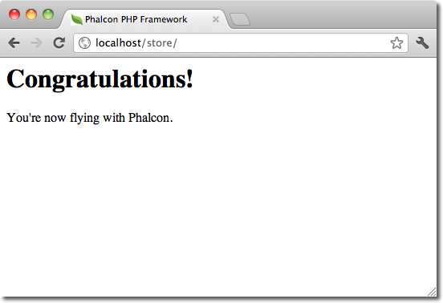
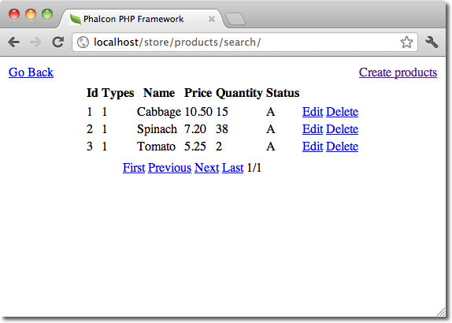

Инструменты разработчика Phalcon (Developer Tools)
==================================================

Эти инструменты представляют собой набор полезных скриптов для генерации основы приложения. Основные компоненты приложения могут быть созданы
простыми командами, позволяющими легко разрабатывать приложения с использованием Phalcon.

.. highlights::

    Если вы предпочитаете использовать веб-версию вместо консоли эта `блогозапись`_ содержит больше информации.

Скачать
-------
Вы можете загрузить или скопировать инструменты разработчика с проекта на Github_, инструменты написаны на PHP и они кроссплатформенны.

Установка
^^^^^^^^^
Существуют подробные инструкции о том, как установить средства разработки на различные платформы:

.. toctree::
   :maxdepth: 1

   wintools
   mactools
   linuxtools

Получение списка команд
-----------------------
Для получения списка имеющихся команд введите: :code:`phalcon commands`

.. code-block:: sh

    $ phalcon commands

    Phalcon DevTools (3.0.0)

    Available commands:
      commands         (alias of: list, enumerate)
      controller       (alias of: create-controller)
      module           (alias of: create-module)
      model            (alias of: create-model)
      all-models       (alias of: create-all-models)
      project          (alias of: create-project)
      scaffold         (alias of: create-scaffold)
      migration        (alias of: create-migration)
      webtools         (alias of: create-webtools)

Создание скелета проекта
------------------------
Вы можете использовать инструменты для создания скелета проекта на Phalcon. По умолчанию созданный проект будет использовать mod_rewrite для Apache.
Введите следующие команды в корне сайта вашего веб-сервера:

.. code-block:: sh

    $ pwd

    /Applications/MAMP/htdocs

    $ phalcon create-project store

Проект создастся с полной рекомендованной структурой:

.. figure:: ../_static/img/tools-2.png
   :align: center

Для получения подробной информации по командам стоит использовать параметр *--help*:

.. code-block:: sh

    $ phalcon project --help

    Phalcon DevTools (3.0.0)

    Help:
      Creates a project

    Usage:
      project [name] [type] [directory] [enable-webtools]

    Arguments:
      help    Shows this help text

    Example
      phalcon project store simple

    Options:
     --name               Name of the new project
     --enable-webtools    Determines if webtools should be enabled [optional]
     --directory=s        Base path on which project will be created [optional]
     --type=s             Type of the application to be generated (cli, micro, simple, modules)
     --template-path=s    Specify a template path [optional]
     --use-config-ini     Use a ini file as configuration file [optional]
     --trace              Shows the trace of the framework in case of exception. [optional]
     --help               Shows this help

Созданный проект можно сразу запустить в браузере:

Создание контроллеров
---------------------
Команда "create-controller" генерирует заготовку контроллера. Её необходимо выполнять в корне
существующего проекта Phalcon:

.. code-block:: sh

    $ phalcon create-controller --name test

Команда выше сформирует следующий код:

.. code-block:: php

    <?php

    use Phalcon\Mvc\Controller;

    class TestController extends Controller
    {
        public function indexAction()
        {

        }
    }

Настройка параметров базы данных
--------------------------------
В проектах, созданных с использованием средств разработчика файл конфигурации будет искаться в *app/config/config.ini* или *app/config/config.php*.
Для создания моделей или каркасов(scaffold), вам потребуется изменить настройки, используемые для подключения к вашей базе данных.

При использовании конфигурации в файле config.ini:

.. code-block:: ini

    [database]
    adapter  = Mysql
    host     = "127.0.0.1"
    username = "root"
    password = "secret"
    dbname   = "store_db"

    [phalcon]
    controllersDir = "../app/controllers/"
    modelsDir      = "../app/models/"
    viewsDir       = "../app/views/"
    baseUri        = "/store/"

Создание моделей
----------------
Существует несколько способов генерации моделей. Вы можете создать все модели по таблицам текущей базы данных или для любой таблицы выборочно. Модели
может содержать публичные атрибуты или работу через сеттеры (set{Field}) и геттеры (get{Fielt}).

Options:
 --name=s             Table name
 --schema=s           Name of the schema. [optional]
 --namespace=s        Model's namespace [optional]
 --get-set            Attributes will be protected and have setters/getters. [optional]
 --extends=s          Model extends the class name supplied [optional]
 --excludefields=l    Excludes fields defined in a comma separated list [optional]
 --doc                Helps to improve code completion on IDEs [optional]
 --directory=s        Base path on which project will be created [optional]
 --force              Rewrite the model. [optional]
 --trace              Shows the trace of the framework in case of exception. [optional]
 --mapcolumn          Get some code for map columns. [optional]
 --abstract           Abstract Model [optional]

Самый простой способ для создания модели:

.. code-block:: sh

    $ phalcon model products

.. code-block:: sh

    $ phalcon model --name tablename

Созданная модель содержит публичные атрибуты для прямого доступа.

.. code-block:: php

    <?php

    use Phalcon\Mvc\Model;

    class Products extends Model
    {
        /**
         * @var integer
         */
        public $id;

        /**
         * @var integer
         */
        public $typesId;

        /**
         * @var string
         */
        public $name;

        /**
         * @var string
         */
        public $price;

        /**
         * @var integer
         */
        public $quantity;

        /**
         * @var string
         */
        public $status;
    }

При использовании *--get-set* атрибуты модели будут закрыты для прямого изменения, работа с ними будет только через соответствующие get и set методы. Такое
поведение позволит изменить бизнес-логику работы модели внутри соответствующих set/get методов.

.. code-block:: php

    <?php

    use Phalcon\Mvc\Model;

    class Products extends Model
    {
        /**
         * @var integer
         */
        protected $id;

        /**
         * @var integer
         */
        protected $typesId;

        /**
         * @var string
         */
        protected $name;

        /**
         * @var string
         */
        protected $price;

        /**
         * @var integer
         */
        protected $quantity;

        /**
         * @var string
         */
        protected $status;

        /**
         * Метод установки значения для поля id
         *
         * @param integer $id
         */
        public function setId($id)
        {
            $this->id = $id;
        }

        /**
         * Метод установки значения для поля typesId
         *
         * @param integer $typesId
         */
        public function setTypesId($typesId)
        {
            $this->typesId = $typesId;
        }

        // ...

        /**
         * Возвращает значение статуса поля
         *
         * @return string
         */
        public function getStatus()
        {
            return $this->status;
        }
    }

Приятной особенностью генератора моделей является то, что он сохраняет изменения, сделанные разработчиком. Это позволяет
добавлять или удалять поля и свойства, не беспокоясь о потере изменений, внесенных в модель вручную.
Следующий демо-ролик показывает как это работает:

.. raw:: html

   
<iframe src="https://player.vimeo.com/video/39213020" width="500" height="266" frameborder="0" webkitAllowFullScreen mozallowfullscreen allowFullScreen></iframe>

Автоматическая генерация CRUD интерфейса (Scaffolding)
------------------------------------------------------
Scaffolding - это быстрый способ для получения основных элементов приложения. Если вы хотите быстро создать модели, представления, и
контроллеры для нового ресурса приложения - использование автоматической генерации кода является отличным инструментом для этих задач.

После того, как код сгенерирован, его можно настроить под себя. Многие разработчики не используют scaffolding, предпочитая
писать весь код самостоятельно. Сгенерированный код может служить в качестве руководства, чтобы лучше понять основы работы или
разработки прототипов. Пример ниже показывает генерацию интерфейса для таблицы "товары (products)":

.. code-block:: sh

    $ phalcon scaffold --table-name products

Генератор создаст несколько файлов в вашем приложении, и каталоги для них. Вот краткий обзор того, что будет сгенерировано:

+----------------------------------------+-------------------------------------+
| Файл                                   | Предназначение                      |
+========================================+=====================================+
| app/controllers/ProductsController.php | Контроллер продуктов                |
+----------------------------------------+-------------------------------------+
| app/models/Products.php                | Модель продуктов                    |
+----------------------------------------+-------------------------------------+
| app/views/layout/products.phtml        | Макет для контроллера продуктов     |
+----------------------------------------+-------------------------------------+
| app/views/products/new.phtml           | Представление для действия "new"    |
+----------------------------------------+-------------------------------------+
| app/views/products/edit.phtml          | Представление для действия "edit"   |
+----------------------------------------+-------------------------------------+
| app/views/products/search.phtml        | Представление для действия "search" |
+----------------------------------------+-------------------------------------+

На главной странице созданного таким образом контроллер вы увидите форму поиска, и ссылку на создание нового Продукта:

.. figure:: ../_static/img/tools-10.png
   :align: center

Страница создания товара позволяет добавить в таблицу products новую запись, при этом будут использованы проверки по правилам модели Products. Phalcon
будет автоматически проверять "not null" поля и выдавать требования о их заполнении.

.. figure:: ../_static/img/tools-11.png
   :align: center

После выполнения поиска будут выведены результаты с постраничной навигацией. Используйте ссылки меню "Правка" или "Удалить" возле каждого результата поиска, для выполнения требуемых действий.

Веб интерфейс дополнений ( webtools )
-------------------------------------
Кроме того, можно использовать инструменты разработчика Phalcon через веб-интерфейс. Подробности его работы показаны на следующем скринкасте:

.. raw:: html

   
<iframe src="https://player.vimeo.com/video/42367665" width="500" height="266" frameborder="0" webkitAllowFullScreen mozallowfullscreen allowFullScreen></iframe>

Интеграция в PhpStorm IDE
--------------------------
Скринкаст показывает, как интегрировать инструменты для разработчиков с `PhpStorm IDE`_. Аналогично можно интегрировать дополнения в любой другой PHP редактор или IDE.

.. raw:: html

   
<iframe src="https://player.vimeo.com/video/43455647" width="500" height="266" frameborder="0" webkitAllowFullScreen mozallowfullscreen allowFullScreen></iframe>

Заключение
----------
Phalcon Developer Tools позволяет легко генерировать код для вашего приложения, сокращая время разработки и потенциальные ошибки.

.. _блогозапись: https://blog.phalconphp.com/post/dont-like-command-line-and-consoles-no-problem
.. _Github: https://github.com/phalcon/phalcon-devtools
.. _Bootstrap: http://twitter.github.com/bootstrap/
.. _PhpStorm IDE: http://www.jetbrains.com/phpstorm/
