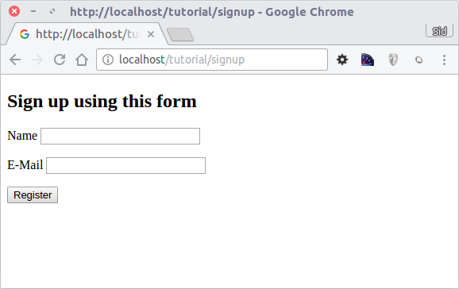

Урок 1: Рассмотрим на примере
=============================
В этом примере рассмотрим создание приложения с простой формой регистрации "с нуля".
Также рассмотрим основные аспекты поведения фреймворка. Если вам интересна
автоматическая генерация кода, посмотрите :doc:`developer tools <tools>`.

Проверка установки
------------------
Будем считать, что у вас уже установлено расширение Phalcon. Проверьте, есть ли в результатах phpinfo() секция "Phalcon",
или выполните следующий код:

.. code-block:: php

    <?php print_r(get_loaded_extensions()); ?>

В результате вы должны увидеть Phalcon в списке:

.. code-block:: php

    Array
    (
        [0] => Core
        [1] => libxml
        [2] => filter
        [3] => SPL
        [4] => standard
        [5] => phalcon
        [6] => pdo_mysql
    )

Создание проекта
----------------
Лучше всего следовать данному руководству шаг за шагом. Полный код можно посмотреть
`здесь <https://github.com/phalcon/tutorial>`_.

Структура каталогов
^^^^^^^^^^^^^^^^^^^
Phalcon не обязывает использовать определенную структуру каталогов. Ввиду
слабой связанности фреймворка, вы можете использовать любую удобную структуру.

В качестве отправной точки для данного урока мы предлагаем следующую структуру:

.. code-block:: php

    tutorial/
      app/
        controllers/
        models/
        views/
      public/
        css/
        img/
        js/

Обратите внимание на то, что вам не нужны директории с библиотеками, относящимися к фреймворку. Он полностью находится в памяти
и все время готов к использованию.

"Красивые" ссылки (URL)
^^^^^^^^^^^^^^^^^^^^^^^
В этом примере будем использовать красивые URL (ЧПУ). ЧПУ хороши как для SEO, так и для восприятия пользователя. Phalcon поддерживает rewrite-модули, представленные самыми распространенными веб-серверами. Вы не обязаны использовать ЧПУ в вашем приложении, вы можете с легкостью обойтись и без них.

В этом примере будем использовать rewrite-модуль для Apache. Создадим несколько правил в файле /tutorial/.htaccess:

.. code-block:: apacheconf

    #/tutorial/.htaccess
    <IfModule mod_rewrite.c>
        RewriteEngine on
        RewriteRule  ^$ public/    [L]
        RewriteRule  ((?s).*) public/$1 [L]
    </IfModule>

Все запросы будут перенаправлены в каталог public/, делая его тем самым корневым каталогом хоста. Данный шаг обеспечивает недоступность внутренних файлов проекта для внешнего пользователя, исключая, таким образом, угрозы безопасности подобного характера.

Следующий набор правил проверяет, существует ли запрашиваемый файл, и в случае его отсутствия перенаправляет запрос index-файлу:

.. code-block:: apacheconf

    #/tutorial/public/.htaccess
    <IfModule mod_rewrite.c>
        RewriteEngine On
        RewriteCond %{REQUEST_FILENAME} !-d
        RewriteCond %{REQUEST_FILENAME} !-f
        RewriteRule ^((?s).*)$ index.php?_url=/$1 [QSA,L]
    </IfModule>

Bootstrap
^^^^^^^^^
Первый файл, который необходимо создать - bootstrap-файл. Он крайне важен, так как является
основой вашего приложения и дает вам контроль над всеми его аспектами. В данном файле вы можете реализовать
как инициализацию компонентов, так и поведение приложения.

Файл tutorial/public/index.php имеет следующее содержимое:

.. code-block:: php

    <?php

    use Phalcon\Loader;
    use Phalcon\Mvc\View;
    use Phalcon\Mvc\Application;
    use Phalcon\Di\FactoryDefault;
    use Phalcon\Mvc\Url as UrlProvider;
    use Phalcon\Db\Adapter\Pdo\Mysql as DbAdapter;

    try {

        // Регистрируем автозагрузчик
        $loader = new Loader();
        $loader->registerDirs(array(
            '../app/controllers/',
            '../app/models/'
        ))->register();

        // Создаем DI
        $di = new FactoryDefault();

        // Настраиваем компонент View
        $di->set('view', function () {
            $view = new View();
            $view->setViewsDir('../app/views/');
            return $view;
        });

        // Настраиваем базовый URI так, чтобы все генерируемые URI содержали директорию "tutorial"
        $di->set('url', function () {
            $url = new UrlProvider();
            $url->setBaseUri('/tutorial/');
            return $url;
        });

        // Обрабатываем запрос
        $application = new Application($di);

        echo $application->handle()->getContent();

    } catch (\Exception $e) {
         echo "Exception: ", $e->getMessage();
    }

Автозагрузка
^^^^^^^^^^^^
Первое, что происходит в bootstrap-файле - это регистрация автозагрузчика. Он будет использоваться для загрузки классов проекта, таких как контроллеры и модели. Например, мы можем зарегистрировать одну или более директорий для контроллеров, увеличив гибкость приложения. В данном примере используется компонент :doc:`Phalcon\\Loader <../api/Phalcon_Loader>`.

Он позволяет использовать разные стратегии загрузки классов, но в данном примере мы решили расположить классы в определенных директориях:

.. code-block:: php

    <?php

    use Phalcon\Loader;

    // ...

    $loader = new Loader();
    $loader->registerDirs(
        array(
            '../app/controllers/',
            '../app/models/'
        )
    )->register();

Управление зависимостями
^^^^^^^^^^^^^^^^^^^^^^^^
Важная концепция, которую стоит понять при использовании Phalcon - это :doc:`внедрение зависимостей <di>`. Это может показаться сложным, но на самом деле это очень простой и практичный шаблон проектирования.

DI представляет из себя глобальный контейнер для сервисов, необходимых нашему приложению. Каждый раз, когда фреймворку необходим какой-то компонент, он будет обращаться за ним к контейнеру, используя определенное имя компонента. Так как Phalcon является слабосвязанным фреймворком, :doc:`Phalcon\\Di <../api/Phalcon_Di>` выступает в роли клея, помогающего разным компонентам прозрачно взаимодействовать друг с другом.

.. code-block:: php

    <?php

    use Phalcon\Di\FactoryDefault;

    // ...

    // Создаем DI
    $di = new FactoryDefault();

:doc:`Phalcon\\Di\\FactoryDefault <../api/Phalcon_Di_FactoryDefault>` является вариантом :doc:`Phalcon\\Di <../api/Phalcon_Di>`.
Он берет на себя функции регистрации большинства компонентов из состава Phalcon, поэтому нам не придется регистрировать их вручную один за другим.
При необходимости можно без проблем заменить реализацию данного сервиса на другую.

На следующем шаге мы регистрируем сервис "view", который указывает на папку с view-файлами (представлениями).
Так как данные файлы не относятся к классам, они не могут быть подгружены автозагрузчиком.

Существует несколько способов регистрации сервисов, но в нашем примере мы используем `анонимную функцию`_:

.. code-block:: php

    <?php

    use Phalcon\Mvc\View;

    // ...

    // Настраиваем компонент View
    $di->set('view', function () {
        $view = new View();
        $view->setViewsDir('../app/views/');
        return $view;
    });

Затем мы регистрируем базовый URI так, чтобы все URI, которые генерирует Phalcon, содержали директорию "tutorial".
Это пригодится нам позднее в данном уроке, когда будем использовать класс :doc:`Phalcon\\Tag <../api/Phalcon_Tag>`
для генерации ссылок.

.. code-block:: php

    <?php

    use Phalcon\Mvc\Url as UrlProvider;

    // ...

    // Настраиваем базовый URI так, чтобы все генерируемые URI содержали директорию "tutorial"
    $di->set('url', function () {
        $url = new UrlProvider();
        $url->setBaseUri('/tutorial/');
        return $url;
    });

На последнем этапе мы используем :doc:`Phalcon\\Mvc\\Application <../api/Phalcon_Mvc_Application>`.
Данный компонент служит для инициализации окружения входящих запросов, их перенаправления и обслуживания относящихся к ним действий.
После отработки всех доступных действий, компонент возвращает полученные ответы.

.. code-block:: php

    <?php

    use Phalcon\Mvc\Application;

    // ...

    $application = new Application($di);

    echo $application->handle()->getContent();

Как можно увидеть, bootstrap-файл очень короткий, нам нет необходимости подключать какие-либо дополнительные файлы. Таким образом, мы настроили
гибкую структуру MVC-приложения менее чем за 30 строк кода.

Создание контроллера
^^^^^^^^^^^^^^^^^^^^
По умолчанию Phalcon будет искать контроллер с именем "Index". Как и во многих других фреймворках он является исходной точкой, когда ни один другой контроллер или
действие не были запрошены. Наш index-контроллер (app/controllers/IndexController.php) выглядит так:

.. code-block:: php

    <?php

    use Phalcon\Mvc\Controller;

    class IndexController extends Controller
    {

        public function indexAction()
        {
            echo "<h1>Привет!</h1>";
        }
    }

Классы контроллеров должны заканчиваться суффиксом "Controller", чтобы автозагрузчик смог загрузить их, а их действия должны заканчиваться суффиксом "Action". Теперь можно открыть браузер и увидеть результат:

.. figure:: ../_static/img/tutorial-1.png
    :align: center

Ура, Phalcon взлетел!

Отправка результатов в представление
^^^^^^^^^^^^^^^^^^^^^^^^^^^^^^^^^^^^
Отображение вывода напрямую из контроллера иногда бывает необходимым решением (например, когда нужно отправить JSON), но нежелательно, и сторонники шаблона MVC это подтвердят. Данные должны передаваться представлению (view), ответственному за отображение данных. Phalcon ищет файл представления с именем, совпадающим с именем действия внутри папки, носящей имя последнего запущенного контроллера. В нашем случае это будет выглядеть так (app/views/index/index.phtml):

.. code-block:: php

    <?php echo "<h1>Привет!</h1>";

В нашем контроллере (app/controllers/IndexController.php) сейчас существует пустое действие:

.. code-block:: php

    <?php

    use Phalcon\Mvc\Controller;

    class IndexController extends Controller
    {

        public function indexAction()
        {

        }
    }

Вывод браузера останется прежним. Когда действие завершит свою работу, будет автоматически создан статический компонент :doc:`Phalcon\\Mvc\\View <../api/Phalcon_Mvc_View>`. Узнать больше о представлениях можно :doc:`здесь <views>`.

Проектирование формы регистрации
^^^^^^^^^^^^^^^^^^^^^^^^^^^^^^^^
Давайте теперь изменим файл представления index.phtml, добавив ссылку на новый контроллер "signup". Идея проста - позволить пользователям регистрироваться в нашем приложении.

.. code-block:: php

    <?php

    echo "<h1>Привет!</h1>";

    echo $this->tag->linkTo("signup", "Регистрируйся!");

Сгенерированный код HTML будет выводить тэг ("a"), указывающий на наш новый контроллер:

.. code-block:: html

    <h1>Привет!</h1> <a href="/tutorial/signup">Регистрируйся!</a>

Для генерации тэга мы воспользовались встроенным классом :doc:`Phalcon\\Tag <../api/Phalcon_Tag>`. Это служебный класс, позволяющий
конструировать HTML-разметку в Phalcon-подобном стиле. Этот класс также является сервисом, зарегистрированным в DI,
таким образом, мы используем :code:`$this->tag` для доступа к нему.

Более подробно о генерации HTML можно :doc:`узнать здесь <tags>`.

.. figure:: ../_static/img/tutorial-2.png
    :align: center

Контроллер Signup (app/controllers/SignupController.php):

.. code-block:: php

    <?php

    use Phalcon\Mvc\Controller;

    class SignupController extends Controller
    {

        public function indexAction()
        {

        }
    }

Пустое действие index говорит нам о том, что будет использоваться одноименный файл представления с нашей формой для регистрации (app/views/signup/index.phtml):

.. code-block:: html+php

    <h2>Зарегистрируйтесь, используя эту форму</h2>

    <?php echo $this->tag->form("signup/register"); ?>

     

        <label for="name">Имя</label>
        <?php echo $this->tag->textField("name") ?>
     

     

        <label for="email">E-Mail</label>
        <?php echo $this->tag->textField("email") ?>
     

     

        <?php echo $this->tag->submitButton("Регистрация") ?>
     

    </form>

В браузере это будет выглядеть так:

Класс :doc:`Phalcon\\Tag <../api/Phalcon_Tag>` также содержит полезные методы для работы с формами.

Метод :code:`Phalcon\Tag::form()` принимает единственный аргумент, например, относительный URI контроллера/действия
приложения.

При нажатии на кнопку "Регистрация" мы увидим исключение, вызванное фреймворком. Оно говорит нам о том, что у нашего контроллера "signup" отсутствует действие "register":

    Exception: Action "register" was not found on handler "signup"

Реализация этого метода прекратит генерацию исключения:

.. code-block:: php

    <?php

    use Phalcon\Mvc\Controller;

    class SignupController extends Controller
    {

        public function indexAction()
        {

        }

        public function registerAction()
        {

        }
    }

Снова жмем на кнопку "Регистрация" и видим пустую страницу. Поля name и email, введенные пользователем, должны сохраниться в базе данных. В соответствии с принципами MVC, все взаимодействие с БД должно вестись через модели, таким образом, следуя традициям ООП-стиля.

Создание модели
^^^^^^^^^^^^^^^
Phalcon содержит первую ORM для PHP, полностью написанную на языке C. Вместо усложнения процесса разработки, он упрощает его!

Перед созданием модели необходимо создать таблицу в базе данных. Простейшая таблица для регистрации пользователей приведена ниже:

.. code-block:: sql

    CREATE TABLE `users` (
      `id` int(10) unsigned NOT NULL AUTO_INCREMENT,
      `name` varchar(70) NOT NULL,
      `email` varchar(70) NOT NULL,
      PRIMARY KEY (`id`)
    );

Файлы моделей должны находиться в папке app/models (app/models/Users.php). Модель, представляющая таблицу "users", выглядит следующим образом:

.. code-block:: php

    <?php

    use Phalcon\Mvc\Model;

    class Users extends Model
    {
        public $id;

        public $name;

        public $email;
    }

Настройка соединения с базой данных
^^^^^^^^^^^^^^^^^^^^^^^^^^^^^^^^^^^
Для использования базы данных и получения к ней доступа через наши модели нам необходимо указать настройки в bootstrap-файле. Соединение с базой данных - это всего лишь еще один сервис нашего приложения, который может быть использован для различных компонентов:

.. code-block:: php

    <?php

    use Phalcon\Loader;
    use Phalcon\Di\FactoryDefault;
    use Phalcon\Mvc\View;
    use Phalcon\Mvc\Application;
    use Phalcon\Mvc\Url as UrlProvider;
    use Phalcon\Db\Adapter\Pdo\Mysql as DbAdapter;

    try {

        // Регистрируем автозагрузчик
        $loader = new Loader();
        $loader->registerDirs(array(
            '../app/controllers/',
            '../app/models/'
        ))->register();

        // Создаем DI
        $di = new FactoryDefault();

        // Настраиваем сервис для работы с БД
        $di->set('db', function () {
            return new DbAdapter(array(
                "host"     => "localhost",
                "username" => "root",
                "password" => "secret",
                "dbname"   => "test_db"
            ));
        });

        // Настраиваем компонент View
        $di->set('view', function () {
            $view = new View();
            $view->setViewsDir('../app/views/');
            return $view;
        });

        // Настраиваем базовый URI так, чтобы все генерируемые URI содержали директорию "tutorial"
        $di->set('url', function () {
            $url = new UrlProvider();
            $url->setBaseUri('/tutorial/');
            return $url;
        });

        // Обрабатываем запрос
        $application = new Application($di);

        echo $application->handle()->getContent();

    } catch (\Exception $e) {
         echo "Exception: ", $e->getMessage();
    }

При правильных настройках подключения наши модели будут готовы к работе и взаимодействию с остальными частями приложения.

Сохранение данных при работе с моделями
^^^^^^^^^^^^^^^^^^^^^^^^^^^^^^^^^^^^^^^
Следующим шагом будет обработка данных нашей формы регистрации и сохранение их в таблице базы данных.

.. code-block:: php

    <?php

    use Phalcon\Mvc\Controller;

    class SignupController extends Controller
    {

        public function indexAction()
        {

        }

        public function registerAction()
        {

            $user = new Users();

            // Сохраняем и проверяем на наличие ошибок
            $success = $user->save($this->request->getPost(), array('name', 'email'));

            if ($success) {
                echo "Спасибо за регистрацию!";
            } else {
                echo "К сожалению, возникли следующие проблемы: ";
                foreach ($user->getMessages() as $message) {
                    echo $message->getMessage(), " ";
                }
            }

            $this->view->disable();
        }
    }

В действии 'register' мы создаем экземпляр модели Users, отвечающий за записи пользователей. Публичные свойства класса указывают на их одноименные названия полей
в таблице базы данных. Установка необходимых значений нашей модели и вызов метода save() приводит к сохранению этих данных в БД. Метод save() возвращает булево значение, указывающее, успешно ли были сохранены данные в таблице или нет (true и false, соответственно).

ORM автоматически экранирует ввод для предотвращения SQL-инъекций, так что мы можем передавать массив :code:`$_POST` напрямую методу save().

Для полей, у которых установлен параметр not null (обязательные), вызывается дополнительная валидация. Если мы ничего не введем в форме регистрации, то получим что-то вроде этого:

.. figure:: ../_static/img/tutorial-4.png
    :align: center

Заключение
----------
На этом очень простом руководстве можно увидеть, как легко начать создавать приложения с помощью Phalcon.
То, что Phalcon является расширением, никак не влияет на сложность разработки и доступные возможности.
Продолжайте читать данное руководство для изучения новых возможностей, которые предоставляет Phalcon!

.. _анонимную функцию: http://php.net/manual/ru/functions.anonymous.php
