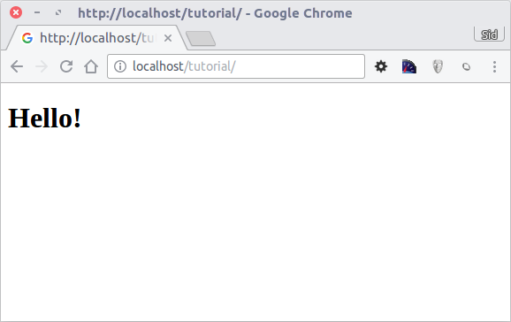

Урок 1: Рассотрим на примере
============================

В этом примере рассмотрим создание приложения с простой формой регистрацией "с нуля".
Также рассмотрим основные аспекты поведения фреймворка. Если вам интересна автоматическая генерация кода, посмотрите :doc:`developer tools <tools>`.

Проверка установки
------------------
Будем считать что у вас уже установлено расширение Phalcon. Проверьте, есть ли в результатах phpinfo() секция "Phalcon" или выполните следующий код:

.. code-block:: php

    <?php print_r(get_loaded_extensions()); ?>

В результате вы должны увидеть Phalcon в списке:

.. code-block:: php

    Array
    (
        [0] => Core
        [1] => libxml
        [2] => filter
        [3] => SPL
        [4] => standard
        [5] => phalcon
        [6] => pdo_mysql
    )

Создание проекта
----------------
Лучше всего следовать данному руководсву шаг за шагом. Полный код можно посмотреть `здесь <https://github.com/phalcon/tutorial>`_.

Структура каталогов
^^^^^^^^^^^^^^^^^^^
Phalcon не обязывает использовать определенную структуру каталогов. В виду слабой связанности фреймворка, вы можете использовать любую удобную структуру.

Для целей данного урока и для начала, мы предалгаем следующую структуру:

.. code-block:: php

    tutorial/
      app/
        controllers/
        models/
        views/
      public/
        css/
        img/
        js/

Обратите внимание на то, что вам не нужны директории с библиотеками, относящимися к фреймворку. Он полностью находится в памяти и все время готов к использованию.

"Красивые" URLs
^^^^^^^^^^^^^^^
В этом примере будем использовать красивые УРЛ (ЧПУ). ЧПУ хороши как для SEO, так и лучше воспринимаются пользователем. Phalcon поддерживает rewrite-модули, представленные самыми распространенными веб-серверами. Вы не обязаны использовать ЧПУ в вашем приложении, вы можете с легкостью обойтись и без них.

В этом примере будем использовать rewrite модуль для Apache. Создадим несколько правил в файле /.htaccess:

.. code-block:: apacheconf

    #/.htaccess
    <IfModule mod_rewrite.c>
        RewriteEngine on
        RewriteRule  ^$ public/    [L]
        RewriteRule  (.*) public/$1 [L]
    </IfModule>

Все запросы будут перенаправлены в каталог public/ тем самым делая его корневым. Данный шаг обеспечивает закрытость внутренних файлов проекта от внешнего пользователя.

Следующий набор правил проверяет существует ли запрашиваемый файл, и если нет перенаправляет запрос index-файлу:

.. code-block:: apacheconf

    #/public/.htaccess
    <IfModule mod_rewrite.c>
        RewriteEngine On
        RewriteCond %{REQUEST_FILENAME} !-d
        RewriteCond %{REQUEST_FILENAME} !-f
        RewriteRule ^(.*)$ index.php?_url=/$1 [QSA,L]
    </IfModule>

Bootstrap
^^^^^^^^^
Это превый файл, который вам необходимо создать. Это основной файл приложения, предназначенный для управления всеми его аспектами. Здесь вы можете реализовать как инициализацию компонентов приложения, так и его поведение.

Файл public/index.php содержит следующее:

.. code-block:: php

    <?php

    try {

        //Register an autoloader
        $loader = new \Phalcon\Loader();
        $loader->registerDirs(array(
            '../app/controllers/',
            '../app/models/'
        ))->register();

        //Create a DI
        $di = new Phalcon\DI\FactoryDefault();

        //Setting up the view component
        $di->set('view', function(){
            $view = new \Phalcon\Mvc\View();
            $view->setViewsDir('../app/views/');
            return $view;
        });

        //Handle the request
        $application = new \Phalcon\Mvc\Application();
        $application->setDI($di);
        echo $application->handle()->getContent();

    } catch(\Phalcon\Exception $e) {
         echo "PhalconException: ", $e->getMessage();
    }

Автозагрузка
^^^^^^^^^^^^
В первую очередь зарегистрируем автозагрузчик. Он будет использоваться для загрузки классов как контроллеров и моделей. Например мы можем зарегистрировать одну или более директорий для контроллеров, увеличив гибкость приложения. В данном примере используется компонент Phalcon\\Loader.

С помощью него можно использовать раные стратегии загрузки классов, но в данном примере мы решили расположить классы в определенных директориях:

.. code-block:: php

    <?php

    $loader = new \Phalcon\Loader();
    $loader->registerDirs(
        array(
            '../app/controllers/',
            '../app/models/'
        )
    )->register();

Управление зависимостями
^^^^^^^^^^^^^^^^^^^^^^^^
Важная концепция, которую стоит понять при использовании Phalcon это :doc:`dependency injection <di>`.

DI представляет из себя глобальный контейнер для сервисов, необходимых нашему приложению. Каждый раз, когда фреймворку необходим какой-то компонент, он будет обращаться за ним к контейнеру используя определенное имя компонента.
Так как Phalcon является слабосвязанным фреймворком, Phalcon\\DI выступает в роли клея, помогающего разным компонентам прозрачно взаимодействовать друг с другом.

.. code-block:: php

    <?php

    //Create a DI
    $di = new Phalcon\DI\FactoryDefault();

:doc:`Phalcon\\DI\\FactoryDefault <../api/Phalcon\_DI_FactoryDefault>` is a variant of Phalcon\\DI. To make things easier, it has registered most of the components
that come with Phalcon. Thus we should not register them one by one. Later there will be no problem in replacing a factory service.

In the next part, we register the "view" service indicating the directory where the framework will find the views files. As the views do not correspond to classes,
they cannot be charged with an autoloader.

Services can be registered in several ways, but for our tutorial we'll use lambda functions:

.. code-block:: php

    <?php

    //Setting up the view component
    $di->set('view', function(){
        $view = new \Phalcon\Mvc\View();
        $view->setViewsDir('../app/views/');
        return $view;
    });

In the last part of this file, we find :doc:`Phalcon\\Mvc\\Application <../api/Phalcon_Mvc_Application>`. Its purpose is to initialize the request environment,
route the incoming request, and then dispatch any discovered actions; it aggregates any responses and returns them when the process is complete.

.. code-block:: php

    <?php

    $application = new \Phalcon\Mvc\Application();
    $application->setDI($di);
    echo $application->handle()->getContent();

As you can see, the bootstrap file is very short and we do not need to include any additional files. We have set ourselves a flexible MVC application in less
than 30 lines of code.

Creating a Controller
^^^^^^^^^^^^^^^^^^^^^
By default Phalcon will look for a controller named "Index". It is the starting point when no controller or action has been passed in the request. The index
controller (app/controllers/IndexController.php) looks like:

.. code-block:: php

    <?php

    class IndexController extends \Phalcon\Mvc\Controller
    {

        public function indexAction()
        {
            echo "<h1>Hello!</h1>";
        }

    }

The controller classes must have the suffix "Controller" and controller actions must have the suffix "Action". If you access the application from your browser,
you should see something like this:

:align: center

Congratulations, you're flying with Phalcon!

Sending output to a view
^^^^^^^^^^^^^^^^^^^^^^^^
Sending output on the screen from the controller is at times necessary but not desirable as most purists in the MVC community will attest. Everything must be
passed to the view that is responsible for outputting data on screen. Phalcon will look for a view with the same name as the last executed action inside a
directory named as the last executed controller. In our case (app/views/index/index.phtml):

.. code-block:: php

    <?php echo "<h1>Hello!</h1>";

Our controller (app/controllers/IndexController.php) now has an empty action definition:

.. code-block:: php

    <?php

    class IndexController extends \Phalcon\Mvc\Controller
    {

        public function indexAction()
        {

        }

    }

The browser output should remain the same. The :doc:`Phalcon\\Mvc\\View <../api/Phalcon_Mvc_View>` static component is automatically created when the action execution has ended. Learn more about :doc:`views usage here <views>` .

Designing a sign up form
^^^^^^^^^^^^^^^^^^^^^^^^
Now we will change the index.phtml view file, to add a link to a new controller named "signup". The goal is to allow users to sign up in our application.

.. code-block:: php

    <?php

    echo "<h1>Hello!</h1>";

    echo Phalcon\Tag::linkTo("signup", "Sign Up Here!");

The generated HTML code displays an "A" html tag linking to a new controller:

.. code-block:: html

    <h1>Hello!</h1> <a href="/test/signup">Sign Up Here!</a>

To generate the tag we use the class :doc:`\Phalcon\\Tag <../api/Phalcon_Tag>`. This is a utility class that allows us to build HTML tags with framework conventions in mind. A more detailed article regarding HTML generation can be :doc:`found here <tags>`

.. figure:: ../_static/img/tutorial-2.png
	:align: center

Here is the controller Signup (app/controllers/SignupController.php):

.. code-block:: php

    <?php

    class SignupController extends \Phalcon\Mvc\Controller
    {

        public function indexAction()
        {

        }

    }

The empty index action gives the clean pass to a view with the form definition:

.. code-block:: html+php

    <?php use Phalcon\Tag; ?>

    <h2>Sign using this form</h2>

    <?php echo Tag::form("signup/register"); ?>

     

        <label for="name">Name</label>
        <?php echo Tag::textField("name") ?>
     

     

        <label for="name">E-Mail</label>
        <?php echo Tag::textField("email") ?>
     

     

        <?php echo Tag::submitButton("Register") ?>
     

    </form>

Viewing the form in your browser will show something like this:

.. figure:: ../_static/img/tutorial-3.png
	:align: center

:doc:`Phalcon\\Tag <../api/Phalcon_Tag>` also provides useful methods to build form elements.

The Phalcon\\Tag::form method receives only one parameter for instance, a relative uri to a controller/action in the application.

By clicking the "Send" button, you will notice an exception thrown from the framework,
indicating that we are missing the "register" action in the controller "signup". Our public/index.php file throws this exception:

    PhalconException: Action "register" was not found on controller "signup"

Implementing that method will remove the exception:

.. code-block:: php

    <?php

    class SignupController extends \Phalcon\Mvc\Controller
    {

        public function indexAction()
        {

        }

        public function registerAction()
        {

        }

    }

If you click the "Send" button again, you will see a blank page. The name and email input provided by the user should be stored
in a database. According to MVC guidelines, database interactions must be done through models so as to ensure clean object-oriented code.

Creating a Model
^^^^^^^^^^^^^^^^
Phalcon brings the first ORM for PHP entirely written in C-language. Instead of increasing the complexity of development, it simplifies it.

Before creating our first model, we need a database table to map it to. A simple table to store registered users can be defined like this:

.. code-block:: sql

    CREATE TABLE `users` (
      `id` int(10) unsigned NOT NULL AUTO_INCREMENT,
      `name` varchar(70) NOT NULL,
      `email` varchar(70) NOT NULL,
      PRIMARY KEY (`id`)
    );

A model should be located in the app/models directory. The model mapping to "users" table:

.. code-block:: php

    <?php

    class Users extends \Phalcon\Mvc\Model
    {

    }

Setting a Database Connection
^^^^^^^^^^^^^^^^^^^^^^^^^^^^^
In order to be able to use a database connection and subsequently access data through our models, we need to specify it in our bootstrap process.
A database connection is just another service that our application has that can be use for several components:

.. code-block:: php

    <?php

    try {

        //Register an autoloader
        $loader = new \Phalcon\Loader();
        $loader->registerDirs(array(
            '../app/controllers/',
            '../app/models/'
        ))->register();

        //Create a DI
        $di = new Phalcon\DI\FactoryDefault();

        //Set the database service
        $di->set('db', function(){
            return new \Phalcon\Db\Adapter\Pdo\Mysql(array(
                "host" => "localhost",
                "username" => "root",
                "password" => "secret",
                "dbname" => "test_db"
            ));
        });

        //Setting up the view component
        $di->set('view', function(){
            $view = new \Phalcon\Mvc\View();
            $view->setViewsDir('../app/views/');
            return $view;
        });

        //Handle the request
        $application = new \Phalcon\Mvc\Application();
        $application->setDI($di);
        echo $application->handle()->getContent();

    } catch(\Phalcon\Exception $e) {
         echo "PhalconException: ", $e->getMessage();
    }

With the correct database parameters, our models are ready to work and interact with the rest of the application.

Storing data using models
^^^^^^^^^^^^^^^^^^^^^^^^^
Receiving data from the form and storing them in the table is the next step.

.. code-block:: php

    <?php

    class SignupController extends \Phalcon\Mvc\Controller
    {

        public function indexAction()
        {

        }

        public function registerAction()
        {

            $user = new Users();

            //Store and check for errors
            if ($user->save($_POST) == true) {
                echo "Thanks for register!";
            } else {
                echo "Sorry, the following problems were generated: ";
                foreach ($user->getMessages() as $message) {
                    echo $message->getMessage(), " ";
                }
            }
        }

    }

We then instantiate the Users class, which corresponds to a User record. The class public properties map to the fields
of the record in the users table. Setting the relevant values in the new record and calling save()
will store the data in the database for that record. The save() method returns a boolean value which
informs us on whether the storing of the data was successful or not.

The ORM automatically escapes the input preventing SQL injections so we only need to pass the request to the method save().

Additional validation happens automatically on fields that are not null (required). If we don't type any of the
required files our screen will look like this:

.. figure:: ../_static/img/tutorial-4.png
	:align: center

Conclusion
----------
This is a very simple tutorial and as you can see, it's easy to start building an application using Phalcon.
The fact that Phalcon is an extension on your web server has not interfered with the ease of development or
features available. We invite you to continue reading the manual so that you can discover additional features offered by Phalcon!

Sample Applications
-------------------
The following Phalcon powered applications are also available, providing more complete examples:

* `INVO application`_: Invoice generation application. Allows for management of products, companies, product types. etc.
* `PHP Alternative website`_: Multilingual and advanced routing application
* `Album O'Rama`_: A showcase of music albums, handling big sets of data with :doc:`PHQL <phql>` and using :doc:`Volt <volt>` as template engine
* `Phosphorum`_: A simple and clean forum

.. _INVO application: http://blog.phalconphp.com/post/20928554661/invo-a-sample-application
.. _PHP Alternative website: http://blog.phalconphp.com/post/24622423072/sample-application-php-alternative-site
.. _Album O'Rama: http://blog.phalconphp.com/post/37515965262/sample-application-album-orama
.. _Phosphorum: http://blog.phalconphp.com/post/41461000213/phosphorum-the-phalcons-forum

