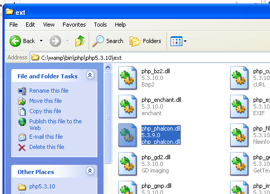
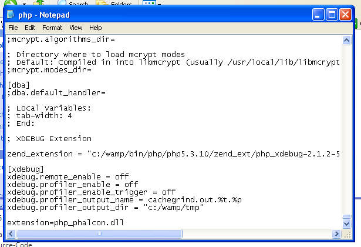
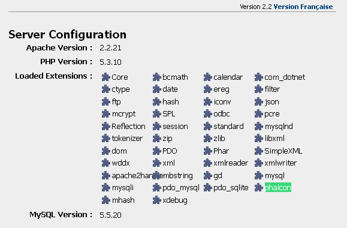

Installation on WAMP
=====================

WampServer_ is a Windows web development environment. It allows you to create web applications with Apache2, PHP and a MySQL database. Below are detailed instructions on how to install Phalcon on WampServer for Windows. Using the latest WampServer version is highly recommended. 

Download the right version of Phalcon
-------------------------------------
WAMP has both 32 and 64 bit versions. From the download section, you can choose the Phalcon for Windows accordingly to your desired architecture. 

After download the Phalcon library you will have a zip file like the one shown below: 

.. figure:: ../_static/img/xampp-1.png
    :align: center

Extract the library from the archive to get the Phalcon DLL: 

.. figure:: ../_static/img/xampp-2.png
    :align: center

Copy the file php_phalcon.dll to the PHP extensions. If WAMP is installed in the c:\\wamp folder, the extension needs to be in C:\\wamp\\bin\\php\\php5.3.10\\ext

Edit the php.ini file, it is located at C:\\wamp\\bin\\php\\php5.3.10\\php.ini. It can be edited with Notepad or a similar program. We recommend Notepad++ to avoid issues with line endings. Append at the end of the file: extension=php_phalcon.dll and save it. 

Also edit another php.ini file, which is located at C:\\wamp\\bin\\apache\\Apache2.2.21\\bin\\php.ini. Append at the end of the file: extension=php_phalcon.dll and save it.

Restart the Apache Web Server. Do a single click on the WampServer icon at system tray. Choose "Restart All Services" from the pop-up menu. Check out that tray icon will become green again. 

.. figure:: ../_static/img/wamp-3.png
    :align: center  

Open your browser to navigate to http://localhost. The WAMP welcome page will appear. Look at the section "extensions loaded" to check if phalcon was loaded. 

Congrats!, You are now flying with Phalcon. 

Related Guides
--------------
* :doc:`General Installation </reference/install>`
* :doc:`Detailed Installation on XAMPP for Windows </reference/xampp>`

.. _WampServer: http://www.wampserver.com/en/
