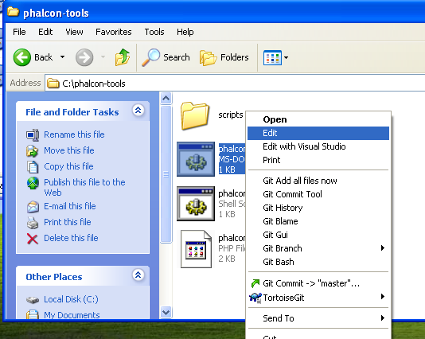

Инструменты разработчика Phalcon для Windows
============================================
Эти шаги помогут вам с установкой инструментов раз-разработчика Phalcon на Windows.

Предпосылки
-----------
Для запуска Инструментов разработчика необходимо установленное PHP расширение Phalcon. Если расширение еще не установлено, обратите внимание наинструкции в разделе :doc:`Установка <install>`.

Скачать
-------
Вы можете скачать кросс-платформенный пакет с инструментами разработчика в разделе `Скачать`_. Можно так же клонировать его с `Github`_.

На платформе Windows вам необходимо настроить системную переменную PATH для запуска инструментов разработчика и выполнения php. Если вы скачали инструменты разработчика в виде ZIP архива то его необходипмо распаковать, например в *c:\\phalcon-tools*. Запомните этот каталог, путь к нему понадобится ниже. Отредактируйте файл "phalcon.bat", для этого кликните правой кнопкой мыши и выберите "Редактировать":

Измените путь на тот в который били установлены инструменты разработчика Phalcon:

.. figure:: ../_static/img/path-01.png
   :align: center

Сохраните изменения.

Добавление PHP и Инструментов в системную переменную PATH
^^^^^^^^^^^^^^^^^^^^^^^^^^^^^^^^^^^^^^^^^^^^^^^^^^^^^^^^^
Поспольку сценарии написаны на PHP, его необходимо установить на ваш компьютер. В зависимости от того как был установлен PHP его исполняемый файл может быть в разхных местах. Найдите файл php.exe и запомните(скопируйте) путь к нему. Для примера, в последней редакции WAMP, PHP по умолчанию распологается в: *C:\\wamp\bin\\php\\php5.3.10\\php.exe*.

В меню Пуск правой кнопкой кликните на значек "My Computer" и выберите "Properties":

.. figure:: ../_static/img/path-1.png
   :align: center

Выберите вкладку "Advanced" и нажмите кнопку "Environment Variables":
В Windows 7 (Компьютер - свойства - дополнительные параметры системы - параметры среды)

В нижней части диалога обратите внимание на раздел "System variables" и отредактируйте переменную "Path":

Будьте осторожны на этом шаге! В конце этой длинной строки вам надо будет добавить путь к установленному файлы php.exe и путь к установленным инструментам разработчика Phalcon. Используйте символ ";" для разделения:

.. figure:: ../_static/img/path-4.png
   :align: center

Примените измнения, нажав кнопку "Ок" и закройте диалог. В меню Пуск выберите поле "Run". Если не можете найти эту опцию нажмите сочетание "Windows" + "R".

.. figure:: ../_static/img/path-5.png
   :align: center

Выберите "cmd" и нажмите "Enter" для запуска окна консоли:

.. figure:: ../_static/img/path-6.png
   :align: center

Введите команду "php -v" и "phalcon" и увидите что-то вроде этого:

.. figure:: ../_static/img/path-7.png
   :align: center

Поздраляем, инструменты разработчика Phalcon установлены!

Дополнительные руководства
^^^^^^^^^^^^^^^^^^^^^^^^^^
* :doc:`Использование инструментов разработчика <tools>`
* :doc:`Установка на OS X <mactools>`
* :doc:`Установка на Linux <linuxtools>`

.. _Скачать: http://phalconphp.com/download
.. _Github: https://github.com/phalcon/phalcon-devtools
