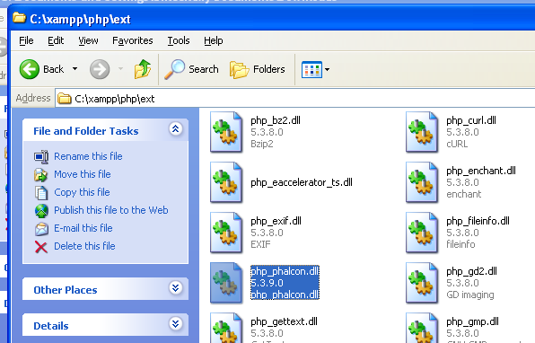
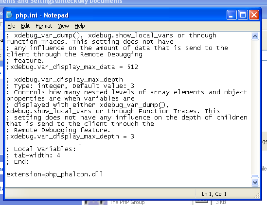
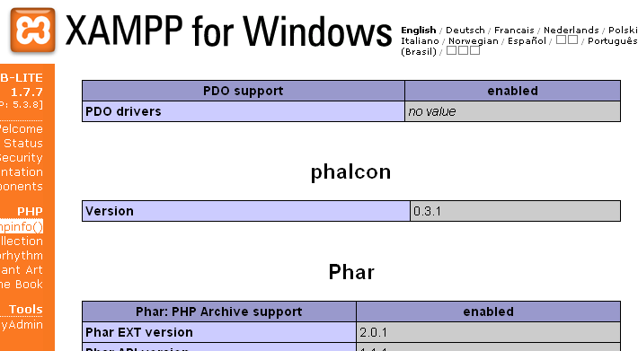

Установка на XAMPP
==================
XAMPP_ представляет собой лёгкий вариант установки Apache в комплекте с MySQL, PHP и Perl. Просто скачав XAMPP его сразу можно использовать. Ниже представлена детальная инструкция по установке Phalcon на XAMPP для Windows. Крайне рекомендуем использовать последние версии XAMPP.

Скачайте правильную версию Phalcon
----------------------------------
XAMPP всегда выпускается с 32 разрядными версиями Apache и PHP. Вам необходимо так же скачивать x86 версию Phalcon для Windows в разделе скачиваний.

После скачивания библиотеки Phalcon у вас будет zip файл, примерно такой, как показано ниже:

.. figure:: ../_static/img/xampp-1.png
    :align: center

Распакуйте архив и получите файл библиотеки Phalcon DLL:

.. figure:: ../_static/img/xampp-2.png
    :align: center

Скопируйте файл php_phalcon.dll в каталог PHP расширений. Если вы установили XAMPP в каталог c:\\xampp, то расширения будут в c:\\xampp\\php\\ext

Отредактируйте ваш файл php.ini, он располагается в C:\\xampp\\php\\php.ini. Для редактирования можно использовать Блокнот или любую подобную программу. Мы рекомендуем использовать Notepad++ для избегания проблем с окончание и переводом строк. Добавьте в конец файла: extension=php_phalcon.dll и сохраните его.

Перезапустите сервер Apache из контрольной панели XAMPP. PHP должен загрузиться с новой конфигурацией.

.. figure:: ../_static/img/xampp-5.png
    :align: center

Откройте ваш браузер и перейдите на http://localhost. Должна появиться страница приветствия XAMPP. Нажмите на ссылку phpinfo().

.. figure:: ../_static/img/xampp-6.png
    :align: center

phpinfo() выводит обширную информацию о текущем состоянии PHP. Прокрутите страницу ниже и убедитесь что расширение phalcon загружено корректно.

Если вы увидели версию phalcon в выдаче phpinfo(), поздравляем!, вы готовы к полёту с Phalcon.

Скринкаст
---------
Нижеприведённый скринкаст отображает пошаговую установку Phalcon на Windows:

.. raw:: html

   
<iframe src="http://player.vimeo.com/video/40265988" width="500" height="266" frameborder="0" webkitAllowFullScreen mozallowfullscreen allowFullScreen></iframe>

Дополнительные руководства
--------------------------
* :doc:`Информация по установке </reference/install>`
* :doc:`Подробная установка на WAMP для Windows </reference/wamp>`

.. _XAMPP: http://www.apachefriends.org/en/xampp-windows.html
