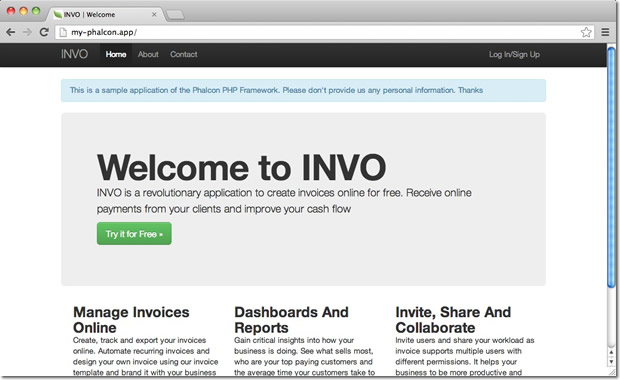

Cherokee 安装说明（Cherokee Installation Notes）
===========================
Cherokee_ 是一个高性能的web服务器。它非常快，运行稳定并且易于配置。

针对Phalcon的Cherokee配置
--------------------------------
Cherokee提供了友好的界面来设置几乎web服务器全部可用的配置。
使用root帐号执行 /path-to-cherokee/sbin/cherokee-admin 可以启动cherokee管理员。

.. figure:: ../_static/img/cherokee-1.jpg
    :align: center

Create a new virtual host by clicking on 'vServers', then add a new virtual server:

The recently added virtual server must appear at the left bar of the screen. In the 'Behaviors' tab
you will see a set of default behaviors for this virtual server. Click the 'Rule Management' button.
Remove those labeled as 'Directory /cherokee_themes' and 'Directory /icons':

.. figure:: ../_static/img/cherokee-3.jpg
    :align: center

Add the 'PHP Language' behavior using the wizard. This behavior allow you to run PHP applications:

.. figure:: ../_static/img/cherokee-4.jpg
    :align: center

Normally this behavior does not require additional settings. Add another behavior,
this time in the 'Manual Configuration' section. In 'Rule Type' choose 'File Exists',
then make sure the option 'Match any file' is enabled:

.. figure:: ../_static/img/cherokee-55.jpg
    :align: center

In the 'Handler' tab choose 'List & Send' as handler:

.. figure:: ../_static/img/cherokee-7.jpg
    :align: center

Edit the 'Default' behavior in order to enable the URL-rewrite engine. Change the handler to 'Redirection',
then add the following regular expression to the engine ^(.*)$:

.. figure:: ../_static/img/cherokee-6.jpg
    :align: center

Finally, make sure the behaviors have the following order:

.. figure:: ../_static/img/cherokee-8.jpg
    :align: center

Execute the application in a browser:

.. _Cherokee: http://www.cherokee-project.com/
