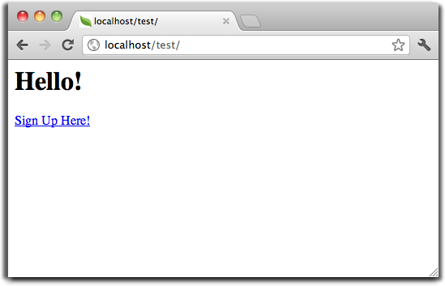
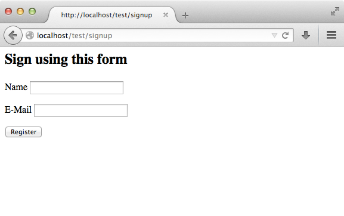
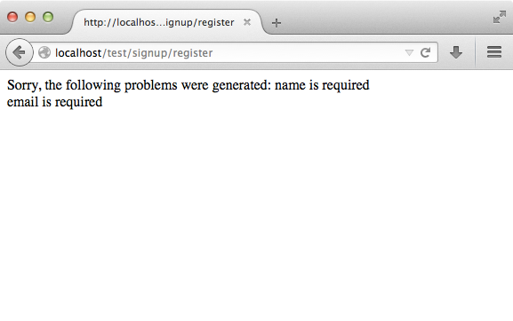

教程 1: 让我们先来学习一个例子
==================================

在本节教程中，我们将带您创建一个简单的注册表单的应用程序。
我们还将解释框架的行为的基本方面。如果你有对自动生成部分代码感兴趣，
您可以查看 :doc:`developer tools <tools>`.

检查您的安装
--------------------------
我们假设你已经安装了Phalcon,您可以利用Phpinfo()函数来进行输出查看是否有phalcon出现？

.. code-block:: php

    <?php print_r(get_loaded_extensions()); ?>

如果在下面出现了phalcon扩展的字样，那么说明你安装成功了:

.. code-block:: php

    Array
    (
        [0] => Core
        [1] => libxml
        [2] => filter
        [3] => SPL
        [4] => standard
        [5] => phalcon
        [6] => pdo_mysql
    )

创建一个项目
------------------
学习的最好方法是，您按照本教程的指引一步一步的进行. 您可以从此处获得完整的代码 `here <https://github.com/phalcon/tutorial>`_.

目录结构
^^^^^^^^^^^^^^
Phalcon 是松耦合的，因此并没有对文件的目录作固定，您可以根据您的需要或喜好，自定义文件目录结构

本教程的目的和出发点, 我们建议您使用以下类似的文件目录结构:

.. code-block:: php

    tutorial/
      app/
        controllers/
        models/
        views/
      public/
        css/
        img/
        js/

需要注意的是，您不需要包含任何类库到此项目中就可以工作了，因为Phalcon已经当作一个php模块加载进来了.
（译者备注）比如您使用ZF或者其他框架的时候，你要么include进来，要么在include_path中加入框架的路径。但Phalcon却不必这样。

完美漂亮的URL
^^^^^^^^^^^^^^
在本教程中，我们将教你如何做出漂亮的（友好的）网址。友好的URL非常有利于搜索引擎优化，因为它们很容易让用户记住。Phalcon支持最流行的Web服务器的重写。使您的应用程序的URL不完全依赖web server就可以写出很友好的格式。

在这个例子中，我们将使用为Apache重写模块。我们使用.htaccess文件的重写规则：

.. code-block:: apacheconf

    #/.htaccess
    <IfModule mod_rewrite.c>
        RewriteEngine on
        RewriteRule  ^$ public/    [L]
        RewriteRule  (.*) public/$1 [L]
    </IfModule>

All requests to the project will be rewritten to the public/ directory making it the document root. This step ensures that the internal project folders remain hidden from public viewing and thus posing security threats.

The second set of rules will check if the requested file exists, and if it does it doesn't have to be rewritten by the web server module:

.. code-block:: apacheconf

    #/public/.htaccess
    <IfModule mod_rewrite.c>
        RewriteEngine On
        RewriteCond %{REQUEST_FILENAME} !-d
        RewriteCond %{REQUEST_FILENAME} !-f
        RewriteRule ^(.*)$ index.php?_url=/$1 [QSA,L]
    </IfModule>

Bootstrap
^^^^^^^^^
第一步，你需要创建一个程序的引导文件，这个文件是非常重要的，因为它作为您的应用程序的基础，让你控制它的各个方面，在这个文件中，你可以实现初始化组件以及应用程序的行为

一般我们会以index.php为引导程序的入口程序，public/index.php 内容大致如下:

.. code-block:: php

    <?php

    try {

        //Register an autoloader
        $loader = new \Phalcon\Loader();
        $loader->registerDirs(array(
            '../app/controllers/',
            '../app/models/'
        ))->register();

        //Create a DI
        $di = new Phalcon\DI\FactoryDefault();

        //Setting up the view component
        $di->set('view', function(){
            $view = new \Phalcon\Mvc\View();
            $view->setViewsDir('../app/views/');
            return $view;
        });

        //Handle the request
        $application = new \Phalcon\Mvc\Application();
        $application->setDI($di);
        echo $application->handle()->getContent();

    } catch(\Phalcon\Exception $e) {
         echo "PhalconException: ", $e->getMessage();
    }

类的自动加载
^^^^^^^^^^^^^^^^^^
在第一部分，我们发现注册了首先定义了一个autoloader,它的作用是用来自动加载应用中的控制类及模型类等。我们用它可以灵活的加载一个目录或者多个目录中的类。在下面的例子中，我们将介绍如何使用Phalcon\Loader

有了它，我们可以使用不同的策略来加载类库。下面的例子是自动注册控制器类目录及模型类目录：

.. code-block:: php

    <?php

    $loader = new \Phalcon\Loader();
    $loader->registerDirs(
        array(
            '../app/controllers/',
            '../app/models/'
        )
    )->register();

依赖管理
^^^^^^^^^^^^^^^^^^^^^
使用Phalcon，你必须了解它的一个非常重要的概念，那就是他的依赖注入容器。听起来很复杂，但实际使用上它是非常简单和实用的。

译者注：学过或者对JAVA有些了解的人都应该十分熟悉依赖注入的概念，在早期这个概念被称作IOC(控制反转)，后期才被称作DI。它们分别是inversion of control，Dependency Injection的英文缩写。只是DI更能表达其含意，因此后来基本都叫做DI。对这个概念不太懂的人，可以搜索一个这两个英文单词，相信你会有不少收获。

一个服务容器就相当于一个袋子，用于存储我们应用将要用到的一些服务，每当框架需要一个组件，将要求服务容器首先注册这个服务组件。Phalcon是一个高度松耦合的框架，Phalcon\DI 将使这些要用到的服务组件透明的结合在一起。

.. code-block:: php

    <?php

    //Create a DI
    $di = new Phalcon\DI\FactoryDefault();

:doc:`Phalcon\\DI\\FactoryDefault <../api/Phalcon\_DI_FactoryDefault>` 是Phalcon\DI的一个默认实现，为了使开发更容易，它注册了大量的服务组件集成到Phalcon。因此，我们不需要再一个一个的注册这些组件，以后直接使用也没有问题。

在接下来的部分，我们将注册一个“view”视图组件，并指定视图文件所在目录，由于视图不同于类文件，它们不能被autoloader自动加载。

服务组件可以通过多种方式进行注册，在我们的教程中，我们将使用lambda的匿名函数方式进行注册

.. code-block:: php

    <?php

    //Setting up the view component
    $di->set('view', function(){
        $view = new \Phalcon\Mvc\View();
        $view->setViewsDir('../app/views/');
        return $view;
    });

在最后一部分，我们看到 :doc:`Phalcon\\Mvc\\Application <../api/Phalcon_Mvc_Application>`. 它的作用是初始化请求，对请求进行URL路由，分发响应，它收集所有的请求，执行并返回响应。

.. code-block:: php

    <?php

    $application = new \Phalcon\Mvc\Application();
    $application->setDI($di);
    echo $application->handle()->getContent();

正如你所看到的，程序的引导文件是很短的，并且不需要加载任何额外的文件，我们定义的一个MVC应用代码可以少于30行代码。

创建一个控制器
^^^^^^^^^^^^^^^^^^^^^
默认情况下，Phalcon的控制器名默认为 "index",这么做的原因是在请求中没有传递控制器及动作时，该控制器被自动调用（译者注：ZF等一些框架都是这么做的）默认的控制器(app/controllers/IndexController.php)大概是这个样子的：

.. code-block:: php

    <?php

    class IndexController extends \Phalcon\Mvc\Controller
    {

        public function indexAction()
        {
            echo "<h1>Hello!</h1>";
        }

    }

控制器的类名都必须以"Controller"结束，控制器类的方法名必须以"Action"结束，如果你通过浏览器访问应用，看到的是这个样子：

.. figure:: ../_static/img/tutorial-1.png
    :align: center

恭喜你，你的应用已经成功运行！

视图数据输出
^^^^^^^^^^^^^^^^^^^^^^^^
通过控制器向视图输出数据有时候是必要的，但大多数情况下被证实不太理想。Phalcon是根据控制器和动作在视图目录中找到相应的视图文件的，看例子  (app/views/index/index.phtml):

.. code-block:: php

    <?php echo "<h1>Hello!</h1>";

控制器 (app/controllers/IndexController.php) 定义了一个空的动作，即(indexAction):

.. code-block:: php

    <?php

    class IndexController extends \Phalcon\Mvc\Controller
    {

        public function indexAction()
        {

        }

    }

不出意外的话，会输出 'hello world'.在执行action的时候，视图组件 :doc:`Phalcon\\Mvc\\View <../api/Phalcon_Mvc_View>` 被自动创建。

设计一个注册表单
^^^^^^^^^^^^^^^^^^^^^^^^
现在我们将修改 index.phtml 视图文件，同时添加一个新的控制器文件，并命名为"signup".它的作用是让用户可以注册我们的应用。

.. code-block:: php

    <?php

    echo "<h1>Hello!</h1>";

    echo Phalcon\Tag::linkTo("signup", "Sign Up Here!");

以上代码会生成一个 html "A" 标签，连接到新的 signup 控制器上：

.. code-block:: html

    <h1>Hello!</h1> <a href="/test/signup">Sign Up Here!</a>

生成html标签，我们使用 :doc:`\Phalcon\\Tag <../api/Phalcon_Tag>`. 更多的html生成方式请查看 :doc:`found here <tags>`

下面是Signup控制器文件内容 (app/controllers/SignupController.php):

.. code-block:: php

    <?php

    class SignupController extends \Phalcon\Mvc\Controller
    {

        public function indexAction()
        {

        }

    }

The empty index action gives the clean pass to a view with the form definition:
视图文件内容 (app/views/sigup/index.phtml)

.. code-block:: html+php

    <?php use Phalcon\Tag; ?>

    <h2>Sign using this form</h2>

    <?php echo Tag::form("signup/register"); ?>

     

        <label for="name">Name</label>
        <?php echo Tag::textField("name") ?>
     

     

        <label for="name">E-Mail</label>
        <?php echo Tag::textField("email") ?>
     

     

        <?php echo Tag::submitButton("Register") ?>
     

    </form>

通过浏览器访问，显示结果如下:

:doc:`Phalcon\\Tag <../api/Phalcon_Tag>` 提供了很多的方法生成表章元素.

The Phalcon\\Tag::form method receives only one parameter for instance, a relative uri to a controller/action in the application.

点击 "Send" 按钮时，你会发现Phalcon会抛出一个异常，表明我们在控制器中缺少"register" Action, public/index.php 抛出的异常内容如下： 

    PhalconException: Action "register" was not found on controller "signup"

实现registerAction后，异常消除:

.. code-block:: php

    <?php

    class SignupController extends \Phalcon\Mvc\Controller
    {

        public function indexAction()
        {

        }

        public function registerAction()
        {

        }

    }

如果你点击"Send"按钮，将转到一个空白页面，表单中提交的name和email将存储到数据库，为了实现干净的面像对象，我们将使用models

Creating a Model
^^^^^^^^^^^^^^^^
Phalcon带来了第一个用C语言写的PHP ORM，它简化了开发的复杂性。

在创建我们的第一个Model之前，我们需要把数据表映射到model，即我们需要先创建数据库及数据表结构，一个简单的用户表结构:

.. code-block:: sql

    CREATE TABLE `users` (
      `id` int(10) unsigned NOT NULL AUTO_INCREMENT,
      `name` varchar(70) NOT NULL,
      `email` varchar(70) NOT NULL,
      PRIMARY KEY (`id`)
    );

一个model需要放到 app/models目录下，下面定义的 Users model将映射到 "users"数据表上:

.. code-block:: php

    <?php

    class Users extends \Phalcon\Mvc\Model
    {

    }

设置数据库连接
^^^^^^^^^^^^^^^^^^^^^^^^^^^^^
为了能够连接到数据库，并随后进行数据访问，通过我们创建的model,我们需要设定数据库连接。

数据库连接是另一种服务，我们的应用程序，由几部分组成：

.. code-block:: php

    <?php

    try {

        //Register an autoloader
        $loader = new \Phalcon\Loader();
        $loader->registerDirs(array(
            '../app/controllers/',
            '../app/models/'
        ))->register();

        //Create a DI
        $di = new Phalcon\DI\FactoryDefault();

        //Set the database service
        $di->set('db', function(){
            return new \Phalcon\Db\Adapter\Pdo\Mysql(array(
                "host" => "localhost",
                "username" => "root",
                "password" => "secret",
                "dbname" => "test_db"
            ));
        });

        //Setting up the view component
        $di->set('view', function(){
            $view = new \Phalcon\Mvc\View();
            $view->setViewsDir('../app/views/');
            return $view;
        });

        //Handle the request
        $application = new \Phalcon\Mvc\Application();
        $application->setDI($di);
        echo $application->handle()->getContent();

    } catch(\Phalcon\Exception $e) {
         echo "PhalconException: ", $e->getMessage();
    }

设置正确的数据库连接参数，我们创建的models才能正常工作。

使用models存储数据
^^^^^^^^^^^^^^^^^^^^^^^^^
接收由表单传过来的数据，并将他们存储到相应的数据表中

.. code-block:: php

    <?php

    class SignupController extends \Phalcon\Mvc\Controller
    {

        public function indexAction()
        {

        }

        public function registerAction()
        {

            //Request variables from html form
            $name = $this->request->getPost("name", "string");
            $email = $this->request->getPost("email", "email");

            $user = new Users();
            $user->name = $name;
            $user->email = $email;

            //Store and check for errors
            if ($user->save() == true) {
                echo "Thanks for register!";
            } else {
                echo "Sorry, the following problems were generated: ";
                foreach ($user->getMessages() as $message) {
                    echo $message->getMessage(), " ";
                }
            }
        }

    }

用户提交的任何数据都是不可信的，因此我们需要对用户提交的数据进行过滤，只有通过验证和过滤后的内容，才进行保存。这使得应用程序更安全，因为这样避免了常见的攻击，比如SQL注入等

在本节教程中，我们使用过滤器过滤一个字符串类型的表单变量，以确保用户提交的内容不包含恶意字符， :doc:`Phalcon\\Filter <../api/Phalcon_Filter>` 使得过滤任务不再复杂，因为我们可以直接使用request中的getPost调用

然后实际化Users类，它对应一个User，类的公共属性会映射到users数据表中的字段，通过调用save()方法把该条记录数据存储到数据表。save()方法返回一个 bool值，它告诉我们存储数据是否成功

译者注：save()方法是通过继承得来的，因为所有的Model都必须继承自 :doc:`Phalcon\\Mvc\\Model <../api/Phalcon_Mvc_Model>`。再注释一下，别太扣字眼，你当然也可以不继承自 Model，那么你就用不成model的相关功能了：）

其他的验证会自动发生，比如数据字段定义的not null，即类属性在保存时必须有值。如果我们不输入任何数据直接进行提交，将显示以下内容：

结束语
----------
这是一个非常简单的教程，你可以看到，你可以使用Phalcon很容易的创建一个应用程序，希望您继续阅读本手册，这样你就可以发现Phalcon提供的更多的附加功能！

其他的示例
-------------------
以下的示例也是使用Phalcon开发的，可以下载进行学习。同时欢迎提供更多的完整的示例程序：

* `INVO application`_: Invoice generation application. Allows for management of products, companies, product types. etc.
* `PHP Alternative website`_: Multilingual and advanced routing application.

.. _INVO application: http://blog.phalconphp.com/post/20928554661/invo-a-sample-application
.. _PHP Alternative website: http://blog.phalconphp.com/post/24622423072/sample-application-php-alternative-site

