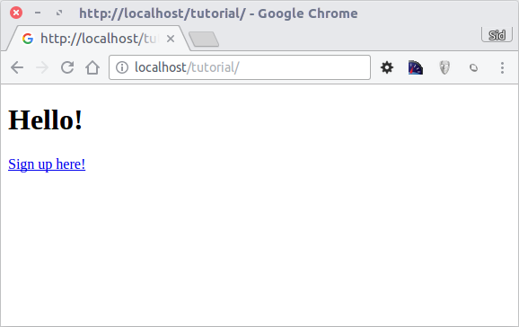
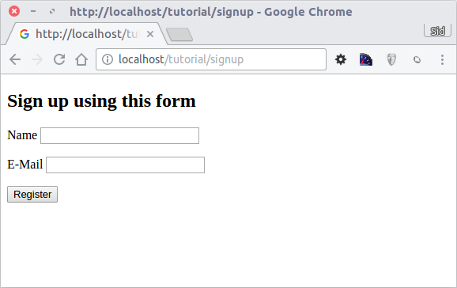

教程 1：让我们通过例子来学习（Tutorial 1: Let's learn by example）
==================================================================
通过这第一个教程，我们将引导您从基础完成创建简单的带有注册表单的应用。
我们也将解释框架行为的基本方面。如果您对Phalcon的自动代码生成工具有兴趣，
您可以查看 :doc:`developer tools <tools>`。

使用本指南的最好方法就是依次按照每一步来做。你可以得到完整的代码 `点击这里 <https://github.com/phalcon/tutorial>`_.

文件结构（File structure）
--------------------------
Phalcon不会强制要求应用程序的开发遵循特定的文件结构。因为它是松散耦合的，你可以实现Phalcon驱动的应用程序，以及使用对你来说最舒服的文件结构。

本教程的目的以此为起点，我们建议使用以下结构：

.. code-block:: php

    tutorial/
      app/
        controllers/
        models/
        views/
      public/
        css/
        img/
        js/

需要注意的是，你不需要任何有关Phalcon的 "library" 目录。该框架已经被加载到内存中，供您使用。

在此之前, 请确认你已经成功的 :doc:`installed Phalcon <install>`, 并设置了:doc:`Nginx <nginx>`, :doc:`Apache <apache>` 或者 :doc:`Cherokee <cherokee>`.

引导程序（Bootstrap）
---------------------
你需要创建的第一个文件是引导文件。这个文件很重要; 因为它作为你的应用程序的基础，用它来控制应用程序的各个方面。
在这个文件中，你可以实现组件的初始化和应用程序的行为。

基本上, 它负责做三件事情:

1. 设置自动加载器.
2. 配置依赖注入.
3. 处理应用请求.

自动加载（Autoloaders）
^^^^^^^^^^^^^^^^^^^^^^^
我们可以看出，引导程序的第一部分是注册一个自动加载器。在这个应用程序里，它将用于加载控制器和模型类。例如，我们可以为控制器注册一个或多个目录来增加应用程序的灵活性的。在我们的例子中，我们使用了 :doc:`Phalcon\\Loader <../api/Phalcon_Loader>` 组件。

有了它，我们可以加载使用各种策略类，但在这个例子中，我们选择了在预定义的目录中查找类：

.. code-block:: php

    <?php

    use Phalcon\Loader;

    // ...

    $loader = new Loader();

    $loader->registerDirs(
        [
            "../app/controllers/",
            "../app/models/",
        ]
    );

    $loader->register();

依赖管理（Dependency Management）
^^^^^^^^^^^^^^^^^^^^^^^^^^^^^^^^^
在使用Phalcon时必须理解的一个非常重要的概念是 :doc:`依赖注入容器(dependency injection container) <di>`. 这听起来复杂,但实际上非常简单实用。

服务容器是一个全局存储的将要被使用的应用程序功能包。每次框架需要的一个组件时，会请求这个使用协定好名称的服务容器。因为Phalcon是一个高度解耦的框架， :doc:`Phalcon\\Di <../api/Phalcon_Di>` 作为黏合剂，促使不同组件的集成，以一个透明的方式实现他们一起进行工作。

.. code-block:: php

    <?php

    use Phalcon\Di\FactoryDefault;

    // ...

    // 创建一个 DI
    $di = new FactoryDefault();

:doc:`Phalcon\\Di\\FactoryDefault <../api/Phalcon_Di_FactoryDefault>` 是 :doc:`Phalcon\\Di <../api/Phalcon_Di>` 的一个变体。为了让事情变得更容易，它已注册了Phalcon的大多数组件。
因此，我们不需要一个一个注册这些组件。在以后更换工厂服务的时候也不会有什么问题。

在接下来的部分，我们注册了“视图(view)”服务，指示框架将去指定的目录寻找视图文件。由于视图并非PHP类，它们不能被自动加载器加载。

服务可以通过多种方式进行登记，但在我们的教程中，我们将使用一个匿名函数 `anonymous function`_:

.. code-block:: php

    <?php

    use Phalcon\Mvc\View;

    // ...

    // 设置视图组件
    $di->set(
        "view",
        function () {
            $view = new View();

            $view->setViewsDir("../app/views/");

            return $view;
        }
    );

接下来，我们注册一个基础URI，这样通过Phalcon生成包括我们之前设置的“tutorial”文件夹在内的所有的URI。
我们使用类  :doc:`Phalcon\\Tag <../api/Phalcon_Tag>`  生成超链接，这将在本教程后续部分很重要。

.. code-block:: php

    <?php

    use Phalcon\Mvc\Url as UrlProvider;

    // ...

    // 设置一个基础URI, 这样所有生成的URI都包含"tutorial"文件夹
    $di->set(
        "url",
        function () {
            $url = new UrlProvider();

            $url->setBaseUri("/tutorial/");

            return $url;
        }
    );

处理应用请求(Handling the application request)
^^^^^^^^^^^^^^^^^^^^^^^^^^^^^^^^
在这个文件的最后部分，我们发现 :doc:`Phalcon\\Mvc\\Application <../api/Phalcon_Mvc_Application>`。其目的是初始化请求环境，并接收路由到来的请求，接着分发任何发现的动作；收集所有的响应，并在过程完成后返回它们。

.. code-block:: php

    <?php

    use Phalcon\Mvc\Application;

    // ...

    $application = new Application($di);

    $response = $application->handle();

    $response->send();

把每个组件组合在一起(Putting everything together)
^^^^^^^^^^^^^^^^^^^^^^^^^^^
这个引导文件 tutorial/public/index.php 文件应该看起来像:

.. code-block:: php

    <?php

    use Phalcon\Loader;
    use Phalcon\Mvc\View;
    use Phalcon\Mvc\Application;
    use Phalcon\Di\FactoryDefault;
    use Phalcon\Mvc\Url as UrlProvider;
    use Phalcon\Db\Adapter\Pdo\Mysql as DbAdapter;

    // 注册一个自动加载器
    $loader = new Loader();

    $loader->registerDirs(
        [
            "../app/controllers/",
            "../app/models/",
        ]
    );

    $loader->register();

    // 创建一个 DI
    $di = new FactoryDefault();

    // 设置视图组件
    $di->set(
        "view",
        function () {
            $view = new View();

            $view->setViewsDir("../app/views/");

            return $view;
        }
    );

    // 设置一个基础URI, 这样所有生成的URI都包含"tutorial"文件夹
    $di->set(
        "url",
        function () {
            $url = new UrlProvider();

            $url->setBaseUri("/tutorial/");

            return $url;
        }
    );

    $application = new Application($di);

    try {
        // 处理请求
        $response = $application->handle();

        $response->send();
    } catch (\Exception $e) {
        echo "Exception: ", $e->getMessage();
    }

正如你所看到的，引导文件很短，我们并不需要引入任何其他文件。在不到30行的代码里，我们已经为自己设定一个灵活的MVC应用程序。

创建控制器（Creating a Controller）
-----------------------------------
默认情况下Phalcon会寻找一个名为“Index”的控制器。当请求中没有控制器或动作时，则使用“Index”控制器作为起点。这个“Index”控制器 (app/controllers/IndexController.php) 看起来类似：

.. code-block:: php

    <?php

    use Phalcon\Mvc\Controller;

    class IndexController extends Controller
    {
        public function indexAction()
        {
            echo "<h1>Hello!</h1>";
        }
    }

该控制器类必须有“Controller”后缀，且控制器动作必须有“Action”后缀。如果你从浏览器访问应用程序，你应该看到这样的事情：

.. figure:: ../_static/img/tutorial-1.png
    :align: center

恭喜, 让Phalcon带你飞!

输出到视图（Sending output to a view）
--------------------------------------
从控制器发送输出到屏幕上有时是必要的，但是在MVC社区，大多数纯粹主义者证明这样做不可取。一切必须传递给视图，视图负责在屏幕上输出数据。Phalcon将在最后执行的控制器的同名目录中，查找最后执行的动作的同名的视图。在我们的例子 (app/views/index/index.phtml) ：

.. code-block:: php

    <?php echo "<h1>Hello!</h1>";

我们的控制器 (app/controllers/IndexController.php) 现在定义了一个空的动作：

.. code-block:: php

    <?php

    use Phalcon\Mvc\Controller;

    class IndexController extends Controller
    {
        public function indexAction()
        {

        }
    }

浏览器输出应该保持不变。当这个动作已经执行结束 :doc:`Phalcon\\Mvc\\View <../api/Phalcon_Mvc_View>` 静态组件会自动创建。
学习更多关于 :doc:`视图使用教程 <views>` 。

设计注册表单（Designing a sign up form）
----------------------------------------
现在我们将改变index.phtml视图文件，添加一个链接到一个名为“signup”的新控制器。我们的目标是在应用程序中允许用户注册。

.. code-block:: php

    <?php

    echo "<h1>Hello!</h1>";

    echo PHP_EOL;

    echo PHP_EOL;

    echo $this->tag->linkTo(
        "signup",
        "Sign Up Here!"
    );

生成的HTML代码显示一个锚 ("a") HTML标签链接到一个新的控制器：

.. code-block:: html

    <h1>Hello!</h1>

    <a href="/tutorial/signup">Sign Up Here!</a>

我们使用类 :doc:`Phalcon\\Tag <../api/Phalcon_Tag>` 去生成标记。 这是一个让我们构建HTML标记的实用类。 关于生成HTML更详细的文章可以查看 :doc:`视图助手 <tags>`

这是一个注册控制器 (app/controllers/SignupController.php):

.. code-block:: php

    <?php

    use Phalcon\Mvc\Controller;

    class SignupController extends Controller
    {
        public function indexAction()
        {

        }
    }

这个空index动作整洁的传递了表单定义给一个视图 (app/views/signup/index.phtml):

.. code-block:: html+php

    <h2>
        Sign up using this form
    </h2>

    <?php echo $this->tag->form("signup/register"); ?>

        

            <label for="name">
                Name
            </label>

            <?php echo $this->tag->textField("name"); ?>
        

        

            <label for="email">
                E-Mail
            </label>

            <?php echo $this->tag->textField("email"); ?>
        

        

            <?php echo $this->tag->submitButton("Register"); ?>
        

    </form>

在浏览器中查看表单将显示类似的页面：

:doc:`Phalcon\\Tag <../api/Phalcon_Tag>` 还提供了有用的方法来构建表单元素。

:code:`Phalcon\Tag::form()` 方法只接受一个参数实例, 一个相对uri到这个应用的一个控制器/动作。

通过单击“Send”按钮，您将注意到框架抛出了一个异常，这表明我们是错过了在控制器中注册“register”动作。我们的 public/index.php 文件抛出这个异常：

    Exception: Action "register" was not found on handler "signup"

实现该方法将移除异常：

.. code-block:: php

    <?php

    use Phalcon\Mvc\Controller;

    class SignupController extends Controller
    {
        public function indexAction()
        {

        }

        public function registerAction()
        {

        }
    }

如果你再点击“Send”按钮,您将看到一个空白页。提供的名称和电子邮件的输入的这个用户应该被存储在数据库中。根据MVC的指导方针,必须通过数据库交互模型，确保整洁的面向对象的代码。

创建模型（Creating a Model）
----------------------------
Phalcon带来的第一个完全用C语言编写的PHP ORM。它简化了开发， 而不是增加了开发的复杂性。

创建我们的第一个模型之前，我们需要在Phalcon以外创建一个数据库表。一个用来存储注册用户的简单表，可以这样定义：

.. code-block:: sql

    CREATE TABLE `users` (
        `id`    int(10)     unsigned NOT NULL AUTO_INCREMENT,
        `name`  varchar(70)          NOT NULL,
        `email` varchar(70)          NOT NULL,

        PRIMARY KEY (`id`)
    );

模型应该位于 app/models 目录 (app/models/Users.php). 这个模型对应“users”表:

.. code-block:: php

    <?php

    use Phalcon\Mvc\Model;

    class Users extends Model
    {
        public $id;

        public $name;

        public $email;
    }

设置数据库连接（Setting a Database Connection）
-----------------------------------------------
为了能够使用一个数据库连接，然后通过我们的模型访问数据，我们需要在我们的引导过程指定它。数据库连接是我们的应用程序可以使用的数个组件中的另一个服务：

.. code-block:: php

    <?php

    use Phalcon\Db\Adapter\Pdo\Mysql as DbAdapter;

    // 设置数据库服务
    $di->set(
        "db",
        function () {
            return new DbAdapter(
                [
                    "host"     => "localhost",
                    "username" => "root",
                    "password" => "secret",
                    "dbname"   => "test_db",
                ]
            );
        }
    );

使用正确的数据库参数，我们的模型已经准备和应用程序的其余部分工作。

使用模型保存数据（Storing data using models）
---------------------------------------------
下一个步骤是从表单接收数据存储在表中。

.. code-block:: php

    <?php

    use Phalcon\Mvc\Controller;

    class SignupController extends Controller
    {
        public function indexAction()
        {

        }

        public function registerAction()
        {
            $user = new Users();

            // 存储和检验错误
            $success = $user->save(
                $this->request->getPost(),
                [
                    "name",
                    "email",
                ]
            );

            if ($success) {
                echo "Thanks for registering!";
            } else {
                echo "Sorry, the following problems were generated: ";

                $messages = $user->getMessages();

                foreach ($messages as $message) {
                    echo $message->getMessage(), " ";
                }
            }

            $this->view->disable();
        }
    }

然后我们实例化用户类，它对应于一个用户记录。类的公共属性映射到用户表中的记录的字段。在新记录中设置相应的值并调用:code:`save()`将在数据库中存储的数据记录。:code:`save()`方法返回一个布尔值，表示存储的数据是否成功。

ORM自动转义输入以防止SQL注入，所以我们只需要将请求传递给:code:`save()`方法。

附加的自动验证会验证字段定义为not null(必需)。如果我们不输入任何必需的注册表单中的字段，我们的屏幕将会看起来像这样：

.. figure:: ../_static/img/tutorial-4.png
    :align: center

结束语（Conclusion）
--------------------
这是一个非常简单的教程，正如你所看到的，使用Phalcon很容易开始构建应用程序。Phalcon是一个在你的web服务器上没有干扰、易于开发、特性优良的扩展。我们邀请你继续阅读手册，这样你就可以发现Phalcon提供的附加功能!

.. _anonymous function: http://php.net/manual/zh/functions.anonymous.php
