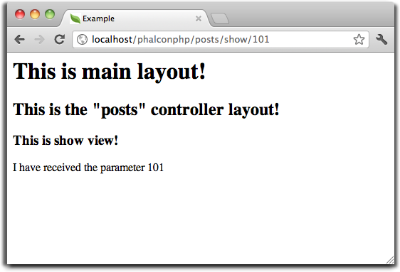

使用视图（Using Views）
=======================

视图代表了应用程序中的用户界面. 视图通常是在 HTML 文件里嵌入 PHP 代码，这些代码仅仅是用来展示数据。
视图的任务是当应用程序发生请求时，提供数据给 web 浏览器或者其他工具。

:doc:`Phalcon\\Mvc\\View <../api/Phalcon_Mvc_View>` 和 :doc:`Phalcon\\Mvc\\View\\Simple <../api/Phalcon_Mvc_View_Simple>`
负责管理你的MVC应用程序的视图(View)层。

集成视图到控制器（Integrating Views with Controllers）
------------------------------------------------------
当某个控制器已经完成了它的周期，Phalcon自动将执行传递到视图组件。视图组件将在视图文件夹中寻找一个文件夹名与最后一个控制器名相同,文件命名与最后一个动作相同的文件执行。例如，如果请求的URL *http://127.0.0.1/blog/posts/show/301*, Phalcon将如下所示的方式按解析URL:

+-------------------+-----------+
| Server Address    | 127.0.0.1 |
+-------------------+-----------+
| Phalcon Directory | blog      |
+-------------------+-----------+
| Controller        | posts     |
+-------------------+-----------+
| Action            | show      |
+-------------------+-----------+
| Parameter         | 301       |
+-------------------+-----------+

调度程序将寻找一个“PostsController”控制器及其“showAction”动作。对于这个示例的一个简单的控制器文件：

.. code-block:: php

    <?php

    use Phalcon\Mvc\Controller;

    class PostsController extends Controller
    {
        public function indexAction()
        {

        }

        public function showAction($postId)
        {
            // Pass the $postId parameter to the view
            $this->view->postId = $postId;
        }
    }

setVar允许我们创建视图变量，这样可以在视图模板中使用它们。上面的示例演示了如何传递 :code:`$postId` 参数到相应的视图模板。

分层渲染（Hierarchical Rendering）
----------------------------------
:doc:`Phalcon\\Mvc\\View <../api/Phalcon_Mvc_View>` 支持文件的层次结构，在Phalcon中是默认的视图渲染组件。这个层次结构允许通用的布局点(常用的视图)和以控制器命名的文件夹中定义各自的视图模板

该组件使用默认PHP本身作为模板引擎，因此视图应该以.phtml作为拓展名。如果视图目录是 *app/views* ，视图组件会自动找到这三个视图文件。

+-------------------+-------------------------------+-------------------------------------------------------------------------------------------------------------------+
| 名称              | 文件                          | 解释                                                                                                              |
+===================+===============================+===================================================================================================================+
| Action View       | app/views/posts/show.phtml    | 这是该动作相关的视图。它只会在执行 "show" 动作时显示。                                                            |
+-------------------+-------------------------------+-------------------------------------------------------------------------------------------------------------------+
| Controller Layout | app/views/layouts/posts.phtml | 这是该控制器相关的视图。它只会 "posts" 控制器内每个动作执行时显示。这个控制器的所有动作将重用这个布局的全部代码。 |
+-------------------+-------------------------------+-------------------------------------------------------------------------------------------------------------------+
| Main Layout       | app/views/index.phtml         | 这是主布局，它将在应用程序的每个控制器或动作执行时显示。                                                          |
+-------------------+-------------------------------+-------------------------------------------------------------------------------------------------------------------+

你不需要实现上面提到的所有文件。在文件的层次结构中 :doc:`Phalcon\\Mvc\\View <../api/Phalcon_Mvc_View>` 将简单地移动到下一个视图级别。如果这三个视图文件被实现，他们将被按下面方式处理:

.. code-block:: html+php

    <!-- app/views/posts/show.phtml -->

    <h3>This is show view!</h3>

    
I have received the parameter <?php echo $postId; ?>

.. code-block:: html+php

    <!-- app/views/layouts/posts.phtml -->

    <h2>This is the "posts" controller layout!</h2>

    <?php echo $this->getContent(); ?>

.. code-block:: html+php

    <!-- app/views/index.phtml -->
    <html>
        <head>
            <title>Example</title>
        </head>
        <body>

            <h1>This is main layout!</h1>

            <?php echo $this->getContent(); ?>

        </body>
    </html>

注意方法 :code:`$this->getContent()` 被调用的这行。这种方法指示 :doc:`Phalcon\\Mvc\\View <../api/Phalcon_Mvc_View>` 在这里注入前面视图层次结构执行的内容。在上面的示例中，输出将会是：

请求生成的HTML的将为：

.. code-block:: html+php

    <!-- app/views/index.phtml -->
    <html>
        <head>
            <title>Example</title>
        </head>
        <body>

            <h1>This is main layout!</h1>

            <!-- app/views/layouts/posts.phtml -->

            <h2>This is the "posts" controller layout!</h2>

            <!-- app/views/posts/show.phtml -->

            <h3>This is show view!</h3>

            
I have received the parameter 101

        </body>
    </html>

使用模版（Using Templates）
^^^^^^^^^^^^^^^^^^^^^^^^^^^
模板视图可以用来分享共同的视图代码。他们作为控制器的布局，所以你需要放在布局目录。

模板视图可以在布局之前渲染(使用 :code:`$this->view->setTemplateBefore()` 方法) ，也可以布局之后渲染(使用 :code:`this->view->setTemplateAfter()` 方法)。
下面的例子中，模板视图(layouts/common.phtml)是在布局(layouts/posts.phtml)之后渲染的:

.. code-block:: php

    <?php

    use Phalcon\Mvc\Controller;

    class PostsController extends Controller
    {
        public function initialize()
        {
            $this->view->setTemplateAfter("common");
        }

        public function lastAction()
        {
            $this->flash->notice(
                "These are the latest posts"
            );
        }
    }

.. code-block:: html+php

    <!-- app/views/index.phtml -->
    <!DOCTYPE html>
    <html>
        <head>
            <title>Blog's title</title>
        </head>
        <body>
            <?php echo $this->getContent(); ?>
        </body>
    </html>

.. code-block:: html+php

    <!-- app/views/layouts/common.phtml -->

    <ul class="menu">
        <li><a href="/">Home</a></li>
        <li><a href="/articles">Articles</a></li>
        <li><a href="/contact">Contact us</a></li>
    </ul>

    
<?php echo $this->getContent(); ?>

.. code-block:: html+php

    <!-- app/views/layouts/posts.phtml -->

    <h1>Blog Title</h1>

    <?php echo $this->getContent(); ?>

.. code-block:: html+php

    <!-- app/views/posts/last.phtml -->

    <article>
        <h2>This is a title</h2>
        
This is the post content

    </article>

    <article>
        <h2>This is another title</h2>
        
This is another post content

    </article>

最终的输出如下:

.. code-block:: html+php

    <!-- app/views/index.phtml -->
    <!DOCTYPE html>
    <html>
        <head>
            <title>Blog's title</title>
        </head>
        <body>

            <!-- app/views/layouts/common.phtml -->

            <ul class="menu">
                <li><a href="/">Home</a></li>
                <li><a href="/articles">Articles</a></li>
                <li><a href="/contact">Contact us</a></li>
            </ul>

            

                <!-- app/views/layouts/posts.phtml -->

                <h1>Blog Title</h1>

                <!-- app/views/posts/last.phtml -->

                <article>
                    <h2>This is a title</h2>
                    
This is the post content

                </article>

                <article>
                    <h2>This is another title</h2>
                    
This is another post content

                </article>

            

        </body>
    </html>

如果我们调用 :code:`$this->view->setTemplateBefore("common")` 方法, 最终输出如下:

.. code-block:: html+php

    <!-- app/views/index.phtml -->
    <!DOCTYPE html>
    <html>
        <head>
            <title>Blog's title</title>
        </head>
        <body>

            <!-- app/views/layouts/posts.phtml -->

            <h1>Blog Title</h1>

            <!-- app/views/layouts/common.phtml -->

            <ul class="menu">
                <li><a href="/">Home</a></li>
                <li><a href="/articles">Articles</a></li>
                <li><a href="/contact">Contact us</a></li>
            </ul>

            

                <!-- app/views/posts/last.phtml -->

                <article>
                    <h2>This is a title</h2>
                    
This is the post content

                </article>

                <article>
                    <h2>This is another title</h2>
                    
This is another post content

                </article>

            

        </body>
    </html>

渲染级别控制（Control Rendering Levels）
^^^^^^^^^^^^^^^^^^^^^^^^^^^^^^^^^^^^^^^^
如上所述，:doc:`Phalcon\\Mvc\\View <../api/Phalcon_Mvc_View>` 支持视图分层。你可能需要控制视图组件的渲染级别。方法 :code:`Phalcon\Mvc\View::setRenderLevel()` 提供这个功能。

这种方法可以从控制器调用或是从上级视图层干涉渲染过程。

.. code-block:: php

    <?php

    use Phalcon\Mvc\View;
    use Phalcon\Mvc\Controller;

    class PostsController extends Controller
    {
        public function indexAction()
        {

        }

        public function findAction()
        {
            // This is an Ajax response so it doesn't generate any kind of view
            $this->view->setRenderLevel(
                View::LEVEL_NO_RENDER
            );

            // ...
        }

        public function showAction($postId)
        {
            // Shows only the view related to the action
            $this->view->setRenderLevel(
                View::LEVEL_ACTION_VIEW
            );
        }
    }

可用的渲染级别:

+-----------------------+--------------------------------------------------------------------------+-------+
| 类常量                | 解释                                                                     | 顺 序 |
+=======================+==========================================================================+=======+
| LEVEL_NO_RENDER       | 表明要避免产生任何形式的显示。                                           |       |
+-----------------------+--------------------------------------------------------------------------+-------+
| LEVEL_ACTION_VIEW     | 生成显示到视图关联的动作。                                               | 1     |
+-----------------------+--------------------------------------------------------------------------+-------+
| LEVEL_BEFORE_TEMPLATE | 生成显示到控制器模板布局之前。                                           | 2     |
+-----------------------+--------------------------------------------------------------------------+-------+
| LEVEL_LAYOUT          | 生成显示到控制器布局。                                                   | 3     |
+-----------------------+--------------------------------------------------------------------------+-------+
| LEVEL_AFTER_TEMPLATE  | 生成显示到控制器模板布局后。                                             | 4     |
+-----------------------+--------------------------------------------------------------------------+-------+
| LEVEL_MAIN_LAYOUT     | 生成显示到主布局。文件： views/index.phtml                               | 5     |
+-----------------------+--------------------------------------------------------------------------+-------+

关闭渲染级别（Disabling render levels）
^^^^^^^^^^^^^^^^^^^^^^^^^^^^^^^^^^^^^^^
你可以永久或暂时禁用渲染级别。如果不在整个应用程序使用，可以永久禁用一个级别：

.. code-block:: php

    <?php

    use Phalcon\Mvc\View;

    $di->set(
        "view",
        function () {
            $view = new View();

            // Disable several levels
            $view->disableLevel(
                [
                    View::LEVEL_LAYOUT      => true,
                    View::LEVEL_MAIN_LAYOUT => true,
                ]
            );

            return $view;
        },
        true
    );

或者在某些应用程序的一部分暂时或禁用:

.. code-block:: php

    <?php

    use Phalcon\Mvc\View;
    use Phalcon\Mvc\Controller;

    class PostsController extends Controller
    {
        public function indexAction()
        {

        }

        public function findAction()
        {
            $this->view->disableLevel(
                View::LEVEL_MAIN_LAYOUT
            );
        }
    }

选择视图（Picking Views）
^^^^^^^^^^^^^^^^^^^^^^^^^
如上所述, 当 :doc:`Phalcon\\Mvc\\View <../api/Phalcon_Mvc_View>` 由 :doc:`Phalcon\\Mvc\\Application <../api/Phalcon_Mvc_Application>` 视图渲染的是最后的一个相关的控制器和执行动作。你可以使用 :code:`Phalcon\Mvc\View::pick()` 方法覆盖它。

.. code-block:: php

    <?php

    use Phalcon\Mvc\Controller;

    class ProductsController extends Controller
    {
        public function listAction()
        {
            // Pick "views-dir/products/search" as view to render
            $this->view->pick("products/search");

            // Pick "views-dir/books/list" as view to render
            $this->view->pick(
                [
                    "books",
                ]
            );

            // Pick "views-dir/products/search" as view to render
            $this->view->pick(
                [
                    1 => "search",
                ]
            );
        }
    }

关闭视图（Disabling the view）
^^^^^^^^^^^^^^^^^^^^^^^^^^^^^^
如果你的控制器不在视图里产生(或没有)任何输出，你可以禁用视图组件来避免不必要的处理：

.. code-block:: php

    <?php

    use Phalcon\Mvc\Controller;

    class UsersController extends Controller
    {
        public function closeSessionAction()
        {
            // Close session
            // ...

            // Disable the view to avoid rendering
            $this->view->disable();
        }
    }

Alternatively, you can return :code:`false` to produce the same effect:

.. code-block:: php

    <?php

    use Phalcon\Mvc\Controller;

    class UsersController extends Controller
    {
        public function closeSessionAction()
        {
            // ...

            // Disable the view to avoid rendering
            return false;
        }
    }

你可以返回一个“response”的对象，避免手动禁用视图:

.. code-block:: php

    <?php

    use Phalcon\Mvc\Controller;

    class UsersController extends Controller
    {
        public function closeSessionAction()
        {
            // Close session
            // ...

            // A HTTP Redirect
            return $this->response->redirect("index/index");
        }
    }

简单渲染（Simple Rendering）
----------------------------
:doc:`Phalcon\\Mvc\\View\\Simple <../api/Phalcon_Mvc_View_Simple>` 是 :doc:`Phalcon\\Mvc\\View <../api/Phalcon_Mvc_View>` 的另一个组成部分。
它保留 :doc:`Phalcon\\Mvc\\View <../api/Phalcon_Mvc_View>` 的大多数的设计思想，但缺少文件的层次结构是它们的主要区别。

该组件允许开发人员控制渲染视图时，视图所在位置。
此外，该组件可以利用从视图中继承的可用的模板引擎。比如 :doc:`Volt <volt>` 和其他的一些模板引擎。

默认使用该组件必须替换服务容器：

.. code-block:: php

    <?php

    use Phalcon\Mvc\View\Simple as SimpleView;

    $di->set(
        "view",
        function () {
            $view = new SimpleView();

            $view->setViewsDir("../app/views/");

            return $view;
        },
        true
    );

自动渲染必须在 :doc:`Phalcon\\Mvc\\Application <applications>` 被禁用 (如果需要):

.. code-block:: php

    <?php

    use Exception;
    use Phalcon\Mvc\Application;

    try {
        $application = new Application($di);

        $application->useImplicitView(false);

        $response = $application->handle();

        $response->send();
    } catch (Exception $e) {
        echo $e->getMessage();
    }

渲染一个视图必须显式地调用render方法来指定你想显示的视图的相对路径：

.. code-block:: php

    <?php

    use Phalcon\Mvc\Controller;

    class PostsController extends \Controller
    {
        public function indexAction()
        {
            // Render 'views-dir/index.phtml'
            echo $this->view->render("index");

            // Render 'views-dir/posts/show.phtml'
            echo $this->view->render("posts/show");

            // Render 'views-dir/index.phtml' passing variables
            echo $this->view->render(
                "index",
                [
                    "posts" => Posts::find(),
                ]
            );

            // Render 'views-dir/posts/show.phtml' passing variables
            echo $this->view->render(
                "posts/show",
                [
                    "posts" => Posts::find(),
                ]
            );
        }
    }

This is different to :doc:`Phalcon\\Mvc\\View <../api/Phalcon_Mvc_View>` who's :code:`render()` method uses controllers and actions as parameters:

.. code-block:: php

    <?php

    $params = [
        "posts" => Posts::find(),
    ];

    // Phalcon\Mvc\View
    $view = new \Phalcon\Mvc\View();
    echo $view->render("posts", "show", $params);

    // Phalcon\Mvc\View\Simple
    $simpleView = new \Phalcon\Mvc\View\Simple();
    echo $simpleView->render("posts/show", $params);

使用局部模版（Using Partials）
------------------------------
局部模板是把渲染过程分解成更简单、更好管理的、可以重用不同部分的应用程序块的另一种方式。你可以移动渲染特定响应的代码块到自己的文件。

使用局部模板的一种方法是把它们作为相等的子例程：作为一种移动细节视图，这样您的代码可以更容易地被理解。例如，您可能有一个视图看起来像这样：

.. code-block:: html+php

    
<?php $this->partial("shared/ad_banner"); ?>

    

        <h1>Robots</h1>

        
Check out our specials for robots:

        ...
    

    
<?php $this->partial("shared/footer"); ?>

方法 :code:`partial()` 也接受一个只存在于局部范围的变量/参数的数组作为第二个参数:

.. code-block:: html+php

    <?php $this->partial("shared/ad_banner", ["id" => $site->id, "size" => "big"]); ?>

控制器传值给视图（Transfer values from the controller to views）
----------------------------------------------------------------
:doc:`Phalcon\\Mvc\\View <../api/Phalcon_Mvc_View>` 可以在每个控制器中使用视图变量 (:code:`$this->view`)。 你可以在控制器动作中使用视图对象的 :code:`setVar()` 方法直接设置视图变量。

.. code-block:: php

    <?php

    use Phalcon\Mvc\Controller;

    class PostsController extends Controller
    {
        public function indexAction()
        {

        }

        public function showAction()
        {
            $user  = Users::findFirst();
            $posts = $user->getPosts();

            // Pass all the username and the posts to the views
            $this->view->setVar("username", $user->username);
            $this->view->setVar("posts",    $posts;

            // Using the magic setter
            $this->view->username = $user->username;
            $this->view->posts    = $posts;

            // Passing more than one variable at the same time
            $this->view->setVars(
                [
                    "username" => $user->username,
                    "posts"    => $posts,
                ]
            );
        }
    }

名为:code:`setVar()`的第一参数值的变量将在视图中创建的，并且可以被使用。变量可以是任何类型：从一个简单的字符串，整数等等，变为更复杂的结构，如数组，集合。

.. code-block:: html+php

    <h1>
        {{ username }}'s Posts
    </h1>

    

    <?php

        foreach ($posts as $post) {
            echo "<h2>", $post->title, "</h2>";
        }

    ?>
    

缓存视图片段（Caching View Fragments）
--------------------------------------
有时当你开发动态网站和一些区域不会经常更新，请求的输出是完全相同的。 :doc:`Phalcon\\Mvc\\View <../api/Phalcon_Mvc_View>` 提供缓存全部或部分的渲染输出来提高性能。

将 :doc:`Phalcon\\Mvc\\View <../api/Phalcon_Mvc_View>` 配合 :doc:`Phalcon\\Cache <cache>` 能提供一种更简单的方法缓存输出片段。你可以手动设置缓存处理程序或一个全局处理程序。

.. code-block:: php

    <?php

    use Phalcon\Mvc\Controller;

    class PostsController extends Controller
    {
        public function showAction()
        {
            // Cache the view using the default settings
            $this->view->cache(true);
        }

        public function showArticleAction()
        {
            // Cache this view for 1 hour
            $this->view->cache(
                [
                    "lifetime" => 3600,
                ]
            );
        }

        public function resumeAction()
        {
            // Cache this view for 1 day with the key "resume-cache"
            $this->view->cache(
                [
                    "lifetime" => 86400,
                    "key"      => "resume-cache",
                ]
            );
        }

        public function downloadAction()
        {
            // Passing a custom service
            $this->view->cache(
                [
                    "service"  => "myCache",
                    "lifetime" => 86400,
                    "key"      => "resume-cache",
                ]
            );
        }
    }

如果我们没有定义缓存的key， 这个组件会自动创建一个 MD5_ 散列值(由当前控制器名和视图名组成"controller/view"的格式)作为key。
为每个action定义一个单独的缓存key，这是一个好的习惯与规范，这样你可以很容易地识别与每个视图相关联的缓存。

当视图组件需要缓存一些数据时，它会从服务容器(DI)中请求缓存服务。
这个服务的名称约定为"viewCache"：

.. code-block:: php

    <?php

    use Phalcon\Cache\Frontend\Output as OutputFrontend;
    use Phalcon\Cache\Backend\Memcache as MemcacheBackend;

    // Set the views cache service
    $di->set(
        "viewCache",
        function () {
            // Cache data for one day by default
            $frontCache = new OutputFrontend(
                [
                    "lifetime" => 86400,
                ]
            );

            // Memcached connection settings
            $cache = new MemcacheBackend(
                $frontCache,
                [
                    "host" => "localhost",
                    "port" => "11211",
                ]
            );

            return $cache;
        }
    );

.. highlights::
    前端 :doc:`Phalcon\\Cache\\Frontend\\Output <../api/Phalcon_Cache_Frontend_Output>` 和服务 'viewCache' 必须在服务容器（DI）注册为
    总是开放的（不共享 not shared）

在视图中使用视图缓存也是有用的，以防止控制器执行过程所产生的数据被显示。

为了实现这一点，我们必须确定每个缓存键是独一无二的。 首先，我们验证缓存不存在或是否过期，再去计算/查询并在视图中显示数据:

.. code-block:: html+php

    <?php

    use Phalcon\Mvc\Controller;

    class DownloadController extends Controller
    {
        public function indexAction()
        {
            // Check whether the cache with key "downloads" exists or has expired
            if ($this->view->getCache()->exists("downloads")) {
                // Query the latest downloads
                $latest = Downloads::find(
                    [
                        "order" => "created_at DESC",
                    ]
                );

                $this->view->latest = $latest;
            }

            // Enable the cache with the same key "downloads"
            $this->view->cache(
                [
                    "key" => "downloads",
                ]
            );
        }
    }

`PHP alternative site`_ 是实现缓存片段的一个例子。

模版引擎（Template Engines）
----------------------------
模板引擎可以帮助设计者不使用复杂的语法创建视图。Phalcon包含一个强大的和快速的模板引擎，它被叫做叫 :doc:`Volt <volt>`。

此外, :doc:`Phalcon\\Mvc\\View <../api/Phalcon_Mvc_View>` 允许你使用其它的模板引擎而不是简单的PHP或者Volt。

使用不同的模板引擎，通常需要使用外部PHP库并且引入复杂的文本解析来为用户生成最终的输出解析。这通常会增加一些你的应用程序的资源耗费。

如果一个外部模板引擎被使用，:doc:`Phalcon\\Mvc\\View <../api/Phalcon_Mvc_View>` 提供完全相同的视图渲染等级，仍然可以尝试在这些模板内访问的更多的API。

该组件使用的适配器，这些适配器帮助 Phalcon 与外部模板引擎以一个统一的方式对话，让我们看看如何整合。

创建模版引擎（Creating your own Template Engine Adapter）
^^^^^^^^^^^^^^^^^^^^^^^^^^^^^^^^^^^^^^^^^^^^^^^^^^^^^^^^^
有很多模板引擎，你可能想整合或建立一个自己的。开始使用一个外部的模板引擎的第一步是创建一个适配器。

模板引擎的适配器是一个类，作为 :doc:`Phalcon\\Mvc\\View <../api/Phalcon_Mvc_View>` 和模板引擎本身之间的桥梁。
通常它只需要实现两个方法: :code:`__construct()` and :code:`render()`。首先接收 :doc:`Phalcon\\Mvc\\View <../api/Phalcon_Mvc_View>` 和应用程序使用的DI容器来创建引擎适配器实例。

方法 :code:`render()` 接受一个到视图文件的绝对路径和视图参数，设置使用 :code:`$this->view->setVar()`。必要的时候，你可以读入或引入它。

.. code-block:: php

    <?php

    use Phalcon\DiInterface;
    use Phalcon\Mvc\Engine;

    class MyTemplateAdapter extends Engine
    {
        /**
         * Adapter constructor
         *
         * @param \Phalcon\Mvc\View $view
         * @param \Phalcon\Di $di
         */
        public function __construct($view, DiInterface $di)
        {
            // Initialize here the adapter
            parent::__construct($view, $di);
        }

        /**
         * Renders a view using the template engine
         *
         * @param string $path
         * @param array $params
         */
        public function render($path, $params)
        {
            // Access view
            $view = $this->_view;

            // Access options
            $options = $this->_options;

            // Render the view
            // ...
        }
    }

替换模版引擎（Changing the Template Engine）
^^^^^^^^^^^^^^^^^^^^^^^^^^^^^^^^^^^^^^^^^^^^
你可以完全更换模板引擎或同时使用多个模板引擎。方法 :code:`Phalcon\Mvc\View::registerEngines()` 接受一个包含定义模板引擎数据的数组。每个引擎的键名是一个区别于其他引擎的拓展名。模板文件和特定的引擎关联必须有这些扩展名。

:code:`Phalcon\Mvc\View::registerEngines()` 会按照相关顺序定义模板引擎执行。如果 :doc:`Phalcon\\Mvc\\View <../api/Phalcon_Mvc_View>` 发现具有相同名称但不同的扩展，它只会使第一个。

如果你想在应用程序的每个请求中注册一个或一组模板引擎。你可以在创建视图时注册服务：

.. code-block:: php

    <?php

    use Phalcon\Mvc\View;

    // Setting up the view component
    $di->set(
        "view",
        function () {
            $view = new View();

            // A trailing directory separator is required
            $view->setViewsDir("../app/views/");

            // Set the engine
            $view->registerEngines(
                [
                    ".my-html" => "MyTemplateAdapter",
                ]
            );

            // Using more than one template engine
            $view->registerEngines(
                [
                    ".my-html" => "MyTemplateAdapter",
                    ".phtml"   => "Phalcon\\Mvc\\View\\Engine\\Php",
                ]
            );

            return $view;
        },
        true
    );

在 `Phalcon Incubator <https://github.com/phalcon/incubator/tree/master/Library/Phalcon/Mvc/View/Engine>`_ 有一些适配器可用于数个模板引擎

注入服务到视图（Injecting services in View）
--------------------------------------------
每个视图执行内部包含一个 :doc:`Phalcon\\Di\\Injectable <../api/Phalcon_Di_Injectable>` 实例, 提供方便地方式访问应用程序的服务容器。

下面的示例演示如何用一个框架约定好的URL服务写一个 jQuery `ajax request`_ 。
"url" (usually :doc:`Phalcon\\Mvc\\Url <url>`) 服务被注入在视图由相同名称的属性访问：

.. code-block:: html+php

    

独立的组件（Stand-Alone Component）
-----------------------------------
在Phalcon的所有部件都可以作为胶水（*glue*） 组件单独使用，因为它们彼此松散耦合:

分层渲染（Hierarchical Rendering）
^^^^^^^^^^^^^^^^^^^^^^^^^^^^^^^^^^
如下所示，可以单独使用 :doc:`Phalcon\\Mvc\\View <../api/Phalcon_Mvc_View>`：

.. code-block:: php

    <?php

    use Phalcon\Mvc\View;

    $view = new View();

    // A trailing directory separator is required
    $view->setViewsDir("../app/views/");

    // Passing variables to the views, these will be created as local variables
    $view->setVar("someProducts",       $products);
    $view->setVar("someFeatureEnabled", true);

    // Start the output buffering
    $view->start();

    // Render all the view hierarchy related to the view products/list.phtml
    $view->render("products", "list");

    // Finish the output buffering
    $view->finish();

    echo $view->getContent();

使用短的语法也可以:

.. code-block:: php

    <?php

    use Phalcon\Mvc\View;

    $view = new View();

    echo $view->getRender(
        "products",
        "list",
        [
            "someProducts"       => $products,
            "someFeatureEnabled" => true,
        ],
        function ($view) {
            // Set any extra options here

            $view->setViewsDir("../app/views/");

            $view->setRenderLevel(
                View::LEVEL_LAYOUT
            );
        }
    );

简单渲染（Simple Rendering）
^^^^^^^^^^^^^^^^^^^^^^^^^^^^
如下所示，以单独使用 :doc:`Phalcon\\Mvc\\View\\Simple <../api/Phalcon_Mvc_View_Simple>`：

.. code-block:: php

    <?php

    use Phalcon\Mvc\View\Simple as SimpleView;

    $view = new SimpleView();

    // A trailing directory separator is required
    $view->setViewsDir("../app/views/");

    // Render a view and return its contents as a string
    echo $view->render("templates/welcomeMail");

    // Render a view passing parameters
    echo $view->render(
        "templates/welcomeMail",
        [
            "email"   => $email,
            "content" => $content,
        ]
    );

视图事件（View Events）
-----------------------
如果事件管理器（EventsManager）存在，:doc:`Phalcon\\Mvc\\View <../api/Phalcon_Mvc_View>` 和 :doc:`Phalcon\\Mvc\\View <../api/Phalcon_Mvc_View_Simple>` 能够发送事件到 :doc:`EventsManager <events>`。事件触发使用的“view”类型。当返回布尔值false，一些事件可以停止运行。以下是被支持的事件：

+----------------------+------------------------------------------------------------+---------------------+
| 事件名称             | 触发点                                                     | 是否可以停止?       |
+======================+============================================================+=====================+
| beforeRender         | 渲染过程开始前触发                                         | Yes                 |
+----------------------+------------------------------------------------------------+---------------------+
| beforeRenderView     | 渲染一个现有的视图之前触发                                 | Yes                 |
+----------------------+------------------------------------------------------------+---------------------+
| afterRenderView      | 渲染一个现有的视图之后触发                                 | No                  |
+----------------------+------------------------------------------------------------+---------------------+
| afterRender          | 渲染过程完成后触发                                         | No                  |
+----------------------+------------------------------------------------------------+---------------------+
| notFoundView         | 视图不存在时触发                                           | No                  |
+----------------------+------------------------------------------------------------+---------------------+

下面的例子演示了如何将监听器附加到该组件：

.. code-block:: php

    <?php

    use Phalcon\Events\Event;
    use Phalcon\Events\Manager as EventsManager;
    use Phalcon\Mvc\View;

    $di->set(
        "view",
        function () {
            // Create an events manager
            $eventsManager = new EventsManager();

            // Attach a listener for type "view"
            $eventsManager->attach(
                "view",
                function (Event $event, $view) {
                    echo $event->getType(), " - ", $view->getActiveRenderPath(), PHP_EOL;
                }
            );

            $view = new View();

            $view->setViewsDir("../app/views/");

            // Bind the eventsManager to the view component
            $view->setEventsManager($eventsManager);

            return $view;
        },
        true
    );

下面的示例演示如何创建一个插件 Tidy_ ，清理/修复的渲染过程中产生的HTML：

.. code-block:: php

    <?php

    use Phalcon\Events\Event;

    class TidyPlugin
    {
        public function afterRender(Event $event, $view)
        {
            $tidyConfig = [
                "clean"          => true,
                "output-xhtml"   => true,
                "show-body-only" => true,
                "wrap"           => 0,
            ];

            $tidy = tidy_parse_string(
                $view->getContent(),
                $tidyConfig,
                "UTF8"
            );

            $tidy->cleanRepair();

            $view->setContent(
                (string) $tidy
            );
        }
    }

    // Attach the plugin as a listener
    $eventsManager->attach(
        "view:afterRender",
        new TidyPlugin()
    );

.. _this Github repository: https://github.com/bobthecow/mustache.php
.. _ajax request: http://api.jquery.com/jQuery.ajax/
.. _Tidy: http://www.php.net/manual/en/book.tidy.php
.. _md5: http://php.net/manual/en/function.md5.php
.. _PHP alternative site: https://github.com/phalcon/php-site
